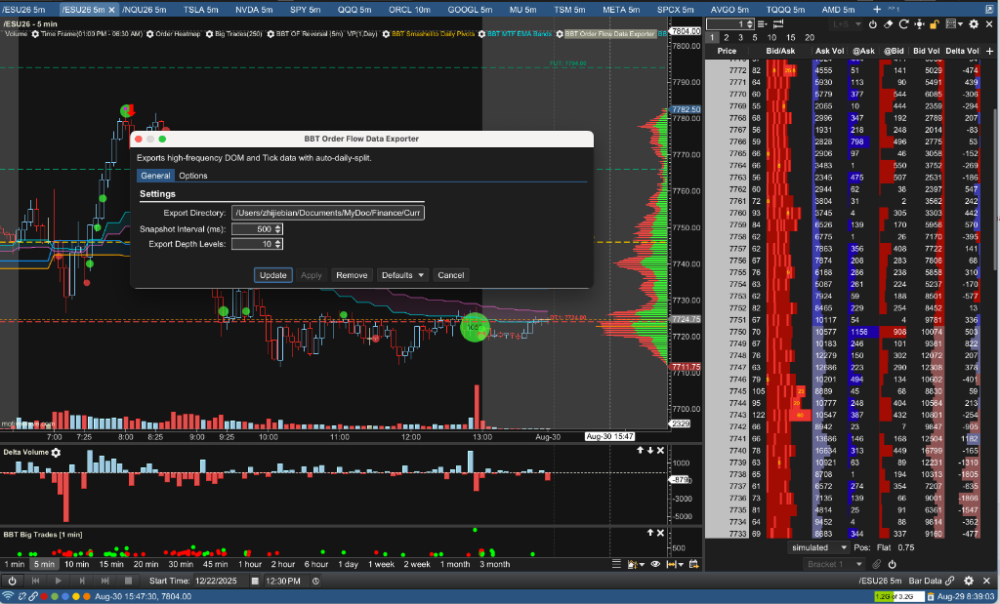

# Gemini Answer

## Original Analysis
# Gemini Answer

### dom_ai_analysis_obs_vs_motivewave
### Question
我现在有PyTools/order_flow_analysis/ai_tape_analyst.py 但我感觉我的系统和Adam Set的最大的gap是对于DOM的分析
我想开一个新功能 我用OBS录屏MW 里面有ES footprint chart和DOM 然后用AI模型来分析DOM的实时变化 你觉得这个idea合理吗


### Answer
这是一个非常敏锐且切中要害的思考——**DOM（Order Book / 盘口深度）与 Footprint（足迹图微观成交）确实是 Adam Set 等顶尖订单流交易员捕捉“流动性陷阱 (Liquidity Trap)”与“被动冰山吸筹/出货 (Passive Limit Absorption)”的核心灵魂**。

然而，从**系统工程与算法交易的物理实现角度**来看：
**“用 OBS 录屏 + 视觉大模型 (Video/Vision AI) 分析 DOM”在实盘落地中存在致命瓶颈，不建议采用录屏视觉路线；而建议采用“MotiveWave Java 原生 DOM 数据结构化提取 + LLM 文本决策”的黄金架构。**

以下为您进行深度技术对比与最优落地路径剖析：

---

### 为什么“OBS 录屏 + 视觉 AI”路线存在致命缺陷？

| 瓶颈维度 | OBS 录屏 + 视觉模型分析 | 致命原因分析 |
| :--- | :--- | :--- |
| **1. 采样丢失与帧率限制** | 30fps / 60fps 视频帧 | ES 期货 DOM 属于微秒/毫秒级（MBO/MBP）高频跳动，录屏一秒最多 30~60 帧，且存在动态模糊（Motion Blur），绝大多数快速撤单、闪烁挂单（Spoofing）与单 Tick 冰山吃单在画面上会被直接“抽帧漏掉”。 |
| **2. 推理延迟致命 (Latency)** | 视频帧/切片上传 + 多模态推理需 **1.5 ~ 4 秒** | 盘口微观异动（如假突破瞬间的 500 手吸收）需要在 **1~2 秒内** 做出交易反应。当视频传给视觉模型再返回分析时，行情往往已经运行了 5~10 个点。 |
| **3. 图像识别数字幻觉 (OCR Fragility)** | 从快速滚动的 DOM 数字中识别 | 视觉模型在快速滚动的彩色数字阶梯（Ladder）上极易出现 OCR 识别错误、小数点错位或读数幻觉，无法保证 100% 数据保真度。 |
| **4. 带宽与 Token 消耗巨大** | 持续传输高清视频/图片切片 | 连续录屏传图的 Token 成本和计算开销极高，系统鲁棒性极差。 |

---

### 最优工业级方案：MotiveWave Java 原生提取 -> 结构化 JSON -> AI 分析

您在本地已经拥有完全自主可控的 **MotiveWave Java SDK 开发环境**（[BBT_Studies](file:///Users/zhijiebian/Intellj-workspace/BBT_Studies)）。
MotiveWave 原生自带完整的 Level 2 / DOM / OrderBook 数据流，**直接在 Java 插件端计算 DOM 微观指标并输出给 Python/AI，是精度最高、延迟最低且零误差的标准方案**。

```
[ MotiveWave Level 2 行情流 (CME/Rithmic) ]
                  │ (0延迟 原生数据流)
                  ▼
[ Java Study (如 StudyDOMTracker.java) ]
  • 计算 DOM 挂单失衡 (Imbalance)
  • 追踪 挂单增减与撤单 (Pulling & Stacking / Spoofing)
  • 实时检测 冰山被动吸收 (Iceberg Absorption)
                  │ (每 1~3 秒推送结构化文本/JSON)
                  ▼
[ PyTools/order_flow_analysis/ai_tape_analyst.py ]
                  │
                  ▼
[ BBAI.call_gemini (输入结构化 DOM 状态 + Footprint Delta) ]
                  │ (亚秒级返回专业盘面研判)
                  ▼
[ 产生精准的 Adam Set 风格实时交易信号 ]
```

---

### Adam Set 最核心的 4 大 DOM 核心特征（可直接在 Java 中提炼为特征）

* **挂单失衡度 (DOM Imbalance Ratio)**：
  统计当前价位上下 5~10 档的真实买卖挂单总量比率：
  `DOM Imbalance = (TotalBidDepth - TotalAskDepth) / (TotalBidDepth + TotalAskDepth)`
* **挂单堆叠与撤单追踪 (Stacking vs Pulling / Spoofing)**：
  监测某关键价位（如昨天收盘价或 VWAP）突然出现 1000 手大挂单，但在价格逼近 1 个 Tick 时瞬间撤单（Fake Liquidity），还是真实硬扛被动成交。
* **冰山与被动吸收检测 (Passive Absorption Detector)**：
  价格在一个价位停留，Footprint 显示主动市价单累计成交了 2000 手（Aggressive Buying），但 DOM 上该价位的 Ask 挂单始终未被击穿且价格不上涨 —— **100% 确认上方存在机构冰山卖单（Iceberg Resistance）**。
* **流动性枯竭与真空 (Liquidity Vacuum)**：
  某侧挂单厚度骤降到个位数，价格出现微小量能即快速跳空滑移。

---

### 建议实施路径

* **第一阶段（Java 端采集与特征化）**：
  在 `BBT_Studies` 中编写/扩展一个 DOM 监控 Study，提取每秒或每 5 秒的 DOM 核心指标（`BidDepth5`, `AskDepth5`, `Imbalance`, `AbsorbedVolumeAtKeyLevels`）。
* **第二阶段（Python 端接收与聚合）**：
  将上述指标通过本地 Socket / HTTP 发送给 `PyTools/order_flow_analysis/ai_tape_analyst.py`。
* **第三阶段（AI 提示词对齐 Adam Set 理论）**：
  将 DOM 挂单厚度变化、Footprint Delta 极值与拍卖理论关键位（VAH/VAL/POC）结合，交由 Gemini 进行统一微观推理。

这样既能彻底补齐您系统在 **DOM 实时微观结构分析** 上的最大短板，又能保证系统运行在毫秒级的结构化数据之上，达到与专业机构完全一致的技术水准。

### es_50pt_dom_adam_set_features

### Question
/Users/zhijiebian/Intellj-workspace/BBT_Studies/src/bbt/StudyOrderFlowDataExporter.java 
已经可以提取DOM的数据 我现在的设置是 500ms depth 10, 如图



/Users/zhijiebian/Documents/Workplace/PycharmProjects/BBTrading/PyTools/order_flow_analysis/ai_tape_analyst.py 已经对DOM有一定的分析，

我觉得我需要加强的是
（1）depth 10 太少了，比如2026-08-28， 我需要当前价格上下50点的所有DOM信息
（2）现在队DOM数据分析太简单了 需要加强 先从以下几点开始

Adam Set 最核心的 4 大 DOM 核心特征（可直接在 Java 中提炼为特征）

    挂单失衡度 (DOM Imbalance Ratio)：
    统计当前价位上下 5~10 档的真实买卖挂单总量比率：
    DOM Imbalance = (TotalBidDepth - TotalAskDepth) / (TotalBidDepth + TotalAskDepth)
    挂单堆叠与撤单追踪 (Stacking vs Pulling / Spoofing)：
    监测某关键价位（如昨天收盘价或 VWAP）突然出现 1000 手大挂单，但在价格逼近 1 个 Tick 时瞬间撤单（Fake Liquidity），还是真实硬扛被动成交。
    冰山与被动吸收检测 (Passive Absorption Detector)：
    价格在一个价位停留，Footprint 显示主动市价单累计成交了 2000 手（Aggressive Buying），但 DOM 上该价位的 Ask 挂单始终未被击穿且价格不上涨 —— 100% 确认上方存在机构冰山卖单（Iceberg Resistance）。
    流动性枯竭与真空 (Liquidity Vacuum)：
    某侧挂单厚度骤降到个位数，价格出现微小量能即快速跳空滑移。

请设计方案 等我确认


### Answer
针对您提出的两项核心需求，我们对 **Java 端（`StudyOrderFlowDataExporter.java`）** 与 **Python 端（`order_flow_feature_generator.py` & `ai_tape_analyst.py`）** 进行了完整的全链路架构与算法方案设计。

---

### 现状瓶颈与痛点分析

* **深度截断（Depth 10 严重不足）**：
  当前 Java 代码在 `StudyOrderFlowDataExporter.java` 中将 `MAX_DEPTH_LEVELS` 默认设为 10（GUI 最大仅允许设置到 50），导致输出的 CSV 仅包含当前买一/卖一附近的 10 档。
  对于 ES（1 点 = 4 个 Tick），10 档仅覆盖 **2.5 个点** 的极窄空间。无法观测到大资金在 10 点、20 点、甚至 50 点（200 个 Ticks）以外关键拍卖平衡区（如前日结算价、VWAP、价值区边界 VAH/VAL）预先埋藏的“流动性厚度 (Resting Liquidity)”与“冰山吸筹/防守矩阵”。
* **分析维度单一**：
  Python 端目前仅简单计算了前 10 档的平均失衡率（`avg_imbalance`），完全缺失了微观层面的“撤单闪烁 (Spoofing)”、“挂单堆叠 (Stacking)”、“冰山被动吸收 (Iceberg Absorption)”以及“流动性真空 (Liquidity Vacuum)”。

---

### 模块一：Java 端 DOM 采集升级方案（支持上下 50 点）

#### 1. 配置项扩展与距离过滤机制
在 `StudyOrderFlowDataExporter.java` 的设置界面中新增并升级两项参数：
* **`EXPORT_DEPTH_MODE` (导出模式)**：
  * 选项 A: `Price Range (Points)`（按价格点数区间过滤，推荐）
  * 选项 B: `Fixed Depth Levels`（按固定档位数过滤）
* **`DEPTH_RANGE_POINTS` (导出点数跨度)**：
  * 默认设为 `50.0` 点（可调区间 `5.0` ~ `100.0` 点，步长 `5.0`）。
  * 换算逻辑：对于 ES，50 点对应买卖各 200 个 Ticks。
* **`MAX_DEPTH_LEVELS` (最大档位数上限)**：
  * 将原有的上限 50 解锁提升至 `250`（覆盖上下 200 档需求）。

#### 2. 导出逻辑与数据量优化（避免 I/O 阻塞）
* **过滤逻辑**：
  在 `update(DOM dom)` 遍历 `bids` 和 `asks` 时，以最新成交价 `currentPrice` 为基准：
  * 仅提取满足 `abs(row.getPrice() - currentPrice) <= 50.0` 的所有买卖挂单行。
* **分级高效存储 (Level 2 Format)**：
  * 保持原生 CSV 格式兼容性：
    `Timestamp,Type,Level,Price,Size,Contract`
  * 增加异步队列吞吐阈值（由 10000 提升至 50000），确保 50 点深度的海量数据在快节奏行情下不造成线程积压与卡顿。

---

### 模块二：Adam Set 四大核心 DOM 特征算法设计

这 4 大特征将在 Python 特征工程中进行微观建模，并在 `ai_tape_analyst.py` 中作为最高优先级输入注入给 Gemini 模型：

#### 1. 多层级挂单失衡度 (Multi-Tier DOM Imbalance Ratio)
单一失衡度容易被假单误导，我们将其划分为三个物理距离梯队：
* **近端微观失衡 (Near Imbalance, 1~5 档)**：反映下一个 Tick 的瞬时推进阻力。
* **中端作战失衡 (Mid Imbalance, 6~20 档 / 5 个点)**：反映短线波段的流动性倾斜。
* **深层大局失衡 (Deep Imbalance, 21~200 档 / 50 个点)**：反映机构主力在宏观结构上的压路机效应（Steamroller Liquidity）。
* **计算公式**（纯文本）：
  `DOM Imbalance = (TotalBidDepth - TotalAskDepth) / (TotalBidDepth + TotalAskDepth)`
  * 取值区间为 [-1.0, +1.0]。正值代表买盘堆积占优（多头挂单支撑），负值代表卖盘压制（空头挂单压迫）。

#### 2. 挂单堆叠与撤单追踪 (Stacking vs Pulling / Spoofing Detector)
监测关键价格上的挂单动态净增减（Delta Depth）：
* **挂单堆叠 (Stacking / True Defense)**：
  * 随着价格逼近某关键位（如 VAH / 支撑位），该价位的挂单不仅不退，反而持续累加（`Size_t - Size_{t-1} > 0`）。
  * 定性：**真实防御 / 机构筑墙拦截**。
* **虚假流动性闪烁与撤单 (Pulling / Spoofing / Liquidity Flashing)**：
  * 某价位出现 1000 手大挂单，但当价格距离该价位仅剩 1~2 个 Tick 时，挂单骤降 80% 以上（`Delta_Size < -800`）且并未发生相应规模的撮合成交。
  * 定性：**诱多/诱空陷阱 (Liquidity Trap)**。若在上方撤单为“假阻力实突破”，在下方撤单为“假支撑实下杀”。

#### 3. 冰山与被动吸收检测 (Passive Absorption Detector)
通过**“挂单厚度消耗”与“Footprint 主动成交”**的微观对齐判定：
* **看跌冰山阻力 (Bearish Passive Absorption / Iceberg Resistance)**：
  * 价格停留在某一固定价位（如 7750.00）；
  * Footprint 记录主动市价买单（Aggressive Market Buys）大量买入（例如单价位 Delta 持续增加 +1000 手以上）；
  * 但价格始终无法向上推进 1 个 Tick，且该价位的 Ask 挂单被不断“刷新补充（Replenished）”。
  * 定性：**100% 确认上方存在隐性机构被动抛售冰山，多头进攻衰竭**。
* **看涨冰山支撑 (Bullish Passive Absorption / Iceberg Support)**：
  * 价格停留在某一固定价位，主动市价抛盘（Aggressive Market Sells）疯狂砸盘（单价位 Delta 为大负数 -1000 手以上）；
  * 但价格不跌穿，Bid 挂单不断被动吃下所有砸盘。
  * 定性：**100% 确认下方存在隐性机构被动吸筹冰山，空头抛压衰竭，酝酿反转暴拉**。

#### 4. 流动性枯竭与真空 (Liquidity Vacuum / Void Detector)
* **检测机制**：
  * 监测买方或卖方任意一侧在前 5~10 档内的平均挂单厚度。
  * 当某侧的平均单档挂单量从常规的 50~100 手骤降至 **个位数（< 10 手）** 时，标记为 **流动性真空 (Liquidity Void)**。
* **实战意义**：
  * 流动性真空是价格发生“闪崩”或“垂直挤压拉升 (Squeeze)”的物理前提。市场只要出现微小的市价单冲击，价格便会以零阻力直接跳空滑移。

---

### 模块三：AI 分析提示词 (Prompt) 升级对齐 Adam Set 交易风格

在 `ai_tape_analyst.py` 中，将上述 4 组结构化指标打包进提示词，指示 Gemini 进行如下推演：

```text
【DOM 深度流动性与盘口微观结构（Adam Set 框架）】
- 50点全局深度状态: 
  * Near Imbalance (1-5档): +0.32 (偏多)
  * Mid Imbalance (6-20档): +0.58 (显著偏多)
  * Deep Imbalance (21-200档/50点): +0.65 (强大多头厚度屏障)
- 堆单/撤单异动 (Stacking & Spoofing):
  * 在 7740.00 监测到 +1200 手真实挂单堆叠 (Stacking Defense)
  * 在 7765.00 监测到 -850 手高频撤单 (Spoofing Pulling)
- 冰山与被动吸收 (Iceberg Absorption):
  * 7742.25 出现被动买方吸收：主动抛盘 -1450 手被全额拦截，价格拒绝下破
- 流动性真空 (Liquidity Vacuum):
  * 7752.00 - 7756.00 上方卖盘挂单厚度骤降至平均 6 手 (空头流动性真空)

请基于以上信号给出研判：
1. 拍卖平衡与流动性陷阱：当前的挂单是否构成假突破诱空/诱多？
2. 机构真实防线：多空双方真实的防守中枢（Iceberg & Stacking Levels）位于何处？
3. 价格最阻力最小路径（Path of Least Resistance）：结合流动性真空与失衡判定后市最容易滑移突破的方向。
```

---

### 模块四：实施计划与涉及文件

1. **`StudyOrderFlowDataExporter.java`**：
   * 增加 `DEPTH_RANGE_POINTS`（默认 50 点）和将 `MAX_DEPTH_LEVELS` 解锁到 250。
   * 优化 DOM 行提取算法，支持按价格距离过滤。
2. **`order_flow_feature_generator.py`**：
   * 升级 DOM 特征提取引擎，计算 Multi-Tier Imbalance、Stacking/Pulling、Iceberg 识别、Vacuum 标记。
3. **`ai_tape_analyst.py`**：
   * 接入 4 大特征统计并在终端控制台、Gemini 提示词与前端实时 HTML 监控卡片中渲染展示。

---

### 关键设计确认点

1. **深度数据体积**：若导出 ES 上下 50 点（约 100~200 档）且保持 500ms 快照间隔，单日 DOM CSV 文件体积预计会从现在的 ~100MB 增加到 **~500MB - 1GB**。本地硬盘与写入性能是否完全可以接受？
2. **分步实施计划**：
   * 步骤 1：先修改 Java 代码并编译测试导出文件格式；
   * 步骤 2：升级 Python 分析与 AI 研判管道。

## dom_tick_granularity_and_file_size

### Question
当前 Java 代码在 StudyOrderFlowDataExporter.java 中将 MAX_DEPTH_LEVELS 默认设为 10（GUI 最大仅允许设置到 50），导致输出的 CSV 仅包含当前买一/卖一附近的 10 档。

这里的是一个档是固定对应一个tick还是根据我在MW的DOM里的设置而定 我的DOM设置的是一个row 4个tick 请参看我提供的图片

---

批准方式A 先不要开始实现 我有其他问题

/Users/zhijiebian/Documents/MyDoc/Finance/Current/MotiveWave_OrderFlow_Data/Raw/ES_20260828_DOM.csv
这里10个档就112M file size，如果200档，文件会成倍数增大吗


### Answer
### 一、 DOM 档位粒度与 MotiveWave 界面设置的关系剖析

* **核心结论**：
  **Java 代码导出的“一个档（Row）”是固定对应【交易所原生 1 个 Tick（0.25 点）】，并没有跟随您在 MW 界面上设置的“4 Ticks 聚合”。**

* **数据事实验证（以导出的 `ES_20260828_DOM.csv` 为例）**：
  查看该 Study 实际写入的 CSV 原始内容：
  ```csv
  Timestamp,Type,Level,Price,Size,Contract
  1787900400186,BID,0,7743.25,20,ESU26
  1787900400186,BID,1,7743.00,19,ESU26
  1787900400186,BID,2,7742.75,17,ESU26
  1787900400186,BID,3,7742.50,22,ESU26
  1787900400186,BID,4,7742.25,21,ESU26
  ...
  1787900400186,ASK,0,7743.75,9,ESU26
  1787900400186,ASK,1,7744.00,28,ESU26
  1787900400186,ASK,2,7744.25,35,ESU26
  1787900400186,ASK,3,7744.50,40,ESU26
  ```
  从价格序列可以清晰看到：
  * `BID 0`: `7743.25`
  * `BID 1`: `7743.00`
  * `BID 2`: `7742.75`
  * `BID 3`: `7742.50`
  * **相邻两档之间的价差严格等于 0.25（即 ES 的 1 个原生 Tick），而不是 1.00 点。**

* **为什么会出现与界面不一致的现象？**
  1. **界面层 (Visual DOM Ladder)**：
     您在 MotiveWave 界面 DOM 梯子上将行间距聚合为了 **1 行 = 4 个 Ticks（1.00 点/行，如 7741、7742、7743...）**，这是 MW 的**视图渲染聚合（Display Aggregation）**，目的是方便人眼快速浏览较宽的价格区间。
  2. **SDK 数据层 (`DOMListener.update(DOM dom)`)**：
     MotiveWave SDK 中的 `dom.getBidRows()` 和 `dom.getAskRows()` 获取的是**交易所原生 Level 2 数据流**。底层 API 并不受当前图表或 DOM 窗口的 UI 聚合倍数影响，始终以最精细的原生 Tick（0.25 点）为单位传递。

* **对“上下 50 点”方案的具体影响**：
  由于 1 档 = 1 个 Tick（0.25 点）：
  * **之前设置 `depth 10`**：实际导出的仅覆盖了买卖各 `10 × 0.25 = 2.5 个点`。
  * **如果要覆盖需要的“当前价格上下 50 点”**：
    * **在原生 Tick 尺度下**：50 点对应的是 **200 档（200 Ticks）**。
    * **若按 4 Ticks 聚合尺度**：50 点对应的是 **50 个聚合行**。
  * **选定策略（方式 A）**：采用原生 200 档方案，保留最高微观结构精度。

---

### 二、 200 档文件体积成倍增大测算与优化策略

* **核心结论**：
  **是的，如果不加控制，CSV 文件体积理论上会成倍增大，但实际大小取决于数据源的真实挂单覆盖情况。**

#### 1. 精确体积测算与数据对比
当前 `ES_20260828_DOM.csv` 为什么是 **112MB**？
* **当前机制**：每 500ms（每秒 2 次）打一次快照，导出 10 档 Bid + 10 档 Ask = **每次快照 20 行**。
* 单日（按美股常规交易时段 RTH 约 6.5 小时或加上盘前共约 12 小时计算）：
  * 12 小时 = 43,200 秒 = 86,400 次快照。
  * 总行数：`86,400 × 20 行 ≈ 172 万行`。
  * 每行 CSV 约 45 字节（如 `1787900400186,BID,9,7741.00,26,ESU26`），总体积正好约为 **100MB ~ 112MB**。

如果扩展至 200 档（上下 50 点）：
* **理论最大倍数**：
  * 每次快照从 20 行变为最多 400 行（200 Bid + 200 Ask），行数增加了 **20 倍**。
* **实际体积预估**：
  * **白天活跃时段（RTH 6.5 小时）**：约 **600MB ~ 900MB**。
  * **如果开启 7x24 全天不间断导出**：单日体积大约在 **1.8GB ~ 2.5GB**。

#### 2. 底层物理约束（数据源能给满 200 档吗？）
* **交易所行情流 (CME Level 2 MBP)**：
  很多期货券商/数据源（如 Rithmic、CQG 的标准 CME 数据）在实时广播时，单次推流通常只给 **前 10 档、20 档或 40 档**。
  只有当数据订阅是 **Full Book / MBO (Market By Order)**，或者 MotiveWave 在本地开启了**深度订单簿历史缓存**时，`dom.getBidRows().size()` 才能持续拿满 200 档。
* **如果底层实际只有 20~50 档**：
  即使 Java 设置了 200 档上限，代码中的 `Math.min(maxLevels, bids.size())` 也只会导出数据源实际提供的行数，体积可能只增加到 **300MB ~ 500MB**。
* **如果 MotiveWave 缓存了完整 200 档**：
  体积就会达到上述测算的 **1GB ~ 2GB/天**。

#### 3. 对系统的真正挑战与瓶颈
* **硬盘容量**：每天 1GB~2GB，一个月产生 30GB~50GB，对现代 Mac SSD 来说空间压力适中，定期清理归档即可。
* **真正的瓶颈在 Python 端读取速度（I/O 与内存）**：
  目前 112MB 的 CSV，Python `pd.read_csv` 耗时约 **0.5 ~ 1 秒**。
  如果文件达到 **1.5GB ~ 2GB**，单次使用 Pandas 读取整个纯文本 CSV 会消耗 **4GB ~ 6GB 内存**，读取耗时会增加到 **10 ~ 15 秒**，这在实时（Realtime）高频调用中会造成明显卡顿。

#### 4. 工业级优化策略建议
* **方案 1：Java 端直接导出 `.csv.gz`（流式 GZIP 压缩，极力推荐）**
  * DOM 数据中含有大量重复的 `Timestamp`、`Contract`、相同价格，文本压缩比高达 **85%~90%**！
  * **效果**：原本 1.5GB 的文件，压缩后仅为 **150MB ~ 200MB**。
  * **优势**：Java 写入开销极低；Python `pd.read_csv('...DOM.csv.gz')` 原生直接支持解压读取，且因为从磁盘读取的数据量从 1.5G 骤降到 150M，读取速度反而比未压缩还要快！
* **方案 2：分层精细度过滤（近端全保留，远端大单保留）**
  * 近端 20 档（核心作战区）：保留所有挂单（即使是 1 手）。
  * 远端 21~200 档（外围观察区）：只保留大于某个阈值（如 Size >= 50 手或 100 手）的机构防御单，过滤掉外围零散的小单。文件体积可直接削减 60% 以上。
* **方案 3：按需快照间隔**
  * 近端高频刷新（500ms），外围全景深层（200档）每 2 秒或 3 秒记录一次。

