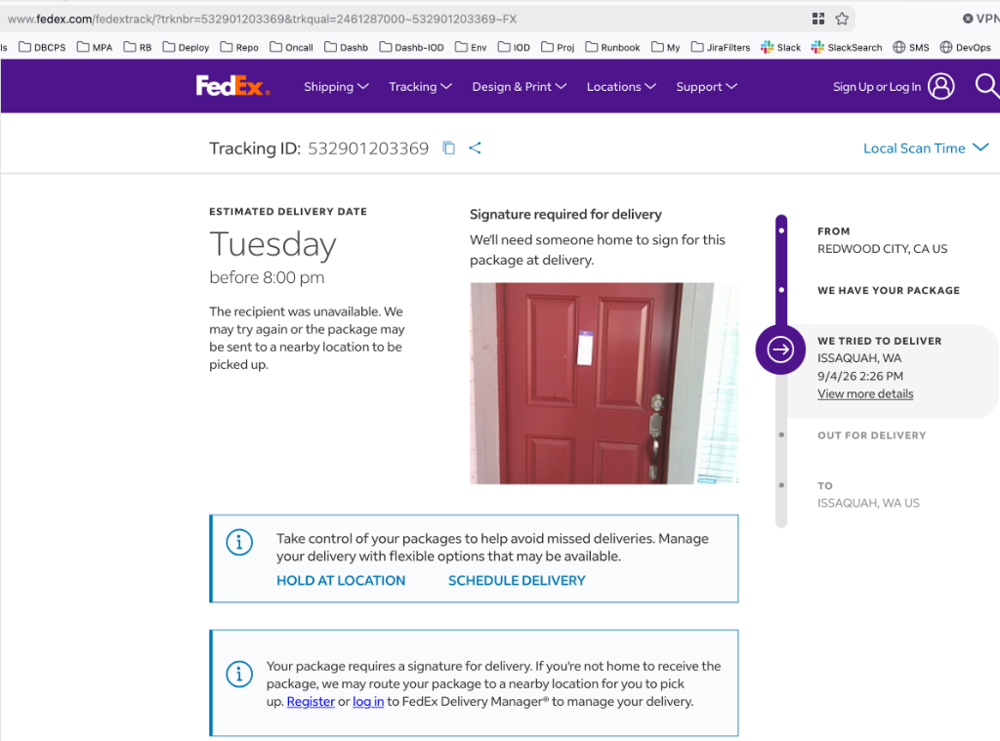
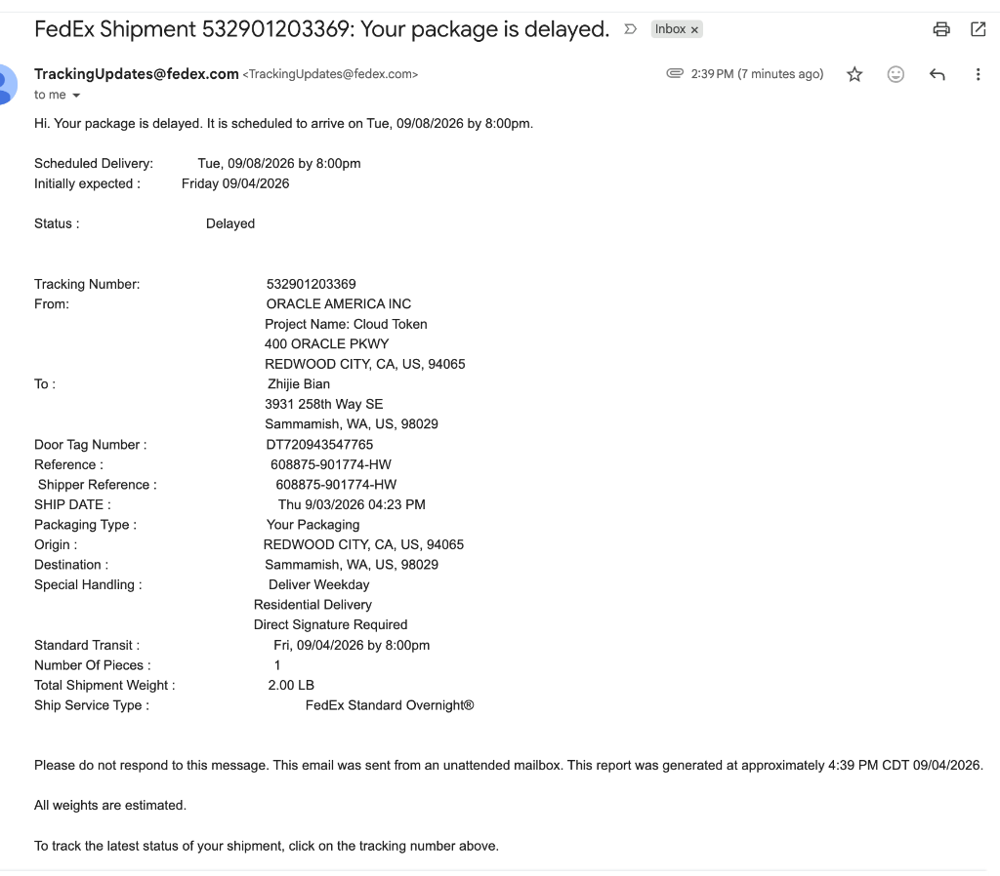

# FedEx 错过签字派送同日紧急自提与应急处理指南

针对 FedEx 隔夜加急特快件（Standard Overnight）因需要必须当面签字（Direct Signature Required）而在周五下午错过派送、被系统自动延期至下周二（跨越劳工节长假）的紧急情况，本文档完整汇总了应急拦截方案、当天去官方大仓自提的精准时段、站点地址与所需证件要求。

## 事件背景与延期根因剖析

### 包裹关键属性与运单明细
* **运单号码 (Tracking ID)**：`532901203369`
* **门贴编号 (Door Tag Number)**：`DT720943547765`
* **发件机构**：ORACLE AMERICA INC (Project Name: Cloud Token, Redwood City, CA) —— 工作急需的云安全令牌硬件
* **收件人与地址**：Zhijie Bian，`3931 258th Way SE, Sammamish, WA, US, 98029`
* **服务类型**：`FedEx Standard Overnight®`（工作日次日达）
* **特殊管控要求**：
  * `Deliver Weekday`（仅工作日派送）
  * `Direct Signature Required`（**必须收件人本人在场当面签字**，严禁擅自留置门口或由无凭证邻居代签）

### 系统自动顺延至下周二的原因
* **派送未达时间**：**2026 年 9 月 4 日（周五）下午 2:26 PM**。
* **节假日重叠**：当天是周五，9 月 5 日至 6 日为周末，**9 月 7 日（周一）为美国联邦法定假日 Labor Day（劳工节）**。
* **规则机制**：FedEx Express 的 Standard Overnight 常规件在周末及联邦假日默认不安排投递，系统自动判定下一个常规工作日为 **9 月 8 日（周二）**，因此向收件人发送了长达 4 天的延期通知邮件。

---

## 官方直属派送大仓（FedEx Ship Center）站点信息

该包裹在派送未果后，不会转交普通第三方代收网点，而是会在送货车结束当日行程后统一返回所属的直属分发中心大仓：

* **站点官方全称**：**FedEx Ship Center (Issaquah)**
* **物理详细地址**：**5500 220th Ave SE, Issaquah, WA 98029**
* **地理位置优势**：位于 I-90 高速公路旁（紧邻 SE 56th St 与 220th Ave SE 交汇处），距 Sammamish 高原（3931 258th Way SE）仅约 **4 ~ 5 英里**，下山驱车仅需 **8 ~ 10 分钟**。
* **对外柜台运营时间**：
  * **周一至周五**：**8:30 AM – 7:00 PM**（周五晚间 7:00 PM 准时闭店关门）
  * **周六**：**8:30 AM – 5:00 PM**
  * **周日**：休息关闭（Closed）
* **联系电话**：1-800-GO-FEDEX (1-800-463-3339)

---

## 当天自提行动指南与黄金时间窗口

### 货车流转与最佳前往时段
货车司机在下午派送完整个片区前，包裹始终在货车车厢内流转：
1. **太早前往（5:00 PM 前）**：司机仍在 Sammamish / Issaquah 各街道派件，大仓前台无件可查，系统显示还在车上。
2. **黄金取件窗口（6:00 PM – 6:45 PM）**：
   * 快递员通常在 **5:30 PM ~ 6:15 PM** 左右结束所有日间派件，统一驾车返回 5500 220th Ave SE 货场卸货。
   * 柜台工作人员会在此时段将“派送未达件”登记入库或从车厢后舱提取。
   * 在 7:00 PM 柜台关门前留出 15~45 分钟的充裕时间，是当天拿到包裹概率最高的时间段。

### 现场取件必备凭证（缺一不可）
因该包裹属于最高安全级别的 `Direct Signature Required`，前台执行极严格的人证核对：
1. **贴在门上的 Door Tag 原件**：
   * 必须将贴在门上的便签原件完整撕下并带往柜台。
   * 便签下方有专属条形码，前台扫码即可秒级调出派件车次与货位号（编号：`DT720943547765`）。
2. **收件人政府签发的有效带照片身份证件（Driver's License / Photo ID）**：
   * 证件姓名必须严格匹配运单姓名：`Zhijie Bian`。
   * 证件背面的现住地址必须与运单目的地一致：`3931 258th Way SE, Sammamish, WA 98029`。

---

## 应急拦截与司机回头联动话术（电话处理复盘）

在刚错过包裹的 30 分钟黄金期内，致电调度中心能够起到关键拦截作用：

### 电话菜单直通人工技巧
1. 拨打官方热线 **1-800-463-3339 (1-800-GO-FEDEX)**。
2. 语音机器人询问时，直接坚决说：`"Representative"`（人工客服）或报出单号 `532901203369`。

### 调度联动与锁定大仓实战英文话术
> **You:**  
> *"Hi, I just missed the FedEx Express delivery at 2:26 PM at 3931 258th Way SE, Sammamish.  
> Tracking number is **532901203369**, Door Tag is **DT720943547765**.  
> This package contains an urgent security cloud token from Oracle required for my job. Because of the Labor Day long weekend, the system postponed delivery to next Tuesday, which is unacceptable for my work.  
> Can you please send an urgent broadcast message to the driver on the road to see if they can re-attempt delivery before leaving my neighborhood today?  
> If the driver cannot come back, please put a **Hold for Evening Pickup at Station** on this package so that when the truck returns to the **Issaquah Ship Center at 5500 220th Ave SE**, the package remains at the front counter for me to pick up tonight before 7:00 PM, instead of being sorted for next Tuesday."*

---

## 避坑预警与严禁事项

1. **切勿在官网或 App 随意点击 "Redirect to Retail Location"（如 Walgreens / Dollar General）**：
   * 很多人误以为点“Hold at Location”能更快拿到，实际上将快件转至第三方零售代收点需要重新生成内部流转标签并重新排班路线，在长周末前夕操作会导致包裹在周二甚至周三才能送达代收点，彻底丧失当天在直属大仓自提的机会。
2. **切勿委托无相同地址证件的朋友代领**：
   * Direct Signature 包裹在没有 Door Tag 原件且代领人证件地址不一致的情况下，FedEx 柜台依法有权拒绝放行。
3. **若周五晚间未能赶上 7:00 PM**：
   * 该 Issaquah Ship Center 在 **周六（9 月 5 日）上午 8:30 AM 至下午 5:00 PM** 正常开门营业。只要周五已完成返仓入库且未流转，周六上午仍可前往柜台凭借 ID 和 Door Tag 自行提取。

