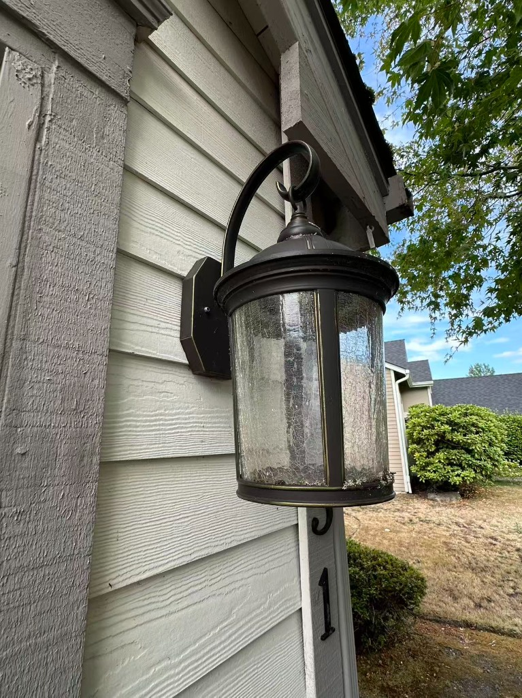
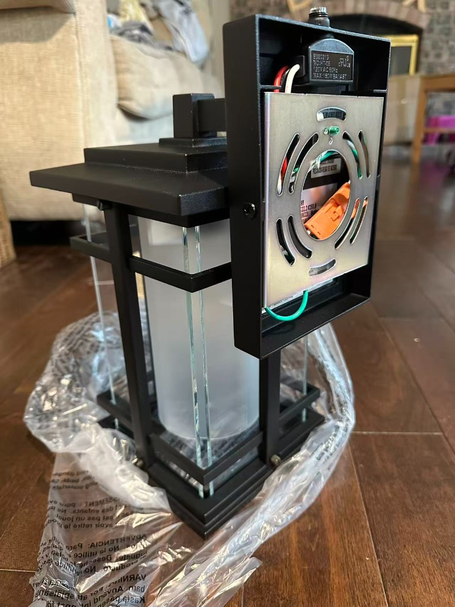
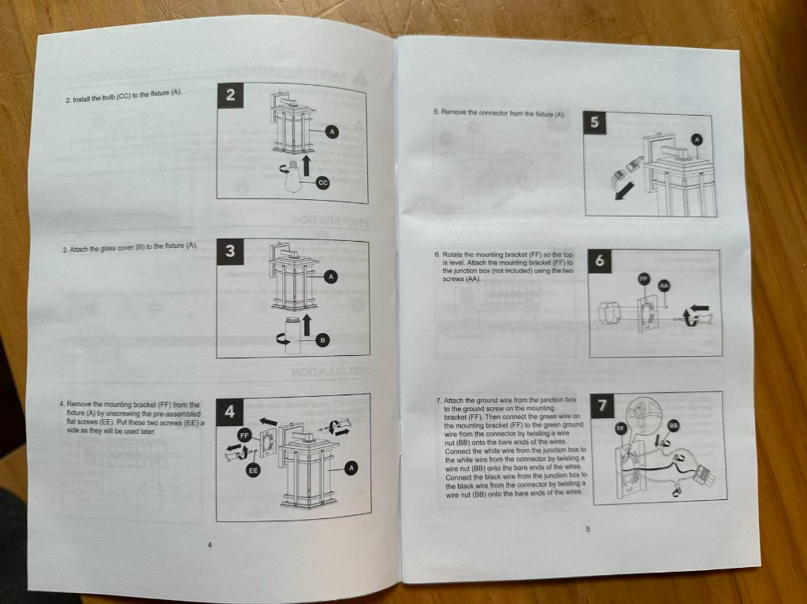
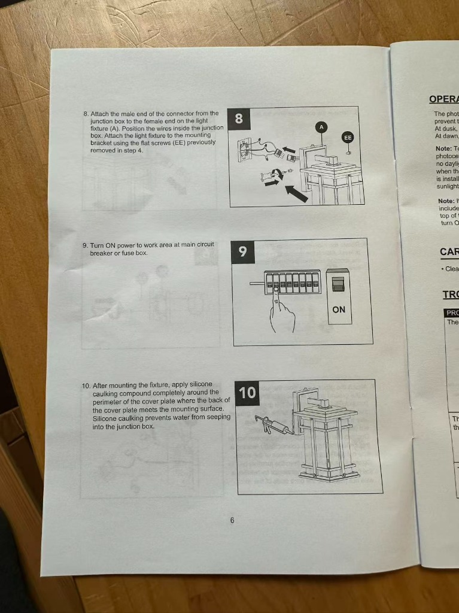
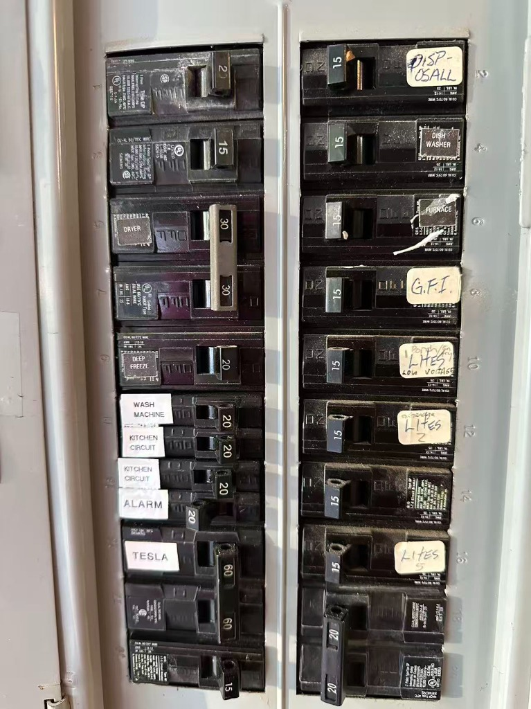
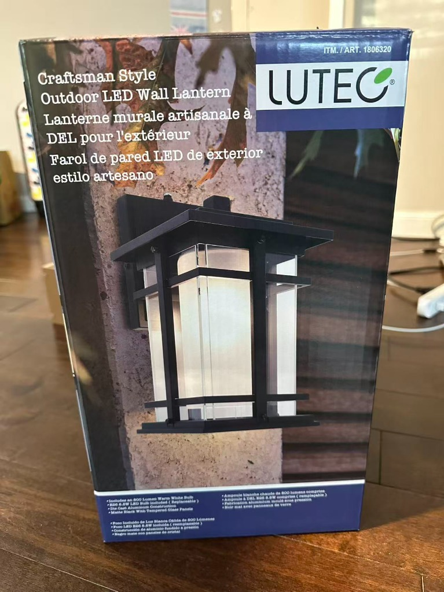

# 前门灯更换与安装详细指南 (Front Door Light Replacement Guide)

根据现场照片、新灯具结构、说明书以及配电箱标签，以下为您整理的详尽更换安装步骤与关键注意事项。

---

## 参考图示与现场确认

  

    
    
图 1：旧门灯现场实物（两侧带固定螺母）

  

  

    
    
图 2：新门灯背部结构、金属挂板与快接端子

  

  

    
    
图 3：安装说明书步骤 2 至步骤 7

  

  

    
    
图 4：安装说明书步骤 8 至步骤 10

  

  

    
    
图 5：家庭配电箱（右列第 10 槽位为 Porch 回路）

  

---

## 准备工作与工具清单

### 必要工具
- 十字螺丝刀、平口螺丝刀
- 测电笔 / 非接触式验电笔（电压测试仪，强烈建议）
- 剥线钳 / 钳子（备用）
- 硅酮防水胶（Silicone Caulk）及打胶枪（用于最后户外防水密封）
- 稳固梯子或矮凳
- 适用的灯泡（按说明书要求，如标准 E26 底座灯泡）

---

## 断电与验电（安全第一）

### 查找对应断路器（Breaker）
- 查看配电箱右侧第 5 组开关（第 10 槽位），手写标签为 **`Porch / LTS / LOW VOLTAGE`**（Porch 即门廊/前门灯回路）。
- 同时留意其下方的 `LITES 2`、`LITES 5` 等照明回路。

### 切断电源与验电
- 将 **`Porch`** 对应的 15A 开关扳到 **OFF** 位置。
- 如果不确定前门灯具体属于哪个，可先打开前门灯开关让旧灯处于通路状态（若旧灯还能微亮），或者关闭开关后，使用**测电笔**核验。
- **绝对准则**：在身体触碰任何导线前，必须用验电笔靠近导线确认**完全无电**。

---

## 拆卸旧门灯

### 拆除旧灯固定螺母
- 从图 1 可见，旧灯底座左右两侧各有一颗固定滚花螺母/螺栓。
- 用螺丝刀或徒手拧下两侧的固定螺母。

### 割开旧密封胶
- 如果旧灯底座与墙体（木挂板）之间打有防水胶，用美工刀轻轻沿边缘划开，避免用力拉扯损坏外墙漆面或挂板。

### 取下旧灯并拆线
- 将旧灯轻轻向外拉出，露出接线盒（Junction Box）内的电线。
- 此时先用验电笔再次测量电线，确保安全断电。
- 拧开电线连接帽（Wire Nuts），将旧灯的黑线、白线、裸铜/绿线与墙体内出线分离。
- 拧下固定在墙壁接线盒上的旧金属安装挂板并取下。

---

## 组装新灯具（依据说明书步骤 2、3、4、5）

新灯采用带有**快插端子（Quick Connector）**的设计，安装非常便捷：

### 安装灯泡与玻璃罩（说明书 Step 2 & 3）
- 在地面将灯泡装入灯体 `(A)`。
- 将圆柱形磨砂玻璃罩 `(B)` 安装并固定到灯体上。

### 拆下新灯背面的安装板（说明书 Step 4）
- 从图 2 实物可见，新灯出厂时金属安装背板 `(FF)` 已预装在灯座背面，由左右两颗扁头小螺丝 `(EE)` 固定。
- 拧下这两颗螺丝 `(EE)`，将金属挂板 `(FF)` 与灯体分离，螺丝妥善收好。

### 拔下快接插头（说明书 Step 5）
- 从图 2 可以看到背板中间有一个橙色接线快插端子。
- 按下卡扣，将快接公头端与母头端拔开分离。

---

## 固定挂板与接线（说明书步骤 6、7）

### 固定安装背板 (FF) 到墙上接线盒（Step 6）
- 将墙壁接线盒里的电线穿过金属背板中心大孔。
- 使用两颗长安装螺丝 `(AA)`，将金属板固定到接线盒上。
- 调整背板水平度，注意背板朝向（水平保持平直，确保两侧固定小螺孔处于水平左右方向）。

### 连接电线（Step 7）
- **地线（Ground）**：将墙内出来的裸铜线（或绿线）缠绕在金属板上的**绿色接地螺丝**上并拧紧；同时将快插端子带出的绿线与墙内地线用接线帽（Wire Nut `BB`）拧紧在一起。
- **零线（Neutral - 白线）**：将墙内出来的白色线与快插插头引出的白色线对齐，顺时针用接线帽 `(BB)` 拧紧。
- **火线（Hot - 黑线）**：将墙内出来的黑色线与快插插头引出的黑色线对齐，顺时针用接线帽 `(BB)` 拧紧。
- **检查**：接好后轻拉每根电线，确保没有松脱，铜线未裸露在接线帽外（建议用电工绝缘胶布辅助缠绕一圈加强保护）。

---

## 安装灯体与通电测试（说明书步骤 8、9）

### 插上快插端子
- 将带电线连接端子的公头与灯体上的母头插紧（听到“咔哒”卡扣到位声）。

### 固定灯体
- 将多余的电线小心塞入墙内接线盒中。
- 将灯体套在金属安装板上，对齐左右两侧的螺孔。
- 用之前拆下的两颗扁头螺丝 `(EE)` 重新固定拧紧。

### 通电测试
- 前往配电箱，将 **`Porch`** 断路器推回 **ON**。
- 打开室内前门灯开关测试：
  - *注意：新灯顶部带有光敏传感器（Photocell，见实物图顶部凸起小传感器）*。如果是在白天测试，传感器感应到强光可能不会自动亮起；测试时可用手指或黑布彻底遮住顶部的圆形感应头，等待 5~10 秒，确认灯是否正常点亮。

---

## 户外防水打胶密封（说明书步骤 10，极其关键）

测试无误后，进行最后一步防雨密封：
- 使用**户外防霉硅酮密封胶（Clear 或配合外墙颜色的 Silicone Caulk）**。
- 沿着灯体底座与墙面接缝处，打胶密封**顶部及左、右两侧**。
- **特别注意**：**底座的最底部务必留出一段约 1-2 厘米的小缝隙不要打胶**（Weep Hole 泄水孔）。
  - *原因*：万一有微量雨水或冷凝水渗入，底部的缝隙可让水分自然排出，防止内部积水浸泡电线导致跳闸或短路故障。

## lutec_craftsman_lantern_product_links

根据新灯外包装箱实物照片与条码信息，进一步核实了该灯具的品牌型号、销售渠道背景以及在各大主流电商平台的对应购买链接：

  
  
图 6：LUTEC Craftsman 外包装箱实物（右上角标注 Costco 专供货号 1806320）

### 产品核心规格与编码
- **品牌商标**：LUTEC
- **产品名称**：Craftsman Style Outdoor LED Wall Lantern（美式工艺风格户外 LED 壁灯）
- **Costco 专供货号（ITM. / ART.）**：**`1806320`**
- **生产厂商内部型号（Model #）**：**`5217801012`**
- **核心功能亮点**：配备内置 Dusk-to-Dawn（黄昏至黎明）光敏传感器、快接安装挂板端子（Quick Connect Bracket）、附赠 800 流明 E26 暖白光可更换 LED 灯泡、压铸铝耐候材质。

### 渠道背景说明
右上角的 **`ITM. / ART. 1806320`** 属于典型的 **Costco 独家专属料号**。该版本为品牌商专为北美 Costco 仓储会员店定制发售，包含专供的一体化快插接线端子与定制灯泡套件，因此在 Amazon 和 Home Depot 通常不会以一模一样的 Costco 内部编号（1806320）作为独立直营商品长期常驻。

### 各主流电商与零售渠道链接

#### 1. Costco 直营与查询链接
- **[Costco 官网商品查询 (Item 1806320)](https://www.costco.com)**：可在搜索框输入 `1806320` 查看本地 Warehouse 仓库提货库存与送货状态。
- **[Costco Canada 对应产品档案](https://www.costco.ca)**：提供同款型号的详细规格参数列表。

#### 2. Amazon (亚马逊) 官方与同款系列
LUTEC 在 Amazon 设有官方品牌店铺，提供同款 Craftsman 造型及相同 Dusk-to-Dawn 光感特性的壁灯：
- **[Amazon - LUTEC 户外黄昏黎明感应壁灯检索直达](https://www.amazon.com/s?k=LUTEC+outdoor+wall+lantern+dusk+to+dawn)**
- **[Amazon - 美式 Craftsman 风格黄昏黎明户外壁灯精选](https://www.amazon.com/s?k=Craftsman+Style+Outdoor+LED+Wall+Lantern+dusk+to+dawn)**

#### 3. The Home Depot (家得宝) 官方品牌专区
The Home Depot 设有 LUTEC 户外工程灯具专区：
- **[The Home Depot - LUTEC 户外照明与壁灯品牌专区](https://www.homedepot.com/b/Lighting-Outdoor-Lighting-Outdoor-Wall-Lights/LUTEC/N-5yc1vZbm76Zq3j)**

### 官方售后保修与备件咨询
该灯具提供 3 年有限质保，如需补充备用玻璃罩、螺母小配件或申请售后：
- **LUTEC USA 官方服务热线**：`1-877-714-8669`（美东时间周一至周五 9:00 AM - 5:00 PM EST）
- **官方支持邮箱**：`service@lutec.net`
- **官方网站**：[www.lutec.com](https://www.lutec.com)

