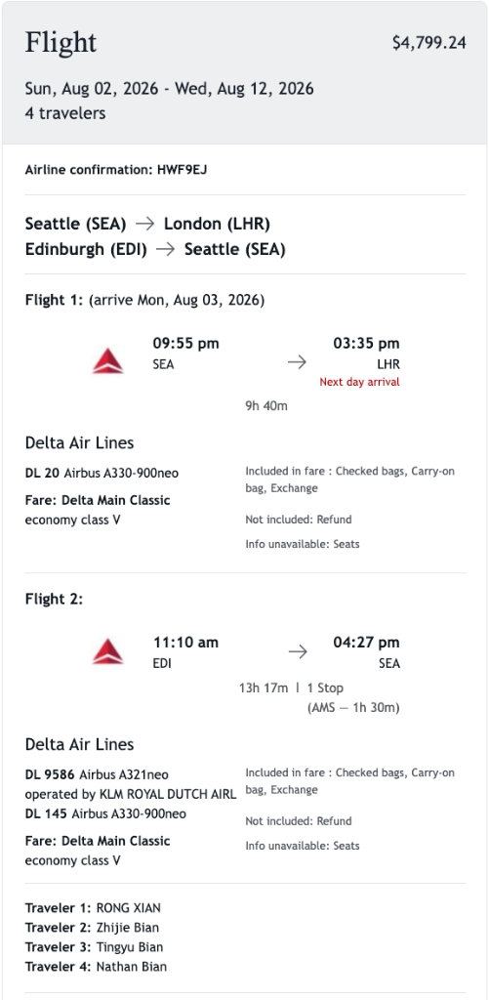
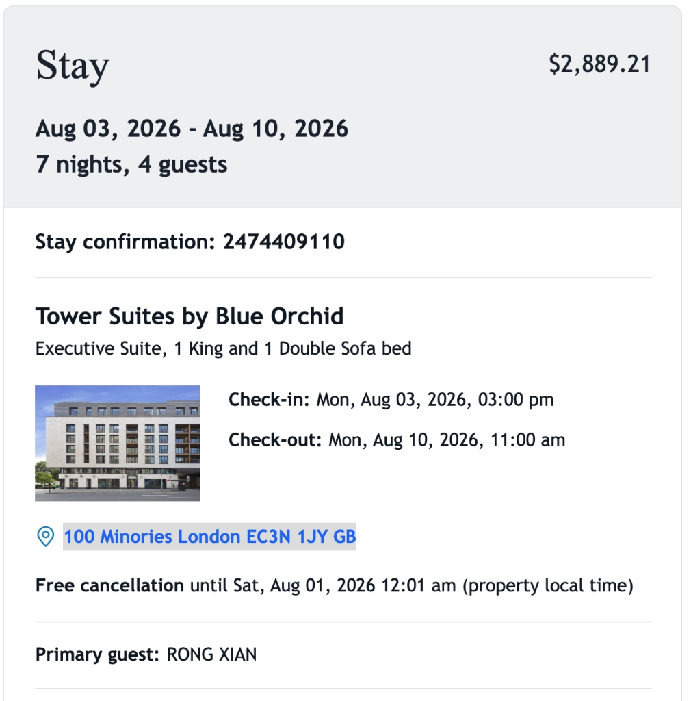
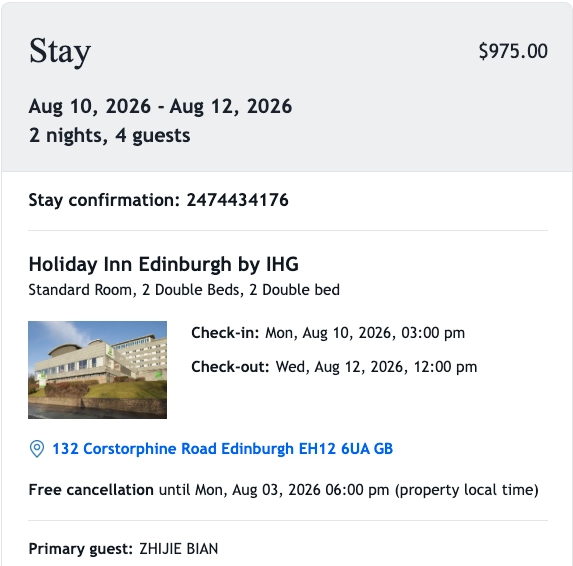
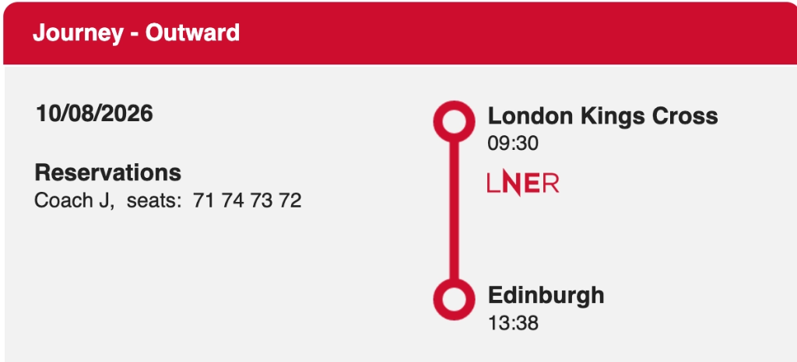

# Gemini Answer - london_edinburgh_family_trip_itinerary_aug2026

## Question
请同时在 二、 逐日详细行程安排 (Daily Itinerary) 中标注

## Answer
## 伦敦与爱丁堡家庭游详细行程与避坑指南 (London & Edinburgh Family Travel Plan)

### 一、 行程总览与关键预订信息 (Trip Overview & Booking Details)

#### 1. 基础旅行信息 (Basic Travel Details)
| 项目 (Item) | 详细信息 (Details) |
| :--- | :--- |
| **出行成员 (Travelers)** | RONG XIAN, Zhijie Bian, Tingyu Bian, Nathan Bian (家庭出游 4 人) |
| **出行时间 (Date Range)** | 2026年8月2日 – 8月12日 (共 11 天 10 晚) |

#### 2. 航班预订明细 (Flight Bookings - Delta 确认号 `HWF9EJ`)
| 航段 (Leg) | 航班号 (Flight) | 起飞时间 (Departure) | 到达时间 (Arrival) | 途经/中转 (Route / Layover) | 机型/舱位 (Aircraft / Class) |
| :--- | :--- | :--- | :--- | :--- | :--- |
| **去程 (Outbound)** | DL 20 | 8/2 09:55 PM (SEA) | 8/3 03:35 PM (LHR) | SEA → LHR 直飞 (9h 40m) | Airbus A330-900neo (Classic V) |
| **回程第一程** | DL 9586 (KLM) | 8/12 11:10 AM (EDI) | 8/12 01:40 PM (AMS) | EDI → AMS (阿姆斯特丹中转 1h 30m) | Airbus A321neo |
| **回程第二程** | DL 145 | 8/12 02:40 PM (AMS) | 8/12 04:27 PM (SEA) | AMS → SEA 直飞 (10h 47m) | Airbus A330-900neo |

#### 3. 酒店住宿明细 (Hotel Accommodations)
| 城市 (City) | 入住日期 (Dates) | 酒店名称 (Hotel) | 确认号 (Conf #) | 房型 (Room Type) | 酒店地址 (Address) |
| :--- | :--- | :--- | :--- | :--- | :--- |
| **伦敦 (London)** | 8/3 – 8/10 (7晚) | Tower Suites by Blue Orchid | 2474409110 | Executive Suite (1 King + 1 Double Sofa bed) | 100 Minories, London EC3N 1JY, GB |
| **爱丁堡 (Edinburgh)** | 8/10 – 8/12 (2晚) | Holiday Inn Edinburgh by IHG | 2474434176 | Standard Room (2 Double Beds) | 132 Corstorphine Road, Edinburgh EH12 6UA, GB |

#### 4. 跨城火车预订明细 (Intercity Train - LNER)
| 日期 (Date) | 火车公司 (Operator) | 出发站/时间 (Departure) | 到达站/时间 (Arrival) | 车厢与座位 (Coach & Seats) | 耗时 (Duration) |
| :--- | :--- | :--- | :--- | :--- | :--- |
| **8月10日 (周一)** | LNER | London Kings Cross (09:30 AM) | Edinburgh Waverley (13:38 PM) | Coach J, Seats 71, 74, 73, 72 | 4小时 08分钟 |

---

### 二、 逐日详细行程安排 (Daily Itinerary)

*(注：下文中每个项目前均已标注门票状态：🎟️ 需提前付费购票 | 🎫 免费但须提前预约 | 🆓 免费开放/免费外景)*

#### Day 1: 8月2日 (周日) — 西雅图启程 (Seattle to London)
* **21:55**: 从西雅图塔科马国际机场 (SEA) 乘坐达美航空 DL 20 航班直飞伦敦希思罗机场 (LHR)。夜航休息，准备开启英伦之旅。

#### Day 2: 8月3日 (周一) — 抵达伦敦与泰晤士河畔初体验
* **15:35**: 顺利抵达伦敦希思罗机场 (LHR) Terminal 3/4，办理入境与提取行李。
* **16:30 – 17:30**: 乘车前往伦敦市中心酒店。
  * *交通推荐*: 可乘坐 **Elizabeth Line (伊丽莎白线紫线)** 从希思罗直达 Liverpool Street 站，再打车 3 分钟或步行 8 分钟即达酒店；4 人携带行李亦可直接使用 Uber XL。
* **17:30**: 入住 **Tower Suites by Blue Orchid** (100 Minories)，办理 Check-in 并在行政套房整理休息。
* **18:30 – 20:30**: 晚间漫步。
  * 🆓 **Tower Bridge (伦敦塔桥桥面通行/外景)**：免费散步体验夜景。
  * 🆓 **St Katharine Docks (圣凯瑟琳码头)**：免费游览，并在码头附近的英式餐厅享用晚餐。

#### Day 3: 8月4日 (周二) — 剑桥大学一日游 (Cambridge Day Trip)
* **08:30 – 09:30**: 从酒店乘坐地铁 Circle Line 至 **London King's Cross (国王十字车站)**，乘坐 LNER / Great Northern 火车直达剑桥 (Cambridge) 车站（车程约 50 分钟，🎟️ **需购火车票**）。
* **10:00 – 12:30**: 游览剑桥核心学院区：
  * 🎟️ **King's College (国王学院礼拜堂)**：【**需提前购票 (约 £14-16/人)**】参观哥特式建筑礼拜堂与徐志摩《再别康桥》诗碑。
  * 🎟️ **River Cam Punting (康河撑船泛舟)**：【**需提前预订 (约 £22-30/人)**】体验 45 分钟经典康河划船之旅，穿过徐志摩笔下的康河、叹息桥与数学桥。
* **12:30 – 14:00**: 剑桥小镇午餐，推荐前往著名的 🆓 **The Eagle Pub (二战飞行员与 DNA 发现地鹰酒吧)** 或 **Fitzbillies** 尝著名的肉桂卷 (Cinnamon Buns)。
* **14:00 – 16:30**: 游览 🎟️ **Trinity College (三一学院)**（牛顿苹果树所在地）与 🎟️ **St John's College (圣约翰学院)**。
* **17:00 – 18:00**: 乘火车返回伦敦国王十字车站。顺道在车站打卡 🆓 **Platform 9¾ (九又四分之三站台拍照免费)**。

#### Day 4: 8月5日 (周三) — 白金汉宫换岗仪式与大本钟/西敏寺
* **09:30 – 11:30**: 🆓 **Buckingham Palace Changing of the Guard (白金汉宫换岗仪式)**。【**免费观赏**】
  * *预留时间*: 换岗仪式于 11:00 正式开始。建议 09:45 – 10:00 前到达 Victoria Memorial (维多利亚女王纪念碑) 阶梯上方占据最佳视野。
* **12:00 – 13:30**: 穿过 🆓 **St James's Park (圣詹姆斯公园)** 欣赏绿意与天鹅，在 Westminster 附近享用午餐。
* **13:30 – 15:30**: 🎟️ **Westminster Abbey (西敏寺大教堂/威斯敏斯特教堂)**。【**需提前购票 (约 £29-30/人)**】感受千年来英国皇家加冕与名人安葬地（牛顿、达尔文、霍金之墓）。
* **15:30 – 17:30**: 游览 🆓 **Big Ben (大本钟外景)**、🆓 **Houses of Parliament (英国国会大厦外景)** 与 🆓 **Westminster Bridge (威斯敏斯特桥)**。
* **18:00 – 19:30**: 🎟️ **London Eye (伦敦眼摩天轮 - 可选)**。【**建议提前购票 (约 £38-45/人)**】俯瞰伦敦日落全景。

#### Day 5: 8月6日 (周四) — 大英博物馆与西区人文风情
* **09:30 – 13:00**: 🎫 **British Museum (大英博物馆)**。【**免费开放，但必须提前官网预约 Timed Free Ticket**】重点打卡罗塞塔石碑 (Rosetta Stone)、帕特农神庙雕塑、埃及木乃伊馆以及中国馆。
* **13:00 – 15:00**: 前往 🆓 **Covent Garden (柯文特花园)** 享用午餐，游览街头艺人表演，并打卡彩虹小巷 🆓 **Neal's Yard**。
* **15:00 – 18:00**: 漫步至 🆓 **Trafalgar Square (特拉法加广场)**，参观免费开放的 🎫 **National Gallery (国家美术馆 - 建议提前免费预约通道票)**，欣赏梵高《向日葵》、达芬奇与莫奈名画。
* **19:00**: 🎟️ **West End Musical (西区音乐剧)**。【**需提前购票**】观看经典音乐剧（如《歌剧魅影》或《狮子王》）。

#### Day 6: 8月7日 (周五) — 哈利波特片场魔法之旅 (Harry Potter Studio Tour)
* **08:30 – 09:15**: 从 **London Euston** 车站乘坐快车 (West Midlands Trains，仅需 20 分钟) 到达 **Watford Junction** 车站，随后转乘免费接驳巴士到达片场。
* **09:45 – 14:00**: 🎟️ **Warner Bros. Studio Tour London (哈利波特影城)**。【**必须提前数月官网购票 (约 £53-56/人)，现场绝不售票**】沉浸式参观大礼堂、九又四分之三站台、霍格沃茨特快列车、禁忌森林、古灵阁银行与对角巷，品尝黄油啤酒。
* **15:00 – 18:00**: 返回伦敦市中心，参观 🆓 **St Paul's Cathedral (圣保罗大教堂外景)**，随后步行穿越 🆓 **Millennium Bridge (千禧桥)** 直达 🆓 **Tate Modern (泰特现代艺术馆免费开放)**。

#### Day 7: 8月8日 (周六) — 伦敦塔历史深度游与博罗美食集市
* **09:00 – 12:00**: 🎟️ **Tower of London (伦敦塔)**。【**需提前购票 (约 £34.80/人)**】（就在酒店门前，步行 2 分钟！）。观看英国皇室皇冠珠宝 (Crown Jewels) 与白塔 (White Tower)。
* **12:30 – 14:30**: 穿过 Tower Bridge 漫步至 🆓 **Borough Market (博罗市场)**。【**免费进场，餐饮自理**】体验伦敦最著名的美食集市，品尝生蚝、西班牙海鲜饭与烤肉甜点。
* **15:00 – 18:00**: 乘坐 🎟️ **Uber Boat by Thames Clippers (泰晤士河水上巴士刷卡购票)** 前往格林威治，游览 🆓 **Greenwich Park (格林威治公园与天文台外景免费，进子午线院内需票 £20)**。

#### Day 8: 8月9日 (周日) — 皇家公园与英伦购物休闲
* **09:30 – 12:30**: 游览 🆓 **Hyde Park (海德公园)**、🆓 **Kensington Gardens (肯辛顿花园)**，参观 🎫 **Natural History Museum (自然历史博物馆 - 免费，建议提前预约通道票)**。
* **13:00 – 17:00**: 🆓 **Regent Street (摄政街)**、🆓 **Oxford Street (牛津街)** 与 🆓 **Harrods (哈洛德百货)** 采购伴手礼。
* **18:30**: 泰晤士河景观餐厅享用伦敦告别晚宴。

#### Day 9: 8月10日 (周一) — 沿海景观火车前往爱丁堡与卡尔顿山
* **08:15**: 酒店办理退房，前往 London King's Cross 车站。
* **09:30 – 13:38**: 乘坐 🎟️ **LNER 火车** 前往爱丁堡（已订票 Coach J, Seats 71-74，过 Newcastle 后右侧窗外即为北海海岸线美景）。
* **13:38**: 抵达 **Edinburgh Waverley** 车站。
* **14:30**: 前往入住 **Holiday Inn Edinburgh** (132 Corstorphine Rd)，办理 Check-in。
* **15:30 – 18:30**: 漫步 🆓 **Royal Mile (皇家麦尔大道)**。【**免费观赏**】正值 **8月爱丁堡国际艺术节 (Edinburgh Fringe Festival)**，街头表演免费观赏，气氛热烈。
* **19:00 – 20:30**: 登上 🆓 **Calton Hill (卡尔顿山)**。【**免费开放**】俯瞰爱丁堡古城与日落全景。

#### Day 10: 8月11日 (周二) — 爱丁堡城堡与中世纪古城深度游
* **09:00 – 11:30**: 🎟️ **Edinburgh Castle (爱丁堡城堡)**。【**必须提前在线购票 (约 £19.50-22/人)**】屹立于死火山岩之上的古堡，参观命运之石 (Stone of Destiny)、苏格兰皇冠与城堡炮台。
* **11:30 – 13:00**: 漫步 🆓 **Victoria Street (维多利亚街 - 《哈利波特》斜角巷灵感来源)** 与 🆓 **Grassmarket (草料市场午餐)**。
* **13:30 – 16:00**: 参观 🆓 **St Giles' Cathedral (圣吉尔斯大教堂免费)** 与 🎟️ **Palace of Holyroodhouse (霍利鲁德宫 - 需提前购票约 £20-22/人)**。
* **16:00 – 18:00**: 可选择攀登 🆓 **Arthur's Seat (亚瑟王座免费)** 远眺海岸线，或在 🆓 **Princes Street Gardens (王子街花园免费)** 散步休息。

#### Day 11: 8月12日 (周三) — 告别苏格兰，返程西雅图 (EDI -> AMS -> SEA)
* **08:15**: 酒店退房，乘坐打车 (Uber/Taxi) 或乘坐 100 路 Airlink 巴士直达 **Edinburgh Airport (EDI)**。
* **09:00**: 抵达 EDI 机场，办理行李托运与安检。
* **11:10**: 乘坐 🎟️ **DL 9586 / DL 145 航班** 返程西雅图，16:27 顺利降落 SEA，结束旅行！

---

### 三、 关键项目注意事项、Tips 与避坑指南 (Tips & Pitfalls)

#### 1. 白金汉宫换岗仪式 (8月5日)
* **换岗时间**: 换岗仪式于上午 11:00 正式开始，但警卫队伍从 10:30 起即在 Wellington Barracks 整理集合。
* **避坑提示 (Pitfall)**: 白金汉宫正门黑铁栅栏前极其拥挤，身高受限且只能看背影。最佳观测点为 **Victoria Memorial (维多利亚女王纪念碑)** 的高阶梯上，视野开阔且可拍摄队伍入场全景。
* **天气取消**: 若遇大雨天气，换岗仪式会自动取消。请在前一天或当天清晨在官方网站 (`householddivision.org.uk`) 确认是否照常举行。

#### 2. 哈利波特影城 (8月7日)
* **门票预订**: 现场绝无售票！必须提前数月在官网预约精确的 Entry Time Slot。
* **交通避坑 (Pitfall)**: 从 London Euston 到 Watford Junction 时，务必乘坐 **West Midlands Trains 的直达快车 (仅 20 分钟)**，千万不要误乘坐每站都停的 Overground 慢车 (需 50 分钟)。
* **支付方式**: 出 Watford Junction 车站后有免费的 Harry Potter 双层巴士接驳（刷门票或直接上车）。

#### 3. 剑桥大学一日游 (8月4日)
* **康河划船避坑 (Punting Pitfall)**: 剑桥火车站和康河边有大量无牌照的野导游拉客推销高价划船票。建议提前在 **Scudamore's** 官网预约正规 guided punt，或直接在 Dock 现场向持有学生证的正规学生购买。
* **学院门票**: 国王学院礼拜堂 (King's College Chapel) 需单独购票，建议提前在线预约，避免现场排长队。

#### 4. 大英博物馆 (8月6日)
* **快速通道预订**: 虽为免费开放，但必须提前在官网预约 **Timed Entry Ticket**。未预约者现场排队可能长达 1-2 小时。
* **游览路线**: 馆藏浩瀚，家庭游建议聚焦四大核心区域：罗塞塔石碑（4展厅）、帕特农神庙（18展厅）、埃及木乃伊（61-64展厅）以及中国馆（33展厅）。

#### 5. 爱丁堡 8 月艺术节特别提示 (8月10日 – 8月12日)
* **拥挤提示 (Fringe Festival)**: 8月是全球闻名的**爱丁堡国际艺术节 (Edinburgh Fringe Festival)**，Royal Mile (皇家麦尔大道) 全天人满为患，街头表演丰富。出行请留足步行时间。
* **城堡预订**: 爱丁堡城堡门票极为紧俏，必须提前在线预约门票。

#### 6. 火车与市内交通 Tips
* **LNER 火车观景 (8月10日)**: 已预订 Coach J 71-74 座位，位于车厢右侧。过 Newcastle 后的右侧海岸线极美，请准备好相机。
* **伦敦无接触支付 (Contactless Pay)**: 伦敦公共交通（地铁 Underground、公交车 Bus、伊丽莎白线、DLR、水上巴士）全线支持 Apple Pay 或 Contactless 信用卡，随刷随走，每日自动按最高上限封顶 (Capped Fare)，无需为全家人购买实体 Oyster 卡。
* **爱丁堡酒店交通 Advantage**: 您预订的 Holiday Inn Edinburgh 位于 Corstorphine Rd，出门即是公交站，乘 100 路 Airlink 巴士 15 分钟直达爱丁堡 Waverley 市中心，反方向 15 分钟直达 EDI 机场，极其便捷！

---

### 四、 景点门票与收费项目全清单 (Tickets & Admission Master Checklist)

#### 1. 必须提前付费预订的景点/项目 (Mandatory Pre-Booked Paid Attractions)
| 景点/项目 (Attraction) | 建议预订窗口 (Booking Window) | 参考票价 (Estimated Ticket Price) | 预订与避坑提示 (Important Notes) |
| :--- | :--- | :--- | :--- |
| **Harry Potter Studio Tour (哈利波特影城)** | 提前 2-3 个月 (官网) | 成人约 £53 - £56 / 人 | **必须**提前在线预约精确时间段，现场绝对不售票！ |
| **Edinburgh Castle (爱丁堡城堡)** | 提前 2-4 周 (官网) | 成人约 £19.50 - £22 / 人 | 8 月爱丁堡艺术节期间门票极易售罄，务必提前购票！ |
| **King's College Chapel (剑桥国王学院礼拜堂)** | 提前 1-2 周 (官网) | 成人约 £14 - £16 / 人 | 剑桥最核心景点，参观礼拜堂与徐志摩诗碑需购票。 |
| **River Cam Punting (剑桥康河划船)** | 提前 3-5 天 (Scudamore's) | 散客约 £22 - £30 / 人 (包船约 £120) | 提前官网预订正规船公司，切勿在街头购买无牌野导游高价票。 |
| **Westminster Abbey (西敏寺大教堂)** | 提前 1-2 周 (官网) | 成人约 £29 - £30 / 人 | 票价含多语言语音导览，周日仅做礼拜不对外开放观光。 |
| **Tower of London (伦敦塔)** | 提前 1 周 (官网) | 成人约 £34.80 / 人 | 凭票可参观白塔与 Crown Jewels 皇冠珠宝展。 |
| **Palace of Holyroodhouse (爱丁堡霍利鲁德宫)** | 提前 1 周 (官网) | 成人约 £20 - £22 / 人 | 英国国王在苏格兰的官方行宫，含语音导览。 |
| **London Eye (伦敦眼摩天轮 - 可选)** | 提前 3-5 天 (官网) | 成人约 £38 - £45 / 人 | 在线预订指定时间段，避免现场排长队。 |

#### 2. 免费参观但建议/必须提前预约的博物馆 (Free Entry with Advance Reservation)
| 景点/博物馆 (Museum) | 门票费用 (Admission) | 预约建议 (Booking Notice) | 核心打卡亮点 (Highlights) |
| :--- | :--- | :--- | :--- |
| **British Museum (大英博物馆)** | **免费** (Free) | **必须**提前在官网预约免费 Timed Ticket | 罗塞塔石碑、埃及木乃伊、中国馆 |
| **National Gallery (国家美术馆)** | **免费** (Free) | 建议提前在官网免费预约通道票 | 梵高《向日葵》、达芬奇、莫奈名画 |
| **Natural History Museum (自然历史博物馆)** | **免费** (Free) | 建议提前在官网免费预约通道票 | 恐龙化石展厅、蓝鲸骨架 |
| **Tate Modern (泰特现代艺术馆)** | **免费** (Free) | 现场免费入场 | 现代艺术、千禧桥俯瞰圣保罗 |

#### 3. 免费开放无需门票的公共景点/地标 (Free Open Landmarks)
| 景点/地标 (Landmark) | 费用 (Cost) | 行程日期 (Date) | 游览建议与说明 (Tips & Description) |
| :--- | :--- | :--- | :--- |
| **白金汉宫换岗 (Buckingham Palace Guard Change)** | **免费** | 8月5日 上舞 | 外部观看，09:45 前到达维多利亚纪念碑占位 |
| **大本钟与国会大厦外景 (Big Ben & Parliament)** | **免费** | 8月5日 下午 | 广场与桥头外部拍照免费 |
| **伦敦塔桥外景与通行 (Tower Bridge)** | **免费** | 8月3日 & 8月8日 | 桥面步行通行免费；若登上高空玻璃栈道需单独购票 (£13.40) |
| **国王十字车站 9¾ 站台 (Platform 9¾)** | **免费** | 8月4日 傍晚 | 推推车拍照免费，拍完可选择购买纪念照 |
| **柯文特花园与 Neal's Yard (Covent Garden)** | **免费** | 8月6日 下午 | 街头表演与彩色小巷打卡免费 |
| **博罗美食集市 (Borough Market)** | **免费进场** | 8月8日 中午 | 进场免费，集市小吃美食自理 |
| **格林威治公园与本初子午线外景 (Greenwich)** | **免费** | 8月8日 下午 | 公园与天文台外景免费；进入天文台子午线小院需购票 (£20) |
| **海德公园与皇家公园 (Hyde Park & St James's)** | **免费** | 8月5日 & 8月9日 | 皇家公园全天免费开放 |
| **皇家麦尔大道 (Royal Mile)** | **免费** | 8月10日 & 8月11日 | 爱丁堡古城主街，8月艺术节街头表演免费观赏 |
| **卡尔顿山 (Calton Hill)** | **免费** | 8月10日 傍晚 | 登顶俯瞰爱丁堡日落与古城全景，免费开放 |
| **亚瑟王座与王子街花园 (Arthur's Seat & Gardens)** | **免费** | 8月11日 下午 | 徒步公园与远眺死火山全景，免费开放 |
| **维多利亚街与草料市场 (Victoria St & Grassmarket)** | **免费** | 8月11日 中午 | 街景拍照散步免费 |

