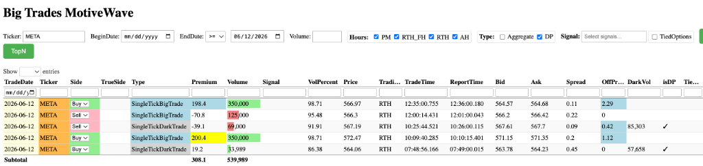
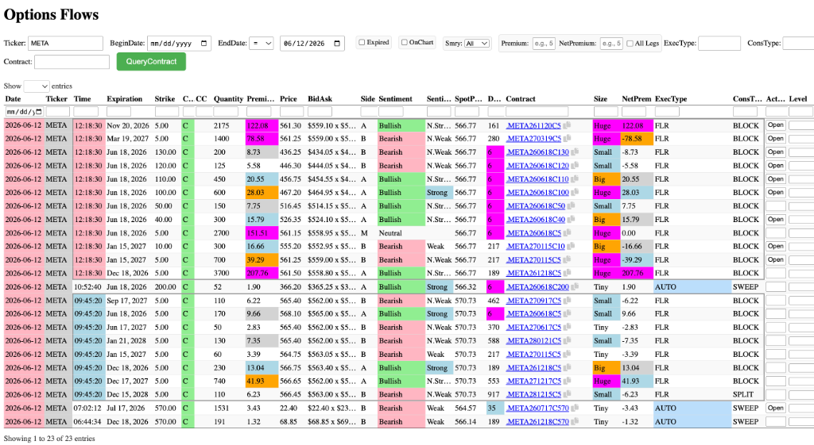

# Gemini Answer - meta_orderflow_optionsflow_analysis

## Question
分析今天 META order flow和options flow 异常大单，以及是看涨还是跌。

## Answer
针对今日（2026-06-12）META（Meta Platforms）的股票大单（Order Flow）与期权链（Options Flow）异动，进行以下技术分析与数据关联研判：

### 股票端大单（Order Flow）特征分析
今日 META 股票大单净主动买入金额达 **+3.08 亿美元**，净买入量达 **+539,989 股**（以主动买入为正值，主动卖出为负值进行净值折算）。其主要呈现以下两个显著特征：

1. **机构超高偏离度扫盘（High Off-Price Sweeps）**：
   * **10:09:40**：出现一笔 **350,000 股** 的 SingleTickBigTrade 主动买单，成交价 $572.47，偏离度（OffPrice）高达 **$1.12**（即成交价高出当时 Ask 卖一价 $1.12）。
   * **12:35:00**：再次出现一笔 **350,000 股** 的 SingleTickBigTrade 主动买单，成交价 $566.97，偏离度高达 **$2.29**（高出当时 Ask 卖一价 $2.29）。
   * *分析*：如此庞大的单笔体量（每笔成交额均近 2 亿美元）且以极高溢价直接扫盘，表明机构在现货市场的买入态度非常急迫，愿意承担高额滑点成本以快速建仓或完成对冲。
2. **暗池与常规卖单对冲**：
   * 盘中伴随少量卖单，包括 12:00 处的常规大单卖出 125,000 股，以及 10:25 处的暗池（SingleTickDarkTrade）卖出 69,000 股（偏离度 -$0.42，跌破 Bid 买一价），但整体买方力量占据绝对主导地位。

### 期权端大单（Options Flow）特征分析
期权端在今日呈现了极罕见的**超大额深实值看涨期权（Deep In-The-Money Calls）**密集交易，集中在两个时间段：

1. **12:18:30 的多期限组合大单**：
   * 该时间点密集出现了多笔行权价极低（**$5.00** 或 **$10.00**）的深实值 Call 块交易，成交类型全部为 **FLR（Floor，场内交易）**。
   * **主要买入方（主动打在 Ask 上，偏看多）**：
     * `Dec 18, 2026 5.00 Call`：成交 **3,700 张**，权利金高达 **2.08 亿美元**。
     * `Nov 20, 2026 5.00 Call`：成交 **2,175 张**，权利金达 **1.22 亿美元**。
     * `Jun 18, 2026 100.00/110.00 Call`：分别成交 600 张 and 450 张，合计权利金约 4800 万美元。
   * **主要卖出方（主动打在 Bid 上，偏看空/平仓）**：
     * `Mar 19, 2027 5.00 Call`：成交 **1,400 张**，权利金 **7858 万美元**。
     * `Jan 15, 2027 5.00 Call`：成交 **700 张**，权利金 **3929 万美元**。
   * **中性交易（打在 Mid 中点）**：
     * `Jun 18, 2026 5.00 Call`：成交 **2,700 张**，权利金 **1.51 亿美元**。
2. **09:45:20 的早期实值大单**：
   * 同样以 $5.00 Strike 的 Call 为主，买入与卖出方向交织，其中 `Dec 17, 2027 5.00 Call` 买入 **740 张**（权利金 4193 万美元）。

### 现货与期权联动分析（套利与对冲行为）
将两张数据图表进行时间与体量关联，可以清晰推导出这是**大型机构的系统性对冲或转换套利（Conversions/Reversals）操作**：

1. **时序高度吻合**：
   * 早上 **09:45** 期权端出现第一批 $5.00 Strike 大单后，约 24 分钟后（**10:09**），现货市场即出现第一笔 35 万股的扫盘买单。
   * 中午 **12:18** 期权端爆发 12:18:30 的超大体量 Floor 块交易后，约 17 分钟后（**12:35**），现货市场再次爆发第二笔 35 万股的扫盘买单。
   * *注*：大宗 Floor 交易在场内成交后，其向系统报告通常有十余分钟的延迟，时间差完全符合机构在期权市场成交后，在现货市场进行 Delta 动态对冲（Delta Hedging）或现货交割配对的时间窗口。
2. **实值期权作为股票替代品**：
   * 行权价为 $5.00 且距离到期日较远的看涨期权，其 Delta 几乎等于 **1.0**。购买此类期权在财务盈亏上与直接持有 100 股现货完全一致。
   * 机构交易总量达数千张（如 3,700 张合约等价于 37 万股正股），这与现货端两笔 **35 万股** 的扫盘规模高度契合。
3. **交易性质研判**：
   * **转换套利（Conversion Arbitrage）**：机构可能在买入正股的同时，买入深实值 Put 并卖出深实值 Call（或反向操作 Reversal），利用期权平价公式（Put-Call Parity）锁定无风险利差、借贷利率差或股息红利。
   * **税收/保证金筹划（Tax/Margin Straddle）**：通过在场内（Floor）对倒不同到期日同为 $5.00 行权价的深实值期权，可以实现在不暴露净敞口风险的情况下，转移账面损益或优化资本占用。

### 方向性研判结论
从专业交易分析的角度来看，这笔资金流向在**短线价格行为上偏向“看涨（偏多）”**，但在**机构真实意图上是“方向中性（套利对锁）”**。

1. **短线盘面影响：偏多（看涨）**
   * **流动性消耗**：在股票端，机构在 `10:09` 和 `12:35` 的两笔 **35万股** 扫盘大单均以极高溢价直接扫货。
   * **价格推动**：这种不计滑点成本的主动吃单（Sweep）会直接消耗上方卖单的流动性，在日内及短线层面会对股价产生直接的**向上推动力**。

2. **机构头寸本质：中性（无方向性押注）**
   * **Delta 对冲特征**：期权端出现的数亿美元 `$5.00 Strike`（深实值）看涨期权（Call），其 Delta 值几乎等于 1.0。
   * **套利对锁**：机构在买入（Ask）和卖出（Bid）这些深实值期权的同时，必须在现货市场进行等量正股的配对交易（如买正股 + 卖实值 Call 的 Conversion 套利，或者卖正股 + 买实值 Call 的 Reversal 套利）。
   * **轧差敞口**：这类 Floor 场内大单组合的净 Delta 敞口通常会被完全轧平成 **0（Delta-Neutral）**。这意味着机构并不是在赌 META 未来会大涨或大跌，而是为了赚取无风险的借贷利差、股息红利或进行税务结构调整。

* **总结**：**短线偏多（看涨），中线中性。**
* **操作参考**：不建议单凭此大单盲目追多。虽然日内主动性买盘很强推动了股价，但由于其本质是机构的低风险套利/对锁头寸，一旦其对冲买盘执行完毕，该资金并不会对股价提供持续的 directional（方向性）多头推力。

