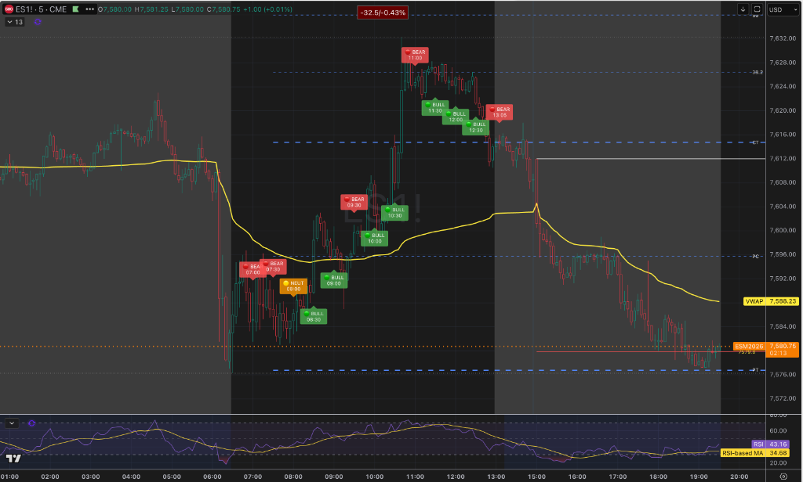
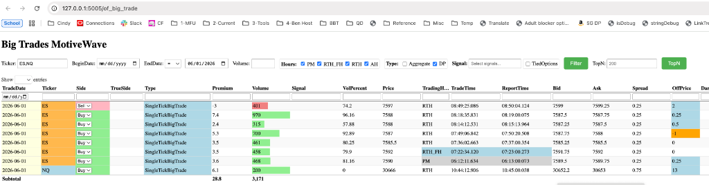

# Gemini Answer - order_flow_analysis_1230_drop_clues

## Question
图一是今天的orderflow实时分析结果 (/Users/zhijiebian/Documents/Workplace/PycharmProjects/BBTrading/PyTools/order_flow_analysis/ai_tape_analyst.py )
  图二是RTH ES NQ SingleTickBigTrade大单（很bullish）
但12:30后开始下跌 盘后下跌了更多 请分析12:30 之前的orderflow数据 有什么evidence/clue 预示了这个大的下跌吗

## Answer
结合您提供的两张图表以及 12:30 之前的 Order Flow（订单流）与大单数据，可以从微观结构和量价行为中梳理出以下几个预示后续大跌的**关键线索（Evidence & Clues）**：

### 1. 大单资金的“时空错配”：底部吸筹 vs 高位无跟风
观察图二（SingleTickBigTrade 大单列表）：
* **入场位置**：今天 ES 的巨额主动买单（970手、700手、458手、461手等）几乎全部集中在 **07:22 至 08:18** 之间，对应的价格区间在 **7585.50 - 7592.00**（即日内低位及图一中的黄线 VWAP 附近）。这确实是极强的主力**被动吸收与主动推升（吸筹阶段）**。
* **高位缺失**：当价格在 11:00 之后推升至 **7620 - 7628** 的日内高位时，**大单列表中完全没有出现新的大额主动买单跟风**。这意味着推升至高位的动力主要来自于散户的 FOMO 或前期空头的止损（Buy Stops），而真正的机构大单在 7620 上方已经停止了追高，甚至开始进行多头平仓（Distribution）。

### 2. 关键时点（11:00）的“看空吸收”与“主动打压”
图一中，11:00 出现的 **BEAR 信号** 是日内高位结构发生本质改变的第一个警示牌：
* **订单流细节**：11:00 价格触及 RTH 高位区间（85.7%），虽然最近 30 分钟累计 Delta 仍为正，但在 **7628.00** 上方遭遇了极为强劲的**被动看空吸收（Bearish Absorption）**。
* **空头增量**：在该 30 分钟的最后 5 分钟内，盘口直接出现了主动卖盘（Aggressive Sellers）的增量打压，迫使价格从 7628.00 快速回落至 7624.25。这表明高位存在极其坚硬的限价卖单墙（Limit Sell Orders），且主动空头已开始尝试夺回短期主导权。

### 3. 12:30 “Supply Trap”（卖盘被吸收）的欺骗性与衰竭
12:30 虽录得 **BULL 信号**，但其结构在当时所处的“位置”具有极高的风险：
* **背离的局限性**：12:00 - 12:30 期间，净 Delta 为负（-614），价格微涨 1.50 点，盘口判定为“卖盘被吸收”。**然而，这种吸收是发生在该交易日 88.4% 的绝对高位**。
* **多头衰竭信号**：在高位出现负 Delta 伴随价格滞涨/微涨，往往不是健康的吸筹，而是多头主动买方动能耗尽（Buyers Exhaustion）的征兆。此时的“卖盘被吸收”更像是在高位利用被动买单维持价格稳定以利于出货，或者是最后的空头不死心进行最后的抵抗，上方流动性已经变稀薄。

### 4. 13:05 确认信号：“买盘被吸收”的最终确立
紧接着 12:30 的虚假繁荣后，13:05 订单流立即给出了明确的 **BEAR 信号**：
* 30分钟内整体出现经典的 **“买盘被吸收”（Divergence of Aggressive Buyers Absorbed）**，Delta 与价格呈现相反的下行背离，且价格处于高位 69.2%。
* 这证实了多头在 12:30 强撑后，主动买方彻底放弃抵抗，被动卖方的压制力量在 7620-7628 区域完全胜出。一旦多头止损盘在 7615-7612 区域被触发，下方由于缺乏 7600 以上的机构买单支撑，价格便迅速向早盘大单吸筹区（VWAP 7588 附近）进行均值回归，并由于多头爆仓（Long Liquidation）引发了更深幅度的盘后下跌。

