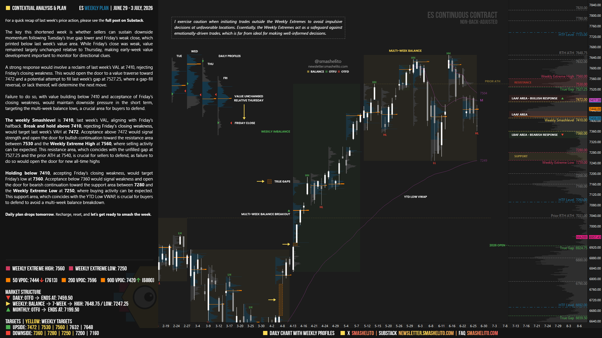
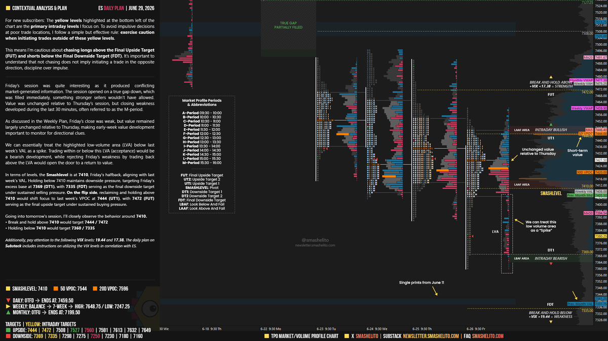

# Gemini Answer - smashelito_weekly_plan_analysis

## Question
Smashelito(@smashelito) 另外一个X的order flow trader，他每周末post weekly analysis，每天post daily analysis。
和Adam Set不一样，他不做涨跌的方向性预测，但他分享基于order flow的pivot，上涨点位和下跌点位。

下面是他的这周的weekly plan

Smashelito Signal:
2026-06-27 18:22:42 Seattle Time
IsSignal: False, Direction: 
Post: #ES_F | $SPX Weekly Plan | June 29 - 3 July
🟥 Daily: OTFD
🟨 Weekly: BALANCE
🟩 Monthly: OTFU
The key this shortened week is whether sellers can sustain downside momentum following Tuesday’s true gap lower and Friday’s weak close, which printed below last week’s value area.

注意他的分析在X post的图片上，

请分析他的分析接 试着解释他的方式方法 and 理论，提取关于点位的信息

## Answer
根据从 Smashelito 本周（6月29日 - 7月3日）周度计划图表中提取出的全量 OCR 文本和结构数据，以下为您深度解构他的**交易理论体系、核心分析方法以及本周的关键价格点位**：

---

## 一、 核心交易理论与分析方法 (Trading Philosophy & Methodology)

Smashelito 的分析完全基于**拍卖市场理论 (Auction Market Theory)** 与 **市场轮廓/量价分布 (Market Profile / Volume Profile)**。他的核心分析框架可拆解为以下三个支柱：

### 1. 多时间框架拍卖状态 (Multi-Timeframe Auction Status)
他使用 **单向趋势推进 (One-Time Framing, OTF)** 状态来评估各周期多空动能：
* **OTFU (One-Time Framing Up - 单边向上)**：高点 and 低点持续抬升。
* **OTFD (One-Time Framing Down - 单边向下)**：高点 and 低点持续下破。
* **BALANCE (平衡震荡)**：价格在既定区间内横盘盘整。
* **本周结构定位**：
  * **日线 (Daily)**: **OTFD** (看空推进，终止点/拐点为 **7459.50**)。
  * **周线 (Weekly)**: **BALANCE** (7周大区间平衡，区间为 **7247.25 - 7648.75**)。
  * **月线 (Monthly)**: **OTFU** (看多推进，终止点/安全边界为 **7199.50**)。

### 2. 价值区穿越逻辑 (Value Area Traverse Rules)
* **价值区 (Value Area, VA)** 代表上周 70% 成交量集中的区域，由价值区上沿 (VAH) 和价值区下沿 (VAL) 锁定。
* **Smashelito 的核心假说**：如果价格能够重新站回并企稳于价值区下沿 (VAL)，代表市场对“低价”的拒绝，价格将大概率横穿整个价值区（Value Traverse）去测试价值区上沿 (VAH)。反之，若无法站回，则向下测试前期的平衡区低点。

### 3. 周度极端边界防守法则 (Weekly Extremes & Safeguard)
* **Weekly Extremes (周度极端边界)**：分为极端高点（Extreme High）和极端低点（Extreme Low）。
* 他的风控理念指出，**周度极端边界是情绪化交易的防火墙**。在极端边界之外追单极易遭遇“均值回归”的机构拦截（被动吸筹或被动阻力）。交易员应在极端低点寻找买入支持，在极端高点寻找卖出阻力，拒绝在中间的震荡带进行情绪化追单。

---

## 二、 本周核心价格点位提取 (Key Price Levels)

根据图表及文本，本周 $ES 的价格版图如下（点位均以非除权连续合约价格为准）：

### 1. 核心枢纽线 (Weekly Smashlevel)
* **7410.00**：上周的价值区下沿 (VAL)，也是周五的 Halfback (50%回撤位)。这是本周多空的生死线。
  * **站稳 7410**：否定上周五的弱势收盘，确立买方短期夺回主控权。
  * **承压于 7410**：确认空头动能延续，价格将继续向下测试。

### 2. 上行看多目标与阻力带 (Upside Targets & Resistances)
* **7472.00**：上周价值区上沿 (VAH)，若站稳 7410 后的第一目标位。
* **7527.25**：上周遗留的未补缺口 (Unfilled Gap)，空头强力防御区。
* **7530.00 - 7560.00**：强阻力带（包含历史高点 ATH 7540.00 区域）。
* **7560.00**：**周度极端高点 (Weekly Extreme High)**，机构被动卖盘密集区，在此预计有强烈抛压。
* **7648.75**：RTH 历史高点 (RTH All-Time High)。

### 3. 下行看空目标与支撑带 (Downside Targets & Supports)
* **7360.00**：上周五的最低点，跌破 7410 后的首要防守测试位。
* **7280.00 - 7250.00**：多周平衡区底部强支撑带。
* **7250.00**：**周度极端低点 (Weekly Extreme Low)**，与年内低点成交量加权平均价 (YTD Low VWAP) 高度重合，机构被动买盘防守大本营。
* **7199.50**：月度 OTFU 趋势终止位（跌破此位置将破坏月线级别多头结构）。
* **7160.00**：长期宏观支撑位。

---

## 三、 实战战术推演 (Tactical Scenarios)

### 场景 A：买方强势响应 (Bullish Response)
* **激活条件**：开盘突破并站稳 **7410** 之上。
* **战术路径**：向 **7472** 推进，若突破 7472，则进一步向 **7527.25 - 7530** 缺口阻力带以及 **7560** 极端高点发起冲击。

### 场景 B：卖方动能延续 (Bearish Continuation)
* **激活条件**：价格受阻于 **7410** 之下，或无法站稳 7410。
* **战术路径**：向测试上周五低点 **7360**，若跌破 7360，空头将大举向下碾压，测试多周平衡底部的 **7280 - 7250** 密集支撑区（Weekly Extreme Low）。

## smashelito_daily_plan_analysis

### Question
以下是关盘后他的daily 分析 

smashelito Signal:
2026-06-29 08:02:16 Seattle Time
IsSignal: False, Direction: 
Post: [Posted at 06/28/2026 14:57:30]
#ES_F Daily Plan | June 29
As discussed in the Weekly Plan, Friday’s close was weak, but value remained largely unchanged relative to Thursday, making early-week value development important to monitor for directional clues.
We can essentially treat the highlighted low-volume

请深度解构他的交易理论体系、核心分析方法以及关键价格点位

### Answer
根据从 Smashelito `6月29日` 的 $ES 日度计划（Daily Plan）图表中提取的完整文本及拍卖分布数据，以下为您深度解构他的日内交易理论体系、分析逻辑以及具体的核心点位：

---

## 一、 核心交易理论与分析方法 (Intraday Methodology & Theory)

与周度宏观框架相比，Smashelito 在日度分析中更聚焦于**盘口结构冲突、市场参与者性质以及波动率多维度联协**：

### 1. 市场生成信息冲突的研判 (Conflicting Market-Generated Information)
他对前一交易日（周五）的盘面异动给出了极高价值的结构化定性：
* **缺口回补揭示卖方虚弱 (True Gap Filled)**：周五开盘出现低开缺口（True Gap Down），但该缺口在开盘后被多头瞬间回补。在拍卖理论中，真正的强势卖方（Stronger Sellers）绝不会允许缺口被轻易回补。这表明日内卖方力量实际上较为松散。
* **M周期收弱 (M-Period Weakness)**：虽然价值区间（Value Area）与周四基本持平，但周五的最后一周期（收盘前30分钟，即 M-Period）出现了尾盘杀跌。这属于典型的“尾盘被动出货”，导致收盘价格偏弱。

### 2. 价格针尖/长针拒绝逻辑 (Spike / Low-Volume Area Rejection)
* 他将上周价值区下沿（VAL）下方的**低成交量区 (Low-Volume Area, LVA)** 视为一个“**Spike (价格长针/针尖)**”。
* **市场接受度判断 (Acceptance vs. Rejection)**：
  * 如果价格在 LVA 内部或下方运行（称为 **Acceptance 接受**），说明市场认可了低价，这属于明显的**看空信号**。
  * 如果价格能迅速收回至 LVA 上方（称为 **Rejection 拒绝**），说明低价被市场拒绝，价格将大概率返回原有价值区（Return to Value）。

### 3. 日内操作军规 (Intraday Rules)
* **不追单原则 (Anti-Chasing Rules)**：
  * 拒绝在**终极上行目标 (Final Upside Target, FUT)** 之上盲目追多。
  * 拒绝在**终极下行目标 (Final Downside Target, FDT)** 之下盲目追空。
  * **纪律重于冲动 (Discipline over impulse)**：不追单并不等于要立刻反手开反向单，而是保持空仓等待均值回归。

### 4. VIX 联协验证 (VIX Correlation Validation)
他引入 VIX 指数作为 $ES 走势的过滤器：
* 密切关注 VIX 关键点位：**19.44** 和 **17.38**。
* **判定规则**：若 VIX 大于 **19.44**，表明大盘市场处于极度脆弱状态（WEAK），此时做多应保持最高警惕。

---

## 二、 6月29日核心日内点位 (Key Intraday Levels)

### 1. 日内生死枢纽线 (Daily Smashlevel)
* **7410.00 / 7412.00**：对应前一交易日周五的 Halfback（50%回撤线）及上周价值区下沿 (VAL)。
  * **突破并站稳 7410**：确认价格拒绝低价区，日内转为多头主控。
  * **承压于 7410 下方**：空头继续控盘，下行压力维持。

### 2. 上行日内目标 (Upside Intraday Targets)
* **7444.00 (UT1 - 第一上行目标)**：对应上周的最大成交量控制点 (VPOC - Volume Point of Control)。
* **7472.00 (FUT - 终极上行目标)**：对应上周价值区上沿 (VAH)。
* **7508.00 - 7520.00**：若多头动能爆发的延伸阻力带。
* **7527.25**：上周缺口位置 (True Gap)。

### 3. 下行日内目标 (Downside Intraday Targets)
* **7369.00 (DT1 - 第一下行目标)**：周五的异常底部支撑区（Excess Base）。
* **7335.00 (FDT - 终极下行目标)**：最终下行支撑区。
* **7280.00 - 7250.00**：宏观多周平衡下沿大支撑带（Weekly Extreme Low）。

---

## 三、 日内交易战术推演 (Tactical Execution Scenarios)

Smashelito 将以 **7410** 处的盘口行为作为开盘后的唯一判断基准：

* **多头剧本 (Bullish Path)**：
  价格开盘直接站稳 **7410**，说明周五尾盘的弱势被市场否定。第一目标看向上方筹码密集区 **7444**。若多头在 7444 持续增仓并被市场接受，则最终目标看向上周阻力高沿 **7472**。

* **空头剧本 (Bearish Path)**：
  价格开盘承压于 **7410** 下方。战术上直接看跌向周五低点附近的 **7369**。如果在 7369 处未见明显的吸收（Absorption）和主动买盘介入，则空头动能将继续下泻至日内防守终点 **7335**。

