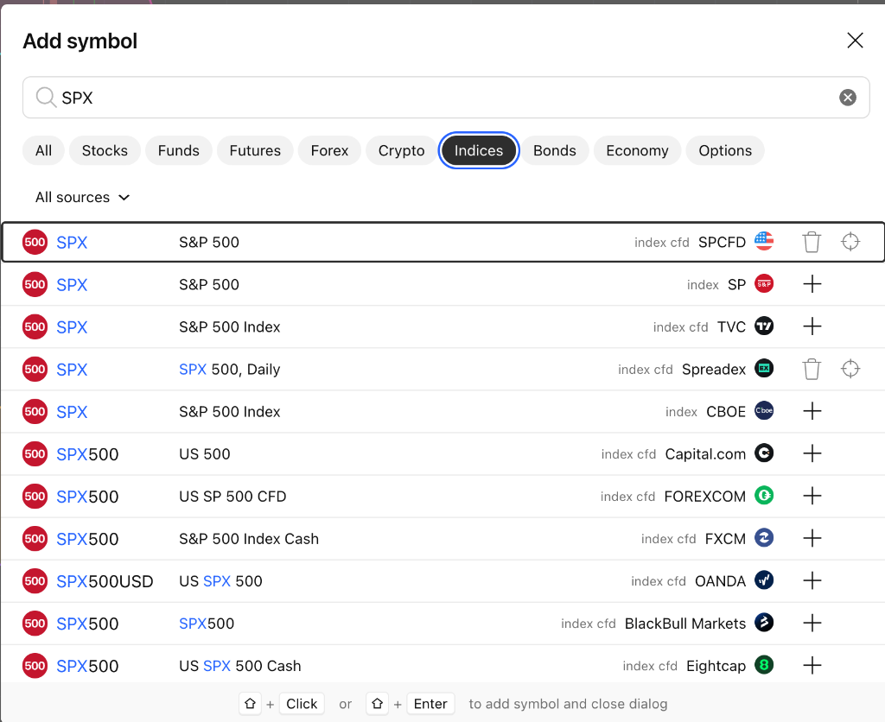

# TradingView SPX 标普500各数据源代码对比与标准选型全指南

在 TradingView 中搜索 `SPX` 时，会出现大量由不同机构、交易所和外汇经纪商提供的代码。它们最核心的本质区别在于**“官方正规现货指数 (Index)”**与**“场外差价合约 (Index CFD)”**的划分。

## 结论：哪一个是标准的？

最标准、最权威、全球专业机构及期权交易员公认的绝对核心代码是第 5 行：**`SPX`（数据源为 `CBOE`，代码全称：`CBOE:SPX`）**。

### 为什么 CBOE:SPX 是最标准的？
- **清算与挂牌的唯一性**：S&P 500 现货指数期权（包括全部 0DTE 日内期权、月度期权、季度期权以及衡量市场恐慌情绪的 VIX 指数体系）均在**芝加哥期权交易所（CBOE，Chicago Board Options Exchange）**挂牌交易与清算。
- **做市商对冲与 Gamma 基准**：CBOE 实时根据标普 500 所有 503 只成分股的最新撮合价进行高频官方指数加权计算。在进行做市商 Net Gamma 敞口、Call Wall / Put Wall、Zero Gamma Flip、波动率触发位（Vol Trigger）以及期权卖方行权价（Strike）对齐时，必须以 `CBOE:SPX` 为绝对基准。
- **备选官方标准**：第 2 行 `SP:SPX`（数据源为 `SP`，即标准普尔道琼斯指数公司官方发布源），同样是官方权威真实指数，与 CBOE 走势基本一致。

## 第一行的 SPCFD 是什么？

搜索列表第一行的 **`SPCFD:SPX`** 是 TradingView 官方整合建立的 **“标普系列差价合约”（S&P Index CFDs）** 聚合通道。

### 名字拆解与本质属性
- **SP**：代表 S&P（Standard & Poor's，标准普尔公司）；
- **CFD**：代表 Contract For Difference（差价合约）；
- **资产类型**：右侧灰色文字清晰标注为 `index cfd`（而非真实交易所指数 `index`）；
- **报价原理**：它**不是**来自交易所撮合的真实股票现货成交价，而是由场外流动性机构（Liquidity Providers）根据标普现货成分股与 CME 标普期货价格实时合成的场外衍生品报价。

### 在 TradingView 中的作用
TradingView 专门设立了 `SPCFD` 这一代码前缀，用来归集一整套完整的标普系列指数 CFD，方便普通用户免订阅查看：
- `SPCFD:SPX`：标普 500 大盘指数 CFD
- `SPCFD:SPF`：标普 500 金融板块指数 CFD
- `SPCFD:S5REAS`：标普 500 房地产板块指数 CFD
- `SPCFD:MID`：标普 400 中盘股指数 CFD

### 优势与局限性
- **主要优势**：TradingView 免费用户也能直接看到实时跳动的报价，无需付费订阅；并且交易时段极长，覆盖盘前、盘后及隔夜时段；
- **主要缺陷**：存在 0.5 到 2 个点的场外合成基差；无真实交易所成交量；不能作为期权行权价的绝对锚定点。

## 截图中 11 类 SPX 代码全维度对比大表

以下按照搜索结果截图中从上到下的 11 行顺序，对每一个代码的本质属性、适用场景、缺陷及推荐建议进行逐一对比说明：

| 行号 | 代码与显示名称 | 资产类型与数据源 | 本质属性 | 特点与适用场景 | 局限性 / 缺陷 | 权威度与使用建议 |
| :---: | :--- | :--- | :--- | :--- | :--- | :--- |
| **1** | **`SPX`** S&P 500 | `index cfd` **SPCFD** | TradingView 官方整合的**标普系列场外差价合约**（S&P Index CFDs）归集通道。 | 免费提供实时跳动行情；涵盖标普大盘及各行业子板块；交易时间长（覆盖盘前/盘后）；适合免费看大盘日内连续形态走势。 | 属于做市商合成报价，非官方真实交易所撮合；与真实现货常有 0.5 到 2 点的基差；成交量为虚拟量；不能用于期权行权价精确对齐。 | 适合日常免费看趋势、画线分析；不适合期权精确对齐。 |
| **2** | **`SPX`** S&P 500 | `index` **SP** | **标准普尔道琼斯指数公司**（S&P Dow Jones Indices）发布的官方现货标准指数。 | 100% 官方正宗指数定义；全球机构与基金衡量标普 500 表现的基准；历史日线收盘数据绝对权威；适合宏观分析与长周期复盘。 | 非期权撮合交易所；TradingView 免费用户盘中通常有 15 分钟延迟；仅在美东 9:30 - 16:00 正常交易时段跳动。 | **官方标准之一**。 适合长线与宏观日线/周线复盘。 |
| **3** | **`SPX`** S&P 500 Index | `index cfd` **TVC** | **TradingView 官方自研聚合**的标普 500 差价合约（TradingView CFD）。 | TradingView 平台上最普及的**免费实时**大盘走势源；全天候连续波动（含美股盘前/盘后）；画线、看形态、看指标非常方便。 | 点位由 TradingView 算法基于流动性提供商合成，与官方现货存在微小基差；成交量无效；无法作为 0DTE Gamma Wall 精确判定依据。 | 极佳的免费实时盯盘备选（如不愿订阅 CBOE 实时包）。 |
| **4** | **`SPX`** SPX 500, Daily | `index cfd` **Spreadex** | 英国点差交易与 CFD 经纪商 Spreadex 提供的**点差合约**。 | 专供在 Spreadex 开户的零售交易者进行日线（Daily）级别的点差押注交易。 | 受 Spreadex 自家盘口点差与结算模型制约；流动性与连贯性差；高低点不准；对普通美股交易者无参考价值。 | **不推荐**。 仅限该券商开户交易者使用。 |
| **5** | **`SPX`** S&P 500 Index | `index` **CBOE** | **芝加哥期权交易所（CBOE）官方现货指数**，所有 SPX 现货期权的母体与结算基准。 | **业界公认最权威、最标准的绝对核心代码**！SPX 0DTE 期权、做市商 Gamma 对冲、Gamma Wall（Call/Put Wall）、波动率触发位（Vol Trigger）及期权卖方结算点位的**唯一官方基准**。 | 免费账户通常有 15 分钟延迟（需在 TradingView 订阅 CBOE 实时数据包，约 $2~$3/月）；仅在美东 9:30 - 16:00 开市时段更新；无盘前盘后夜盘连续走势。 | **绝对核心标准（强力推荐）**。 期权量化、Gamma 研判与核心点位必须认准此代码。 |
| **6** | **`SPX500`** US 500 | `index cfd` **Capital.com** | 零售差价合约券商 Capital.com 发行的**场外高杠杆指数 CFD**。 | 供 Capital.com 平台散户进行 24 小时小资金加杠杆做多/做空；免费提供实时行情。 | 包含券商加价点差（Spread）；非真实交易所订单；行情剧烈波动时容易出现脱钩或平台独有插针；成交量仅代表该券商内部。 | **不推荐**用于分析。 仅作为该平台开户交易标的。 |
| **7** | **`SPX500`** US SP 500 CFD | `index cfd` **FOREXCOM** | 全球零售外汇经纪商**嘉盛集团**（FOREX.com）发行的标普 500 差价合约。 | 供嘉盛外汇账户持有者进行跨市场对冲和指数保证金交易；提供 24 小时连续报价。 | 价格由嘉盛内部做市商算法撮合；高低极值点含券商点差，与真实交易所指数存在滑点与偏差。 | **不推荐**用于专业分析。 仅限嘉盛交易用户。 |
| **8** | **`SPX500`** S&P 500 Index Cash | `index cfd` **FXCM** | 外汇经纪商**福汇**（FXCM）基于标普 500 合成的现金指数差价合约。 | 适合在福汇交易的投资者；无交割换月周期的现金合约（Cash）；24 小时连续交易。 | 存在点差成本摩擦；在非美股正常交易时段（如亚盘）流动性薄弱、点差会显著放大；与官方 SPX 有 1~3 点偏离。 | **不推荐**用于专业分析。 仅限福汇交易用户。 |
| **9** | **`SPX500USD`** US SPX 500 | `index cfd` **OANDA** | 老牌外汇券商**安达**（OANDA）发行的美元计价标普 500 差价合约。 | 全球零售外汇圈使用最广泛的 CFD 之一；24 小时连续波动；常被用于在亚洲和欧洲时段快速观察美股夜盘整体多空情绪。 | 点位被 OANDA 算法平滑，且包含点差；开收盘价及缺口经常与正规美股现货不一致；严禁作为期权行权价对齐依据。 | 可作为夜盘情绪参考；不适合精准技术分析与量化回测。 |
| **10** | **`SPX500`** SPX500 | `index cfd` **BlackBull** | 新西兰外汇经纪商 BlackBull Markets 提供的差价合约。 | 供 BlackBull 客户在 MT4/MT5 或 TradingView 上进行杠杆保证金交易。 | 属于较小众的经纪商通道，深度与报价稳定性依赖上游清算机构；对专业美股交易分析无独立参考价值。 | **不推荐**。 仅限该券商开户交易者使用。 |
| **11** | **`SPX500`** US SP 500 Cash | `index cfd` **Eightcap** | 澳洲外汇经纪商易汇（Eightcap）发行的现金差价合约。 | 常见于各种自营交易考牌（Prop Trading Firms，如 FTMO 等）指定使用的指数交易标的。 | 做市商对手盘报价机制；点差随波动剧烈变化；高低极值点存在平台特性，无法与美股真实大盘对齐。 | **不推荐**用于美股现货/期权分析。 仅限自营考牌或该平台交易使用。 |

## 实战交易与量化选型建议

在不同的交易体系与日常盯盘需求中，推荐采取如下选型策略：

### 期权卖方与 0DTE Gamma 策略
- **唯一准则**：必须认准第 5 行 **`CBOE:SPX`**（类型为 `index`）。
- **原因**：期权行权价（如 5700 Call、5650 Put）是绝对整数价位，一旦点位因为 CFD 的加价点差偏移 1 到 2 点，就会导致是否触碰 Call Wall 或是否跌破 Put Wall 的风控信号产生严重误判。

### 零成本日常形态盯盘与画线
- **首选代码**：第 3 行 **`TVC:SPX`** 或第 1 行 **`SPCFD:SPX`**。
- **原因**：TradingView 免费用户即可享有无延迟的连续实时报价，且涵盖美股盘前盘后的波动轨迹，对于技术分析形态（头肩顶底、趋势线、EMA 均线）完全足够。

### 微观订单流与高频先行指标
- **首选代码**：**`CME:ES1!`**（E-mini 标普 500 期货连续合约）或 **`AMEX:SPY`**（标普 500 ETF 现货）。
- **原因**：CFD 缺乏真实的撮合成交量和 Level 2 挂单盘口。只有在 CME 期货市场，才能提取出真正代表机构资金动向的主动买卖量（Delta）、冰山单（Iceberg）、吸收单（Absorption）与关键流动性分界线（Pivots）。

