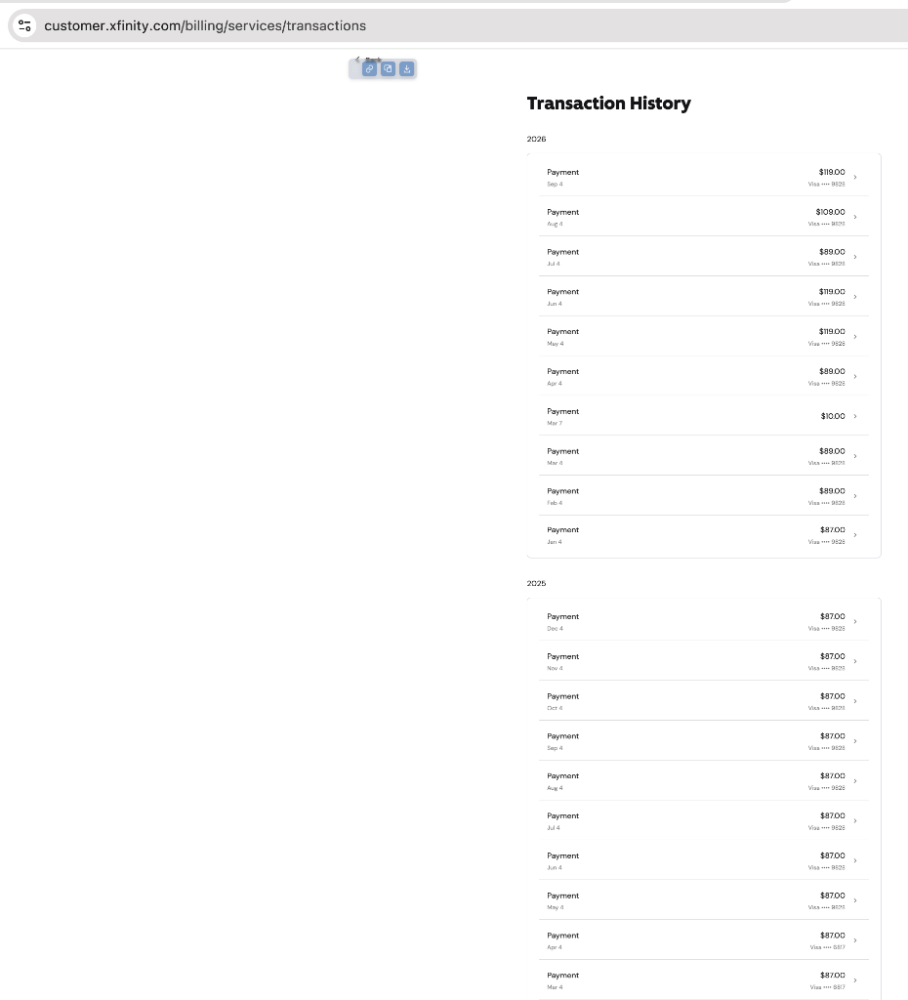
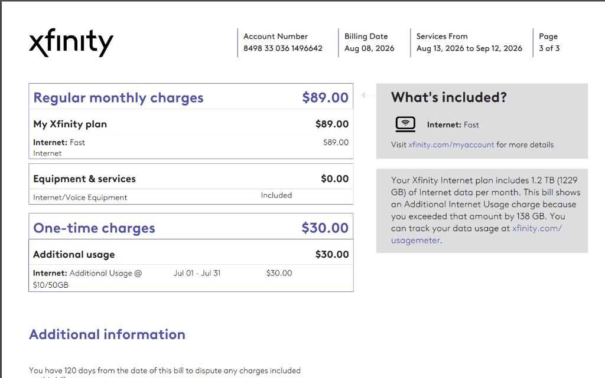
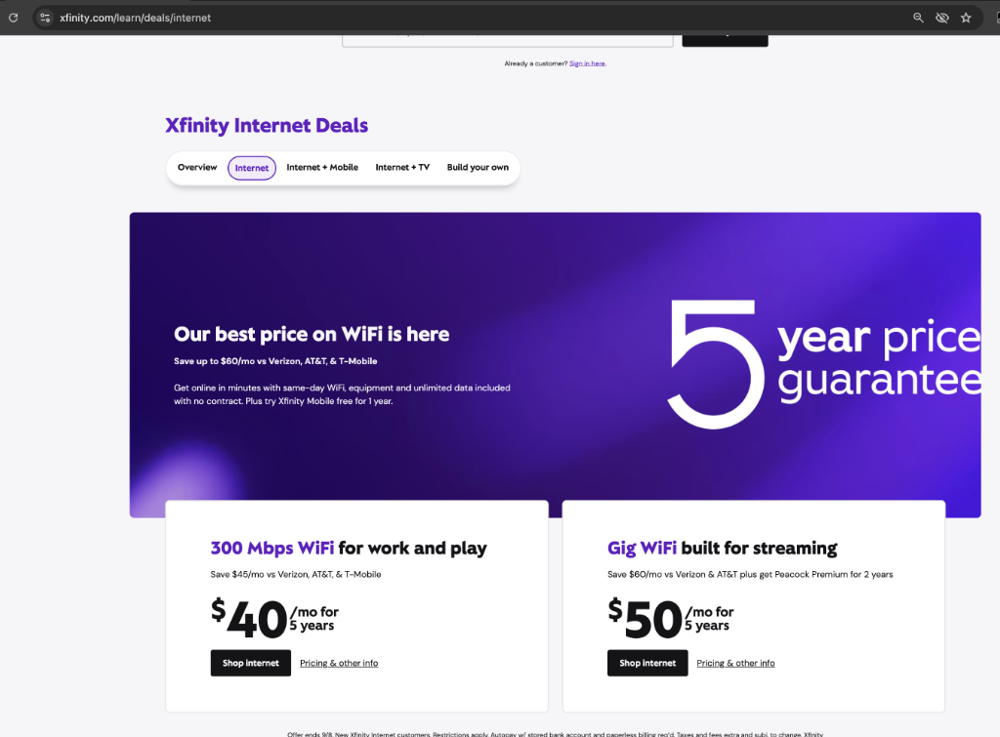

# Xfinity 账单降价谈判策略与电话沟通实战手册 (开门见山要取消·5年锁价对决·30刀退款收割)

针对 Xfinity（Comcast）账单在优惠期结束后大幅上涨至 **$119.00/月** 的现状，结合账单明细中隐蔽的 **$30 流量超量罚金** 以及官网当前公开的 **5 年锁价促销**，本方案制定了一套极高胜率的电话谈判策略、退费维权脚本与换户兜底流转指南。

## 账单现状与涨幅真相解密

### 历史账单扣款趋势 (Transaction History)
根据扣款历史明细：
* **2025 年度基准**：月费长期稳定在 **$87.00**（2025 年 3 月至 12 月均按该基础费率扣缴）。
* **2026 年度异动**：
  * 1 月维持在 $87.00，2 月至 4 月微调至 $89.00（3 月出现一次 $10.00 杂费）。
  * 5 月至 6 月费率首次跳涨至 **$119.00**。
  * 7 月经短期调整回落至 $89.00，8 月回弹至 $109.00。
  * 9 月（最新账期）再次攀升至 **$119.00**。

### 账单明细真相：基础费率与 $30 流量超量惩罚金
通过深入核对最新月度账单（Billing Statement）明细，发现实际账单由两部分组成：

1. **常规月度套餐（Regular monthly charges）**：
   * 套餐名称：`Internet: Fast`（标准带宽通常仅为 400 ~ 500 Mbps）。
   * 基础月费：**$89.00 / 月**。
2. **流量超额单次惩罚金（One-time charges - Additional usage）**：
   * 计费项目：`Internet: Additional Usage @ $10/50GB`。
   * 扣款金额：**$30.00**！
   * **惩罚机制剖析**：Xfinity 给老用户套餐强加了落后的 **1.2 TB (1229 GB)** 月度流量上限（Data Cap）。账单显示该账期仅仅超出了 138 GB，Xfinity 便按每 50GB 收取 $10 的阶梯，硬生生薅了 3 个计费单元共 $30.00！
   * 这直接揭示了账单波动的规律：**5月、6月、9月付 $119.00（$89 + $30 罚金），8月付 $109.00（$89 + $20 罚金）**。

---

## 官网新用户杀手级优惠 (Golden Leverage) 对照

目前 Xfinity 官网（`xfinity.com/learn/deals/internet`）正在公开推广极具竞争力的超级新用户促销（New Customer Deal）：

### 核心参数与暴利差额对照

| 对比维度 | 您当前实际支付的账单 | 官网公开新用户优惠 (New Customer Deal) | 差额与冲击力 |
| :--- | :--- | :--- | :--- |
| **网络速率与套餐** | `Internet: Fast` (约 400~500 Mbps) | **Gig WiFi (1000 Mbps 千兆网络)** | 新用户网速快一倍以上 |
| **每月综合费用** | **$119.00 / 月** ($89 基础 + $30 流量罚金) | **$50.00 / 月** (千兆) 或 **$40.00 / 月** (300M) | **每月净差 $69.00 ~ $79.00**！ |
| **流量配额 (Data Cap)** | **受限 1.2 TB**（超量按 $10/50GB 严罚） | **全无限流量 (Unlimited data included)** | **彻底免除 $30 罚金（价值 $30/月）** |
| **设备租金 (Gateway)** | 免租金 | **免费包含 (Equipment included)** | 包含最新 xFi 智能无线网关 |
| **价格锁定机制** | 随时涨价，动辄超额罚款 | **5 年价格保障 (5 Year Price Guarantee)** | 极其罕见的 5 年超长锁定承诺 |
| **合约约束** | 无 | **无合约 (No contract)** | 随时可以调整或终止 |
| **附加赠送权益** | 无 | **Gig 套餐附赠 2 年 Peacock Premium** | 赠送主流流媒体流媒体会员 |

**谈判核心结论**：老客户在完全相同的线路上，享受着更慢的网速，却在承担高额基础月费与落后的流量罚款，每月被多收 $69.00（每年多付 $828.00，5 年累计多付超过 **$4,140.00**！）。

---

## 核心谈判原则与战术节奏

### 关键节奏：为什么第一步决不能先提 30 刀罚款？
* **战术大忌**：如果一通电话开门见山就纠缠“30 刀流量罚金”，客服会立刻把您的意图定性为“普通的账单费用争议（Billing Dispute）”。他们最擅长的应对就是：“*好那我帮您免掉这 30 刀，请问还有别的问题吗？*” 从而把谈判焦点从“**每月 119 刀的长期高昂费率**”带偏成“**单次 30 刀的小恩小惠**”。
* **制胜战术**：
  1. **第一步（定调）**：劈头盖脸直接表明“**账单太贵了，今天不降价就立刻取消服务**”，将对话直接拉进客户流失（Churn Risk）的最高紧急层级，激活留存客服的核心降价权限。
  2. **第二步（施压）**：摆出官网公开的 50 刀 5 年锁价与无限流量神仙 Deal，要求匹配。
  3. **第三步（收网）**：在双方基本谈拢低价方案后，**顺手牵羊、临门一脚**提出：“*另外上月那 30 刀由于 1.2TB 限制收的超量罚款，必须按 Courtesy Credit 立即退还给我！*” 达成**降月费 + 免费加无限流量 + 退回 30 刀**的大满贯！

### 谈判原则
1. **避免普通账单客服，直达留存部门**：普通客服（Billing Dept）权限极低，只能给出 $5 左右的小额安慰补偿。必须转接至拥有最高挽留权限的**用户留存部门（Retention / Loyalty Department）**。
2. **电话语音机器人（IVR）应对指令**：致电 **1-800-XFINITY (1-800-934-6489)** 时，坚决且清晰地说出：`"Cancel service"`（取消服务）或 `"Downgrade service"`，直接跳过普通坐席。
3. **警惕移动套餐（Xfinity Mobile）捆绑陷阱**：客服常以“绑定一条手机线宽带减免 $20”为幌子推销手机卡，需坚决拒绝，只专注于纯宽带谈判。

---

## 升级版实战电话沟通脚本 (Script)

### 第一幕：开门见山：直奔主题说账单太贵，要求取消服务

> **Agent:** "Thank you for calling Xfinity. My name is [Name]. How can I help you today?"  
>   
> **You:**  
> *"Hi, I am calling because my internet bill has surged to **119 dollars** a month. That is way too expensive, and I cannot justify paying this anymore.  
> Competitors in my area and new customer deals are offering high-speed internet for around 40 to 50 dollars. If we cannot get this bill lowered to a competitive rate today, I would like to **cancel my service**."*

### 第二幕：客服询问原因并试图挽留时，亮出官网 5 年锁价王牌

> **Agent:** "I'd be happy to look at options to lower your bill so you can stay with us. What speed do you need?"  
>   
> **You:**  
> *"I am currently looking directly at your official website under `xfinity.com/learn/deals/internet`.  
> You are publicly offering new customers **Gig WiFi for 50 dollars a month with equipment and UNLIMITED DATA INCLUDED for free, plus a 5-year price guarantee with no contract**—or 300 Mbps for just **40 dollars**.  
> Why am I paying **119 dollars** as a loyal customer for a slower plan? I want this **50-dollar Gig plan with unlimited data matched on my account today**, or we proceed with scheduling the cancellation."*

### 第三幕：针对客服“仅限新用户”推诿的防守反击

> **Agent:** "I understand your frustration, but that 50-dollar 5-year promotion is strictly for brand new customers..."  
>   
> **You:**  
> *"I understand that is the standard line for new customers, which is precisely why I asked for the **Retention Department**.  
> You and I both know it makes zero sense for me to stay at 119 dollars. If you cannot apply this 50-dollar rate with unlimited data to my existing account, please go ahead and set a **cancellation date for 7 days from today**.  
> My spouse will simply sign up online as a new customer at this exact address and lock in the 50-dollar 5-year unlimited plan in 5 minutes. That just creates unnecessary equipment return hassle and customer churn for Comcast. As a retention specialist, can you match this 50-dollar rate today so we don't have to go through that?"*

### 第四幕：拒绝手机套餐推销，锁定纯宽带

> **Agent:** "We could lower your rate if you add an Xfinity Mobile line today..."  
>   
> **You:**  
> *"Thank you, but I am entirely happy with my current mobile carrier and will not switch. I am only talking about my home internet. Can we match the standalone internet rate without mobile bundling?"*

### 第五幕：临门一脚，顺势要求免除/退还上月 $30 流量罚金 (Courtesy Credit)

当客服同意匹配低价方案或查询留存专案时，顺水推舟提出退款：

> **You:**  
> *"And one more thing before we finalize: on my latest statement, I was charged a **30-dollar penalty** for exceeding the 1.2TB data cap by just 138 GB.  
> Since the new plan comes with free unlimited data, and Comcast has a policy for a **one-time courtesy credit** for data overage, I need this **30-dollar charge credited back to my account balance today** as well."*  
>   
> *(注：留存客服为了促成这单留存，在系统权限内几乎 100% 会立刻批准这笔 30 刀的 Courtesy Credit！)*

### 第六幕：方案确认与防坑三问

在最终确认协议时，逐条核对细节：

> **You:**  
> *"Thank you. Before we finalize this, please verify three details for me:  
> 1. Does this plan include **Unlimited Data (xFi Complete)** with no more 1.2TB caps?  
> 2. What will be the exact total monthly price including all equipment and taxes?  
> 3. How long is this promotional rate locked in for?"*

---

## 备用必胜底牌：夫妻与室友“新用户流转法”

若遇极其顽固的客服代表，始终无法提供低于 $60 或无法免除流量上限的方案，果断执行以下步骤进行无痛新用户切换：

1. **预约延期取消**：当场告知客服：“*Please schedule my service cancellation for 7 days from today.*”（预约在 7 天后停止服务，确保当前网络正常可用，留出充裕过渡期）。
2. **家属在线新开户**：由配偶、室友或家属使用新的姓名、未曾注册过 Xfinity 的新邮箱及手机号，登录 `xfinity.com/learn/deals/internet`：
   * 直接以“New Customer”身份下单 **$50/月 Gig WiFi**（或 $40/月 300Mbps）。
   * 勾选包含免费智能网关设备（Equipment included）与免费无限流量（Unlimited data included）。
   * 锁定 **5 年价格保障 (5-Year Price Guarantee)**。
3. **硬件流转与零断网激活**：
   * 选择“Self-Install Kit”（自装套件）或在原有网关线路上直接使用新账户在线激活。
   * 旧账户停机当日新账户立即无缝接管，无需重新走线，彻底锁定未来 5 年超低费率与无限流量。

