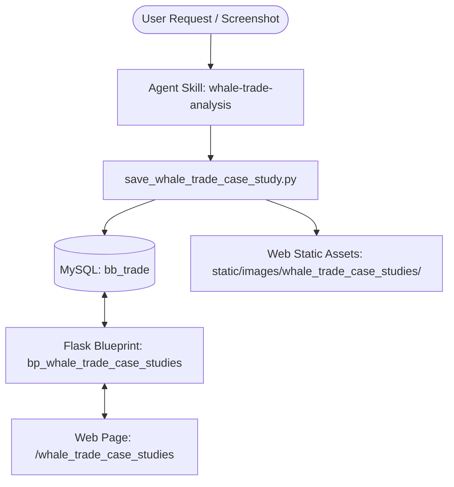

# Implementation Plan - Whale Trade Case Study Module

We will implement the **"Whale Trade Case Study Analysis" (机构大单案例分析)** module. This consists of:
1. A new agent skill (`whale-trade-analysis`) to ingest options/order flow screenshots/descriptions, analyze institutional strategies, and upsert records to the database.
2. A database table (`whale_trade_case_studies`) to store the case studies.
3. A web interface similar to `bbt_signals` with filters, a 2D tabular view, expanding detailed rows, and interactive buttons to backfill actual results (Correct/Incorrect).

---

## Technical Design & Architecture

### 1. Database Schema (`whale_trade_case_studies`)
The model will be added to `models.py`:
- `id` (INT, Primary Key)
- `case_date` (DATE, Indexed)
- `ticker` (VARCHAR(16), Indexed)
- `case_type` (VARCHAR(64), Indexed): `OrderFlow`, `OptionsFlow`, or `OptionsFlowOrderFlow` (联合)
- `direction` (VARCHAR(32), Indexed): `Bullish`, `Bearish`, `Neutral`
- `summary` (TEXT): High-level summary of the case study.
- `detail` (JSON): Contains input metadata (copied relative image URLs, time ranges) and an array of analyses (timestamps + markdown text of the analyses/followups).
- `actual_result` (VARCHAR(32), Default 'Pending'): `Pending`, `Correct` (对), `Incorrect` (错).
- `ai_model` (VARCHAR(64), Nullable): AI model used to generate the analysis.
- `created_at` (DATETIME, Default current_timestamp)
- `last_modified_date_time` (DATETIME, Default current_timestamp, onupdate current_timestamp)
- Unique Constraint: `(case_date, ticker, case_type)` to support easy upsert and follow-up updates.

### 2. Save Helper Script (`save_whale_trade_case_study.py`)
This Python script runs within the Flask application context:
- Ingests command line arguments: `--date`, `--ticker`, `--type`, `--direction`, `--summary`, `--detail-file`, `--images` (space-separated list of paths), `--ai-model`, and `--verify` (sets actual result).
- Handles image files: Copies the original screenshots to the web assets directory (`bbt_data_web/static/images/whale_trade_case_studies/`), renames them safely to prevent collisions, and stores relative URLs (e.g. `/static/images/whale_trade_case_studies/case_TSLA_2026-05-27_0.png`).
- Performs an **Upsert**:
  - If a study on the same `(case_date, ticker, case_type)` exists, it reads the JSON `detail` field, appends the new analysis block to the `analyses` list, updates `summary`, `direction`, `ai_model`, and `last_modified_date_time`.
  - Otherwise, it inserts a new record.

### 3. Agent Skill (`whale-trade-analysis`)
Created at `/Users/zhijiebian/.gemini/skills/whale-trade-analysis/SKILL.md`:
- Guides the agent on how to write options flow sweeps and order flow block analysis.
- Instructs the agent to call the save helper script to persist case study reports to the database.

### 4. Flask Blueprint (`bp_whale_trade_case_studies`)
Defined at `data_app/whale_trade_case_studies.py`:
- Route `@bp_whale_trade_case_studies.route('/whale_trade_case_studies')` renders the HTML template.
- Route `@bp_whale_trade_case_studies.route('/data/whale_trade_case_studies')` serves the filtered case study list in JSON.
- Route `@bp_whale_trade_case_studies.route('/api/whale_trade_case_studies/<int:case_id>/verify', methods=['POST'])` updates actual results (Correct/Incorrect) in the database.

### 5. Web UI (`whale_trade_case_studies.html` & `whale_trade_case_studies.js`)
Similar to the `bbt_signals` UI:
- Filters for Date, Ticker, Case Type, Direction, and Actual Result.
- A 2D DataTable with an expand/collapse column `[+]` on the left.
- Expanding a row renders the `detail` JSON column:
  - Lists the inputs (including screenshot images).
  - Chronologically lists each analysis block (markdown rendered using `marked.js` on the client side).
- Includes action buttons: **✅ 对 (Correct)** and **❌ 错 (Incorrect)** to immediately backfill the outcome to the DB.

---

## Proposed Changes

### Database & Web Setup

#### [MODIFY] [models.py](file:///Users/zhijiebian/Documents/Workplace/PycharmProjects/BBTrading/bbt_data_web/models.py)
- Append the `WhaleTradeCaseStudy` SQLAlchemy model to the end of the file.

#### [NEW] [create_whale_trade_case_study_table.py](file:///Users/zhijiebian/Documents/Workplace/PycharmProjects/BBTrading/bbt_data_web/scratch/create_whale_trade_case_study_table.py)
- Create a scratch script to run `db.create_all()` to create the table `whale_trade_case_studies` in MySQL.

#### [MODIFY] [bbt_data_app.py](file:///Users/zhijiebian/Documents/Workplace/PycharmProjects/BBTrading/bbt_data_web/bbt_data_app.py)
- Import and register the `bp_whale_trade_case_studies` blueprint.
- Add "Whale Trade Case Studies" (Whale Trade 案例分析) to the landing page `grouped_tools` dictionary.

---

### Backend Blueprint & Web Frontend

#### [NEW] [whale_trade_case_studies.py](file:///Users/zhijiebian/Documents/Workplace/PycharmProjects/BBTrading/bbt_data_web/data_app/whale_trade_case_studies.py)
- Define the blueprint routes (`/whale_trade_case_studies`, `/data/whale_trade_case_studies`, `/api/whale_trade_case_studies/<int:case_id>/verify`).

#### [NEW] [whale_trade_case_studies.html](file:///Users/zhijiebian/Documents/Workplace/PycharmProjects/BBTrading/bbt_data_web/templates/whale_trade_case_studies.html)
- Main page UI matching the style of the signals dashboard (vibrant colors, Google Font Outfit, modern styling).

#### [NEW] [whale_trade_case_studies.js](file:///Users/zhijiebian/Documents/Workplace/PycharmProjects/BBTrading/bbt_data_web/static/js/whale_trade_case_studies.js)
- Datatables initialization, custom rendering for status badges, expanding child row details (rendering markdown using `marked.js` and displaying images), and API calls for actual result backfills.

---

### Agent Skill

#### [NEW] [SKILL.md](file:///Users/zhijiebian/.gemini/skills/whale-trade-analysis/SKILL.md)
- Main markdown instructions defining the `whale-trade-analysis` skill.

#### [NEW] [save_whale_trade_case_study.py](file:///Users/zhijiebian/.gemini/skills/whale-trade-analysis/scripts/save_whale_trade_case_study.py)
- Python utility script invoked by the agent to copy screenshot images and save/upsert case study analyses.

---

## Verification Plan

### Automated Tests
1. Run `create_whale_trade_case_study_table.py` to create the table and confirm MySQL reports the table exists.
2. Manually execute `save_whale_trade_case_study.py` with dummy inputs (including images) and verify that:
   - Images are copied to `bbt_data_web/static/images/whale_trade_case_studies/`.
   - A row is inserted in MySQL database `bb_trade`.
   - Running it again with the same keys adds a new analysis log block instead of a duplicate row.

### Manual Verification
- Start Flask web server and navigate to `http://127.0.0.1:5005/whale_trade_case_studies`.
- Check filters (Ticker, Type, Direction) and verify that table rows load correctly.
- Expand a row to verify markdown is rendered correctly and screenshots display properly.
- Click the "Correct" / "Incorrect" buttons to check if the actual result status updates instantly in the UI and database.
