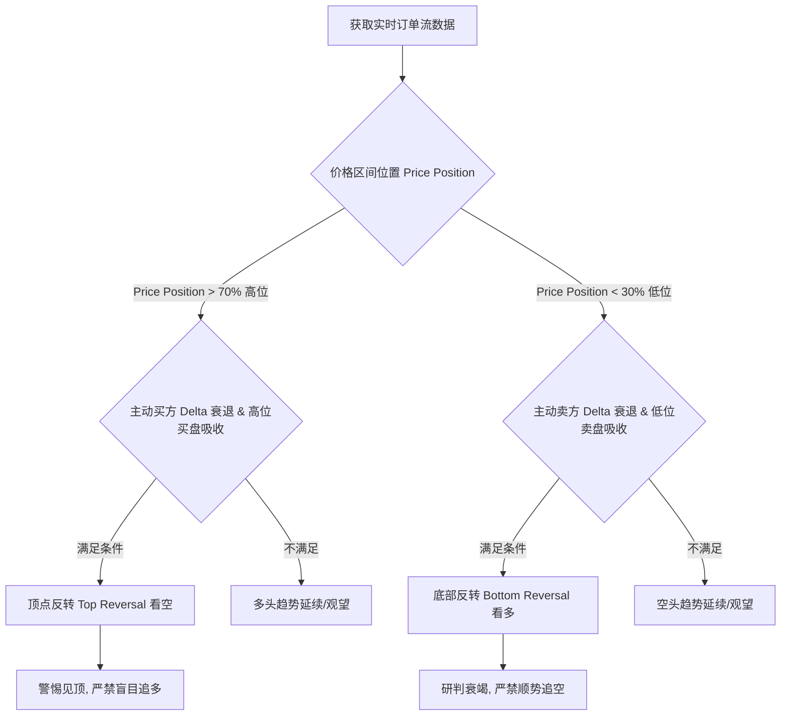

# 机构订单流实时反转研判分析与优化指南

本指南记录了实时订单流分析在极点反转场景下的失效案例诊断，并归纳了针对顶点与底部反转研判的硬性逻辑规则及代码实施细节。

---

## 一、 案例诊断：ES 日内极点反转失效分析

在 2026-05-26 的实时行情中，系统在两个关键转折点（08:00 与 09:00）得出了相反的顺势判定，导致交易信号在高位追多、在低位追空。

### 1. 08:00 高点反转（见顶）
* **盘面特征**：RTH 开盘前 1 小时累积了巨大的正 Delta（`+10110` 与 `+7938`）。在 07:30 - 08:00 时段，Delta 骤降至 `+1842`，而价格由高位回落 `1.75` 点。
* **订单流本质**：这属于典型的**买盘被吸收陷阱（Absorption Trap）**与**主动买方力量衰退（Delta Decay）**的结合。在区间高位（`75.2%`），大额限价卖单（Passive Selling）封死了上涨空间，主动多头力竭。
* **失效成因**：旧版 AI 过于依赖全天累计的正 Delta，忽略了局部动能的阶梯式衰退，将此顶部的强阻力吸收误判为“多头趋势中的健康回调”，从而建议在最高点买入。

### 2. 09:00 低点反转（见底）
* **盘面特征**：价格在 RTH 阶段经历持续下跌后到达低位。在 08:30 - 09:00 期间，空头打压出 `-3269` 的巨额负 Delta，但价格下跌极其困难且在 7522.00 附近堆积了 738 手的高能被动买盘防守。
* **订单流本质**：这属于**卖盘被吸收陷阱（Selling Climax & Passive Buying Support）**。激进空头在关键支撑区被大额限价买单（Iceberg Orders）完全吃掉，下行动能衰退。
* **失效成因**：旧版 AI 线性外推了已形成的空头趋势，判断“空头完全接管盘面”，从而建议在最低点附近顺势卖出，导致踏空反弹。

---

## 二、 订单流反转判定核心规则（Reversal Rules）

为了解决模型在线性行情中的趋势惯性偏见，建立以下量化决策框架：



> [!IMPORTANT]
> ### 规则一：区间高位顶点反转（Top Reversal）
> * **硬性条件**：
>   1. 价格处于 RTH 区间高位（`Price Position > 70%`）。
>   2. 出现“买盘被吸收”背离（Delta 为正，但价格滞涨或小跌）。
>   3. 逐 30 分钟 Delta 的绝对值呈现急剧递减趋势（如 `+10000 -> +7000 -> +1000`），表明多头主动动能竭尽（Exhaustion）。
> * **研判结论**：定性为高位存在密集限价卖单（Passive Selling）压制，**强烈反转看空，严禁追多**。

> [!IMPORTANT]
> ### 规则二：区间低位底部反转（Bottom Reversal）
> * **硬性条件**：
>   1. 价格处于 RTH 区间低位（`Price Position < 30%`）。
>   2. 出现“卖盘被吸收”背离（Delta 为负，但价格跌幅收窄或不创新低）。
>   3. 下方堆积密集的看多吸收（被动买方防御限价单），且主动 Delta 出现明显的递减衰竭。
> * **研判结论**：定性为低位存在被动限价买盘支撑（Passive Buying）拦截，**强烈反转看多，严禁在地板追空**。

---

## 三、 代码实施与 Prompt 优化对照

已在 [ai_tape_analyst.py](file:///Users/zhijiebian/Documents/Workplace/PycharmProjects/BBTrading/PyTools/order_flow_analysis/ai_tape_analyst.py) 的 Prompt 权重规则部分增加了上述反转拦截策略：

```diff
-2. 【研判核心逻辑 — Delta-Price 交叉验证】：
+2. 【研判核心逻辑 — Delta-Price 交叉验证与反转信号判定】：
    - **Delta 方向本身不等于多空方向**。你必须同时考察 Delta 的方向与价格的实际变动：
      a) Delta 为正 + 价格上涨 = 真正的多头驱动（买盘有效推升价格）
      b) Delta 为正 + 价格不涨或下跌 = 被动卖方吸收（Passive Selling Absorption）→ 看似有买盘，实际被大额被动卖单消化，这是**潜在的空头信号**
      c) Delta 为负 + 价格不跌或上涨 = 被动买方吸收（Passive Buying Absorption）→ 看似有卖盘，实际被大额被动买单消化，这是**潜在的多头信号**
      d) Delta 为负 + 价格下跌 = 真正的空头驱动（卖盘有效打压价格）
 
-   - **RTH 逐30分钟 Delta 趋势比全段累积 Delta 更重要**：
-     全天累积 Delta 可能被早期的单向行情掩盖后期的趋势反转。你必须重点分析第5段"RTH Delta-Price Structural Analysis"中的逐30分钟 Delta 演变，识别 Delta 转折点和趋势方向。
-     例如：前1小时 Delta +2500，后2.5小时 Delta -7500 → 累积虽为负，但关键信息是**后半段空头已完全接管**。
-
-   - **价格在区间中的位置（Price Position）是关键判定指标**：
-     若 RTH Price Position < 40%，即使 Delta 为正，也说明买盘未能有效推升价格，市场偏弱。
-     若 RTH Price Position > 60%，即使 Delta 为负，也说明卖盘未能有效打压价格，市场偏强。
+   - **区间高位顶点反转（Top Reversal）判定规则**：
+     当价格处于 RTH 区间高位（Price Position > 70%），如果最近半小时时段出现“买盘被吸收”（Delta 为正但价格变动微弱或为负），且主动买方 Delta 的绝对值呈现出急剧的递减衰竭态势（例如从数千手衰减至数百手），这表明主动多头在阻力区力竭，而上方有密集的被动限价单进行拦截阻力（Passive Selling）。**这属于强烈的见顶反转、看空信号，绝对禁止盲目追多**。
+
+   - **区间低位底部反转（Bottom Reversal）判定规则**：
+     当价格处于 RTH 区间低位（Price Position < 30%），如果最近半小时时段出现“卖盘被吸收”（Delta 为负但价格跌幅明显收窄、不创新低），且下方堆积了密集的看多吸收（被动买方大单拦截），同时主动卖方 Delta 出现明显的递减衰竭，这表明主动空头在支撑区动能耗尽，而下方存在强力被动买盘防守（Passive Buying）。**这属于强烈的见底反转、看多信号，绝对禁止在最低点顺势追空**。
+
+   - **RTH 逐30分钟 Delta 动能演变（Delta Decay & Divergence）**：
+     全天累积 Delta 具有极强的滞后性，容易掩盖盘中的趋势反转。你必须重点分析第5段"RTH Delta-Price Structural Analysis"中的逐30分钟 Delta 序列演变：
+     * 如果主动 Delta 绝对值急剧衰退（如 +10000 -> +7900 -> +1800），配合高位吸收背离，即可确认为趋势竭尽（Exhaustion）并酝酿反转。
+     * 如果主力时段的 Delta 突然换向且价格跟随（例如由正转为大额负值且价格跌破关键前序支撑），表示多空主控权已经发生实质性切换，应迅速调整研判方向。
+
+   - **价格在区间中的位置（Price Position）的辅助过滤**：
+     若 RTH Price Position < 35%，即使累计 Delta 仍然为正，也表明买盘未能有效推高价格（推升效率极差），市场实际表现为偏弱或处于反转看空中。
+     若 RTH Price Position > 65%，即使累计 Delta 仍然为负，也表明卖盘未能有效打压价格（打压效率极差），市场实际表现为偏强或处于反转看多中。
```

---

## 四、 ES 2026-05-26 08:50 - 09:15 底部反转微观订单流数据佐证

根据对 2026-05-26 08:50 - 09:15 期间 ES 主力合约实时订单流特征数据的提取与采样分析，数据明确支持在该区域（09:00 前后）存在坚实的底部反转结构。以下是具体的微观数据与订单流动能演变特征：

### 1. 5 分钟微观 Delta 极速换向与动能逆转
| 时间段 (PT) | 价格变化 | 成交量 (手) | 净 Delta (手) | 平均深度不平衡度 (Imbalance) | 被动吸收次数 | 盘面行为定性 |
| :--- | :--- | :--- | :--- | :--- | :--- | :--- |
| **08:50 - 08:55** | 7524.25 → 7518.75 (最低 7517.25) | 34,160 | -3,622 | +0.127 | 66 | **恐慌盘宣泄/空头竭尽 (Selling Climax)** |
| **08:55 - 09:00** | 7518.75 → 7523.25 (最低 7517.00) | 31,431 | **+2,069** | +0.024 | 65 | **主动买盘极速接入/V形反转 (Initiative Buying)** |
| **09:00 - 09:05** | 7523.00 → 7525.75 | 23,603 | **+707** | -0.074 | 59 | **多头跟进/突破确认 (Trend Follow)** |
| **09:05 - 09:10** | 7525.75 → 7522.25 | 15,735 | -615 | -0.030 | 31 | 缩量回调 (Healthy Retracement) |
| **09:10 - 09:15** | 7522.25 → 7522.50 | 17,410 | **+904** | +0.001 | 41 | 主动买盘再度蓄势 (Re-accumulation) |

* **量化特征诊断**：
  * **08:50-08:55** 出现了 `-3622` 的极端空头抛压，但价格跌至 `7517.25` 后即止跌，并触发了高频的被动拦截（66次吸收信号）。
  * **08:55-09:00** 价格在未创实质性新低（最低仅触及 `7517.00`）的情况下，Delta 瞬间从 `-3622` 变动至 **`+2069`**，且价格收复了近 5 个点的失地。这属于订单流上最典型的 **“极速动能逆转 (Velocity Momentum Switch)”**。
  * 若仅看 30 分钟大块数据，该时段的总 Delta 表现为 `-1553`，会严重掩盖 `08:55` 开始的强势 V 反结构。

### 2. 关键支撑价格段的被动买方防御 (Passive Buying Absorption)
在 08:50 - 09:15 的 25 分钟窗口中，高频吸收信号在特定价格段堆积：
* **`7523.75`**：吸收频次最高（18次），累积 Delta 为 **`-308`**（表现为被动买方吸收，即限价买单在此处吞噬了主动卖单）。
* **`7523.25`**：累计 13 次吸收信号，累积 Delta 为 **`-132`**，同样表现为被动买方拦截。
* **`7523.50`**：累计 11 次吸收信号，累积 Delta 为 **`-182`**。
* 综上，`7523.00 - 7524.00` 价格带是强力的被动吸筹密集区。

