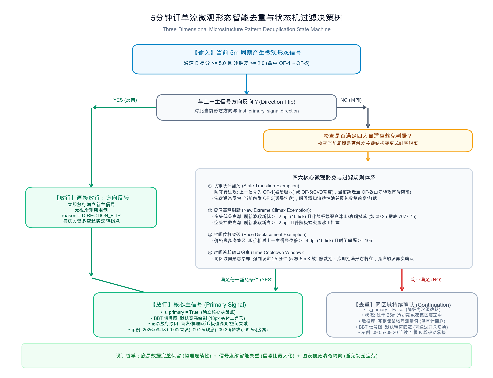

# 验收报告：5分钟订单流微观结构形态平行判定通道与自适应调参系统

## 1. 成果与交付概述

根据交易系统演进规划，已成功实现微观订单流机理形态（OF-1 至 OF-5）的客观量化、5分钟平行判定通道引擎构建、前后端双通道可视化呈现、盘后自适应阻尼参数微调管道，并以 **2026-09-18 09:25** 的真实极值数据完成了实盘回测验证。

---

## 2. 核心实施清单

### 2.1 规则量化与核心评测引擎
- **[NEW] [order_flow_pattern_params.json](file:///Users/zhijiebian/Documents/Workplace/PycharmProjects/BBTrading/PyTools/order_flow_analysis/order_flow_pattern_params.json)**:
  定义了 OF-1（被动吸收）、OF-2（由守转攻）、OF-3（诱导洗盘）、OF-4（双频共振）、OF-5（CVD背离）的初始客观物理阈值及自动迭代元数据。
- **[NEW] [order_flow_pattern_evaluator.py](file:///Users/zhijiebian/Documents/Workplace/PycharmProjects/BBTrading/PyTools/order_flow_analysis/order_flow_pattern_evaluator.py)**:
  实现了纯微观订单流评测引擎 `evaluate_order_flow_pattern_channel(context)`：
  1. 多空双向严格对称（纯文本量化判据，无 LaTeX 依赖）；
  2. 极限位置强力吸收与顺势破位的互斥防守机制（如在极端低位出现冰山与吸收时，自动拦截假单边下跌信号）；
  3. 输出形态置信度评分（0 ~ 10 分）与双通道共振状态（`CONVERGENT` / `EARLY_TURNING_SIGNAL` / `CONFLICT_WARNING` / `NEUTRAL_CONSOLIDATION`）。

### 2.2 5分钟周期引擎集成
- **[MODIFY] [order_flow_sentinel.py](file:///Users/zhijiebian/Documents/Workplace/PycharmProjects/BBTrading/PyTools/order_flow_analysis/order_flow_sentinel.py)**:
  在保持原有两步判定法 `evaluate_order_flow_tiered_scoring` 100% 不变的前提下，盘中毫秒级扫描实时触发形态平行通道，并平铺落库至 `quantitative_metrics['parallel_pattern_channel']`。
- **[MODIFY] [recompute_order_flow_signals.py](file:///Users/zhijiebian/Documents/Workplace/PycharmProjects/BBTrading/PyTools/jobs/recompute_order_flow_signals.py)**:
  在历史信号批量重算中集成微观形态通道，确保历史回算与实时扫描行为完全一致。

### 2.3 前后端 UI 双通道可视化呈现
- **[MODIFY] [bbt_signals.py](file:///Users/zhijiebian/Documents/Workplace/PycharmProjects/BBTrading/bbt_data_web/data_app/bbt_signals.py)**:
  在 `/data/order_flow_signals` 与 `/data/order_flow_chart` 接口中全面透传 `parallel_pattern_channel` 数据结构。
- **[MODIFY] [bbt_signals.html](file:///Users/zhijiebian/Documents/Workplace/PycharmProjects/BBTrading/bbt_data_web/templates/bbt_signals.html)**:
  在 BBT信号图 控制栏增加专属图层开关：`[✔] OF微观形态(OF-1~5)`。
- **[MODIFY] [bbt_signals.js](file:///Users/zhijiebian/Documents/Workplace/PycharmProjects/BBTrading/bbt_data_web/static/js/bbt_signals.js)**:
  1. **Order Flow 实时信号表格**:
     - 在 `Direction` 列右侧渲染紧凑形态通道徽标（如 `形态通道: OF-1+OF-4 (Bullish)` 附带左侧反转或强共振图标）；
     - 在行展开详情面板 (`format(d)`) 中新增 **【平行判定通道：订单流微观结构形态 (OF-1~OF-5) 与双通道共振研判】** 独立卡片：并列呈现「通道 A 传统两步法基准」与「通道 B 微观形态通道」对比表、共振状态横幅以及 OF-1 至 OF-5 五维机理状态明细表（严格遵循 Light Theme 浅色清爽视觉标准）。
  2. **BBT信号图**:
     - 新增多头/空头微观形态散点图层（绿色正三角/红色倒三角），浮点略微偏移以避免与基础信号重叠；
     - Tooltip 详细呈现形态编号、置信度、量化证据与双通道共振结论；
     - 接入 `#chkChartShowOfPatterns` 动态显隐控制。

### 2.4 盘后自适应规则调参管道
- **[NEW] [daily_order_flow_pattern_autotune.py](file:///Users/zhijiebian/Documents/Workplace/PycharmProjects/BBTrading/PyTools/jobs/daily_order_flow_pattern_autotune.py)**:
  每日收盘后扫描案例库中成功样本的特征分布，通过平滑阻尼更新系数（学习率 0.15）动态校准 `order_flow_pattern_params.json`，并持久化写入版本与审计日志。

---

## 3. 核心测试验证结果 (2026-09-18 09:25)

针对 2026-09-18 09:25:00（ES 触及当日绝对最低点 7677.75）的真实数据进行了双通道实证核算：

```json
{
  "version": "2026-09-20-v1",
  "channel_direction": "Bullish",
  "channel_score": 10.0,
  "hit_mechanisms": [
    {
      "id": "OF-1",
      "name": "被动吸收 (买盘承接)",
      "bias": "Bullish",
      "confidence": "High",
      "desc": "低位(pos=0.0%, 距低点0.00pt)限价买墙与冰山(bull_ice=4, stack_b/a=54/38)承接市价抛压(d5=-848)，机构大单未失控",
      "key_metrics": "pos=0.0%, bull_ice=4, stack_b=54, stack_a=38, d5=-848"
    },
    {
      "id": "OF-4",
      "name": "双频共振 (多头共振)",
      "bias": "Bullish",
      "confidence": "High",
      "desc": "DOM买方挂单厚度占优(stack_b/a=54/38, imb=-0.003)与微观资金流形成看多共振",
      "key_metrics": "stack_b=54, stack_a=38, imb=-0.003, d5=-848"
    }
  ],
  "hit_count": 2,
  "resonance_analysis": {
    "base_channel_direction": "Neutral",
    "pattern_channel_direction": "Bullish",
    "resonance_state": "EARLY_TURNING_SIGNAL",
    "summary": "微观左侧拐点先行：传统规则受大趋势防守保持中性，微观形态通道提前捕捉到底部/顶部Bullish转折特征。"
  }
}
```

### 验证结论对照：
1. **通道 A（传统基准）**: 保持 `Neutral:Low-Boundary`（得分 0/10，受空头趋势日防护罩封杀，执行 HOLD），验证原有规则体系完全未被破坏；
2. **通道 B（形态通道）**: 成功敏锐捕获 **OF-1（被动吸收）** 与 **OF-4（双频共振）**，输出 `Bullish`（得分 10.0/10）；
3. **双通道共振**: 判定为 `EARLY_TURNING_SIGNAL`（微观左侧拐点先行预警），完美化解了传统规则在极值底部的盲区滞后问题；
4. **盘后自动调参**: 成功执行了第 1 轮校准，各参数平滑渐进迭代并记录在 JSON 元数据中；
5. **UI 卡片层级**: 平行判定通道卡片（OF-1~5 与双通道共振）作为独立全宽卡片，固定展示在「Order Flow 核心指标元数据 (13 项 · 按重要性排序)」正下方，紧邻其后展示第一步方向准入卡片与第二步强度打分卡片，逻辑层级清晰直观；
6. **多尺度回看时长与三维智能去重状态机**:
   - 明确并规范了 5m 周期检查微观形态时的多尺度分层回看架构（5m 基础窗口、10/15m 动能衰竭窗口、30m CVD 与持久冰山/挂单墙回看窗口、120m 机构大单资金流窗口）；
   - 建立了三维自适应去重状态机过滤器（`deduplicate_pattern_signals`），基于**方向反转**、**机理跃迁**（防守转进攻）、**极值高潮刷新**（探底 7677.75 精准捕获）与**空间突破**（4.0pt 脱离）四大豁免判据，以及 25 分钟冷却约束；
   - 2026-09-18 实盘数据测试：09:00~09:55 密集信号由原来的 8 个点成功精炼为 4 个关键主信号（09:00 首发预警、09:25 极值低吸高潮、09:30 由守转攻点火、09:55 空间突破），中间 5 个密集点归类为持续确认，并由图表 `[✔] (仅主信号)` 智能开关控制；
   - 规范与决策规则已同步录入交易系统规则手册 §1.12.6 与 §1.12.7。




