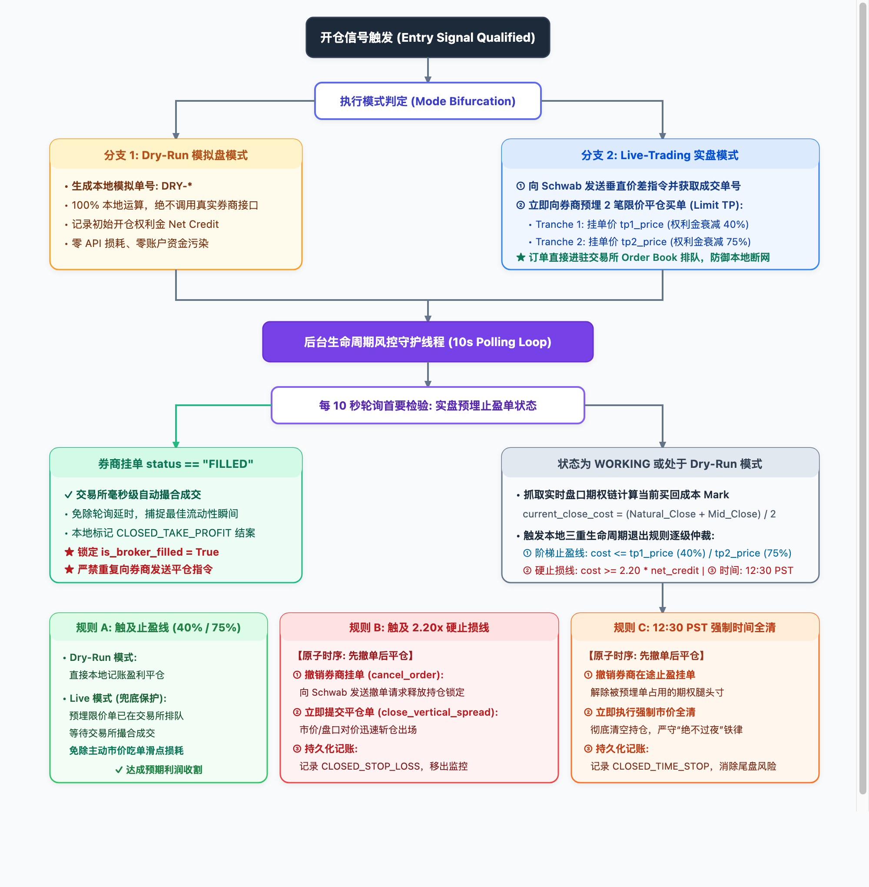

# 交付总结：Option Seller 实盘预埋限价止盈 (Resting Limit Order) 与本地守护止损系统

## 一、 交付背景与业务痛点
在传统的期权自动化交易实现中，多采用本地 10 秒轮询（Polling）检测买回成本，并在触及止盈时再向券商发送平仓指令。该模式在模拟盘（Dry-Run）中安全且无成本，但在真实资金（Live Trading）交易中存在以下致命痛点：
1. **错失交易所撮合排队优势**：期权流动性（尤其是 0DTE 价差）往往在日内出现短暂几秒钟的流动性枯竭或波动率暴跌，本地 10 秒轮询极易错过毫秒级的最佳买回成交窗口；
2. **缺乏网络断线抗脆弱性**：若本地程序发生网络卡顿、进程重启或断电，未能向交易所预埋止盈单将导致持仓暴露于未受控的风险中；
3. **TOS 界面无在途挂单显示**：交易员在 ThinkorSwim (TOS) 客户端看不到预挂的限价单，缺乏视觉安全感与可控感。

---

## 二、 架构解决方案：双轨分流执行架构



> **图 15-1: Option Seller 双轨执行与本地守护风控生命周期状态机架构**（高清矢量图与 PNG 已保存在本目录）。

### 决策树逻辑时序逐级分解 (Sequential Decision Breakdown)
1. **开仓信号触发 (Entry Signal Qualified)**：
   - **[模式 A: Dry-Run 模拟盘]**：生成本地模拟单号 (`DRY-*`) ──► 100% 本地运算，记录初始权利金 ──► 移交 10s 守护线程监控；
   - **[模式 B: Live-Trading 实盘]**：向 Schwab 提交垂直价差开仓单 ──► 成交获取真实 Order ID ──► 立即预埋 2 笔限价止盈单 (T1 40% / T2 75%) ──► 挂单进驻交易所 Order Book 排队 (防御本地断网)；

2. **移交后台 10s 风控守护线程监控 (Guardian Loop)**：
   - **[首要检验: 券商挂单 status == 'FILLED']**：交易所已毫秒级自动撮合成交 ──► 本地直接标记 `CLOSED_TAKE_PROFIT` 结案 ──► 锁定 `is_broker_filled = True` (绝不重复向券商发单)；
   - **[持续监控: 状态为 WORKING 或处于 Dry-Run 模式]**：抓取实时期权链计算当前买回成本 Mark: `current_close_cost` ──► 触发本地三重退出判定：
     - **规则 A：买回成本 <= 止盈线 (40% / 75% 衰减)**：
       - Dry-Run: 直接本地记账盈利平仓；
       - Live: 预埋单已在交易所排队等待撮合，免除主动市价吃单滑点损耗；
     - **规则 B：买回成本 >= 2.20 × net_credit (硬止损触发)**：
       - **刚性原子时序**：① 先调用 `cancel_order` 撤销券商在途挂单释放持仓锁定 ──► ② 立即调用 `close_vertical_spread` 市价/盘口对价迅速斩仓 ──► ③ 结案 `CLOSED_STOP_LOSS`；
     - **规则 C：美西时间 >= 12:30:00 PST (强制时间止损)**：
       - **刚性原子时序**：① 先撤在途止盈挂单 ──► ② 立即执行强制市价全清，清空持仓绝不过夜 ──► ③ 结案 `CLOSED_TIME_STOP`。

---

## 三、 代码交付与修改清单

1. **`PyTools/tos_api/bb_tos.py`**：
   * 新增 `place_vertical_spread_limit_close(cls, spread_type, short_symbol, long_symbol, quantity=1, net_debit=0.10)`：向 Schwab API 发送多腿限价买回平仓单，并从响应 Header `Location` 中精准提取返回的 `order_id`；
   * 新增 `get_order_status(cls, order_id)`：支持实时查询指定订单在 Schwab/TOS 的执行状态（`WORKING`, `FILLED`, `CANCELED`, `REJECTED` 等）；
   * 新增 `cancel_order(cls, order_id)`：支持撤销在途挂单。
2. **`PyTools/option_seller/option_seller_manager.py`**：
   * `_open_single_contract`：实盘模式下开仓成交后，立即为该 Tranche 提交限价止盈买单，将券商挂单号 `tp_broker_order_id` 存入内存持仓及数据库 `entry_evidence`；
   * `close_trade`：
     - 增加 `is_broker_filled` 状态防护；若非券商自动成交，在下单平仓前自动先撤销对应的在途止盈挂单；
     - **方案 A 动态保本推损**：当检测到 Tranche 1 止盈兑现时，在同一原子锁内自动检索同批次 Tranche 2 活跃持仓，将其止损线 `stop_loss_price` 从 2.20x 动态调降至开仓保本价 `net_credit`，标记 `is_breakeven_protected = True` 并持久化；
   * `_evaluate_active_positions`：
     - 优先轮询预埋挂单是否已由交易所自动 Filled，Filled 则立即转入结案；
     - 触发止损时，若已激活保本保护，结案状态标记为 `CLOSED_BREAKEVEN_T2`；
   * `_reload_active_trades`：服务重启时从数据库 `entry_evidence` 自动恢复 `tp_broker_order_id`、`tp_order_status` 以及 `is_breakeven_protected` 状态。
3. **`bbt_data_web/db_query_module/db_query_option_seller.py`**：
   * 新增 `option_seller_trade_update_evidence(cls, trade_id, entry_evidence)` 接口。
4. **前端监控看板 (`bbt_option_seller.html`)**：
   * 持仓卡片：显示 `TOS预挂止盈: #<order_id> (WORKING)` 徽章；若 T2 处于保本保护中，高亮显示 `🛡️ 已推保本` 徽章并展示 `🛡️ 保本损: $net_credit`；
   * 历史流水表格：当流水为保本平仓时，展示蓝色专属 `tag-blue` 徽章与对应 TOS 止盈挂单号。

---

## 四、 自动化测试验证结果

测试脚本：[`test_live_resting_limit_order.py`](file:///Users/zhijiebian/Documents/Workplace/PycharmProjects/BBTrading/PyTools/option_seller/test_live_resting_limit_order.py)

运行结果：
```bash
/Library/Frameworks/Python.framework/Versions/3.11/bin/python3 PyTools/option_seller/test_live_resting_limit_order.py
.....
----------------------------------------------------------------------
Ran 5 tests in 0.103s

OK
```

覆盖的核心验证点：
* `test_dry_run_mode_isolation`：验证 Dry-Run 模式下完全不调用实盘券商 API；
* `test_live_mode_resting_limit_placement`：验证实盘开仓后立即预埋限价平仓单，并正确捕获券商 `order_id`；
* `test_live_broker_filled_handling`：验证券商成交后，系统自动完成止盈结案且绝不重复发单；
* `test_live_stop_loss_cancel_precedence`：验证止损触发时，严格按“先撤在途单 ➜ 再发平仓单”的原子时序执行；
* `test_scheme_a_breakeven_activation_and_execution`：验证 Tranche 1 止盈后，同批次 Tranche 2 止损线自动调降至保本价（0.20），并在后续反抽时以 `CLOSED_BREAKEVEN_T2` 安全平仓。

---

## 五、 规则手册与模块目录索引更新
* 归档目录：`system_modules/15_2026-08-30_Option_Seller_Live_Resting_Limit_Order_Engine/`
* 系统总表：`system_modules/bbt_trading_modules.html` 更新并登记模块 15。
* 规则手册：`gemini_answer-trading_system_rules_manual-2026-08-29_10-13-45.html`（及对应 `.md`）第 17 章追加第 10 节《Dry-Run 模拟与实盘预埋限价止盈双轨执行规范》及第 11 节《Tranche 1 止盈后 Tranche 2 动态保本推损机制 (Scheme A)》。
