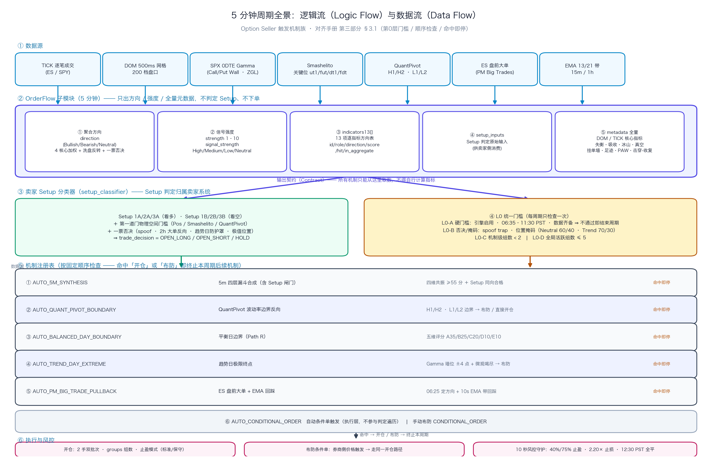

# 交易系统核心规则定义综合全集手册 (Trading System Comprehensive Rules Manual)

本手册系统性整合了量化交易分析平台（包括 `ai_tape_analyst.py`、`order_flow_sentinel.py`、`bbt_signals` 网页端及衍生量化计算模块）中定义的所有核心规则。内容涵盖底层数据清洗、微观盘口定性、量化指标评分、大模型研判约束、SPX 0DTE Gamma 做市商对冲模型以及跨资产流动性验证标准。

---

## 1. Order Flow 订单流分析规则 (Order Flow Analysis Rules)

### 1.1 5分钟 Order Flow 两步判定法核心架构 (Two-Step Evaluation Architecture)

5 分钟 Order Flow 研判引擎在美西 `06:30 - 13:00` 对 ES 成交流（Ticks Flow）与盘口深度（DOM 200 档）做毫秒级扫描，代码入口为 `PyTools/order_flow_analysis/order_flow_rules_optimizer.py::evaluate_order_flow_tiered_scoring()`，权威规则版本 `RULES_VERSION`（当前 `2026-09-13-phase18`）。

**为什么必须拆成两步**：旧版把「方向」与「强度」压进同一条加权链，只要分数够高就直接开仓，由此产生两个结构性缺陷——**动量滞后**导致在日内天花板追多、地板杀跌；**变色率过高**使中性状态名存实亡。2026-09-08 起二者彻底解耦：第一步只回答「朝哪边」，第二步只回答「这个方向有多强」，因此 UI 可以如实展示「方向看多、但强度不足 / 当前不是开仓好时机」。

| 步骤 | 做什么 | 产出 | 规则详解 |
| :---: | :--- | :--- | :--- |
| **第一步** | **方向准入**：纯 4 核心分支加权 + 一票否决 | `of_direction` ∈ {Bullish, Bearish, Neutral}；通过者起跑强度 = 1 | [§1.3 第一步：方向准入](#13-第一步基本规则方向准入判定-direction-qualifying-rules) |
| **第二步** | **强度打分**：起跑 1 分 + 11 项客观加分，封顶 10 | `strength_score` 1~10；`signal_strength` ∈ {High, Medium, Low, Neutral} | [§1.4 第二步：强度打分体系](#14-第二步底层数据强度打分体系-strength-scoring-1--10-分) |

第四层（期权链盘口硬性验算）**不属于本两步**：它是卖家系统开仓前的物理门槛，见 §3.3.1 三档开仓策略标准。本子模块**不做物理门槛、不做非接飞刀判定**。

**输出契约**：顶层标量为 `direction` / `dir_code` / `strength_score` / `signal_strength` / `base_rule` / `bonus_items` / `verdict`，以及解耦字段 `of_direction` / `of_strength` / `of_base_rule` / `of_bonus_items` / `of_bull_ok` / `of_bear_ok` 与洗盘反转字段 `washout_bull` / `washout_bear` / `washout_detail`；嵌套体 `metrics_dict` 承载 `indicators13`（13 项逐指标方向表）、`setup_inputs`（卖家系统 Setup 分类器的原始输入契约，36 键）、`quality_tier` / `gate_c_blocked_open`（数据质量）、DOM/TICK 全量元数据与 `rules_version`。

**职责边界**：Order Flow 子模块只输出方向 + 强度 + 元数据，**不下单、不判定 Setup、不设物理门槛**；Setup 1~6 判定在卖家系统 `setup_classifier.py`（§3.1.2），L0 门槛与开仓编排在 `auto_mechanisms.py`（§3.1.1）。


---

### 1.2 核心微观订单流与 DOM 盘口指标定义与计算模型 (Core Metrics & Microstructure Definitions)

5分钟 Order Flow 研判引擎通过毫秒级成交流（Ticks Flow）与盘口深度（DOM 200档）实时计算以下核心微观量化指标。这些指标构成了方向准入（第一步）与强度打分（第二步）的坚实数学底座：

#### 1.2.1 DPER (价格推进效率, Delta Price Efficiency Ratio)
- **数学定义与计算公式**:
  `DPER = price_change / (net_delta / 1000)` (单位: 点 / 1000手 Delta)
  衡量每 1000 手净主动买卖量（Delta）在特定时间窗口内（如 30 分钟）所能撬动的标的价格位移点数。
- **微观市场机制与物理内涵**:
  - **顺势有效推进 (|DPER| >= 1.5)**: 主动量推进极具成效，每 1000 手净主动单能推动价格移动至少 1.5 点，表明对手方限价挂单薄弱，盘面顺畅突破；
  - **🟢 底部被动吸收反转 (底背离，DPER > -1.5)**: 当 `net_delta_30m <= -3500`（空头大额激进抛盘砸盘），但价格跌幅收窄且 `DPER > -1.5`（甚至接近 0.0），意味着每砸 1000 手价格下挫不足 1.5 点，说明散户的主动市价抛单全部被主力巨额被动限价买单（挂单/冰山）吃掉，是极强的大级别底部吸收见底特征；
  - **🔴 顶部被动拦截派发 (顶背离，DPER < 1.5)**: 当 `net_delta_30m >= +3500`（多头激进追高），但价格涨幅受阻且 `DPER < 1.5`，说明主力在上方布置了密集限价卖单墙拦截（Supply Trap），是极强的大级别顶部派发见顶特征。

#### 1.2.2 dom_bull_book_flip 与 dom_bear_book_flip (盘口买卖比率极速大翻转)
- **采样与量化基准**:
  在 5 分钟窗口内，系统建立 600 个 500ms 离散时间网格（`sample_interval_ms = 500`），持续追踪近端 Top 0-5 档挂单深度比率:

  > **采样间隔变更（2026-09-14 07:51:30 起）**：MotiveWave ES DOM 导出间隔由 **500ms 改为 250ms**（实测：同文件 gzip 成员边界 07:50:48 → 07:51:28，快照间隔峰值 500/501/502ms → **252/259/271ms**，快照数/分 100 → 148、行数/分 40.1k → 59.3k，**行/快照恒为 400 档**不变）。
  > · **本节的网格口径不变**：`extract_5m_dom_metrics()` 仍以 `sample_interval_ms = 500` 建 600 点网格，源快照按 `idx = (t−start)//500` **覆盖写** ⇒ 两个 250ms 样本落同一格时**后者胜出**，真空秒数仍按 `× 0.5` 折算，因此 **指标口径与阈值（如真空秒数、±50 手撤单阈值）无需重标定**；代价是每格较早的那个样本被丢弃（250ms 的信息只利用约一半）。
  > · **覆盖率类指标的既有口径（先弄清事实）**：`vacuum_coverage = raw_snapshots_count / samples_count`，其中 **分子 = 读取区间 `[start−25min, end]` 内的快照数**（冰山/挂墙需要 30 分钟回看，读取区间比 5 分钟网格窗口长），**分母 = 5 分钟 500ms 网格 600 点** ⇒ 该比值**结构性 > 1**（2026-09-14 实测 2.3–3.3），它实际是「读取量代理」，**不是** 5 分钟覆盖率分数。
  > · **★ 2026-09-14 已实施①：网格间隔自动跟随源间隔**。`extract_5m_dom_metrics()` 的 `sample_interval_ms` 默认由 `500` 改为 **`None` = 自动**：由窗口内快照节奏估出源导出间隔（`estimate_src_interval_ms()`：先滤掉 [125,1000] 之外的间隔，再取 **p02 低分位**、吸附 50ms、clamp —— **必须用低分位**：同一 250ms 源窗口实测 p02≈251 / p10≈289 / p50≈657，取 p10 会把 08:55 窗口误判成 300ms 网格，故改为 p02）并据此建网格 ⇒ **ES（250ms 源）用 250ms 网格 = 1200 点**，**NQ / 旧 ES（500ms 源）仍 600 点**（`resolve_grid_interval_ms()`）。这样每格只装 1 个真实快照，不再「同格覆盖写」丢弃一半样本；真空秒数按**实际网格间隔**折算（250ms 网格 ⇒ `× 0.25`）。显式传 `500` 完全保持历史行为。产出端新增审计字段 `sample_interval_ms`（实际网格）/ `source_interval_ms`（估出的源间隔）/ `grid_interval_auto`。
  > · **★ 2026-09-14 已实施②：覆盖度闸门改为「与源间隔无关」**。不再用固定比值 `0.20` 直接比 `raw/samples`，而是换算成**绝对快照条数**：`min_raw = 0.20 × 窗口毫秒 / 源间隔毫秒` ⇒ **500ms 源 = 120 条**（与 2026-09-13 标定完全一致）、**250ms 源 = 240 条**（同一「60 秒数据量」含义）⇒ **ES 与 NQ 共用一份标定**，不会因源变密而等效灵敏度减半。阈值基准 `vacuum_min_coverage` **保持 0.20**（勿按品种改成 0.40 —— 那会误伤 500ms 的 NQ）。新增审计字段 `vacuum_min_raw_snapshots` / `vacuum_min_coverage_effective`；`of_contract` 优先采信产出端显式标志与等效门槛（历史行无该键 ⇒ 仍用 0.20 基准，历史行全是 500ms 源，正确）。
  > · **★ 2026-09-14 追加③：窗口内数据量闸门（防「源导出中断 ⇒ 陈旧盘口」）**。实测当日源导出在 **07:33:29 → 07:51:28 整段中断 18.0 分钟**（用户改导出间隔期间），此时 30 分钟读取区间内旧快照+新成员的总数仍很多、旧闸门会放行，但窗口内 600/1200 个格子**全是前向填充的旧盘口**（指标「看着正常、实为陈旧」）。现增加窗口内判据，并分两档处置：**① `STALE_WINDOW`（窗口内 0 快照）⇒ `extract_5m_dom_metrics()` 直接返回 `None`（整段拒绝产出）** —— 因为不只真空列，失衡类（`imb_*` / `weighted_imbalance` / `book_flip_*`）在陈旧窗口里同样是「前向填充的旧盘口」算出的**看似合理**的值，若照常落库，下游（1A/1B 准入、卖家系统机制 ①③）会拿陈旧盘口做决策；返回 `None` 即复用既有契约「本时段无 DOM 数据」⇒ sentinel 落 NULL / 数据健康标 `NO_DOM` / 规则层 fail-closed。**② `SPARSE_WINDOW`（有数据但 < 门槛）仍产出**，只是真空归零 + 打标，以免把「低流动性时段」误判成「没有 DOM 数据」。审计字段 `dom_window_snapshots` / `dom_window_min_snapshots` / `dom_window_quality`（`OK` / `SPARSE_WINDOW` / `STALE_WINDOW`）。实测 07:40/07:45/07:50 窗口 = `win=0 ⇒ None`（当日 DB 中这三行已置 NULL）；07:55 起 = `win=459/677/777/412…, OK`。
  > · **附带口径变化（需知悉）**：真空秒数由「500ms 网格抽样」变为「250ms 网格全样本」，实测量更接近真实持续时长（短暂断层更可能被采到）⇒ **20s 加分阈值在 250ms 网格下相对更严**（更易被跨过）。**复核结论（2026-09-14 实测 A/B，暂不调整）**：同一份 250ms 源、一次读取、分别按 250ms / 500ms 网格前向填充重采样，当日 6 个窗口（07:55 / 08:00 / 08:30 / 09:00 / 09:15）**两种网格的真空秒数全部为 0.0**，无通胀证据；机制上真空秒数的语义 = 处于「近端单档 < 10 手」状态的**墙钟秒数**，250ms 网格只把分辨率由 0.5s 提升到 0.25s 并把此前被丢弃的样本纳入统计，并不改变墙钟语义 ⇒ 达到 20s 仍需约 20 秒持续薄档。因此 `bonus_vacuum_sec = 20.0` **本次不调整**；若后续出现「真空读数密集日」，用同样方法（单次读取双网格 A/B）复核后再定。
  `Book_Ratio = Near_Bids (近端买单总量) / Near_Asks (近端卖单总量)`
- **判定标准与逻辑意图**:
  - **dom_bull_book_flip (底部多头大翻转)**: 前半段（前 2.5 分钟）空头压制 `early_ratio < 0.85`，后半段（后 2.5 分钟）买方猛烈翻盘 `late_ratio > 1.40`（挂单比率激增超 60%），且现价处于日内相对低位 `price_position_pct <= 40%`。确认买方主力完全夺得近端盘口主导权，强制激活 Setup 1A 底部吸收准入；
  - **dom_bear_book_flip (顶部空头大翻转)**: 前半段多头占优 `early_ratio > 1.15`，后半段卖方极速筑墙 `late_ratio < 0.70`（骤降超 40%），且现价处于日内相对高位 `price_position_pct >= 60%`。确认卖方主力完全锁死天花板，强制激活 Setup 1B 顶部派发准入。

#### 1.2.3 冰山单 (Iceberg Orders: iceberg_bull / iceberg_bear)
- **微观概念与运行逻辑**:
  机构主力为掩盖真实大额持仓意图，利用算法在特定价格档位仅展示少量限价单（Display Size，如 20 手），背后自动持续刷新补充隐藏限价单（Hidden Size，实际防守数千手）。当市价单连续碰撞该档位时，价格坚如磐石。
- **梯级双层检测模型**:
  - **Tier 1 极致死守 (iceberg_extreme <= 1.0点)**: 单根 5m Bar 内 Delta 冲击绝对值超过 1000 手，但价格移动区间不超过 1.0 点。发生 1 次即可最高置信度确认被动冰山大单死守；
  - **Tier 2 主流波段 (iceberg_std <= 3.0点)**: 涵盖 8~12 个 Tick 算法单分层吸筹/出货，发生 >= 2 次确认；
  - **变量产出**: `iceberg_bull >= 1` 对应买方被动冰山托盘护盘；`iceberg_bear >= 1` 对应卖方被动冰山压盘封顶。

#### 1.2.4 vacuum_ask_sec 与 vacuum_bid_sec (流动性真空持续秒数)
- **定义与量化计算**:
  在 500ms DOM 网格步长中（源采样间隔 2026-09-14 07:51 起由 500ms 改为 250ms，见 §1.2.2 开头说明；**网格口径与秒数折算不变**），单档挂单量不足 10 手被定义为实质性流动性断层（断崖式空洞）。累计处于断层状态的步长总数并转换为有效秒数:
  `vacuum_sec = (挂单量 < 10手 的步长总数) * 0.5 秒`
- **微观推进机制**:
  - **vacuum_ask_sec (卖方流动性真空)**: 上方阻力档位挂单极其稀薄，极小的市价买盘即可引发向上横扫（Sweep），触发逼空式暴拉；第二步加分项要求持续 `>= 20.0 秒`；
  - **vacuum_bid_sec (买方流动性真空)**: 下方支撑档位挂单极度空虚，缺乏限价垫背，市价抛单极易瞬间击穿引发跳水雪崩；第二步加分项要求持续 `>= 20.0 秒`。

#### 1.2.5 weighted_imbalance (多梯队深度加权失衡度) 与 imb_momentum (微观动量)
- **梯队距离加权建模**:
  将全景 0-199 档挂单深度按距现价的物理距离分为三层梯队加权计算失衡：
  - 近端失衡 (`imb_near`，Top 0-5 档，**权重 50%**): `(Bid0_5 - Ask0_5) / (Bid0_5 + Ask0_5)`，代表瞬时阻力；
  - 中端失衡 (`imb_mid`，Level 6-20 档，**权重 30%**): 代表日内核心作战波段的挂单缓冲；
  - 深层失衡 (`imb_deep`，Level 21-120 档，**权重 15%**): 上下 30 点核心深层战略护城河；
  - 远端底色 (`imb_far`，Level 121-200 档，**权重 5%**): 30 点外深水区背景底色。
  `weighted_imbalance = (imb_near * 0.50) + (imb_mid * 0.30) + (imb_deep * 0.15) + (imb_far * 0.05)`
  数值范围在 `[-1.0, +1.0]` 之间。正值代表买盘挂单厚重托底，负值代表卖盘挂单重压封顶；加分项门槛为 `>= +0.20 (+20%)` 或 `<= -0.20 (-20%)`。
- **imb_momentum (失衡微观动量)**:
  `imb_momentum = late_w_imb (后半段 2.5m 均值) - early_w_imb (前半段 2.5m 均值)`
  衡量 5 分钟内盘口攻防力量的加速度。显著偏正（`> +0.04`）表示买方防线快速增厚抢筹；显著偏负（`< -0.04`）表示买盘撤单溃退、卖压加速集结。

#### 1.2.6 其他核心微观量化指标
- **price_position_pct (日内相对极值位置百分比)**:
  `price_position_pct = ((current_price - rth_low) / (rth_high - rth_low)) * 100%`
  将现价无量纲映射在 `[0%, 100%]` 之间。系统硬性规定：`<= 35%` 为极低位吸筹区，`>= 65%` 为极高位派发区，**`>= 75%` 为高位禁追多红线，`<= 25%` 为地板禁杀跌红线**。
- **spoof_bid 与 spoof_ask (虚假撤单诱骗陷阱 Spoofing Trap)**:
  相邻 500ms 步长挂单净减 `< -50 手` 计为 1 次撤单。买方撤单占比 `>= 70%` 且 `spoof_bid > 2 * spoof_ask` 判定为假托单诱多；卖方撤单占比 `>= 70%` 且 `spoof_ask > 2 * spoof_bid` 判定为假压单诱空；**一旦命中强制触发系统一票否决**。
- **big_trade_net_2h (2小时机构大单净量与衰减评分)**:
  统计过去 2 小时单笔 `>= 500 手` 的 ES 机构大单净成交量，结合半衰期指数衰减算法计算主力得分。多头门槛为 `>= +1500 手`，空头门槛为 `<= -1500 手`。

---

### 1.3 第一步：基本规则方向准入判定 (Direction Qualifying Rules)

> **本节职责（2026-09-13 起）**：本节只回答「方向朝哪边」，产出 `of_direction`（三值）与 `neutral_sub`（中性细分）。**Setup 1~6 判定与开仓裁决已整体迁出**到卖家系统 §3.1.2「5分钟综合信号（含 Setup 判定）」；OrderFlow 子模块不再判定 Setup、不再决定下单。

**防空转量能门槛**：比值类指标在近零样本上会退化成极值（2026-09-10 实测：15 分钟窗口仅 21 手成交 → `delta_ratio = -1.000`，价格却几乎未动，被误读为「卖压被吸收」）。故令 `div_min_abs_delta = 200`：仅当 `|Δ15m| >= 200` 或 `|Δ30m| >= 200` 时，该窗口的 `delta_ratio` 才被采信；两个窗口都不过门槛 → 该方向所有背离分支视为不成立。

**13 项方向可信度总表（清卫生 · 2026-09-13 实测）**

每项指标的 `dir_status` 说明其方向是否可用于决策。**只有 `VOTING` 项参与方向聚合**；`OBSERVE` 仅展示与观察；`INVERTED_OBSERVE` 表示样本内符号**稳定反向**，尤其不得当作同向票。

| id | 指标 | dir_status | 依据（30m 前瞻 · 方向匹配基线校正） |
| :---: | :--- | :---: | :--- |
| 01 | 量价背离 / 衰竭 | **VOTING** | 聚合分支 b1；样本内命中 **0 次** ⇒ 权重待重新审视（见 1.3.1） |
| 02 | 盘口买卖大翻转 | **VOTING** | 聚合分支 b2；样本内 1 多 / 1 空，样本不足 |
| 03 | 吸收 / 冰山 / 挂单墙 | **VOTING** | **唯一高频且分日稳健的正边沿**：n=140、超额 +1.73pt、分日 3/4 为正 |
| 04 | 2h 机构大单（位置门槛） | OBSERVE | 聚合分支 b4；样本内 0 多 / 1 空 ⇒ 方向不可证（其**否决**作用另行保留） |
| 05 | Order Wall 净深度曲线 | **INVERTED_OBSERVE** | **样本内符号稳定反向**：分日超额 0/4 为正、全样本 −2.65pt、IC −0.242 |
| 06 | Delta 足迹 | OBSERVE | 分日超额 1/3 为正、超额 −1.13pt ⇒ 未证实 |
| 07 | Cancel-to-Trade Ratio | NA | 风险 / 质量指标，无多空方向 |
| 08 | DOM 加权失衡 + 动量 | OBSERVE | IC 最高（+0.685）但仅 **10** 个样本 ⇒ 样本不足 |
| 09 | Spoofing 撤单陷阱 | NA | 一票否决项，无多空方向 |
| 10 | 洗盘反转 | OBSERVE | 已迁至卖家系统机制 `AUTO_WASHOUT_REVERSAL`（§3.1.7）消费 |
| 11 | 定价挂单墙 PAW | OBSERVE | 事件研究**未达门槛**（E2/E3 各 1 例；需 ≥30 事件 + ≥10 交易日） |
| 12 | 逐价吸收足迹 | OBSERVE | 超额 ≈0、分日 1/3 为正 ⇒ 未证实 |
| 13 | 击穿-收复状态机 | OBSERVE | 超额为正但仅 **10** 个样本 ⇒ 样本不足 |

> **读法**：13 项里只有 **3 项（01/02/03）**在方向上可投票；其中**实际产能几乎全部来自 03**。05 的符号在样本内稳定反向 —— 页面若仍按「正号=看多」展示会**误导**；现由 `dir_status` 显式标注。

#### 1.3.1 4 核心分支加权（方向准入主判据）：问题 / 方案 / 后续

##### 1.3.1.1 问题（数据现状）

| 问题 | 实测（543 行 / 7 交易日） |
| :--- | :--- |
| **① 方向层近乎休眠** | 生产库仅 **5 / 543 行（0.9%）**产出方向；437 个可评估样本中 `of_direction = Neutral` 占 **436**。下游（`AUTO_5M_SYNTHESIS` 的同向 Setup 闸门、平衡日边界的 A 维度）实际**拿不到方向信息** |
| **② 权重 / 门槛倒挂（根因）** | 权重给了**低频**分支（b1，命中 **0 次**），门槛却把**高频且有正边沿**的分支（b3）挡在门外（权重 1 < 门槛 2）——「仅 b3 命中」被挡掉约 **126 行** |
| **③ 分支命中分布失衡** | b1 量价背离（权重 3）：**0 多 / 0 空**；b2 大翻转（1）：1/1；**b3 吸收/冰山/挂单墙（1）：79/72**（唯一高频，且唯一分日稳健的正边沿，30m 超额 +1.73pt、分日 3/4 为正）；b4 机构大单（1）：0/1 |
| **④ 参数与 Setup 1 耦合** | 方向层与卖家 Setup 1 **共用** `setup1_branch_weight_*` ⇒ 任一侧调整都会牵动另一侧，无法独立治理 |

##### 1.3.1.2 方案（结构修复 + 候选权重，**未启用**）

| 方案 | 内容 |
| :--- | :--- |
| **方向层参数解耦** | 新增独立键 `of_dir_branch_weight_b1..b4` · `of_dir_branch_min_score`（**初值逐值等于解耦前的 3/1/1/1 + 门槛 2 ⇒ 行为零变化**）；卖家 Setup 1 保留 `setup1_branch_weight_*`。此后方向层可被门禁（§1.3.5）独立治理 |
| **分支命中归因** | 判据输出新增 `metrics_dict["of_branches"]`（两侧 b1–b4 命中 + 当次权重 + 门槛 + 否决状态）。**关键性质：分支命中与权重解耦** ⇒ 一次真实计算即可**离线模拟任意权重方案**，无需重复回放历史；这是门禁与累积样本的技术前提 |
| **候选权重（`3,1,2,1` 门槛 2）** | 把 **b3 权重 1 → 2**，使其可单独成向。离线模拟（437 样本 · 30m · 方向匹配基线校正）：现行 `3,1,1,1\|2` 入场 **1**；候选 `3,1,2,1\|2` 入场 **126**、胜率 **61.1%**、超额 **+1.98pt**、正超额日 **3/4**。**当前未启用**，需门禁 PASS（§1.3.5）+ 影子验证 |

##### 1.3.1.3 后续（处理路径）

| 序 | 动作 | 说明 / 当前状态 |
| :---: | :--- | :--- |
| 1 | **等门禁放行** | `python3 PyTools/jobs/order_flow_direction_gate.py`（判据 G1–G5 见 §1.3.5）。当前 **G3/G5 已 PASS，仅 G1（7/30 交易日）、G2（17/60 有效样本）、G4（样本天 4/10）未过 ⇒ 约还需 23 个交易日** |
| 2 | PASS 后启用 | 改 `of_dir_branch_weight_b3`（一行）→ 重跑门禁确认 → **影子验证** → 升 `RULES_VERSION` → 上实盘。**当前不启用** |
| 3 | 连带影响（启用时需一并确认） | 方向层产出方向后，`AUTO_5M_SYNTHESIS`（要求同向 Setup 合格）与平衡日边界的 A 维度都会改变行为 ⇒ 必须同时观察 |
| 4 | **下游依赖** | 强度层（§1.4.3）只在方向存在时有定义 ⇒ **方向层未修好前，强度层无法真正生效**；两层门禁共用同一份样本 |

#### 1.3.2 分流裁决与中性判定 (Neutral Taxonomy)

| 条件 | of_direction | 起跑强度 | base_rule |
| :--- | :---: | :---: | :--- |
| `of_bull_ok` 且非 `of_bear_ok` | **Bullish** | 1 | OrderFlow:量价背离/翻转/冰山/机构大单 加权看多 |
| `of_bear_ok` 且非 `of_bull_ok` | **Bearish** | 1 | OrderFlow:量价背离/翻转/冰山/机构大单 加权看空 |
| 两侧同时通过，或两侧都不通过 | **Neutral** | 0 | OrderFlow:4核心指标未形成单边压倒 |

中性细分 `neutral_sub`（仅当 `of_direction == Neutral` 时，按优先级从上到下判定）：

| 序 | neutral_sub | 触发条件 | 决策含义 |
| :---: | :--- | :--- | :--- |
| 1 | `Neutral:High-Boundary` | `price_position_pct >= 75%`（`pos_redline_high`） | **高位禁追多**：日内高位极值防守 |
| 2 | `Neutral:Low-Boundary` | `price_position_pct <= 25%`（`pos_redline_low`） | **低位禁杀跌**：日内低位极值防守 |
| 3 | `Neutral:Spoof-Trap` | `block_bull_by_spoof or block_bear_by_spoof` | 盘口诱多/诱空撤单陷阱规避 |
| 4 | `Neutral:Balanced-Range` | 以上皆不成立 | 价值中枢无序震荡 / 动能胶着（默认值） |

> **实现注记**：代码中另一个 `Trend-Shield` 分支的判据为「`is_bullish_trend_day and of_direction == "Bearish"`」，却位于 `if of_direction == "Neutral"` 之内——条件恒不成立，属**不可达死分支**，故 `neutral_sub` 当前实际只有上表 4 个取值。趋势日反向锁定的真正实现在方向准入上游的 `is_bull_high` / `is_bear_high` 趋势日防护逻辑。

#### 1.3.3 量价背离四象限判据 (Divergence Quadrants)

阈值：`absorb_delta_ratio = active_absorb_delta_ratio = 0.12`、`absorb_price_atr = 0.6`、`active_absorb_price_atr = 0.5`。四象限互斥设计（象限 II / III 以 `price_change_atr` 的 ±0.5 分界，避免重叠）：

| 象限 | 微观含义 | 判据（15m 或 30m，任一成立） | 方向含义 |
| :---: | :--- | :--- | :--- |
| I | **被动吸收型** | `delta_ratio <= -0.12` 且 `-0.6 <= price_change_atr <= +0.6` | 看多（大量卖单砸不动价格） |
| II | **主动承接型** | `delta_ratio >= +0.12` 且 `price_change_atr <= -0.5` | 看多（价格下跌中主力仍净买） |
| III | **被动拦截型** | `delta_ratio >= +0.12` 且 `-0.6 <= price_change_atr <= +0.6` | 看空（大量买单推不动价格） |
| IV | **主动压制型** | `delta_ratio <= -0.12` 且 `price_change_atr >= +0.5` | 看空（价格上涨中主力仍净卖） |

象限 I + III 合称「被动型」，象限 II + IV 合称「主动型」；**主动型**在第二步另有独立加分（§1.4 加分项 10）。

#### 1.3.4 洗盘反转已迁出方向准入（phase16，2026-09-13）

洗盘反转本质是**事件驱动的反转触发结构**，与「方向准入」属两类判据。旧实现把它作为 b5 分支写进 `of_direction`（仅能「打破中性 / 同向强化 / 不逆转」），当 4 核心方向与之相反时该侧触发会被**静默吞掉**，形成方向不对称。

现已**整体迁至卖家系统**作为独立触发机制 → **§3.1.7 洗盘反转-双向机制**（标签 `AUTO_WASHOUT_REVERSAL`）。本子模块**仍负责检测**并输出 `washout_bull` / `washout_bear` / `washout_detail` / `washout_dump_*`；`of_direction` 自此**只由 4 核心分支加权 + 一票否决**产出。

---
#### 1.3.5 方向层变更门禁 (Direction-Layer Change Gate)

> **规则**：任何对**方向层**（`of_dir_branch_weight_*` / `of_dir_branch_min_score`）的调整，**必须先通过门禁脚本** `PyTools/jobs/order_flow_direction_gate.py`，否则**不许提交**。门禁不通过 ⇒ 证据不足 ⇒ 继续累积样本。

| 编号 | 判据 | 理由 |
| :---: | :--- | :--- |
| **G1** | 可用交易日 **>= 30** | 跨 regime 的最低要求；单周结果不可外推 |
| **G2** | 去重叠后有效独立样本 **>= 60** | 30m 前瞻在 5 分钟节点上高度重叠；不去重叠会把 n 虚增 6 倍 |
| **G3** | 候选**方向匹配基线校正**后的 30m 超额 **> 0** | 必须优于「同方向的随机入场」，而非仅仅赚钱 |
| **G4** | 分日超额为正比例 **>= 70%**，且**样本天 >= 10** | 防单日行情贡献全部收益 |
| **G5** | 候选超额 **>= 现行** 且入场数 **>= 现行的 10%**（现行样本 < 20 时视为退化 ⇒ 改用「超额 > 0 且入场 > 现行」） | 防「靠几乎不入场」把指标做漂亮；并防退化基线（n=1）导致无法比较 |

**配套**：① 判据输出 `of_branches` 使门禁可离线模拟任意权重；② **样本随交易日自动累积** —— sentinel 每 5 分钟写入一行（含 `of_branches`），门禁直接读库，无需重算；历史行可用 `--cache` / `--recompute` 补齐。

##### 1.3.5.1 使用方式（门禁 + 累积样本）

| 场景 | 命令 / 动作 |
| :--- | :--- |
| **平时** | **什么都不用做**。sentinel 每 5 分钟写入一行（含 `of_branches`），样本自动累积 |
| **想知道方向层该不该改**（最常用） | `python3 PyTools/jobs/order_flow_direction_gate.py` —— 自动自检现行 + 评估文档候选 `3,1,2,1` + 打印进度条 + 给出结论 |
| 历史行缺 `of_branches`（仅首次） | `python3 PyTools/jobs/order_flow_direction_gate.py --capture` —— 重算历史并落盘 `PyTools/jobs/state/order_flow_branches.json`（约 6~7 分钟，一次性） |
| 评估任意候选 | `... --weights 3,1,2,0 --min-score 2` |
| 结果留档 / 自动化 | `... --json /tmp/gate.json`；**退出码** `0`=PASS、`1`=FAIL、`2`=数据不足 |
| **门禁 PASS 之后** | 改 `order_flow_config.py` 的 `of_dir_branch_weight_b3`（一行）→ 重跑门禁确认 → 影子验证 → 才上实盘 |

**当前门禁结论**：G3 / G5 通过，**G1（7 < 30 交易日）、G2（17 < 60 有效样本）、G4（样本天 4 < 10）不通过 ⇒ 候选权重 `3,1,2,1` 不予启用**，继续累积样本。

---

### 1.4 第二步：底层数据强度打分体系 (Strength Scoring 1 ~ 10 分)

凡第一步判定为 `Bullish` / `Bearish` 者进入本步：**基准起跑分 = 1**，随后按 **11 项客观加分项**逐项累加（每项 +1），最后**封顶 10 分、下限 0 分**。

> **两套强度不要混淆**：① `strength_score`（本节主角，0~10）= 起跑 1 + 下表 11 项，是**对外主输出**，决定 `dir_code` 与 `signal_strength`；② `of_strength` = 针对 `of_direction` 的**内部同向强度**，加分项集合与下表基本一致但**额外包含「洗盘反转」**（仅当 4 核心已同向时作为同向强化）、且**不含**主动背离类，仅用于内部诊断，不参与分级。

| 加分项 | 评估维度 | 🟢 多头加分判据 (+1) | 🔴 空头加分判据 (+1) | 阈值键 |
| :---: | :--- | :--- | :--- | :--- |
| **1** | **30m 持续大单边推进** | `net_delta_30m >= +3000` | `net_delta_30m <= -3000` | `bonus_delta_30m` |
| **2** | **30m 极强爆发式推力** | `net_delta_30m >= +5000` | `net_delta_30m <= -5000` | `bonus_delta_30m_blast` |
| **3** | **最新 10m 双柱强动能** | `last_10m_delta >= +800` | `last_10m_delta <= -800` | `bonus_delta_10m` |
| **4** | **最新 5m 单柱脉冲放量** | `last_5m_delta >= +500` | `last_5m_delta <= -500` | `bonus_delta_5m` |
| **5** | **DOM 深度加权失衡** | `w_imb >= +20%` 且 `imb_mom >= 0` | `w_imb <= -20%` 且 `imb_mom <= 0` | `bonus_w_imb` |
| **6** | **DOM 档位真空**（须先过 **DOM 覆盖度闸门**，见 §1.4.2） | 上方 Ask 真空 `vac_ask >= 20.0s` | 下方 Bid 真空 `vac_bid >= 20.0s` | `bonus_vacuum_sec` |
| **7** | **DOM 被动吸收 / 冰山** | `absorption_bull >= 1` 或 `iceberg_bull >= 1` | `absorption_bear >= 1` 或 `iceberg_bear >= 1` | —（计数 >= 1） |
| **8** | **2H 机构大单净流** | `big_trade_net_2h >= +1500` 或 `inst_bull_accumulation` | `big_trade_net_2h <= -1500` 或 `inst_bear_distribution` | `big_trade_bonus_net` |
| **9** | **趋势日与均线带共振** | `is_bullish_trend_day` 且（`ema13` 缺失 或 `现价 >= ema13 - 1.0`） | `is_bearish_trend_day` 且（`ema13` 缺失 或 `现价 <= ema13 + 1.0`） | `bonus_trend_ema` |
| **10** | **主动背离**（象限 II / IV） | `div_active_bull`：`delta_ratio >= +0.12` 且 `price_change_atr <= -0.5`（跌中净买） | `div_active_bear`：`delta_ratio <= -0.12` 且 `price_change_atr >= +0.5`（涨中净卖） | `active_absorb_delta_ratio` / `active_absorb_price_atr` |
| **11** | **5m/10m 早期背离预警**（低门槛提前捕捉） | `early_divergence_bull`（±12% 级低门槛） | `early_divergence_bear` | 方案 C 低门槛分支 |

> **叠加说明**：加分项 1 与 2 是**包含关系**（`>= +5000` 必然 `>= +3000`），故 30m 爆发推力实际一次贡献 **+2**；同理加分项 3 与 4 在极强单边中会同时命中。这意味着 `strength_score` 上限虽封顶 10，但通常 6~8 分即代表多条独立通道共振。

#### 1.4.1 DOM 覆盖度闸门 (DOM Coverage Gate —— phase15 新增)

**规则**：真空类判据（**加分项 6**、落库 `vacuum_bid_val` / `vacuum_ask_val`）在**原始 DOM 快照覆盖率不足时一律归零**，不得据此加分。覆盖率 = `raw_snapshots_count / samples_count`（原始快照数 / 500ms 网格样本数），阈值 `vacuum_min_coverage = 0.20`（`order_flow_config.THRESHOLDS`）。**注（2026-09-14 已实施：间隔自适应；详见 §1.2.2 开头说明）**：（a）**分母随源间隔** —— `samples_count` = 窗口网格点数，ES（250ms 源）⇒ **1200**，NQ / 旧 ES（500ms 源）⇒ **600**；（b）**分子** `raw_snapshots_count` 是读取区间 `[start−25min, end]`（含冰山/挂墙 30 分钟回看）内的快照数 ⇒ `raw/samples` 仍**结构性 > 1**（属「读取量代理」，实测 2.3–6.0）；（c）**闸门判定改为绝对条数**：`min_raw = 0.20 × 窗口毫秒 / 源间隔毫秒` ⇒ **500ms 源 = 120 条**（= 2026-09-13 标定原值）、**250ms 源 = 240 条**（同一「60 秒数据量」）⇒ **ES 与 NQ 共用一份标定含义**，不再因源变密而等效灵敏度减半；阈值基准 `vacuum_min_coverage` 保持 **0.20**；（d）**追加窗口内数据量判据**：窗口内快照数 < 同一门槛 ⇒ 真空归零；其中**窗口内 0 快照（`STALE_WINDOW`）时整段拒绝产出（返回 `None`，不只归零真空列）**，避免用前向填充的陈旧盘口算出的失衡类指标参与决策（实测 2026-09-14 源导出缺口 07:33:29→07:51:28 共 18.0 分钟 ⇒ 07:40/07:45/07:50 三个窗口的 `dom_metrics` 已置 NULL）。产出端输出 `vacuum_min_raw_snapshots` / `vacuum_min_coverage_effective` / `source_interval_ms` / `dom_window_snapshots` / `dom_window_quality` 供对照。

**为什么要这条闸门**：真空判据是「近端单档挂单 < 10 手」。DOM 原始读取严重不足时，500ms 网格被稀疏数据填充，近端深度普遍测得极小 ⇒ 系统把**「读取不足」误判为「流动性真空」**。2026-09-13 实测标定（`order_flow_signals` 中 306 行 `Rule-Based-5m`）：

| 原始覆盖率 | 行数 | 真空中位 | 越过 20s 阈值占比 | 判定 |
| :---: | :---: | :---: | :---: | :--- |
| ≥ 50% | 245 | 0.0s | 0% | 可信 |
| 20% ~ 50% | 27 | 0.0s | 0% | 可信 |
| 5% ~ 20% | 3 | 0.0s | 33% | 临界 |
| **< 5%** | **31** | **205.5s** | **90%** | **伪值簇（须闸门拦截）** |

标定结论：**伪值簇在 20s 阈值上的命中率是 90%，健康簇是 0%** —— 即 phase15 之前，*几乎所有「真空加分」都来自读取不足*。闸门取 `0.20` 可完整剔除伪值簇且不损失健康样本。

**可观测**：`dom_metrics` 新增 `vacuum_coverage`（覆盖率）与 `vacuum_suppressed`（是否被闸门归零）。**版本**：本闸门属规则行为变更，`RULES_VERSION` 由 `phase14` 升至 `phase15`。

#### 1.4.2 强度分级定义与交易映射 (Grade Boundaries)

| 强度分数 | signal_strength | 含义与交易映射 |
| :---: | :---: | :--- |
| **8 ~ 10** | **High** | 多微观通道顶格共振，主升/主跌浪极限确信。**该阈值同时是 sentinel 的 HIGH 级报警门（`strength_score >= 8` → `is_bull_high` / `is_bear_high`）** |
| **5 ~ 7** | **Medium** | 高确信强动能顺势波段，期权卖方高胜率开仓区 |
| **1 ~ 4** | **Low** | 标准顺势试盘，轻量级推进 |
| **0** | **Neutral** | 多空均衡、中枢震荡或高/低位防守禁区；强度 0 分即绝对防御与观望 |

分级阈值单一权威：`score_high = 8`、`score_medium = 5`（`order_flow_config.THRESHOLDS`）。

---

#### 1.4.3 强度层：问题 / 方案 / 后续（清卫生 · 2026-09-13）

> **强度层的规范定义（唯一权威）**：方向 = **Bullish** 时强度越大 ⇒ 上涨越多；方向 = **Bearish** 时强度越大 ⇒ 下跌越多。即 **强度 = 「同向幅度」预测器（continuation magnitude）**。下文所称「合格」均以此定义为准。

##### 1.4.3.1 问题（数据现状）

| 问题 | 实测（543 行 / 7 交易日） |
| :--- | :--- |
| **① 层被门控，几乎不产出** | `strength_score = 1 if of_direction != "Neutral" else 0`，且加分项只在 `main_dir` 有方向时才求值 ⇒ 被门控在方向层之后。**`strength_score = 0` 占 538 行**、`bonus_items` 非空仅 **5 行**、**投产覆盖率 0.37%（2/543）** |
| **② 分数与前瞻收益反向** | `strength_score` 与原始前瞻收益 IC = **−0.012(15m) / −0.021(30m)**（≈ 无信息）；分桶单调性 **ρ = −0.729** |
| **③ 分项证据分化** | 仅 **DOM 吸收/冰山族**为稳定正边沿；**动量族 / 大单族 / 深度失衡族为负** |
| **④ 按定义不合格** | 定义要求 IC 显著为正；实测 ≈0 且分项多反向 ⇒ **现行强度层不满足定义**，且不能靠给现有 11 项调权重修复（需换分项集） |

**加分项证据状态**（单一权威 `of_contract.BONUS_STATUS`；30m 方向匹配基线校正）：

| 状态 | 项数 | 项（实测） |
| :---: | :---: | :--- |
| **VERIFIED** | 2 | DOM 吸收/冰山压盘（n=156 · **+1.48pt** · 胜率 62.2%）· 护盘（n=151 · +0.65pt） |
| WEAK | 2 | 趋势日均线共振（+1.76pt 但**分日仅 1/5 为正**）· 早期背离预警（n=6） |
| NIL | 1 | 10m 双柱强动能（空）−0.03pt |
| **INVERTED** | 5 | **30m 大单边推进/砸盘 −4.40pt**（设计上最"强"、实测最差）· 10m 双柱（多）−1.91pt · 5m 单柱（空）−1.68pt · 5m 单柱（多）−0.73pt · 2H 大单（空）−2.59pt |
| UNTESTED | 8 | 真空族 / DOM 失衡族 / 30m 爆发 / 主动背离族（n<5） |

##### 1.4.3.2 方案（候选方案 v1 · `cand-v1` · 已实现，**未启用**）

按上述定义重建分项集。**刻意不对样本做拟合**：只取证据中 IC 符号**稳定**的族，**等权** + **固定单调变换**（`tanh` 饱和压缩，不依赖样本分布、无前视）。

| 组 | 分项 | 输入 | 符号 | 依据 |
| :--- | :--- | :--- | :---: | :--- |
| 延续族 | `ice_net` | `iceberg_bull − iceberg_bear` | **+** | IC +0.122 · **分日 6/7** |
| 延续族 | `early_book_ratio` | 早段买卖挂单比 − 1 | **+** | IC +0.134 · **分日 4/4** |
| 延续族 | `stack_ask` | 卖方堆单数 | **+** | IC +0.103 |
| 延续族 | `imb_near` | 近端失衡 | **+** | IC +0.085 · 分日 4/4 |
| **位置结构** | `pos_inverse` | −（`price_position_pct` − 50） | **−** | IC −0.253 · **分日 0/7** ⇒ 取负号 |
| 剔除 | 动量族 / 大单族 / 深度失衡族 / 挂单墙族 | `net_delta_30m`、`last_5m/10m_delta`、`big_trade_net_2h`、`imb_deep`、`imb_momentum`、`weighted_imbalance`、`order_wall_*` | 不计分 | IC 为负或不稳 |

**分值**：`raw = mean(5 项)` ∈ [−1,1]；**方向** = sign(raw) 且 `|raw| ≥ 阈值`（缺省 0.10）；**强度** = `1 + round(9·|raw|)` ∈ 1..10。

| 方案 | 覆盖率 | 整体超额 | 单调性 ρ |
| :--- | :---: | :---: | :---: |
| 现行（方向门控 + 原样 +1） | 0.37%（投产） | +0.11pt | **−0.729** |
| **候选 v1（`cand-v1`）** | **74.0%** | **+1.29pt** | **+0.775** |

**阈值稳健性**（`|raw| ≥`）：0.05 → ρ +0.743（85.4%）· 0.10 → **+0.775**（74.0%）· 0.20 → **+0.928**（35.2%）· 0.30 → +0.715（25.6%，超额 **+2.38pt**）⇒ 对阈值不敏感。

**实现与影响**：仅导出 `metrics_dict["of_strength_candidate"]` = `{v, raw, direction, strength, parts, note}`；现行 `strength_score` / `signal_strength` / `dir_code` **完全不变**（已端到端验证）。**已知局限**：正号族 IC 仅 0.12~0.17 ⇒ 形式合格但关系仍偏弱。

##### 1.4.3.3 后续（处理路径）

| 序 | 动作 | 说明 / 当前状态 |
| :---: | :--- | :--- |
| 1 | **等门禁放行** | `python3 PyTools/jobs/order_flow_direction_gate.py --layer strength`；判据 S1–S5 见 §1.4.4。当前 **S3/S4/S5 已 PASS，仅 S1（7/30 交易日）、S2（59/60 有效样本）未过 ⇒ 约还需 23 个交易日** |
| 2 | PASS 后启用 | 改配置启用候选 → **影子验证** → 升 `RULES_VERSION` → 上实盘。**当前不启用** |
| 3 | 并行：验证新增指标 | 现有正号族 IC 天花板 ≈0.17；要更强须新增指标（候选：**逐价吸收持续时间/成交量**、**墙位击穿-收复幅度**） |
| 4 | **前提：方向层修复** | 强度只在方向存在时有定义；方向层近乎休眠（543 行仅 5 行有方向，见 §1.3.1）⇒ **方向层未修好前，强度层无法真正生效** |

#### 1.4.4 强度层变更门禁 (Strength-Layer Change Gate)

> **规则**：任何对**强度层**（加分项集合 / 计分方式 / 门控条件 / 分级阈值）的调整，必须先通过 `python3 PyTools/jobs/order_flow_direction_gate.py --layer strength`。与方向层门禁共用取数与样本，但判据不同 —— 强度层要的是**单调性**。

| 编号 | 判据 | 理由 |
| :---: | :--- | :--- |
| **S1** | 可用交易日 **>= 30** | 跨 regime |
| **S2** | 去重叠有效样本 **>= 60** | 30m 前瞻在 5 分钟节点上高度重叠 |
| **S3** | **单调性 ρ > 0**（分数分桶超额 与 分数 的秩相关） | **强度层的核心要求**：分越高必须越好；ρ ≤ 0 即分数无意义（当前 −0.73 / −1.00） |
| **S4** | 候选整体超额 **> 0** | 引入方向后的整体正期望 |
| **S5** | 覆盖率 **>= 现行的 10 倍** | 防「继续用几乎不产出」的方案冒充改进 |

**当前门禁结论**：S4 通过；**S1（7 < 30）、S2（31 < 60）、S3（ρ = −1.000）、S5（42.4% < 现行 10 倍）不通过 ⇒ 强度层变更不予启用**，继续累积样本。S3 不通过的含义尤其重要：**在证据层面，"强度"目前不是强度**。

---

### 1.5 输出代码规范与全系统数据库落库 (`order_flow_signals` 表)

**1. 复合方向代码 `dir_code`**（与 SPX Gamma 体系一致）：

| 方向状态 | dir_code 格式 | 示例 |
| :--- | :--- | :--- |
| 看多 | `Bullish_S{1..10}:Bullish` | `Bullish_S1:Bullish`（起跑）～ `Bullish_S10:Bullish`（满分） |
| 看空 | `Bearish_S{1..10}:Bearish` | `Bearish_S1:Bearish` ～ `Bearish_S10:Bearish` |
| 中性防守 | `Neutral:{neutral_sub}` | `Neutral:High-Boundary`（高位禁追多）、`Neutral:Low-Boundary`（低位禁杀跌）、`Neutral:Spoof-Trap`（撤单陷阱）、`Neutral:Balanced-Range`（无序震荡） |

> 注意：中性形态**不带 `_S0` 后缀**（格式为 `Neutral:<sub>`），下游按 `startswith("Neutral:")` 判定中性即可。

**2. 强度字段 `signal_strength`**：`strength_score >= 8` → `High`；`>= 5` → `Medium`；`>= 1` → `Low`；`0` → `Neutral`。方向 `direction` 单独落库为 `Bullish` / `Bearish` / `Neutral` 三值（即 `main_dir`）。

**3. 落库：`order_flow_signals`（共 71 列）**——由 5 分钟 sentinel（`order_flow_sentinel.py`）以 `ai_model = 'Rule-Based-5m'` 写库，按 `(ticker='ES', signal_date, signal_time)` 幂等 upsert：

| 列族 | 列数 | 关键列与含义 |
| :--- | :---: | :--- |
| **身份 / 主判定** | 14 | `ticker`、`signal_date`、`signal_time`、`direction`（= dir_code）、`signal_strength`、`signal_strength_calculation`、`verdict`、`ai_model`、`ai_time_used`、`is_sentinel`、`day_type`、`importance`、`created_at`、`id` |
| **JSON 结构化载荷** | 2 | `quantitative_metrics`（完整 `metrics_dict`：`indicators13`、`setup_inputs`、`bonus_items`、`quality_tier`、`gate_c_blocked_open`、`rules_version` 等）、`dom_metrics`（DOM 原始快照与派生） |
| **5 分钟微观** | 7 | `recent_micro_5m`（逐 5m 桶序列）、`delta_5m` / `delta_10m` / `delta_15m` / `delta_30m`、`vol_5m` / `vol_15m` / `price_chg_5m` / `price_chg_15m`（`_sw_fields` 短窗族） |
| **30 分钟窗口** | 9 | `recent_30m_price_low` / `_high`、`recent_30m_volume`、`recent_30m_delta`、`recent_30m_avg_imbalance`、`recent_30m_price_change_text`、`recent_30m_absorption_freq` / `_vol` |
| **RTH 基线** | 9 | `rth_price_low` / `_high`、`rth_volume`、`rth_delta`、`rth_avg_imbalance`、`rth_price_change_text`、`rth_absorption_freq` / `_vol`、`rth_delta_progression` |
| **PM 盘前** | 7 | `pm_price_low` / `_high`、`pm_volume`、`pm_delta`、`pm_avg_imbalance`、`pm_price_change_text`、`pm_delta_progression` |
| **DOM 盘口明细** | 23 | `price_at_row`、`imb_short` / `imb_mid_short` / `imb_deep_short`、`stack_bid_val` / `stack_ask_val`、`vacuum_bid_val` / `vacuum_ask_val`、`spoof_bid_val` / `spoof_ask_val`、`iceberg_bull_val` / `iceberg_bear_val`、`wall_*_px` / `_sz` / `_dist`、`dom_total_bid` / `dom_total_ask`、`intent_divergence`、`accum_resistance` |

> **实现注记（短窗 / DOM 平铺列的填充口径）**：tick 侧 9 列（`delta_5m/10m/15m/30m`、`vol_5m/15m`、`price_at_row`、`price_chg_5m/15m`）由 `backfill_order_flow_signals.py::_sw_fields()` 从 `recent_micro_5m` 摊平（1 片 = 5 分钟；`delta_Nm` = 末 N/5 片 delta 之和；`price_chg_5m` = 末片 `price_end` − 末 1 片 `price_start`，`price_chg_15m` 用末 3 片）；**实测生产数据 `delta_*`/`vol_*` NULL 率 0%（543 行），`price_at_row`/`price_chg_*` 8.5%**（集中于 2026-09-07）。DOM 侧平铺列（`imb_short/mid/deep_short`、`stack_*_val`、`vacuum_*_val`、`spoof_*_val`、`iceberg_*_val`）由 **AI 路径 `ai_tape_analyst.py`** 写入，**sentinel 5m 路径不写**；`Rule-Based-5m` 行因此约 43.6% 具备该组列（底本是 AI 行，被 sentinel 复用并改标 `ai_model`）。
>
> **★ 2026-09-14 补记（`price_at_row` 的双侧修复）**：上述「由 backfill 摊平」意味着**实时盘中该列恒为空**（09-14 实测 17/17 行 NULL，而回填过的 09-11 为 79/79）——机制 ③「平衡日边界」的取数按该列过滤行，空 ⇒ 上下文为空 ⇒ **盘中静默不出信号**（页面探针只能报 `NOT_EVALUATED`）。已修复两处：① **读侧兜底** `balanced_day_data.row_price()`：`price_at_row` 为空时取同行 `quantitative_metrics.es_price`（**与 `price_at_row` 逐行完全等值**，同为 ES 点位；`balanced_day_shadow.py` 同步复用，保证实盘/影子同源）；② **写侧补齐** `order_flow_sentinel.py` 落库时写 `sig.price_at_row = quantitative_metrics['es_price']`（不覆盖既有非空值）。A/B 校验：历史日（08 起已回填）取数结果**逐字段完全一致**，仅当日 NULL 行由「被剔除」变为「可判定」。
>
> **曾存在的缺陷**：`_sw_fields()` 当时已被 create 分支调用却在库中**无定义**（执行即 `NameError`），update 分支另有一份**内联重复实现**（生产数据实际由它填充）。2026-09-13 已收敛为**单一权威** `_sw_fields(micro_5m, dom_metrics=None)`，两条分支共用，并以 25 行实测复算 **225/225 逐字段一致**。
>
> **真空列已修（phase15）**：原缺陷为**键名与单位双重不一致** —— sentinel 产 `vacuum_ask_sec`（**秒**），AI 路径产 `vacuum_ask`（**500ms 采样计数**），且 **sentinel 根本不写 DOM 平铺列**（该组列此前只有 AI 路径写）。现统一由 `of_contract.flatten_dom_metrics()` 摊平：键名以 `*_sec` 为准、旧键按 `×0.5` 折算为秒、**并叠加 §1.4.2 的 DOM 覆盖度闸门**；sentinel 亦已接入。**历史回填**：306 行可回填（另 237 行 `dom_metrics` 为 JSON `null`，无源数据不可恢复），回填后真空列 NULL 率 100% → 43%，伪值簇 34 行全部归零。

**4. `verdict` 文本与规则版本**：`verdict` 落库前由卖家系统 Setup 分类器**接管覆写**（`setup_res.verdict_text`），内容含方向、强度数值、基准触发结构、加分项清单、成交与盘口细节及 Setup 裁决；自动追加 **`规则版本=RULES_VERSION`**（当前 `2026-09-13-phase18`），`rules_version` 亦随 `quantitative_metrics` 一并落库，便于按版本做回测分层。

---

### 1.6 DOM 200档盘口微观机制与 Smashelito 关键点位联动

#### 1.6.1 500ms 离散网格与上下 30 点核心加权建模
- **600 步长离散网格**: 在 5 分钟（300 秒）窗口内，划分 600 个 500ms 均匀时间戳，采用前向填充（Forward-Fill）追踪全景 0-199 档挂单深度。
- **上下 30 点核心主导加权 (30-Point Dominance Weighting)**:
  - 挂单深度按距离划分：近端（0-5档占 50%）+ 中端（6-20档占 35%）+ 30点核心深层（20-120档占 10%），**30点以内核心常态占据 95% 绝对权重**。
  - 30点外深水区（120-200档/30-50点）常态下仅分配 **5% 背景底色权重**，彻底杜绝远端僵尸挂单稀释近端博弈信号。
- **5 分钟微观动量 (`imb_momentum`)**:
  - `imb_momentum = 后半段 2.5m 加权失衡均值 - 前半段 2.5m 加权失衡均值`。显著偏正（> +0.04）表明买单防线持续增厚抢筹；显著偏负（< -0.04）表明买盘撤单溃退，卖压加速堆积。

#### 1.6.2 盘口买卖比率极速大翻转规则 (The Book Flip at Key Levels)
- **底部多头大翻转 (`dom_bull_book_flip`)**:
  - 在 600 个步长上监控近端买卖比率 `Book_Ratio = Near_Bids / Near_Asks`，前半段空头压制 `early_ratio < 0.85`，后半段买方猛烈翻盘 `late_ratio > 1.40`（激增 > 60%）且处于日内相对低位 `price_position_pct <= 40%`。
  - 裁决: **确认买方夺得盘口主导权，强制激活 Setup 1A 底部吸收准入**。
- **顶部空头大翻转 (`dom_bear_book_flip`)**:
  - 前半段多头占优 `early_ratio > 1.15`，后半段卖方极速筑墙 `late_ratio < 0.70`（骤降 > 40%）且处于日内相对高位 `price_position_pct >= 60%`。
  - 裁决: **确认卖方筑墙锁死天花板，强制激活 Setup 1B 顶部派发准入**。

#### 1.6.3 梯级冰山密集吸收与最高覆写规则 (Tiered Iceberg Burst)
- **Tier 1 极致死守 (`iceberg_extreme <= 1.0点`)**: 单根 Bar 内 Delta 冲击超过 1000 手但价格移动 <= 1.0 点。仅需 1 次发生即可最高置信度激活 Setup 1A/1B 吸收准入。
- **Tier 2 主流波段 (`iceberg_std <= 3.0点`)**: 涵盖 8~12 个 Tick 算法单分层吸筹/出货，发生 >= 2 次触发吸收准入，兼顾防洗盘。

#### 1.6.4 虚假撤单诱多/诱空陷阱过滤规则 (Spoofing Trap Filter)
- **诱多假托单陷阱 (`spoof_bull_trap`)**: 买方撤单占比 >= 70% 且 `spoof_bid > 2 * spoof_ask`（总撤单 >= 10 次），**硬性封杀一切看多信号 (`block_bull_by_spoof = True`)**。
- **诱空假压单陷阱 (`spoof_bear_trap`)**: 卖方撤单占比 >= 70% 且 `spoof_ask > 2 * spoof_bid`（总撤单 >= 10 次），**硬性封杀一切看空信号 (`block_bear_by_spoof = True`)**。

#### 1.6.5 Smashelito 关键点位交互
- **Smashlevel**: 日内多空分水岭 Pivot。站稳上方偏多，跌破偏空。
- **Bullish / Bearish Target**: 进攻加速与突破点位。
- **Support / Resistance (S1~S3, R1~R3)**: 关键支撑阻力台阶，与 DOM 挂单防守重叠时有效性大幅提升。

### 1.7 订单流微观形态全景真值判定规则（SPY 标尺 · T 至收盘全程裁决 · 四大形态体系）

为避免仅依据极值后短窗（如 30m）产生的假反弹或筑底期误判，本规则采用美西 06:30 - 13:00 RTH 期间的 SPY 1 分钟价格序列作为全局基准标尺，以全天极值发生时刻 T 到收盘（13:00）的全程路径，客观裁决形态真值，作为 Order Flow 深度研究与盘中量化预警的核心判据。

#### 1.7.1 基础指标与全景定义（纯文本公式定义）
- **全天总振幅 (Day_Range)**: Day_Range = P_day_high - P_day_low（SPY 点数）。
- **低点后最大反弹位移 (Rebound_Pts) 与反弹比例 (Rebound_Ratio)**:
  P_hi_post = T_low 到 13:00 之间的最高价；
  Rebound_Pts = P_hi_post - P_day_low；
  Rebound_Ratio = Rebound_Pts / Day_Range。
- **收盘在全天振幅的分位 (Close_Pos_Pct)**:
  Close_Pos_Pct = (P_close - P_day_low) / Day_Range * 100%。
- **反弹成果保留率 (Rebound_Held_Ratio)**:
  Net_Close_Pts = P_close - P_day_low；
  Rebound_Held_Ratio = Net_Close_Pts / Rebound_Pts * 100%。
- **收盘 VWAP 中枢 (VWAP_close)**: 截至 13:00 收盘的全天累计成交量加权平均价。

#### 1.7.2 低点两大微观形态量化判定准则
- **形态一：低位彻底反转 (Low Clean Reversal)**：
  - 准则 1（反弹幅度显著）：Rebound_Pts >= 2.2 点 (SPY) 且 Rebound_Ratio >= 50%；
  - 准则 2（收盘收在上半区）：Close_Pos_Pct >= 50.0%（如 2026-09-18 达到 91.06%）；
  - 准则 3（反弹成果保留良好）：Rebound_Held_Ratio >= 50.0%；
  - 准则 4（中枢有效收复）：P_close >= VWAP_close。
- **形态二：维持在低位震荡 / 回踩均线后回落震荡 (Low Consolidation)**：
  - 准则 1（收盘被压制在低位区）：Close_Pos_Pct <= 35.0%（如 2026-09-15 为 29.3%）；
  - 准则 2（反弹空间狭窄 或 冲高成果尽数回吐）：
    满足 (Rebound_Pts <= 2.0 点 且 Rebound_Ratio <= 45%) 或 (Rebound_Held_Ratio <= 35.0%)；
  - 准则 3（均线压制未破）：P_close < VWAP_close。

#### 1.7.3 高点两大微观形态量化判定准则（完全对称定义）
- **形态三：高位彻底反转 / 派发暴跌 (High Clean Reversal)**：
  - 准则 1（下跌幅度显著）：Drop_Pts = P_day_high - P_lo_post >= 2.2 点 (SPY) 且 Drop_Ratio >= 50%；
  - 准则 2（收盘收在下半区）：Close_Pos_Pct <= 50.0%；
  - 准则 3（下跌成果保留良好）：Drop_Held_Ratio = (P_day_high - P_close) / Drop_Pts * 100% >= 50.0%；
  - 准则 4（跌破中枢）：P_close <= VWAP_close。
- **形态四：维持在高位震荡 / 冲高回落震荡 (High Consolidation)**：
  - 准则 1（收盘维持高位抗跌）：Close_Pos_Pct >= 65.0%；
  - 准则 2（跌幅狭窄 或 下跌被完全拉起）：
    满足 (Drop_Pts <= 2.0 点 且 Drop_Ratio <= 45%) 或 (Drop_Held_Ratio <= 35.0%)；
  - 准则 3（均线支撑有效）：P_close > VWAP_close。

#### 1.7.4 形态真值标签与局部订单流分析窗口（前90m+后30m）的协同机制
- **形态标签（Ground Truth Label）**：由 T 时刻至 13:00 收盘的全景走势唯一客观裁决，杜绝局部诱导性波动干扰；
- **订单流局部窗口 (OF Local Window)**：固定截取 [max("06:30", T - 90min), min("13:00", T + 30min)]；
- **前序因果特征提取 (T - 90m 至 T)**：聚焦于转折点前 90 分钟的买卖盘吸收（CVD 累计背离、DOM 贴价墙迁移、大单集中接盘）；
- **右侧微观确认 (T 至 T + 30m)**：聚焦于拐点发生后 30 分钟内主动单跟风程度与挂单阻力被穿透的速度。

---

### 1.11 纯订单流微观机制 (OF-1 至 OF-5) 与价格拍卖结构二维正交解耦决策体系 (Two-Dimensional Orthogonal Order Flow & Price Action Framework)

为彻底解决既往形态体系中「微观订单流机理（如被动吸收、大单洗盘）」与「价格拍卖宏观走势（如低位反转、高位震荡）」混杂纠缠、缺乏多空对称性、以及短窗跨周期背离（5分 vs 30分）在 1~3 天日内波段交易中噪声过大的缺陷，系统于 2026-09-19 正式确立**「二维正交解耦分析体系」**。任何盘面案例均由 `[价格拍卖结构层 (PA Structure)]` 与 `[纯订单流微观机制层 (OF Mechanics)]` 二维交叉定位，形式为：`[走势结构 PA] × [微观机制 OF]`。

---

#### 【第一部分：两大维度具体模式量化与决策定义 (Part I: Mode Definitions)】

##### 1.11.1 维度一：纯订单流微观机制 (OF-1 至 OF-5) 决策准则

本维度完全剔除价格位置与走势结局的循环定义，纯粹由订单簿（DOM 深度挂单）与逐笔成交（TICK 主动市价单）的微观物理属性裁决，且多空完全对立对称：

1. **OF-1 被动吸收 (Passive Absorption - Bid/Ask 双向对称)**：
   - **核心交易决策意图**：识别对手盘市价单的进攻是否被大级别机构限价单完全吞没，从而预判趋势阻力或底部/顶部筑构。
   - **多头承接判定准则 (Bid Absorption)**：标的处于日内相对折价区 (Low_Pos_Pct <= 25%)，30分钟累积 Delta 由负翻正或保持正向 (d30 > 0)，或检出深度吸收 (absorption_side = 'sell_absorbed')，且主力大额市价卖单未失控击穿 (big_sell - big_buy < 500 手)。
   - **空头拦截判定准则 (Ask Absorption)**：标的处于日内相对溢价区 (High_Pos_Pct >= 70%)，30分钟累积 Delta 由正转负或保持负向 (d30 < 0)，或检出买盘被吃 (absorption_side = 'buy_absorbed')，且主力大额市价买单未失控突破 (big_buy - big_sell < 500 手)。
   - **决策指导**：禁止在多头吸收处继续杀跌追空；禁止在空头拦截处继续追高买入。

2. **OF-2 由守转攻 / 态势切换 (Initiative Shift - Bid/Ask 双向对称)**：
   - **核心交易决策意图**：捕捉机构主力从「被动限价挂单防守」向「激进市价大单主攻」的瞬间转换，是顺势介入或波段启动的极佳动量确认。
   - **多头主动发力判定准则 (Initiative Buyers Step In)**：短窗买脉冲爆发 (窗口内最强 5m 买脉冲 d5_max > 0 且末段 5m Delta d5 > 0)，同时主力大单明确呈现大幅净买入 (big_buy > big_sell，或 SingleTickBigTrade 净额 stbt_net > 0)。若大单净买超过 1.5 倍则置信度升为 HIGH。
   - **空头主动反扑判定准则 (Initiative Sellers Step In)**：短窗卖脉冲爆发 (窗口内最强 5m 卖脉冲 d5_min < 0 且末段 5m Delta d5 < 0)，同时主力大单明确呈现大幅净卖出 (big_sell > big_buy，或 SingleTickBigTrade 净额 stbt_net < 0)。若大单净卖超过 1.5 倍则置信度升为 HIGH。
   - **决策指导**：右侧跟进信号，可作为右侧顺势开仓或突破加仓的加持依据。

3. **OF-3 诱导洗盘 / 止损猎杀 (Liquidity Trap & Washout - Bull/Bear 双向对称)**：
   - **核心交易决策意图**：识别机构主力利用假破位诱空/诱多，扫荡市场密集止损盘（Liquidity Sweep）后迅速反包收筹的陷阱形态。
   - **诱空洗盘判定准则 (Bullish Washout / 止损猎杀)**：引擎 washout_bull 触发（市价大单砸破局部关键支撑扫除多头止损），紧随其后出现主力大单强势反包净买入 (big_buy > big_sell 或 stbt_net > 0)。
   - **诱多洗盘判定准则 (Bearish Washout / 多头陷阱)**：引擎 washout_bear 触发（市价大单向上刺破局部关键阻力扫除空头止损），紧随其后出现主力大单反向砸盘净卖出 (big_sell > big_buy 或 stbt_net < 0)。
   - **决策指导**：逆假突破方向反手进场，属于高盈亏比的波段转折交易机会。

4. **OF-4 盘口与成交双频共振 (Order Flow Confluence - Bull/Bear 双向对称)**：
   - **核心交易决策意图**：确认微观挂单深度与逐笔撮合成交方向的一致性，属于趋势可信度最高的订单流确认状态。
   - **多头共振判定准则**：DOM 挂单近端 Top 0-5 档显著偏买方 (imb5_mean > +0.02) 且 TICK 逐笔短窗主动买入 (d5 > 0)，且与研判方向偏多一致。若 abs(imb5_mean) > 0.05 则为强共振 (HIGH)。
   - **空头共振判定准则**：DOM 挂单近端 Top 0-5 档显著偏卖方 (imb5_mean < -0.02) 且 TICK 逐笔短窗主动卖出 (d5 < 0)，且与研判方向偏空一致。若 abs(imb5_mean) > 0.05 则为强共振 (HIGH)。
   - **决策指导**：最高置信度趋势确认，顺势持仓信心增强；逆势交易严禁开仓。

5. **OF-5 结构性 CVD 背离 (Structural CVD Divergence - 1~3 天与日内衰竭研判)**：
   - **核心交易决策意图**：服务于当天或 1~3 天波段走势：价格测试区间边缘甚至创出极值，但累计成交量增量 (Cumulative Volume Delta) 却未能创出新值甚至逆向运行，揭示主动推升/砸盘动能彻底衰竭。
   - **多头背离判定准则 (Bullish CVD Divergence)**：价格探日内低位 (Low_Pos_Pct <= 35%) 或下行，但 30m 累积 Delta 逆势翻正 (d30 > 0)，或短窗买盘强行抵消大窗空头 (d30 < 0 且 d5 > 0 且 big_buy >= big_sell)，或检出卖盘被彻底吸收。
   - **空头背离判定准则 (Bearish CVD Divergence)**：价格冲日内高位 (High_Pos_Pct >= 65%) 或推升，但 30m 累积 Delta 逆势翻负 (d30 < 0)，或短窗卖盘强行抵消大窗多头 (d30 > 0 且 d5 < 0 且 big_sell >= big_buy)，或检出买盘被彻底吸收。
   - **决策指导**：预示中短期波段行情的衰竭末端，提前警惕回调或潜在见底/见顶。

##### 1.11.2 维度二：价格拍卖与走势结构层 (PA-1 至 PA-4) 决策准则

本维度基于拍卖市场理论（Auction Market Theory）与日内至收盘全程价格真值标尺，量化刻画价格在空间维度的分布与收盘属性：

1. **PA-1 低位反转结构 (Low Reversal / V-Bottom Reversal)**：
   - **核心空间走势特征**：价格向下试探日内极度折价区 (Low_Pos_Pct <= 25.0%)，随后多头展开大幅反抽，反弹幅度超过全天总振幅的 35% (满足 Rebound_Pts >= 2.0 点 且 Rebound_Ratio >= 35.0%)，收盘强势收复中枢 (Close_Pos_Pct >= 50.0% 或 P_close > VWAP_close)。
   - **交易决策指导**：确立多头主导反攻空间，若叠加 OF-1/OF-3 则构成极佳的波段底部做多形态。

2. **PA-2 高位反转结构 (High Reversal / Blow-Off Top Reversal)**：
   - **核心空间走势特征**：价格向上冲击日内极度溢价区 (High_Pos_Pct >= 75.0%)，随后遭遇激烈阻击并单边跳水，回撤幅度超过全天总振幅的 35% (满足 Drop_Pts >= 2.0 点 且 Drop_Ratio >= 35.0%)，收盘失守中枢跌入低位 (Close_Pos_Pct <= 50.0% 且 P_close < VWAP_close)。
   - **交易决策指导**：确立空头主导挤压空间，若叠加 OF-1(空头拦截)/OF-5 则构成极佳的高空做空形态。

3. **PA-3 均衡震荡 / 价值区间整理 (Balance / Consolidation in Value Area)**：
   - **核心空间走势特征**：价格全天围绕 Session VWAP 与 POC 往复双向穿梭，收盘停留在中间价值区 (35.0% <= Close_Pos_Pct <= 65.0%)，全天最大单边位移受限，无明显离散趋势。
   - **交易决策指导**：市场处于双边撮合平衡区，交易策略应以区间高抛低吸（Fade Extremes）或等待边界突破为主，禁止盲目单边追涨杀跌。

4. **PA-4 单边趋势突破 / 离散单边 (Trend Imbalance / Breakout & Expansion)**：
   - **核心空间走势特征**：价格脱离平衡区后呈现强单边推升或破位下杀，全天价格紧贴 VWAP 单侧运行且几乎无像样回撤，收盘收于日内绝对极值附近 (多头趋势 Close_Pos_Pct >= 80.0%，空头趋势 Close_Pos_Pct <= 20.0%)。
   - **交易决策指导**：单边极度失衡状态，主动资金持续追逐价格，禁止逆势逆向猜顶摸底，须采取顺势追随策略。

---

#### 【第二部分：两大维度以及具体模式的理论基础 (Part II: Theoretical Foundations)】

##### 1.11.3 核心设计哲理：成因 vs 结果的本体论解耦

在量化交易系统构建中，最常见的方法论谬误是**「循环论证（Circular Reasoning）」**——即用走势的“结果”反推订单流的“成因”。例如旧体系中的“低点吸收反转”，将价格反弹（走势结果）与被动买盘吸收（微观撮合成因）强制绑定。一旦遇到“主力强力吸收但随后价格继续阴跌整理”的真实盘面，系统便无法分类。

- **本体论界定**：
  - **价格走势结构层 (PA)**：回答的是 *Where & What Stage*（价格处于拍卖的哪个空间位置与宏观阶段？是价值区内震荡还是极端价位拒斥？）；
  - **订单流微观机制层 (OF)**：回答的是 *How & True Intent*（在当前位置，微观流动性是如何被挂出和被消耗的？主动资金与被动资金的真实博弈意图是什么？）。
- **二维正交组合矩阵的决策倍增效应**：
  解耦后，`[PA 走势结构] × [OF 微观机制]` 构成网格决策。例如：
  - `[PA-1 低位反转] × [OF-1 被动吸收]`：代表稳健的机构筑底吸筹反转；
  - `[PA-1 低位反转] × [OF-3 诱导洗盘]`：代表流动性池遭到暴力扫损后的逼空暴拉；
  - `[PA-3 均衡震荡] × [OF-1 被动吸收]`：代表震荡下沿的常规防御，预期仅为区间反弹而非趋势反转。

##### 1.11.4 维度一：纯订单流微观机制的理论基础

1. **连续双向拍卖与限价订单簿力学 (Continuous Double Auction & LOB Mechanics)**：
   金融市场的撮合本质是双向拍卖机制。限价单（Limit Orders）驻留在订单簿（DOM）中充当流动性提供者（Liquidity Makers），市价单（Market Orders）跨越买卖价差充当流动性索取者（Liquidity Takers）。**价格变动的根本动因并非单纯的成交量大小，而是主动市价单对限价单盘口厚度（Liquidity Density）的耗尽与穿透。**

2. **OF-1 被动吸收理论基础 (Absorption Dynamics)**：
   根据微观摩擦力学模型，当主动单具有极大 Delta 冲击（动能 Impulse），但价格位移却极其微小（Delta-Price Efficiency Ratio, DPER 衰减）时，物理必然性推导出：在当前价位存在体量极其巨大的限价单墙或隐藏冰山单（Iceberg Orders）持续被动供货/吃货。在底部，大机构不愿推高价格，选择静默挂单吞噬一切恐慌抛压；在顶部，大机构限价抛盘封顶，吸尽散户买盘追涨热情。因此，被动吸收标志着对手盘动能被完全摩擦耗尽。

3. **OF-2 由守转攻理论基础 (Initiative Momentum & State Transition)**：
   被动吸收仅能阻止价格进一步恶化，不能直接带来价格单边位移。根据市场微观状态跃迁理论（Microstructure State Transition），机构在完成底仓限价吸纳后，若要拉开获利空间，其交易行为必须从“提供被动流动性”突变为“主动索取流动性”——即打出大额市价单（Market Orders）快速清扫盘口上方卖单（Sweep the Book）。OF-2 捕捉的正是在微观 Delta 序列中突然涌现的爆发性主动单（Initiative Shift），这是行情的右侧点火动能。

4. **OF-3 诱导洗盘与止损猎杀理论基础 (Liquidity Pools & Sweeps)**：
   机构资金管理的核心约束是「流动性瓶颈与滑点成本」。在显而易见的技术关键支撑位（如昨日低点、波段低点）下方，必然积聚着全市场最高密度的多头止损单（Stop-Loss Orders，本质为市价卖单池）。主力资金先以少量主动卖单将价格轻轻“踢穿”该关键位，瞬间引爆止损盘的踩踏释放（Liquidity Cascades）；随后主力利用瞬间涌出的大量卖单流动性，以极低冲击成本完成大额多头建仓并反手拉回。这种微观“击穿-通吃-反包”过程，即为经典的流动性猎杀。

5. **OF-4 盘口与成交双频共振理论基础 (Confluence & Information Asymmetry)**：
   订单流分析中最核心的风险是“假报单欺骗（Spoofing）”与“暗池抽离”。订单簿（DOM）展示的是挂单意图（Intent），逐笔成交（TICK）展示的是撮合事实（Action）。单一依据 DOM 容易落入诱多/诱空撤单陷阱；单一依据 TICK 容易忽视前方巨大的限价阻力墙。当 DOM 挂单深度倾斜方向与 TICK 主动成交推进方向发生同频共振时，信息不对称消除，验证该方向的主动推升不仅有真实成交支撑，而且盘口挂单正主动提供护航垫，信号置信度最高。

6. **OF-5 结构性 CVD 背离理论基础 (Auction Exhaustion & Divergence)**：
   累积成交量增量（CVD, Cumulative Volume Delta）反映的是特定周期内主动买方与主动卖方净投入的累计能量。在健康的趋势推进中，价格创新高必须伴随 CVD 的同步创新高（买方源源不断投入真金白银）。如果价格探出新高/新低，而 CVD 却出现停滞甚至反向逆行，表明价格的推进仅仅是因为对手盘流动性暂缺引起的“被动滑移”，实际主动推升力量已经枯竭。在 1~3 天结构或日内波段边缘，CVD 结构性背离是拍卖动能耗尽（Auction Exhaustion）的最权威证据。

##### 1.11.5 维度二：价格拍卖与走势结构的理论基础

1. **拍卖市场理论核心公理 (Auction Market Theory Axioms - Steidlmayer & Dalton)**：
   金融市场不是随机漫步，其根本存在目的是**「通过上下试探价格来促进双边交易（Facilitate Trade）」**。
   - **价格是广告（Price Advertises Opportunity）**：价格向上移动是为了试探是否有更高的买家愿意接盘；价格向下移动是为了试探是否有更低的卖家愿意割肉。
   - **成交量是认同（Volume Measures Acceptance）**：高成交量意味着买卖双方对当前价格公允性达成一致（Acceptance）；低成交量意味着双方在此处不愿交易，价格遭到拒绝（Rejection）。

2. **价值区 (Value Area)、平衡与失衡循环 (Balance / Imbalance Cycle)**：
   市场永远在「平衡震荡（Balance）」与「单边失衡（Imbalance）」之间循环往复。
   - **平衡态（对应 PA-3）**：当价格在价值区间内（通常为涵盖 68%~70% 成交量的区域）反复震荡时，做市商与双边交易员充分撮合，价格偏离中枢（VWAP / POC）即会受到均值回归引力。
   - **失衡态与极值拒斥（对应 PA-1 / PA-2 / PA-4）**：当价格试探区间外围极值时，若遭遇强劲的反向拒绝（Rejection at Extrema），价格将高速重返价值区内甚至反转（PA-1 / PA-2）；若外部价格得到交易量认同并持续扩容，则引发价值区迁移，展开单边趋势突破（PA-4）。

##### 1.11.6 历史兼容与别名映射规范

为确保既往数据库记录 (`of_deep_pattern_cases`) 及历史回测脚本百分之百平滑兼容，系统保留如下别名映射字典：
- P1 -> OF-1 (多头被动承接)
- P2 -> OF-3 (诱空洗盘)
- P3 -> OF-1 (空头被动拦截)
- P4 -> OF-4 (双频共振)
- P5 -> OF-5 (结构性背离)

任何历史案例与新案例均能在系统报告与分析页面中无缝呈现与检索。

---

## 2. SPX 0DTE Gamma 规则 (SPX 0DTE Gamma Rules)

本部分从期权做市商（Option Dealers / Market Makers）维持 Delta 动态中性对冲的底层微观机制出发，量化分析 SPX 0DTE Gamma 暴露对大盘走势的约束与引导。

### 2.1 做市商对冲机制与两大市场状态 (Market Regimes)

#### 2.1.1 正 Gamma 状态 (Net Long Gamma Regime - 绿色区域)
- **做市商行为**: “低买高卖（逆势对冲）”。
    - 标的上涨时，做市商的 Delta 增加，必须卖出指数期货以维持中性；
    - 标的下跌时，做市商的 Delta 减少，必须买入指数期货以维持中性。
- **价格行为特征**:
    - **波动率收敛与压制**: 做市商的反向对冲单平抑了任何单边价格冲击。
    - **Pinning 锚定效应**: 标的价格在逼近最大正 Gamma 墙（Call Wall）时移动减速，触及后被牢牢“钉”在附近，难以击穿。

#### 2.1.2 负 Gamma 状态 (Net Negative Gamma Regime - 红色区域)
- **做市商行为**: “追涨杀跌（顺势对冲）”。
    - 标的下跌时，做市商的 Delta 亏损扩大，必须追加抛售指数期货以维持中性；
    - 标的上涨时，做市商必须追加买入指数期货。
- **价格行为特征**:
    - **波动率爆炸与滑移**: 做市商形成恶性“抛售-下挫-再抛售”负反馈循环。
    - **磁吸与击穿加速**: 标的价格在靠近大负 Gamma 墙（Put Wall）时，受到顺势抛压的强烈推引（表现为高速磁吸）；一旦触及或击穿，该点位无法提供支撑，反而直接引发爆仓挤压或加速赶底。

---

### 2.2 核心关键 Gamma 水位体系

#### 2.2.1 核心关键水位清单
- **Absolute Gamma Strike**: 市场整体绝对 Gamma 暴露最大的单一执行价，具有全天最强的价格锚定（Pinning）吸引力。
- **Call Wall**: 整个 0DTE 链上看涨期权 Gamma 聚集峰值行权价，在正 Gamma 环境下构成日内天然顶部天花板。
- **Put Wall**: 整个 0DTE 链上看跌期权 Gamma 聚集峰值行权价，在负 Gamma 环境下构成日内强磁吸与向下引力阱。
- **Gamma Flip**: 市场整体净 Gamma 符号由正转负的分水岭行权价。此点位为大盘由收敛震荡转为单边暴走的分界点。

#### 2.2.2 目标水位距离量化与追涨杀跌防范
- **距 Call Wall <= 10 点**:
    - 若市场处于正 Gamma 状态，属于高风险逆向区，**禁止追多**，警惕冲高回落被做市商对冲单砸盘。
- **距 Put Wall <= 10 点**:
    - 若市场处于负 Gamma 状态，属于磁吸赶底区，警惕向下加速破位；若处于正 Gamma 状态，则为强力支撑锚定区。

---

### 2.3 0DTE 盘中动态演变与时效特征

#### 2.3.1 早盘阶段 (06:30 - 08:30 西雅图时间)
- 隔夜仓位消化与做市商初始持仓对冲，Gamma 水位变动频繁，需等待 08:00 之后的稳态水准确立。

#### 2.3.2 盘中阶段 (08:30 - 11:30)
- 机构交易主力时段，Call Wall 与 Put Wall 结构最稳定，点位指示效果最强。

#### 2.3.3 尾盘归零爆发期 (11:30 - 13:00)
- 随着到期时间趋近于零，ATM（平价）期权的 Gamma 呈现几何级数爆炸，微小的标的波动即可引发做市商巨额期货调仓，极易引发尾盘 Gamma Squeeze。

---

### 2.4 SPX Gamma 5分钟周期结构决策树与 Neutral 细分体系规则 (SPX Gamma 5m Decision Tree & Neutral Taxonomy Rules)

针对原有 5 分钟周期研判“随波逐流（顺势臆测）”与“极值撞墙继续顺势追单导致期权卖方爆仓”的严重弊端，确立以期权做市商持仓防御边界为核心的刚性决策体系。

#### 2.4.1 决策架构：三阶梯结构决策树状态机
系统按严格的先后逻辑顺序执行硬性过滤与多阶梯裁决：
- **第零层：尾盘时钟刚性过滤闸门 (Time Window Gate)**：
    - **有效顺势时间窗**：仅在美西时间 **06:30 - 11:00 PST**（即美东 09:30 - 14:00 EST）开放多空顺势单边判定；
    - **11:00 PST 之后刚性截断判定为中性**：凡在 **11:00 PST 之后**，0DTE 临期期权面临极限 Theta 衰减与做市商行权钉住 (Pinning) 效应，价格极易产生非线性剧烈异动，做市商不再呈现常规日内单边对冲推力。系统**无条件一票否决一切顺势推演，一律强制判定为中性，输出 Neutral:Time-Cutoff（尾盘时段禁区中性）**，彻底消除尾盘盲目追单风险。
- **11:00 PST 自动撤销全部条件单（执行面强制）**：由上述「11:00 PST 之后刚性截断判定为中性」派生 —— 既然该时段做市商不再呈现常规日内单边对冲推力、价格易产生非线性异动，任何已武装的条件单都缺乏有效触发环境。系统据此在**每天 11:00 PST 自动撤销全部 PENDING 条件单**（撤销原因记为 `TIME_CUTOFF_1100`），并在截断区 `[11:00, 23:30)` PT **禁止新建布防**；条件单布防窗口恒为 `[23:30, 24:00) ∪ [00:00, 11:00)` PT。被撤销的未触发单**仍在页面展示并标注「未触发且不会再触发」**，保留至当日 **23:30** 供盘后复盘，其后仅从页面清除（数据库事件流完整保留用于统计）。该规则与方向、标的无关（BULLISH/BEARISH、ES/SPX/SPY 一致适用）。
- **第一层：主活动区结构纯净度检测 (Clean Separation)**：
    - 统计有效 Gamma 主活动区间内的变号次数（Sign Flips）。若变号次数 > 2（红绿柱频繁交替），判定做市商持仓无明确单边偏向，直接阻断顺势判定，输出 **Neutral:Conflicted（多空交织中性）**。
    - 容差机制：变号次数 <= 2（或变号为 3 且反向孤立小柱 <= 1 根）时判定结构纯净，放行进入第二层。
- **第二层：优势方绝对压制检测 (Dominance Check)**：
    - 绿柱主导要求：多空主力集群 Gamma 比率（Ratio）>= 2.0 或 最大绿柱高度 >= 2.0 倍最大红柱高度；
    - 红柱主导要求：多空主力集群 Gamma 比率（Ratio）<= 0.50 或 最大红柱高度 >= 2.0 倍最大绿柱高度；
    - 若未达 2.0 倍压制，判定做市商多空力量势均力敌，直接阻断顺势判定，输出 **Neutral:Balanced（均势胶着中性）**。
- **第三层：空间充盈度与极值撞墙禁区 (Cushion & Pos Filter)**：
    - 进入做市商天花板/铁底空间裁决，以 Gamma 绝对位置 Cushion 为核心主导。

> [!NOTE]
> **样本统计与分时动态演进说明**：
> 基于历史 741 组样本分位数实测，消除 0DTE 尾盘到期数学奇点扭曲：**早盘建仓期 (06:30-08:00 PST)** 历史中位数 ~$4.8B，门限设为 $5.0B / $3.5B；**盘中黄金期 (08:00-11:30 PST)** 历史中位数升至 ~$15B，门限设为 $15.0B / $10.0B。
> （系统后续版本可能加入基于分时段最低绝对金额门限的硬性约束校验）。

#### 2.4.2 核心量化指标与纯文本计算公式
- **多空主力集群 Gamma 比率 (Cluster Gamma Ratio)**: `Ratio = |bullish_cluster_gamma| / |bearish_cluster_gamma|`
    - 分别以最大正 Gamma 柱（绿柱最高峰）与最大负 Gamma 柱（红柱最深谷）为中心，向左取 2 档、向右取 2 档，对连续 5 档行权价的 Net Gamma 累计求和作为集群金额。
- **Call 空间缓冲 (Call Cushion)**: `Call Cushion = Call Wall Strike - Spot Price`（单位: 点）
- **Put 空间缓冲 (Put Cushion)**: `Put Cushion = Spot Price - Put Wall Strike`（单位: 点）
- **日内分位数相对位置 (Pos)**: `Pos = (Spot Price - Day Low) / (Day High - Day Low)`
    - 当全天振幅 (Day High - Day Low) <= 1.0 点时，Pos 默认取 0.50（50%）。
- **ATM 自适应外层阻力天花板解析 (Wall Resolver)**:
    - 当链上最大 Gamma 柱位于现价 ATM < 10 点内时，算法自动在外层（OTM）搜寻具备 >= 80% 峰值 Gamma 的真正结构阻力天花板/支撑底，杜绝平价柱带来的假撞墙误报。

#### 2.4.3 极值撞墙禁区与日内形态自适应顺势空间裁决铁律
- **极值冲顶撞墙禁区 (Call Wall Veto)**:
    - 条件: `Call Cushion < 8.0 点`
    - 裁决: 输出 **Neutral:Exhaustion-Top（极值冲顶撞墙禁区）**。
    - **期权卖方一票否决**: 现价逼近做市商天花板，做市商逆势抛售对冲压制达到极限，**绝对禁止顺势追多（严禁建立 Bull Put Spread）**！
- **极值探底撞墙禁区 (Put Wall Veto)**:
    - 条件: `Put Cushion < 8.0 点`
    - 裁决: 输出 **Neutral:Exhaustion-Bottom（极值探底撞墙禁区）**。
    - **期权卖方一票否决**: 现价跌入做市商强支撑铁底，做市商低吸对冲与空头平仓极值，**绝对禁止顺势杀跌（严禁建立 Bear Call Spread）**！
- **日内趋势形态（Trend Regime）自适应顺势推进区 (Unconstrained Trend)**:
    - **核心逻辑与市场机理**: 对于非单边强趋势日（Non-Trend Day，如区间震荡、早盘大跌后死猫反弹、冲高回落等），做市商正 Gamma 平抑机制与现货买盘动能衰竭，标的 SPX 极难最终触及最外层大 Gamma 墙体（常在半途 15~20 点处提前耗尽夭折）。因此系统基于全局统一的 `evaluate_intraday_trend_regime` 引擎（以 SPY 判定、时间窗 06:30 - 11:00、5m 收盘反向 15m 13EMA <= 1 次）客观研判形态，实施动态 Cushion 空间门限：
        1. **单边趋势日 (Trend Day)**:
           - 判定基准: SPY 现价大幅脱离当日极低/极高点(含盘前与RTH) >= 0.80 点，开盘破位/冲顶 <= 2.00 点，极值回撤/反弹 <= 2.00 点，且 5m close 反向 15m 13EMA <= 1 次；
           - **顺势 Cushion 门限**: 保持宽松门限 **`Cushion >= 15.0 点`**（多头需 `Call Cushion >= 15.0` 且 `Pos < 90%` 输出 **Bullish:Bullish**；空头需 `Put Cushion >= 15.0` 且 `Pos > 10%` 输出 **Bearish:Bearish**）。
        2. **非趋势日 (Non-Trend Day)**:
           - 凡不满足上述严苛单边特征的所有行情（反弹、震荡、整理）或超出 06:30-11:00 时间窗，均归为非趋势日；
           - **顺势 Cushion 门限严谨升级**: 顺势推进空间要求从 15.0 点**硬性提高到 23.0 点**！
           - 若非趋势日下 `Call Cushion < 23.0 点`（即使 > 15.0 点），一律严禁看多，直接降级拦截为 **Neutral:Compression-Top（上行空间压缩中性）**；空头对称地若 `Put Cushion < 23.0 点`，一律严禁看空，直接降级拦截为 **Neutral:Compression-Bottom（下行空间压缩中性）**！
- **空间压缩中性区 (Compression Buffer)**:
    - 条件: `8.0 点 <= Cushion < 动态门限(趋势日15点 / 非趋势日23点)` 或 `Pos >= 90% / Pos <= 10%`（未撞入 8 点禁区）
    - 裁决: 绿柱主导输出 **Neutral:Compression-Top（上行空间压缩中性）**；红柱主导输出 **Neutral:Compression-Bottom（下行空间压缩中性）**。
    - 策略指引: 空间受限且盈亏比极差，**暂停顺势开仓，保持中性观望防范反向掉头**。

#### 2.4.4 中性 (Neutral) 七大子类型决策与风控总表

| 中性子类型代码 | 中文定性 | 核心量化触发条件 | 期权卖方风控指导 (Actionable Advice) |
| :--- | :--- | :--- | :--- |
| `Neutral:Time-Cutoff` | **尾盘时段禁区中性** | `时间 >= 11:00 PST`（美西 11 点之后） | **全系统禁止任何新开仓，强制中性防守**；0DTE 临期 Theta 极速衰减且面临行权钉住 (Pinning) 效应，价格极易脱离常规对冲逻辑发生异动；已有仓位严格按计划在 11:30 PST 停止入场、12:45 PST 强制清仓了结。 |
| `Neutral:Exhaustion-Top` | **极值冲顶撞墙禁区** | `Call Cushion < 8.0 点` | **一票否决顺势追多（严禁卖 Put）**；做市商逆势对冲压制达极值，严防随时行权钉住或回落。激进者可结合微观顶背离博弈 Bear Call Spread。 |
| `Neutral:Exhaustion-Bottom` | **极值探底撞墙禁区** | `Put Cushion < 8.0 点` | **一票否决顺势杀跌（严禁卖 Call）**；做市商低吸对冲达极值，严防随时止跌弹升。激进者可结合微观底背离博弈 Bull Put Spread。 |
| `Neutral:Compression-Top` | **上行空间压缩中性** | 绿柱占优，`8.0 <= Cushion < (趋势日15点 / 非趋势日23点)` 或 `Pos >= 90%` | **暂停追多，保持中性观望**；非趋势日严防反弹夭折（如2026-09-04反弹至7728即终结），不盲目反手，等待有效突破重构。 |
| `Neutral:Compression-Bottom` | **下行空间压缩中性** | 红柱占优，`8.0 <= Cushion < (趋势日15点 / 非趋势日23点)` 或 `Pos <= 10%` | **暂停杀跌，保持中性观望**；非趋势日严防下探企稳反抽，严禁在底部追空，等待击穿企稳或右侧反转。 |
| `Neutral:Conflicted` | **多空交织中性** | `Sign Flips > 2`（主区间红绿柱频繁交错） | **双向观望，严禁顺势单边开仓**；仅允许在两端极值宽幅震荡时轻仓布局 Iron Condor。 |
| `Neutral:Balanced` | **均势胶着中性** | `Sign Flips <= 2`，但红绿柱压制比 < 2.0x | **以震荡市对待，耐心等待放量突破**；避免单边押注，维持中性头寸。 |

#### 2.4.5 5分钟 SPX Gamma 顺势多空分级评级决策体系 (Bullish_L0~L3 / Bearish_L0~L3)

在做市商第三层决策树顺势推进分支中，为进一步量化顺势动能强度与信号置信度，建立基于基础判定与三大加分项的四级分级体系：

##### 2.4.5.1 基础基准判定 (Level 0 Baseline)
- **多头基准 (`Bullish_L0`)**: 满足结构纯净度 PASS、做市商 Gamma 压倒性优势 (>= 2.0x)、未撞入天花板极值禁区 (`Call Cushion >= 8.0`)、顺势缓冲空间充盈 (`Call Cushion >= 动态门限(趋势日15点/非趋势日23点)`)，且现价日内分位数处于安全区 (`Pos < 90%`)。
- **空头基准 (`Bearish_L0`)**: 严格反向对称（红柱占优、`Put Cushion >= 8.0`、`Put Cushion >= 动态门限`、`Pos > 10%`）。

##### 2.4.5.2 三大独立加分项 (Bonus Factors，各得 1 分)
1. **多空主力集群 Gamma 规模比率 >= 3.0**:
   - 多头: `imbalance_score >= 3.0`（Call 主力集群 Gamma 总和是 Put 主力集群总和绝对值的 3 倍及以上）；
   - 空头: `bear_ratio >= 3.0`（Put 主力集群 Gamma 总和绝对值是 Call 主力集群总和的 3 倍及以上，即 `imbalance_score <= 0.333`）。
2. **开盘黄金布局时段 (06:30 - 08:30 PT)**:
   - 目标时间戳处于美西时间 `06:30:00 <= target_time <= 08:30:00`，为日内大机构资金建仓与早盘大单边动能确立的黄金爆发窗口。
3. **主力集群 Gamma 趋势整体上 Trend Up (持续扩张净注入)**:
   - 提取开盘以来全部历史采样节点序列（多头考察 Call 集群规模，空头考察 Put 集群规模绝对值）；
   - 量化要求: 采样节点数 >= 2，终点高于起点，线性拟合斜率 `slope > 0`，最新值处于序列相对高位 (`curr >= 0.85 * max`)，且具备显著净注入规模 (绝对增量 >= 1.0B 或相对增幅 >= 15%)。

##### 2.4.5.3 多空分级判定与交易决策指导表

| 信号级别 | 判定条件 | 动能特征与置信度定性 | 期权卖方与日内交易决策指导 |
| :--- | :--- | :--- | :--- |
| `Bullish_L0`<br>`Bearish_L0` | 满足基础顺势推进，**0 项加分** | **常规基准顺势**<br>满足空间门限但未获超额动能增益 | 常规基础仓位顺势推进（卖 Put / 卖 Call）；严守离场纪律，防范动能后劲不足。 |
| `Bullish_L1`<br>`Bearish_L1` | 满足基础顺势推进，**1 项加分** | **强化顺势动能**<br>具备 1 项超额特征（高比率/早盘窗/集群注入） | 顺势确定性良好，可适度提高顺势持仓信心，分批推进。 |
| `Bullish_L2`<br>`Bearish_L2` | 满足基础顺势推进，**2 项加分** | **高确信主升/主跌浪**<br>两项核心特征共振（如早盘黄金窗 + 集群持续净注入） | 胜率与盈亏比俱佳，积极建立顺势组合；严禁逆势摸顶抄底。 |
| `Bullish_L3`<br>`Bearish_L3` | 满足基础顺势推进，**3 项加分全部成立** | **极强力爆发主升/主跌浪**<br>黄金时段 + 3倍绝对压制 + 集群单调加速注入 | 系统最高置信度单边推进；坚定持有顺势仓位收割 Theta/Delta，杜绝任何逆势妄动。 |

> **↳ 决策树下游消费者（卖方侧）**：本节的 `direction` 评级 + 各墙位 Gamma 深度同样是期权卖家系统 **L0-F⑨「SPX Gamma 单边结构方向掩码」**的判据来源 —— 树给出 `Bullish_*` / `Bearish_*` 时，卖方侧**禁止反向卖方单**（偏多禁卖 Call、偏空禁卖 Put）；`Neutral:*` 态由本闸门**不判**（其禁令方向与柱色支配方向冲突）。完整阈值、粘滞窗口与执行点见 **§3.1.1.1 L0-F**。

---
## 3. Option Seller 自动交易系统风控与选型规则 (Option Seller Rules)

基于 BBT.AI (BBT.AI) 四步闭环体系（DISCOVER -> STRUCTURE -> MANAGE -> REVIEW），面向 SPY 0DTE 信用价差自动化交易制定以下底层刚性规则。

> **第三部分章节结构（三大子章节）**：① **触发机制族**（§3.1.1 统一规范：第0层门槛 / 编排 / OF 契约；§3.1.2 5分钟综合信号 · §3.1.3 QuantPivot 边界反向 · §3.1.4 平衡日边界 · §3.1.5 趋势日极限终点 · §3.1.6 盘前大单开盘回调 · §3.1.7 洗盘反转-双向 · §3.1.8 吸收反转-双向 · §3.1.9 条件单）；② **遗留待审查触发机制**（§3.2：Setup 1–6 判定规范，自 §3.1.2 移出）；③ **子功能模块**（§3.3.1–§3.3.7：三档开仓策略 / 止盈策略 / 三重退出 / 动态盯市与 12:45 时间止损 / 合约选型 / 核心策略与风险锁死 / 双重运行场景）；④ **全局最低开仓净权利金与回退规范**（§3.4）；⑤ **同合约单腿相消合并治理与合成价差自动重挂保护规则**（§3.5）。规则编号保持稳定（锚点 id 不变）。

**全局规范：触发机制中文名称**

| 序 | 触发标签（代码唯一键） | 规范中文名 | 说明 |
| :---: | :--- | :--- | :--- |
| ① | `AUTO_5M_SYNTHESIS` | **5分钟综合信号** | 原「5m 四层漏斗合成」（含 Setup 判定） |
| ② | `AUTO_QUANT_PIVOT_BOUNDARY` | **QuantPivot边界反向** | 原「QuantPivot 波动率边界反向」 |
| ③ | `AUTO_BALANCED_DAY_BOUNDARY` | 平衡日边界 | 保持现名（未在本次规范内调整） |
| ④ | `AUTO_TREND_DAY_EXTREME` | 趋势日极限终点 | 保持现名 |
| ⑤ | `AUTO_PM_BIG_TRADE_PULLBACK` | **ES盘前大单开盘回调** | 原「ES 盘前大单 + EMA 回踩」 |
| ⑥ | `AUTO_WASHOUT_REVERSAL` | **洗盘反转-双向** | 原「洗盘反转（对称双向）」 |
| ⑦ | `AUTO_ABSORPTION_REVERSAL` | **吸收反转-双向** | 2026-09-15 新增（低点吸收 / 高点派发对照模板；**默认关闭**） |
| ⑧ | `AUTO_CONDITIONAL_ORDER` | 自动条件单触发 | 保持现名（执行层，不参与判定遍历；**不列入「Force Dry 触发」清单** —— 执行层不提供强制试运行入口） |

> · **触发标签（`AUTO_*`）是代码唯一键**：页面「Force Dry 触发」多选、`status`、报表与落库标签均以标签为准；**中文名仅用于文档与界面展示**，不得用于任何判定或匹配。
> · 本表为**全局规范**：手册各节标题、机制概览表与页面展示统一使用上表「规范中文名」，不再使用旧名。

### 3.1 触发机制族：各机制概览与统一规范 (Trigger Mechanism Family — Overview & Unified Specs)

本节把「期权卖家系统」当前**全部自动 / 条件触发机制**统一收纳为同一父级下的子节：首个子节为**各机制概览与统一规范**，其后**每一个子节对应一个机制**。机制清单与检查顺序见 §3.1.1.2。

> **家族级统一硬约束（所有机制共同遵守）**
> 1. **第 0 层统一门槛（所有机制共同遵守，固定的）**：每个 5 分钟周期**只检查一次**，**各机制内部不得重复实现**；分两类 —— L0-A 硬门槛（引擎启用 / 时段窗口 `06:35 <= now < 11:30 PST` / 必需数据齐备）、L0-B 否决与掩码（spoof trap / 价格日内位置掩码）、L0-C EMA 禁区、**L0-F SPX Gamma 单边结构方向掩码**（偏多禁卖 Call / 偏空禁卖 Put，最近 3 条 5m 读数粘滞窗口），以及组数闸门 L0-D 机制级组数 `< 2`、L0-E 全局上限 `<= 5`。**完整判据、阈值与「不满足时的行为」见 §3.1.1.1，此处不再重复。**
> 2. **每个机制是否 try-run 由页面「Force Dry 触发」多选逐项控制（不写死）**：勾选即该触发**强制纸面模拟**（不发送券商、不占用资金），未勾选则按全局运行模式执行；调试期建议对未验证机制保持勾选。清单见 `GET/POST /api/option_seller/force_dry`（前缀匹配）。
> 3. **不得单独依据 SPX Gamma 开仓**：SPX Gamma（第二部分）仅作为因素与上下文，触发必须由本节的订单流 / 边界 / 时间维度共同确认。
> 4. **小仓、多次、稳定**：取向为在震荡平衡日与趋势日终点**多次开小仓**，而非等待稀有强信号开大仓。
> 5. **口径分工**：三档开仓策略（§3.3.1）只决定「**选哪个 spread 结构**」；信号强弱只决定「**开仓组数 (groups)**」。

#### 3.1.1 触发机制族统一规范 (Mechanism Family — Unified Specs)

本节规定**所有触发机制共同遵守**的编排规则：① 第0层统一门槛 ② 机制并行与顺序检查（命中即停）③ 布防去重 ④ 各机制概览 ⑤ Order Flow 子模块输出契约。各机制**只负责本机制专属判据**，不得重复第0层检查，也不得自行计算 Order Flow 指标。

##### 3.1.1.1 第0层统一门槛 (Layer-0 Gates)

每个 5 分钟周期**只检查一次**；**各机制内部不得重复实现**（判定组 = L0-A / B / C / **F**；组数闸门 = L0-D / E）：

| 层 | 规则 | 不满足时的行为 |
| :--- | :--- | :--- |
| **L0-A 硬门槛** | ① 引擎启用 `is_enabled`；② 时段窗口 `06:35 ≤ now < 11:30 PST`；③ 必需数据齐备 | **立即结束本周期**，不进入任何机制 |
| **L0-B 否决与掩码** | ④ **spoof trap**：全局 → 结束周期；方向性 → 仅屏蔽该方向<br/>⑤ **价格日内位置掩码**：高位禁做多（禁卖 Bull Put）／低位禁做空（禁卖 Bear Call） | ④全局→结束；方向性→**只掩码该方向**<br/>⑤只掩码方向，不终止 |
| **L0-C EMA 禁区否决**<br/>（2026-09-16 起 **bypass · 仅观测**） | ⑥ **EMA 阻力/支撑带禁区反向开仓一票否决**：价格反弹 / 回调**逼近或处于 15m EMA 13/21 带内部**时，禁止逆势押注突破（高开冲高后回调禁卖 Call；低开深跌后反弹禁卖 Put）—— **完整判据见下文明细** | **只掩码该方向**，不终止本周期<br/>（**2026-09-16 起 bypass：不掩码、仅观测**） |
| **L0-F Gamma 单边掩码**<br/>（2026-09-15 新增） | ⑨ **SPX Gamma 单边结构方向掩码**：Gamma 结构明显偏向一侧时禁止**反向**卖方单 —— 偏多 ⇒ 禁卖 Call（掩码 `BEARISH`）；偏空 ⇒ 禁卖 Put（掩码 `BULLISH`）。判据 = 树方向评级（`Bullish_*` / `Bearish_*`）∪ 墙体深度比（`|敌对墙 γ| / |本方墙 γ| ≥ 2.5` 且敌对墙位于现价敌对侧），取最近 3 条 5m 读数（15 分钟粘滞窗口）中**最新一条非中性读数**为偏向 —— **完整判据见下文明细** | **只掩码该方向**，不终止本周期；**每周期最多掩码一个方向**（无双向死锁）。拦截点 = 布防侧 + **条件单触发侧兜底复校** + `open_trade()` choke point |
| **L0-D 机制级闸门** | ⑦ **该机制**当前活跃组数 `< 2`（**按机制独立计数**，不再是全局） | 跳过**该机制**，继续检查下一个 |
| **L0-E 全局上限** | ⑧ 全局活跃自动组数 `≤ 5`（跨机制安全上限） | **结束本周期** |

> **✓ 已清理的重复实现（phase19）**：机制 ③ 平衡日边界通道（`evaluate_move_end_channel`）原**内联重复**了 3 处 L0 检查，现已全部移除、统一由编排层执行 —— `is_enabled`（L0-A ①）与 11:30 PST（L0-A ②）为**精确重复**（判据与常量完全相同 ⇒ 零行为变化）；`get_active_auto_groups_count() < 2`（旧**全局**口径）改为由 L0-D（机制级 `< 2`）+ L0-E（全局 `<= 5`）接管，**属放宽**。该机制处于 Force Dry 纸面模式。详见 §3.1.4。

**L0-B 价格日内位置掩码阈值**（Pos = 现价在当日振幅区间中的分位）：

| 时段 / 市场态 | 高位：禁做多（禁卖 Bull Put） | 低位：禁做空（禁卖 Bear Call） |
| :--- | :--- | :--- |
| 开盘前 30 分钟（06:30–07:00 PST） | `Pos >= 70%` | `Pos <= 30%` |
| 此后 · **Neutral**（震荡市） | `Pos >= 60%` | `Pos <= 40%` |
| 此后 · **Trend Day**（单边趋势日） | `Pos >= 70%` | `Pos <= 30%` |

中间允许带：Neutral `40%–60%`；Trend Day `30%–70%`（趋势日适度放宽）。

**待并入 L0-B 的两项真实非 L0 否决（尚未上收，当前仍在策略层内联）**：

- **开盘跳空硬否决 (Opening Gap Hard Veto)**：`|gap_pct| >= 0.30%` 且处于开盘 45 分钟窗口（06:30–07:15 PST）时 —— 大幅低开且在缺口下方 ⇒ **禁做空**（禁卖 Call）；大幅高开且在缺口上方 ⇒ **禁做多**（禁卖 Put）。语义同 L0-B 的**方向性掩码**（只屏蔽单侧，不结束周期）。实现位置：`PyTools/option_seller/option_seller_engine.py:580–605`（Hard Veto 6）。
- **趋势日防护罩 (Trend Day Shield)**：多头趋势日 ⇒ **禁卖 Call**；空头趋势日 ⇒ **禁卖 Put**。同样属**方向性掩码**，且与 L0-B 位置掩码同源（都读日型 + 现价位置）。实现位置：`PyTools/option_seller/option_seller_engine.py:147–151 / 508–516`、`PyTools/option_seller/setup_classifier.py:164–171 / 220–226`（`blocked_bull`/`blocked_bear`）。

**为何暂不并入**：两者都在**策略层内联实现**（一处引擎 + 一处 Setup 判定器，且判定器内还叠了 DOM 假单与日内极值拦截），上收需同时改 `setup_classifier` 的 `blocked_*` 语义与引擎 Hard Veto 列表，属**行为改动**，须先在 paper（Force Dry）下做等价性回归，再并入 L0-B。

**L0-C EMA 阻力/支撑带禁区反向开仓一票否决**（`EMA Dynamic Band Resistance/Support Forbidden Zone Veto Rule`）：

> **当前状态（2026-09-16 用户指定）：在 L0 统一门槛中停用（bypass，仅观测）** —— 实现与阈值（缺口最小幅度 `0.05%`、日内极值 `0.40%`、空间条件）**全部保留**，`L0C_ENFORCE = True`（或 `mgr.l0c_enforce = True`）**可一键恢复拦截**；**停用期间 L0 不再因「EMA 禁区」否决任何方向**。闸门仍逐轮计算并写入 `layer0.detail["ema_forbidden_zone"]`（`enforce=False` 为观测值），闸门行标记 `bypass=True` / `passed=True` / 两方向 `per_direction` 均放行。

  - **🚫 EMA 阻力/支撑带禁区反向开仓一票否决铁律 (EMA Dynamic Band Resistance/Support Forbidden Zone Veto Rule)**：
  - **微观市场结构机理与痛点**：当市场处于明确跳空低开（Gap Down）或日内深度下挫（如日内最低跌幅达到 -0.40% ~ -0.54% 及以上）时，价格最低点此前运行在两大核心均线带（15m EMA 13/21 Band 与 1h EMA 13/21 Band）的下方，此时均线带呈陡峭空头排列压制。当价格从低位超跌反弹向上朝 EMA 带移动时，**EMA 均线带构成了极强的层级动态阻力区间（Dynamic Resistance Zone）**。向均线带靠拢是典型的空头顺势二次加仓砸盘区域，绝非顺畅向上反转的突破口，**绝对不能在接近 EMA 带或在 EMA 带内部开仓看多（卖出 Bull Put Spread）去押注突破**，否则极易在强阻力下沿被砸盘造成重大止损；
  - **双向通用性限定规范 (Bidirectional Generality & Strict Veto)**：
    - **(1) 下行破位反弹卖 Put 禁区 (Bearish Breakdown Pullback Veto for Bull Put Spread)**：
      • **触发背景**：当日 SPY 跳空低开（Gap Down，**|缺口| >= 0.05%**）或日内最低跌幅达到 `<= -0.40%`（例如探底至 -0.54%）；
      • **均线相对位置**：此前价格极值点持续运行在两大均线带（15m EMA 13/21 与 1h EMA 13/21）的下方；
      • **阻力禁区判定**：当价格向上反抽接近或进入 EMA 带内部（`现价距离 15m 或 1h EMA 13/21 下沿 <= 0.10%`，或 `现价处于 EMA 13 与 21 之间/下方` 且尚未在带上方实体站稳 2 根 5m K 线）；
      • **一票否决 (Veto)**：**系统绝对禁止开仓 Bull Put Spread！**直接否决入场请求，严防在最强均线阻力带逆势押注上破。
    - **(2) 上行突破回调卖 Call 禁区 (Bullish Breakout Pullback Veto for Bear Call Spread)**：
      • **触发背景**：当日 SPY 跳空高开（Gap Up，**|缺口| >= 0.05%**）或日内最高涨幅达到 `>= +0.40%`（例如冲高至 +0.50% 及以上）；
      • **均线相对位置**：此前价格极值点持续运行在两大均线带（15m EMA 13/21 与 1h EMA 13/21）的上方；
      • **支撑禁区判定**：当价格向下回踩接近或进入 EMA 带内部（`现价距离 15m 或 1h EMA 13/21 上沿 <= 0.10%`，或 `现价处于 EMA 13 与 21 之间/上方` 且尚未在带下方实体跌破 2 根 5m K 线）；
      • **一票否决 (Veto) :** **系统绝对禁止开仓 Bear Call Spread！**直接否决入场请求，严防在最强均线支撑带逆势押注下破。

**跳空最小幅度门槛的依据（2026-09-16 用户确认修订）**：背景支的「跳空」要求 **`|缺口| >= 0.05%`（双侧对称）**；取值依据 = **与系统既有缺口判定分界一致** —— QuantPivot 以 `gap_threshold = 0.0005 × 开盘价`（即 0.05%）把当日分为 `GAP_UP` / `GAP_DOWN` / `FLAT`（见 `PyTools/pivots/quant_pivot.py`）。**原实现无幅度要求（`gap < 0` / `gap > 0`），任何方向的微小缺口（含 0.01% 量级噪声）都会让背景成立**，故按用户确认修订。参考刻度：0.05%（本门槛 · 噪声地板）< 0.30%（引擎开盘大幅缺口保护 `|gap_pct| >= 0.30%`）< 0.40%（本机制**日内极值支路**阈值）。**日内极值支路（`day_low_pct <= -0.40%` / `day_high_pct >= +0.40%`）与空间条件（距带沿 `<= 0.10%`；带内/带外 `<= 0.50%` 且未站稳 2 根）均保持不变。**

**实现现状（2026-09-16 更正）**：编排层 `auto_mechanisms.check_layer0()` 已实现本层判定 `ema_forbidden_zone_mask()`（**只掩码该方向、不终止**，与 L0-B 同语义）；引擎内原有的同名内联否决（`option_seller_engine.py` 原 Hard Veto 7，以 `REJECTED` 终止）**已移除**，避免双重实现。**数据依赖**：需 `price` + 15m / 1h EMA13/21 + 跳空或日内极值（`gap_pct` / `day_low_pct` / `day_high_pct`）；任一缺失即 **fail-open（不否决）**。**缺口口径 = RTH 开盘 vs 昨收**（相对昨收的百分比）；探针在 2026-09-16 之前误用「当日首根 5m bar 自身的开收差」，与手册及活引擎语义不同（实测 2026-09-16：错误口径 +0.036% 属噪声级，真实缺口 +0.279%），**已修正为 QuantPivot 的 `open` / `prev_close`，两者缺一即视为缺失（fail-open，不伪造）**。取数已补齐（2026-09-13）：新增独立模块 `PyTools/order_flow_analysis/ema_engine.py`（通用 EMA / 均线带引擎 —— 支持任意周期 EMA 快慢线、均线带上下沿与「贴近/进入带内」视图、带外站稳根数、ES→SPY 尺度归一；`order_flow_rules_optimizer.calculate_15m_emas_and_price` 已改为委托该模块），实时 5m 哨兵已装配 `ema_data`（15m / 1h EMA13/21）与 `day_low_pct` / `day_high_pct`（相对 RTH 开盘代理）。**当前状态（2026-09-16 用户指定）**：本闸门在 L0 统一门槛中**停用（bypass）** —— `check_layer0()` 仍逐轮调用 `ema_forbidden_zone_mask(ctx)` 并把结果（含本应掩码方向与 `enforce=False`）写入 `layer0.detail["ema_forbidden_zone"]`，但**不并入** `masked_directions`（仅 `enforce=True` 时并入）；`run_cycle()` 打印同款观测日志（与 L0-A③ 并列）。恢复方式：`L0C_ENFORCE = True` 或 `mgr.l0c_enforce = True`。

**实盘生效范围（2026-09-16 取数审计 · 更正此前「已可在实盘生效」的笼统表述）**：实盘取数链已逐点核实 ——

- **日内极值（可用）**：`PyTools/order_flow_analysis/order_flow_sentinel.py:934-935` 计算 `pivot_dict['day_high_pct']`、`pivot_dict['day_low_pct']`（口径 = 相对当日 RTH 开盘代理，取首个 5m bin 的 `price_start`），并在**同一轮评估**中于 `order_flow_sentinel.py:950` 以 `pivot_data=pivot_dict` 传入卖家引擎；`auto_mechanisms.ema_forbidden_zone_mask` 的取值链是 `_num(om…, raw…, pivot…)`，**对 pivot 有兜底** ⇒ **「日内极值 >= 0.40%」支路实盘可用**。
- **缺口（不可用，待接线）**：`gap_pct` 在**生产链完全没有生产者** —— 全仓仅探针与回测脚本构造它；QuantPivot（`PyTools/pivots/quant_pivot.py`）返回 `open` / `prev_close` / `gap_mode` 而**没有** `gap_pct`；哨兵的 `pivot_dict` 也未写入该键；`option_seller_manager.py:1615` 读 `pivot_data.gap_pct` 或 `om.gap_pct` **均为空**。
- **补充旁证（不可用「查库」验证）**：这三个键**都不落库** —— 实测 2026-09-16 的 **79 行** `order_flow_signals.quantitative_metrics` 中 `gap_pct` / `day_high_pct` / `day_low_pct` **均未出现**（0 行命中），所以不能用「查库」判断实盘是否生效，**必须在哨兵进程内看**。

**结论**：**实盘 L0-C 目前只有「日内极值 >= 0.40%」支路可触发；「跳空 >= 0.05%」支路因缺 `gap_pct` 而不可触发**（探针之所以能触发，是因为它自行构造了该输入，且其原口径还是错的）。**标注：待接线（未实施，需用户确认）**；建议接线 = 在哨兵侧按 `(RTH 开盘 − 昨收) / 昨收 × 100` 产出 `pivot_dict['gap_pct']`（与 `day_*_pct` 同处、同一 SPY 尺度），使探针与实盘口径一致；**该接线会改变实盘拦截行为，须用户单独确认，本次不实施**。

**停用后的净效果（2026-09-16 追加 · 用户指令）**：本闸门已在 L0 统一门槛中**停用（bypass，仅观测）**。结合上述取数审计 —— 「跳空」支本就无生产者、停用后**「日内极值 >= 0.40%」支也不再否决** ⇒ **实盘 L0-C 的净效果 = 完全不参与任何方向的开仓否决**（实现、阈值与探针路径全部保留，`L0C_ENFORCE=True` / `mgr.l0c_enforce=True` 可一键回启）。**注意（避免误读）**：这不等于「开空现在可以了」—— 例如 2026-09-16 08:45 高点#1 的做空**仍不满足**，拦截来自 **L0-F⑨ SPX Gamma 单边结构掩码（仍启用，偏向 `BULLISH` ⇒ 掩 `BEARISH`）**、三维共振做空侧仅 **3 分**（门槛 >= 55）与 `qualified_bear=False`；停用 L0-C 只是**移除三个拦截中的一条**，并不解锁该点。探针卡片该行现显示为 `bypass` /「已停用（仅观测）」，并回显本应掩码方向与实测 `gap=+0.279%`，供日后决定是否恢复启用。

**判定口径（两条均已实现）**：**第一条** —— 现价距 15m / 1h EMA13/21 带**沿** `<= 0.10%`（SPY 767 时约 0.77 点）；**第二条（有界）** —— 现价处于 EMA13 与 21 **之间或带外**，但**距带仍 `<= 0.5%`**，且**尚未在带外实体站稳 `2` 根 5m K 线**（计数基准 = **5m 收盘价 × 各周期带上下沿**，15m 与 1h **分别判定**）。两条为**或**关系。

**为何第二条要有界**：若不加 0.5% 上限，单边下跌日中「价格远在带下方」会长期成立，导致长时间掩码多头（过度拦截）。

**口径提示**：容差 `0.10%`（约 0.77 点）> 15m EMA13/21 带宽（约 0.4 点），故「贴近下沿」与「贴近上沿」可能同时成立；当**跳空低开与高开前置同时满足**（宽幅双向日）时会同时掩码两个方向，等价于该周期不交易（保守、安全侧）。

**L0-F⑨ SPX Gamma 单边结构方向掩码**（`SPX Gamma One-Sided Structure Direction Mask`，**2026-09-15 新增 · 用户口径**）：

  - **🚫 SPX Gamma 单边结构方向掩码铁律**：当 SPX 0DTE Gamma 结构**明显偏向一侧**时，**所有自动单触发机制不得触发反向单**；
  - **立规起因（真实事故 · 2026-09-15 06:52:04 流水 #5）**：该笔 `BULL_PUT_SPREAD`（`SPY0915P-756+754`，开仓金 $0.14 / 平仓 $0.33 / **实现盈亏 -$19.00** / `CLOSED_TIME_STOP`）开出时，SPX Gamma 结构**明显偏空** —— 06:49 读数 `Bearish_L1:Bearish`（SPX 7605.83 **低于**零 Gamma 7607.5、多空主力集群比率 `1:1.5`、**Put Wall 深度 2.76×**：-2.86B vs Call Wall +1.04B，Put Wall 7560 位于现价下方）。**在负 Gamma 区间逆势卖 Put = 与做市商顺势放大对冲同向对赌**；
  - **判据（双向严格镜像对称 · 单一权威纯函数 `gamma_bias_side()`）**：
    - **(1) 树方向评级**：`spx_gamma_signals.direction` 前缀 `Bullish` ⇒ 偏向多头；`Bearish` ⇒ 偏向空头（兼容新分级 `Bullish_L1:Bullish` 与旧格式 `Bearish:Bearish`）。**`Neutral:*` 一律不判**（`Balanced` / `Conflicted` / `Compression-*` / `Exhaustion-*` / `Time-Cutoff`）—— 这些态内部「禁令方向」与「柱色支配方向」**自相矛盾**（如 `Exhaustion-Top` 绿柱支配却「严禁卖 Put」），本闸门不替其做方向推断；
    - **(2) 墙体深度比（结构证据 · 与树判定解耦）**：`|Put Wall γ| / |Call Wall γ| ≥ 2.5` 且 **Put Wall 位于现价下方** ⇒ 偏向空头；`|Call Wall γ| / |Put Wall γ| ≥ 2.5` 且 **Call Wall 位于现价上方** ⇒ 偏向多头。**墙侧校验不可省**（否则深度比不构成磁吸推力）；墙位 / 现价缺失时只做深度比、跳过墙侧校验。两侧同时命中且树无方向 ⇒ **不判**（结构自相矛盾，不掷硬币）；
    - **(3) 掩码方向 = 偏向的反向**：偏向多头 ⇒ 掩码 `BEARISH`（禁卖 Call / Bear Call Spread）；偏向空头 ⇒ 掩码 `BULLISH`（禁卖 Put / Bull Put Spread）；
  - **粘滞窗口（防 5 分钟翻面抖动 · 无状态）**：取**最近 3 条 5m 读数**（= 15 分钟），**以其中最新一条非中性读数为准**；中性读数**不解锁、也不覆盖**既有偏向，只有出现**对侧**单边读数才反转掩码侧 ⇒ 单调、**每周期最多掩码一个方向**（不产生双向死锁态）。**为何必须粘滞**：2026-09-15 实测 `06:49 Bearish_L1` → `06:52 Neutral:Balanced`（3 分钟翻面），只看「当前一条」的闸门在 06:52 会**漏放**，故窗口是**必要条件**。窗口法**无状态** ⇒ 跨进程 / 重启 / 热重载口径一致；
  - **数据纪律（fail-open）**：读数缺失 / 最新读数**陈旧 > 15 分钟** / 判定异常 ⇒ **不掩码**并写 `layer0.l0f.data_missing|stale`（与 L0-C 同哲学：结构类判据缺数不误伤，其它闸门仍在把关）。可置 `GAMMA_MASK_FAIL_OPEN=False` 切换为 fail-closed（双向全掩码）；
  - **配置常量（权威 = `PyTools/option_seller/auto_mechanisms.py`）**：`GAMMA_MASK_WALL_DEPTH_MIN = 2.5`、`GAMMA_MASK_LOOKBACK_BARS = 3`、`GAMMA_MASK_MAX_STALE_MIN = 15.0`、`GAMMA_MASK_FAIL_OPEN = True`；
  - **执行位置（三处，缺一漏网）**：① **布防侧** —— 编排层 `check_layer0()` 每周期判定一次，掩码随 `masked_directions` 下发全部机制（**机制 ①–⑦ 全部消费**）；② **触发侧兜底复校** —— `_evaluate_conditional_orders()` 在条件单价格触发瞬间再校一次（覆盖热重载 / 重启遗留的 PENDING 单，以及「布防时中性、布防后转单边」的时序场景），不通过 ⇒ 落 `SKIPPED_GUARD` 事件且**不消费**该条件单（与前置③/④ 同语义）；③ **choke point 兜底** —— `open_trade()` 对所有非豁免路径再校一次（`l0f_gate_decision()` 决策表）。跨进程取数：同周期用内存掩码，跨周期 / 跨日 / Web 进程自动转 **DB 直读**（`resolve_l0f_gamma_mask()`）；
  - **适用范围（2026-09-15 用户口径）**：**自动机制单 ①–⑦ + 自动条件单触发 + UI 扫描单（`MANUAL_UI_SCAN`，系统化扫描路径）一律硬拦截**；**仅「纯手工单」豁免**（trigger / trade_mode 含 `MANUAL` 但不含 `UI_SCAN`）⇒ 转为**红色警示**，不拦；用户可在手动开仓控制台进行**「逆势覆盖」**（二次确认 + `gamma_gate_override` 留痕）后强行开仓；
  - **历史回放标定（2026-06-05 ~ 2026-09-15，1068 个交易窗口内 5m 周期，真实实现复算）**：命中方向掩码的周期 **829 个（77.6%）**、双向死锁 **0**；105 笔流水中**自动机制单被拦 12 笔**（`AUTO_BALANCED_DAY_BOUNDARY` 6 笔 **-62**、`AUTO_QUANT_PIVOT_BOUNDARY` 2 笔 +8、`AUTO_COUNTER_TREND_BOUNDARY` 2 笔 +6、`AUTO_CONDITIONAL_ORDER` 2 笔 0）⇒ **净避免亏损 $48**（纸面）；`MANUAL_UI_SCAN` 36 笔（含用户临场人工判断，故默认拦截 + 提供覆盖通道）。**事故点校验**：2026-09-15 的 `06:50` 与 `06:55` 两个自动周期**均掩码 BULLISH** ⇒ 该笔 Bull Put 在自动链路与 UI 扫描链路上**都会被拦下**。回归脚本 `scratch/validate_l0f_gamma_gate.py`；契约测试 `PyTools/option_seller/test_l0_gamma_one_sided_gate.py`（31 项）；
  - **接线缺口修复（同批交付）**：机制③「平衡日边界」原先**完全不消费 `masked_directions`**（方向在评分器内部定案），已修复为在方向定案后立即施加 L0 掩码 —— 本次样本中 6 笔逆 Gamma 亏损单（-62）正出自该缺口。


##### 3.1.1.2 机制并行 · 顺序检查 · 命中即停

各机制**并行存在**（互不嵌套），每个 5 分钟周期按**固定优先级顺序**依次检查：**命中「开仓」或「布防」即终止本周期后续机制检查**。

| 顺序 | 机制 | 触发标签 | 类型 |
| :--- | :--- | :--- | :--- |
| ① | 5分钟综合信号 | `AUTO_5M_SYNTHESIS` | 直接开仓（DIRECT） |
| ② | QuantPivot边界反向 | `AUTO_QUANT_PIVOT_BOUNDARY` | 布防 / 直接开仓（ARM） |
| ③ | 平衡日边界 | `AUTO_BALANCED_DAY_BOUNDARY` | 直接开仓（DIRECT） |
| ④ | 趋势日极限终点 | `AUTO_TREND_DAY_EXTREME` | 布防 / 直接开仓（ARM） |
| ⑤ | ES盘前大单开盘回调 | `AUTO_PM_BIG_TRADE_PULLBACK` | 直接开仓（DIRECT，含 10 秒通道） |
| ⑦ | 吸收反转-双向 | `AUTO_ABSORPTION_REVERSAL` | 直接开仓（DIRECT，**默认关闭**） |
| ⑧ | 自动条件单触发 | `AUTO_CONDITIONAL_ORDER` | 执行层（不参与判定遍历） |

```
每个 5 分钟周期：
  L0-A / L0-E 不通过 → 结束本周期
  L0-B → { 是否终止, 屏蔽方向集 }
  for M in ①…⑥（⑦ 为执行层，不参与判定遍历）（严格按上表顺序）:
      if M 为布防型 且 已有 M 的布防单      → 跳过 M（不终止）
      if M 的活跃组数 >= 2                 → 跳过 M          # L0-D
      if M 的可用方向为空（被 L0-B 全掩码）  → 跳过 M
      判定 M（只用本机制专属判据 + OF 输出契约）
      命中「开仓」或「布防」 → 终止本周期（其后机制不再检查）
```

##### 3.1.1.3 布防去重（已布防 → 跳过该机制）

- 布防型机制（② QuantPivot 边界、④ 趋势日极限终点）命中后**布防条件单**并**终止本周期**。
- 若该机制**已存在 PENDING 布防单**，则本周期的该机制**直接跳过**（不重复布防、不重复判定）。
- 手动布防使用标签 `CONDITIONAL_ORDER`，与自动布防 `AUTO_CONDITIONAL_ORDER` **区分**；自动布防识别依据为 `sub_scenario`（`RANGE_BOUND_*` → QuantPivot 机制；`TREND_DAY_TERMINAL_*` → 趋势日极限机制）。

##### 3.1.1.4 各机制概览 (Mechanism Overview)

| 机制 | 触发标签 | 类型 | 核心判据来源 | 个性化约束 / 备注 |
| :--- | :--- | :--- | :--- | :--- |
| **5分钟综合信号** | `AUTO_5M_SYNTHESIS` | DIRECT | 三维共振（OF/DOM 60 + Gamma 30 + EMA 10）＋ **Setup 判定** | 综合共振 ≥55 分；**须同时通过 Setup 闸门**（同向合格） |
| **QuantPivot边界反向** | `AUTO_QUANT_PIVOT_BOUNDARY` | ARM | H1/H2 / L1/L2 边界 + 均值回归确认 | 按级别布防；三条件闸门（无活跃仓 / 无历史亏损 / 距上次 >45min）；11:30 截断 |
| **平衡日边界** | `AUTO_BALANCED_DAY_BOUNDARY` | DIRECT | 五维评分器（A35/B25/C20/D10/E10） | ≥85→2 组、70–84→1 组；**平衡日 EMA 缠结需边界确认** |
| **趋势日极限终点** | `AUTO_TREND_DAY_EXTREME` | ARM | SPX Gamma 墙位 ±4 点 + 微观竭尽 | 单日单向 One-Shot；按日布防 |
| **ES盘前大单开盘回调** | `AUTO_PM_BIG_TRADE_PULLBACK` | DIRECT | 06:25 PST 盘前大单定方向 + 10 秒 15m/1h EMA 带回踩 | 单日单向只触发一次；开仓后移交 10 秒风控守护 |
| **洗盘反转-双向** | `AUTO_WASHOUT_REVERSAL` | DIRECT | OrderFlow 契约 `washout_bull` / `washout_bear`（≥500 手极值单 + 净流反转 + 收复/失守 ≥2 点） | 一个机制覆盖多空；双向同时命中→放弃；默认列 Force Dry |
| **吸收反转-双向** | `AUTO_ABSORPTION_REVERSAL` | DIRECT | OrderFlow 契约 `absorption_reversal`（净流硬门槛 + 9 维对照模板投票，见 §3.1.8） | ≥+6→A 型开仓；盘口缺失降参 6 维、窗口未满降参 8 维；**默认关闭** |
| **自动条件单触发** | `AUTO_CONDITIONAL_ORDER` | 执行 | 券商侧价格触发 | 执行层，非判定机制；手动布防用 `CONDITIONAL_ORDER` |

##### 3.1.1.5 Order Flow 子模块输出契约 (OrderFlow Contract)

Order Flow（5 分钟）子模块**只提供元数据与基本方向判定**，**不再判定 Setup、不再决定下单**。所有触发机制若需要 Order Flow 数据，**只能从本契约读取**，不得自行计算指标。

| 输出项 | 内容 |
| :--- | :--- |
| `direction` | **聚合方向**（Bullish / Bearish / Neutral）—— 4 核心分支加权（01 权重 3、02/03/04 各 1，总分 ≥2）＋ 一票否决（09 spoof / 2h 大单反向）；洗盘反转（10）自 phase16 起退出聚合，改由 §3.1.7 机制消费 |
| `dir_code` / `strength_score` / `signal_strength` | 方向代码（如 `Bullish_S7:Bullish`）、**信号强度判定** 1–10、强度分级 High/Medium/Low/Neutral |
| `indicators13[]` | **13 项逐指标方向表**（按重要性排序），字段：`id / name / weight / role / direction / score / hit / in_aggregate / blocked_sides / detail` |
| `absorption_reversal` | **吸收反转判定块**（供 §3.1.8 机制消费）：`version`（`PAIR v1.1`）/ `available` / `gate_ok` / `score` / `n_dims` / `need` / `verdict`（A型 / B型 / 不可判 / 不参与）/ `action`（OPEN_BULLISH / OPEN_BEARISH / NONE）/ `direction` / `candidate_time` / `candidate_px` / `dom_available` / `dims{…}` / `votes{…}` |
| `setup_inputs` | Setup 判定所需的**原始输入**（供卖家系统 `setup_classifier` 消费，见 §3.1.2） |
| `metadata`（DOM / TICK 全量） | 加权失衡与动量、吸收、冰山、真空、挂单墙、Delta 足迹、撤单比、PAW、击穿-收复状态、数据充分性等**全量核心指标元数据** |

**逐指标方向语义**：`direction ∈ {BULL, BEAR, NEUTRAL, N-A}`

| # | 指标 | role | 方向求法 |
| :--- | :--- | :--- | :--- |
| 01 | 量价背离/衰竭 | SIGNAL | 底部背离（被动吸收/主动承接）→ BULL；顶部背离镜像 → BEAR |
| 02 | 盘口买卖大翻转 | SIGNAL | bull book flip → BULL；bear book flip → BEAR |
| 03 | 密集冰山托/压单 | SIGNAL | 冰山买/卖主导侧比较 |
| 04 | 2h 机构大单净流 | SIGNAL | 净流符号（带死区） |
| 05 | Order Wall 净深度 | CONTEXT | **带符号净量** → 符号即方向（**非 N-A**） |
| 06 | Delta 足迹 | CONTEXT | **带符号净量** → 符号即方向（**非 N-A**） |
| 07 | Cancel-to-Trade Ratio | **RISK** | **N-A**（纯风险/质量指标，无多空语义）→ 走数据质量降级通道 |
| 08 | DOM 加权失衡 + 动量 | CONTEXT | 失衡符号（带死区）＋ 动量同号确认 |
| 09 | Spoofing 撤单陷阱 | **VETO** | **N-A**（一票否决项，无多空语义）→ 额外输出 `blocked_sides`（被禁止的方向，**不等于看空/看多**） |
| 10 | 洗盘反转 | CONTEXT（机制触发源） | 砸低点后净买 → BULL；拉高点后净卖 → BEAR |
| 11 | 定价挂单墙 PAW | CONTEXT | 买侧墙坚守 → BULL；卖侧墙坚守 → BEAR |
| 12 | 逐价吸收足迹 | CONTEXT | 买侧吸收 → BULL；卖侧吸收 → BEAR |
| 13 | 击穿-收复状态机 | CONTEXT | `BREACHED_NO_RECLAIM` → 破位方向；`RECLAIMED`/`LEVEL_CONFIRMED` → 坚守方向 |

- **无方向 ≠ 无信号**：`N-A` 表示语义上不对应多空（仅 07 / 09）；`NEUTRAL` 表示有方向语义但当前未触发。
- **聚合口径不变**：`in_aggregate=True` 仅 01/02/03/04/10；11–13 暂未接入聚合（先做事件研究验证）。
- **符号类必带死区**：`|净量| < 阈值` 判 `NEUTRAL`，防噪声抖出假方向。

##### 3.1.1.6 触发层共用五维评分器（平衡日边界，总分 100）

机制 ③「平衡日边界」使用的评分器（`PyTools/option_seller/balanced_day_boundary.py`）。

| 维度 | 名称 | 权重 | 判据（越满足越高分） |
| :--- | :--- | :--- | :--- |
| **A** | 动能衰竭 | 35 | 边界处 Order Flow 强度越弱 / 方向与移动背离越高分；价创新极值但 Δ5m 反向（背离）；Δ15m/Δ30m 动能逐级递减；`divergence_score` 同向加成（对齐 §3.1.2 的 strength 1–10 反读） |
| **B** | 吸收与反制挂单 | 25 | 反向侧吸收计数；反向侧挂单墙增厚；反向侧冰山单 |
| **C** | 位置 / 边界 | 20 | 到达日内高/低或 Smashelito 关键位族 **±4 点**容差内给全额，接近（1.5×容差）给半额；`failed breakout / breakdown` 加成 |
| **D** | 真空 / 流动性 | 10 | 回撤方向存在流动性真空 ⇒ 卖方安全垫更厚 |
| **E** | 时间 / 幅度 | 10 | 当日已走 ≥70% 典型日内幅度；开盘后 ≥15 分钟 |

**一票否决**：`is_spoof_trap`（已提升至 L0-B 统一否决）。**组数映射**：`confidence_to_groups()` — ≥85 ⇒ 2 组；70–84 ⇒ 1 组；<70 ⇒ 0 组；硬顶 2 组。

#### 3.1.2 5分钟综合信号 (5-Minute Synthesis Signal)
在场景（1）后台无人值守全自动开仓模式下，以**5分钟为主周期（美西 06:35 至 11:30 PST 每 5 分钟常态化巡检）**，按 **第 0 层统一门槛（§3.1.1.1，不在本节重复）→ 三维微观共振评分（100 分制）→ 策略自适应选型（§3.1.2.1）** 的顺序逐级仲裁；**Setup 1–6 判定规范**已移入 §3.2 遗留待审查触发机制。系统在三维防波堤后方收割稳态 Theta 时间价值，只有上述各层全部满足时才会自动执行开仓下单：

| 核心检验维度 | 触发硬性阈值 | 仲裁逻辑与决策意图 |
| :--- | :--- | :--- |
| **维度 1：订单流与 DOM 微观盘口**<br>(权重 60分) | • **5m Order Flow 1~10 强度分映射**<br>• **S10: 60分 / S9: 56分**<br>• **S8: 51分 / S7: 47分**<br>• **S6: 42分 / S5: 38分**<br>• **S4: 33分 / S3: 30分**<br>• **S1~S2: 23分 / 中性: 0分**<br>• **满分 60分 (撤单陷阱一票否决)** | • **5m Order Flow 规则化强度直连打分矩阵 (挂接全局统一两步判定法与 1~10 强度体系，满分 60分)**：<br>&nbsp;&nbsp;1. **强度直连赋分标准**：<br>&nbsp;&nbsp;&nbsp;&nbsp;- `强度 10 (S10)`：**60分 (顶格满分)** (机构级全通道极致大共振)；<br>&nbsp;&nbsp;&nbsp;&nbsp;- `强度 9 (S9)`：**56分**；<br>&nbsp;&nbsp;&nbsp;&nbsp;- `强度 8 (S8)`：**51分** (高确信顺势主升/主跌浪，期权卖方高胜率开仓区)；<br>&nbsp;&nbsp;&nbsp;&nbsp;- `强度 7 (S7)`：**47分**；<br>&nbsp;&nbsp;&nbsp;&nbsp;- `强度 6 (S6)`：**42分**；<br>&nbsp;&nbsp;&nbsp;&nbsp;- `强度 5 (S5)`：**38分** (标准顺势推进中坚力量)；<br>&nbsp;&nbsp;&nbsp;&nbsp;- `强度 4 (S4)`：**33分**；<br>&nbsp;&nbsp;&nbsp;&nbsp;- `强度 3 (S3)`：**30分** (常规顺势准入门槛)；<br>&nbsp;&nbsp;&nbsp;&nbsp;- `强度 1~2 (S1~S2)`：**23分** (基础试盘单)；<br>&nbsp;&nbsp;&nbsp;&nbsp;- `中性状态 (强度 0 / Neutral:...)`：**0分** (不贡献分数，与其他两大维度自由合成)；<br>&nbsp;&nbsp;&nbsp;&nbsp;- **兜底口径**：强度值**缺失或不在 1~10 之内**时按 **强度 3（30 分）** 计（代码 `OF_SCORE_MAP.get(s_int, 30)`；`of_direction` 已给出但 `of_strength` 缺失时同样按 3 处理）；<br>&nbsp;&nbsp;2. **被动吸收与强度的关系（实现口径）**：<br>&nbsp;&nbsp;&nbsp;&nbsp;- **被动吸收不单独赋能强度** —— 它只通过 OrderFlow 的方向 / 强度体系（`of_strength`）**正常参与**本维度打分，不存在「触发 Setup 1A/1B 即额外提升至 S6~S8（28~34分）」的独立加分通道（该描述曾见于本文档，**未实现且不予实现**，已于 2026-09-13 删除）；<br>&nbsp;&nbsp;3. **🚫 虚假撤单陷阱刚性一票否决**：<br>&nbsp;&nbsp;&nbsp;&nbsp;- 若 5 分钟 DOM 检测到假单撤单诱多/诱空（`block_bull_by_spoof` 或 `block_bear_by_spoof` 为 True），**本维度直接 0 分清零并触发风控一票否决开仓**！ |
| **维度 2：SPX 0DTE Gamma 结构**<br>(权重 30分) | • **5m SPX Gamma 多空分级评级**<br>• **L0: 20分 / L1: 24分**<br>• **L2: 27分 / L3: 30分**<br>• **满分 30分 (无单项硬性最低分拦截)** | • **直接挂接 5m SPX Gamma 多空分级评级直接赋分（省去原本子项 1/2/3 复合二次运算）**：<br>&nbsp;&nbsp;由 SPX 0DTE Gamma 引擎综合期权大墙物理屏障、集群比率、时钟时段及动量通道直接输出的多空分级结果打分：<br>&nbsp;&nbsp;- **做多看涨 (卖出 Bull Put Spread 垫背)**：<br>&nbsp;&nbsp;&nbsp;&nbsp;* **满足 0 项加分 (`Bullish_L0`)**：常规基准顺势推进 ➔ **20分**<br>&nbsp;&nbsp;&nbsp;&nbsp;* **满足 1 项加分 (`Bullish_L1`)**：强化顺势动能 ➔ **24分**<br>&nbsp;&nbsp;&nbsp;&nbsp;* **满足 2 项加分 (`Bullish_L2`)**：高确信主升浪 ➔ **27分**<br>&nbsp;&nbsp;&nbsp;&nbsp;* **满足 3 项加分 (`Bullish_L3`)**：极强力爆发主升浪 ➔ **30分 (顶格满分)**<br>&nbsp;&nbsp;- **做空看跌 (卖出 Bear Call Spread 压制，严格反向对称)**：<br>&nbsp;&nbsp;&nbsp;&nbsp;* **满足 0 项加分 (`Bearish_L0`)**：常规基准顺势推进 ➔ **20分**<br>&nbsp;&nbsp;&nbsp;&nbsp;* **满足 1 项加分 (`Bearish_L1`)**：强化顺势动能 ➔ **24分**<br>&nbsp;&nbsp;&nbsp;&nbsp;* **满足 2 项加分 (`Bearish_L2`)**：高确信主跌浪 ➔ **27分**<br>&nbsp;&nbsp;&nbsp;&nbsp;* **满足 3 项加分 (`Bearish_L3`)**：极强力爆发主跌浪 ➔ **30分 (顶格满分)**<br>&nbsp;&nbsp;- **中性态或方向分歧 (`Neutral:...` / 反向)**：当做市商处于压缩震荡、撞墙禁区或方向相反时 ➔ **0分**（不贡献分数，由其他维度自由合成总分，无单项硬性最低分拦截）。 |
| **维度 3：超卖/超买均线乖离回归<br>(EMA Extension Reversion)**<br>(权重 10分) | 均线乖离率回归<br>(满分 10 分，**无单项最低分拦截**) | • **顺势基准（+7分）**：15m EMA 呈顺势排列（`regime == BULLISH` 或 `EMA13 > EMA21`）⇒ 多头 +7；严格反向对称（`regime == BEARISH` 或 `EMA13 < EMA21`）⇒ 空头 +7；**中性无序 / EMA 不齐备 ⇒ 多空两侧各 +5**。<br>• **均线乖离率均值回归加分（额外 +3~5分，两侧合计封顶 10分）**：以现价对 **EMA21** 的乖离率 `extension_pct = (price - EMA21) / EMA21 × 100%` 判定：<br>&nbsp;&nbsp;- **做多卖 Put**：`extension_pct <= -0.15%`（下方超卖乖离）⇒ 多头 **额外 +5分**；<br>&nbsp;&nbsp;- **做空卖 Call**：`extension_pct >= +0.15%`（上方超买乖离）⇒ 空头 **额外 +5分**；<br>&nbsp;&nbsp;- 其余情形（乖离不足 0.15%）⇒ 多空**两侧各 +3分**。<br>• **封顶**：本维度单侧最高 **10 分**（`min(score, 10)`）。<br>• **【已删除】**「需贡献 ≥6 分」门槛与「动能衰竭」表述 —— 代码中**既无该门槛也无该度量**（动能衰竭从未实现），已于 2026-09-13 从本文档删除。 |


**实现补充（文档与代码对齐 · 2026-09-13）**：以下 7 项为代码实际行为，此前手册未记载，现补录为规范：

- **维度 2 兼容裸方向串**：Gamma 分级串除 `Bullish_L0` / `Bearish_L0` 外，**兼容裸方向串 `Bullish` / `Bearish`（同样计 20 分）**，用于历史数据与降级场景。
- **维度 3（EMA）缺数据兜底**：当 `ema_data` 缺失时，多空两侧**各按 7 分**计入（兜底，非真实信号）。
- **总分并列 ⇒ 不开仓**：当 `tot_bull == tot_bear` 时判 `NONE` 拒绝，不做方向偏袒；开仓要求严格 `tot > 对侧` 且 `>= 55`。
- **全局「自动策略」可覆盖选档**：用户级开关 `auto_strategy` 设为 `BALANCED` / `AGGRESSIVE` 时**强制覆盖**引擎按分数给出的档位（仅 `AUTO` 时由引擎选档）。
- **`trade_decision` 硬闸**：当维度 1 使用解耦的 `of_direction` 打分**且** OrderFlow 提供 `trade_decision` 时，须与目标方向同向（`OPEN_LONG` / `OPEN_SHORT`）方可开仓；旧数据无该字段则不拦截。
- **【已删除】EMA 严重缠结硬否决（原 Hard Veto 3）**：该否决**不予实现**，代码已于 2026-09-13 移除。原因：① 生产者（`ema_engine`）输出的键名为 `tangled`，引擎却读 `is_tangled`，条件恒为 False ⇒ **从未生效的死分支**；② 与 §3.1.4.1「平衡日**允许** EMA 缠结（须同时满足边界确认）」直接冲突 —— 全局「缠结即否决」会误杀平衡日边界机制。EMA 信息仍通过本机制**维度 3（10 分）** 正常参与打分，不另设否决。
- **机制 ① Setup 闸门的缺数据语义（fail-closed，2026-09-13 修正补录）**：机制 ① 的开仓 = **三维共振阈值（≥55 且严格大于对侧）** **且** **Setup 闸门**（§3.2 Setup 1–6 判定；`qualified_bull = bool(setup_bull) and not blocked_bull`，空头严格对称）。两类情形一律**不通过**：① 形态未命中（`setup_bull/bear` 为 `None`）或被 `blocked_*` 否决；② OrderFlow 契约**未提供** `setup_result`（视为数据缺失 ⇒ **fail-closed**，不开仓）。原实现 `if setup and not ok` 会在 `setup_result` 整体缺失时**静默跳过闸门**（fail-open），已按「文档为准则」修正为必查。

##### 3.1.2.1 策略自适应选型 (Profile Selection)

机制 ①（§3.1.2 5分钟综合信号）在**三维共振评分通过后**，按**共振得分**自适应选择风险档位。本层**只决定「选哪个 spread 结构 / 风险档位」**（对应 §3.3.1 三档开仓策略标准的 profile），**不决定是否开仓** —— 是否开仓由本机制的三维共振阈值与 Setup 闸门决定。

> **⚠️ 2026-09-13 变更（文档与代码对齐）**：量化边界（QuantPivot）**已不再参与机制 ① 的共振打分，也不再驱动机制 ① 的档位选择** —— 原「维度 3：拍卖关键位与 QuantPivot 反转边界（20 分）」整体删除后，机制 ① 的档位**只由共振得分决定**（代码：`d3_ema_score` 仅作 EMA 维度；profile 由总分阈值给出）。QuantPivot **L2/H2 极值 ⇒ 激进型**的档位映射仍成立，但其归属是**机制 ② QuantPivot 边界反向**自身（见 §3.1.3.2），与机制 ① 无关。用户级「自动策略」开关（`AUTO` / `BALANCED` / `AGGRESSIVE`）可在机制 ① 之上**强制覆盖**引擎给出的档位（仅 `AUTO` 时由引擎选档）。

| 档位 | 触发阈值 | 内涵与选型意图 |
| :--- | :--- | :--- |
| **⚡ 激进型 (Aggressive)** | **共振得分 >= 75 分** | 三维全要素强共振时自动激活。贴近日内关键阻力/支撑位，卖出更高 Delta 垂直价差，博取超额权利金与 Vega/Theta 极速双重收割。 |
| **⚖️ 平衡型 (Balanced / 核心主力)** | **共振得分 55 ~ 74 分** | 三维标准稳态共振（**与是否命中 QuantPivot 无关**），日常行情压舱石配置，黄金兼顾高胜率与稳健时间价值收割。 |
| **🚫 动能不足拒绝开仓 (No Trade)** | **共振得分 < 55 分** | 三维共振动能不足或缺乏做市商强力支撑垫背，系统**坚决不开仓（直接阻断）**，杜绝低置信度下的劣质交易，耐心等待下一个 5 分钟周期的更好形态。 |

阈值口径：**共振得分 < 55 分一律不开仓**（上表第 3 行）；55–74 分走**平衡型**；**≥ 75 分**走**激进型**（机制 ① **不再**以 QuantPivot 命中作为档位依据，见上方变更说明）。得分构成见 §3.1.2；机制 ② 的 L2/H2 ⇒ 激进型映射见 §3.1.3.2。

#### 3.1.3 QuantPivot边界反向机制（独立）(QuantPivot Volatility-Boundary Reversal Mechanism)

> **⚠️ 核心架构定位与两大系统用途 (System Architecture & Purposes)**:
> 1. **明确系统定性**：QuantPivot **不是独立开仓通道**（系统唯一的独立开仓通道为§3.1.6 ES盘前大单开盘回调及前台《挂单条件开仓》）。QuantPivot 的本质是**期权卖方 5分钟主周期后台全自动决策漏斗中不可或缺的底层量化基石**。
> 2. **两大核心系统用途**：
>    - **用途 1：机制 ② 边界反向的自身判定内核**：沿 QuantPivot 的 **L1/L2 · H1/H2** 统计边界做均值回归开仓，判据见 3.1.3.1 开仓规则。**注意（2026-09-13 变更）**：QuantPivot **已不再参与** 5 分钟综合信号的共振打分 —— 原「维度 3：拍卖关键位与 QuantPivot 反转边界（满分 20 分）」已**整体删除**，其权重并入维度 1（40 → 60 分）；
>    - **用途 2：开仓后期权行权价的刚性安全垫防线 (Strike Moat Anchoring)**：当总分达标（>= 55分）触发开仓后，系统根据 QuantPivot 的 1-SD 边界（L2 / H2）锁定卖方行权价（卖 Put Strike 必须优先锚定在 <= L2，卖 Call Strike 优先锚定在 >= H2），构筑 84%~95% 统计学概率防下穿/防上刺的坚固防御屏障。

##### 3.1.3.1 开仓规则 (Entry Rules)

**前置规则（同时适用于「空头开仓」与「多头开仓」；任一不满足即不得开仓）**

| 前置规则 | 判据 |
| :--- | :--- |
| **① 波幅 / 日内位置前置限定**<br>（**校验时点 = 布防时点**，见右栏说明） | • **单日波动大小**：`rth_range_pct <= 0.85%` **且（AND）** `rth_range_pts <= 45.0 点`（两项同时成立才算「震荡日」；排斥大趋势日，确认市场无不可阻挡的单边动能）<br>• **日内区间位置**（分方向）：上轨**卖 Call 做空** `60.0% <= price_position_pct <= 95.0%`（进场区间 60%~95%，**上下界均为硬界**）；下轨**卖 Put 做多** `5.0% <= price_position_pct <= 40.0%`（进场区间 5%~40%）<br>• **标的与口径（重要）**：边界点位（L1/L2/H1/H2）、容差带与 Strike 锚定一律使用 **SPY**；而 `price_position_pct` / `rth_range_pct` / `rth_range_pts` 三个指标为 **ES 口径**（由 ES 行情聚合而来，`rth_range_pts <= 45.0` 为 **ES 点**）。两者**不得混比**，比较一律在各自口径内进行。<br>• **施行时点**：本项在**布防时点**（机制 ② 的 5 分钟判定周期）校验一次 —— 布防即该机制的准入决策点，未通过则不产生任何条件单。触发侧（8 秒巡检）**不重复校验波幅/位置**，只执行已授权条件单的价格触发与「② 多次开仓三维准入」（原因：触发侧不持有 OF 快照，5 分钟哨兵为独立子进程；重复取数会引入 DB/接口负载与陈旧数据风险）。 |
| **② 多次开仓三维准入**<br>（对 **L1 / L2 / H1 / H2 四个具体点位分别开放多次开仓**，解除「单日仅触发一次」；任一不满足 ⇒ 一票否决）<br>（**校验时点 = 布防时点 + 触发时点，两处都查**） | • **条件 (1) 该点位无未平仓的活跃仓位**：以**内存活跃仓表** `active_trades` 为准 —— 逐笔按点位归属（`_extract_trade_pivot_level`）比对，同点位存在任一未平仓腿即拦；已开双批次须两批全部止盈 / 保本了结后方可重新评估<br>• **条件 (2) 该点位无历史已平仓亏损单**：当日该点位 DB 成交记录中**已非 OPEN 状态**（`status != 'OPEN'`）且 `realized_pnl < 0` ⇒ 当日该点位**熔断**（永久至收盘）；`realized_pnl >= 0` 视为健康完成上一轮收割<br>• **条件 (3) 距该点位上一次开仓 > 45 分钟**：以该点位最近一次开仓时间（当日 DB `open_time` 与内存活跃仓取最晚者）计 `elapsed = now - last_open`，要求 `elapsed > 45.0` 分钟（**`elapsed <= 45` 一律拦截**），防微观反复拉锯<br>• **执行位置**：机制判定层 `can_open_quant_pivot_level()`；机制 ② 边界单在**触发侧**（`_evaluate_conditional_orders`）**再次强制执行**本项，且**不再**因点位级别不可解析而整段跳过（级别无法确定时 **fail-closed** 拦截并落 `SKIPPED_GUARD` 事件） |

| **③ 昨收方向前置（缺口日保护 · 仅 H1 / L1）**<br>（**校验时点 = 布防时点 + 触发时点，两处都查**；任一不满足 ⇒ **一票否决**） | • **适用范围（关键，2026-09-14 口径）**：本项**只约束 H1 与 L1 两个「均线级」档位**；**H2 / L2（1-SD 极值档位）不适用本项** —— H2 做空、L2 做多不受昨收方向约束，照常按触发点位 / 容差带判定<br>• **做空（仅 H1 档位）**：仅当 `H1 > 昨收`（`prev_close` = 上一交易日 RTH 收盘）时才允许开空仓。若 `H1 <= 昨收` ⇒ 均线级反弹目标位仍落在昨收之下（典型**大幅低开 / 跳空缺口日**），在 H1 卖 Call 等于逆着缺口回补的必经路径站空 ⇒ **一律拦截**（QUALIFIED 与 ARMED 两条路径同时生效）；若现价已进入 **H2** 档位（`price >= H2 − 0.2` 或 zone 标 H2 测试 / 之上）⇒ 档位判定为 H2 ⇒ **本项不适用**<br>• **做多（仅 L1 档位）**：仅当 `L1 < 昨收` 时才允许开多仓。若 `L1 >= 昨收` ⇒ 均线级回踩位仍在昨收之上（典型**大幅高开 / 跳空缺口日**）⇒ 同理**一律拦截**；若现价已进入 **L2** 档位（`price <= L2 + 0.2`）⇒ 档位判定为 L2 ⇒ **本项不适用**<br>• **H2 / L2 豁免的理由**：H2 / L2 是均值 ± 1 倍标准差的**极值耗竭边界**，本身已深入缺口区之外，且按 §3.1.3.2 以**激进型 + 更高权利金**承担更宽统计缓冲；本项旨在拦截「均线级边界仍在昨收之下 / 之上」的顺势缺口风险，故只对 H1 / L1 生效<br>• **数据来源与口径**：`prev_close` 由 `QuantPivotCalculator.get_quant_pivot()` 与 H1/L1 **同源同口径**产出（同一份 30 日日线序列中「上一交易日」的 RTH `Close`），不得混用其它来源的收盘价<br>• **数据缺失 ⇒ fail-closed**：当**本项适用**（H1 / L1 档位）而 `prev_close` / H1 / L1 缺失或 `<= 0` 时**一律拦截**（与 §3.1.1.1 L0-A③「必需数据齐备」同口径），并标记 `data_missing=True` / `applicable=True`；H2 / L2 档位返回 `applicable=False`（N/A，天然不拦截）<br>• **执行位置**：机制判定层纯函数 `OptionSellerEngine.check_qp_prev_close_direction(level, quant_pivot)`（单一权威，入参为**已判定的档位**）；机制 ② 在**布防时点**拦截，并在**触发侧**（`_evaluate_conditional_orders`）**兜底再校验一次**（覆盖热重载 / 重启前遗留的 PENDING 条件单与跨进程重取的 QuantPivot），不通过则落 `SKIPPED_GUARD` 事件且**不消费**该条件单<br>• **机制归属**：本项**仅**适用于机制 ②「QuantPivot边界反向」；机制 ④「趋势日极限终点」沿 SPX Gamma 墙开仓，**不受**本项约束<br>• **事故依据（2026-09-14）**：SPY 昨收 `764.29`、当日 RTH 开盘 `759.00`（大幅低开），`H1 = 761.53` 远低于昨收，事故单档位即 **H1**；机制 ② 旧判据仍按「H1 阻力触及」于 08:41 布防并触发 **Bear Call Spread** `SPY0914C-764+766`，随即被缺口回补反弹打穿 2.20× 硬止损（`CLOSED_STOP_LOSS`，$-14/腿）。本项即为此类缺口日的 **H1 / L1** 单提供方向性保护。 |

| **④ 边界有效性前置（未被有效突破 · 仅 L1 / H1）**<br>（**校验时点 = 布防时点 + 触发时点，两处都查**；任一不满足 ⇒ **一票否决**） | • **规则（用户口径，2026-09-15）**：以**当日 RTH 极值**判定该统计边界当日是否仍然「有效」——<br>&nbsp;&nbsp;· **做多（Bull Put）**：当日最低点 `<= L − 0.8` 点（SPY 口径）⇒ 该 L 档位**当日已被有效跌破** ⇒ **禁做多**。理由：「跌破 L 之后从下方回抽 / 触及 L」在结构上是**破位后回抽测试**（原支撑已转为阻力），此时卖 Put 等于在失败位下方开多，安全垫与统计优势均不存在；<br>&nbsp;&nbsp;· **做空（Bear Call）**：当日最高点 `>= H + 0.8` 点 ⇒ 该 H 档位**当日已被有效突破** ⇒ **禁做空**（**严格反向对称**）。<br>• **适用范围（2026-09-15 用户口径续订，关键）：本项只约束 L1 / H1 两个「均线级」档位；L2 / H2（1-SD 极值档位）豁免本项** —— 与前置规则 ③「昨收方向」的 H2 / L2 豁免**完全同口径**。即：L2 做多、H2 做空不受本项约束，照常按「触发点位 / 容差带 + 波幅与位置 + 三维准入」判定。理由：破位后回抽的失效性只对**均线级统计边界**成立；1-SD 极值档位本身即极限位置，在其外侧再叠一层 0.8 点熔断会把「极值反转」这一类合法机制整体掐掉。受限档位各自用自己的点位与阈值比较（跌破 L1 ≠ 突破 H1）。<br>• **阈值口径**：**SPY 0.8 点**（与容差带 ±0.2 点同源同刻度）；**SPX / ES 等高点位标的按量级等比映射为 8.0 点**（同 ±0.2 → ±2.0 的映射惯例）。**含等号**：恰好突破 0.8 点即算「有效突破」。<br>• **单调熔断**：判据为当日 RTH 极值（单调量），故一旦有效突破，该档位**当日后续一律禁止反向开仓**（不区分现价是从边界上方还是下方接近）。<br>• **数据来源与口径**：优先取**调用方直给的 SPY 口径极值**（触发侧由当日 ES `order_flow_signals` 的 `rth_price_low/high` + `price_position_pct` 快照折算，`OptionSellerManager.resolve_day_extremes_spy_for_gate`）；机制判定层默认按**百分比折算**：`range_spy = SPY现价 × rth_range_pct / 100`，`当日最低 = SPY现价 − (pos%/100) × range_spy`、`当日最高 = SPY现价 + (1 − pos%/100) × range_spy`（百分比与尺度无关，故不涉及 ES/SPY 换算）。**绝对点位铁律**：ES/SPX 口径的**绝对点位不得 `÷10`** 当作 SPY 点位 —— ES 对 SPY 的基差（实测 ~0.9%，约 70 ES 点）**大于**当日波幅（~0.5%），换算会把「已有效突破」误判成「未突破」。<br>• **数据缺失 ⇒ fail-open（放行）**：极值不可解析（`source='missing'`）或该档位值缺失 / 非有限（`nan`·`inf`）时**不拦截**，但在 `debug_info.boundary_integrity_upper / _lower` 标记 `data_missing=True` 便于复盘（与前置③ 的 fail-closed 不同：本项是**幅度类**判据，缺数时前置① 与容差带仍在把关，不应因此整体停摆）。<br>• **执行位置**：机制判定层纯函数 `OptionSellerEngine.check_qp_boundary_integrity(level, direction, quant_pivot, of_metrics, pivot_data, current_price)`（单一权威，入参为**已判定的档位**；极值解析器 `resolve_qp_session_extremes_spy`）；机制 ② 在**布防时点**拦截 **QUALIFIED 与 ARMED 两条路径**，并在**触发侧**（`_evaluate_conditional_orders`）**兜底再校验一次** —— 覆盖「布防时尚未突破、布防后价格才有效突破、随后回抽触发」的场景（该场景布防侧无法拦下），不通过则落 `SKIPPED_GUARD` 事件且**不消费**该条件单（数据缺失时放行并留 debug 日志）。<br>• **机制归属（2026-09-15 扩展）**：本项适用于**机制 ②「QuantPivot边界反向」**（受限档位 **L1 / H1**）与**机制 ③「平衡日边界」**（受限档位 = **Saty `±61.8%`**（原 `ut1`/`dt1` 已从边界族删除）；**SPY 子族阈值 0.8 SPY 点**、**ES 子族（`fut`/`fdt`）8.0 ES 点**；Saty `±100%`、`fut`/`fdt` 与运行极值豁免，完整判据见 §3.1.4.1.9）；机制 ④「趋势日极限终点」沿 SPX Gamma 墙开仓，**不受**本项约束。<br>• **事故依据（2026-09-15，流水 #27）**：SPY `L1 = 757.82`，当日 RTH 最低约 `756.34`（已有效跌破 **1.48 点**），11:10:38 价格从下方回抽至 `757.63` 仍被判定 `TESTING_L1_SUPPORT` ⇒ 自动开出 **Bull Put Spread** `SPY0916P-749+747`（触发 `AUTO_QUANT_PIVOT_BOUNDARY [L1]`），12:30 时间止损 `CLOSED_TIME_STOP`（$-6.00）。本项即为「破位后回抽」类错误开仓提供硬约束。 |

**开仓规则（方向 × 触发 / 微观 / 评分与锚定）**

| 交易方向 | 触发点位与容差带（SPY） | 微观共振与均线验证 | Strike 锚定 |
| :--- | :--- | :--- | :--- |
| **空头开仓<br>(Bear Call Spread)**<br><br>档位：**平衡型**（H1）<br>**激进型**（H2） | **触及或测试 H1 阻力**：现价严格落入 `[H1 - 0.2, H1 + 0.2]` 点 ⇒ **QUALIFIED 立即开仓**（容差带以 QuantPivot 点位 **±0.2 点**为准；SPX/ES 等高点位标的按量级等比映射为 **2.0 点**）；或刺破 H1 向 H2 延伸并出现滞涨冲高回落（深入 `[H2 - 0.2, H2 + 0.2]` 或 H2 之上同样 QUALIFIED）。<br>• 距离 H1 **> 0.2 点且 <= 0.5%** ⇒ 自动装配 **ARMED 条件哨兵单（`SPY GTE H1`）**等待真实触达，**严禁半途提前摸顶**。 | • 15m EMA **正乖离率 >= +0.08%** **【未使用】**（当前代码不将其作为开仓判定条件，仅作记录） | • **Strike 锚定（硬约束，不可绕过）**：Short Call 必须 `>= H1`；极端突破 H2 则退守 `>= H2`。锚位为**单一权威**（由机制判定层给出并透传到选单层；`quant_pivot` 取数失败时锚位**仍然生效**）；候选为空时**不得**退回「无锚软约束」——退守边界内仍无候选则**放弃本次开仓**。<br>• **ARMED 单跨进程携带**：布防时把 `[QPLevel: H1] [L1H1: true] [Anchor: n]` 机器标记写入条件单 `notes`；触发侧（独立进程）据此还原级别与锚位，并在 `quant_pivot` 缺失时**重新获取**边界数据（条件单表无级别列，跨进程不依赖内存状态）。 |
| **多头开仓<br>(Bull Put Spread)**<br><br>档位：**平衡型**（L1）<br>**激进型**（L2） | **触及或测试 L1 支撑**：现价严格落入 `[L1 - 0.2, L1 + 0.2]` 点 ⇒ **QUALIFIED 立即开仓**（容差带以 QuantPivot 点位 **±0.2 点**为准；SPX/ES 等高点位标的按量级等比映射为 **2.0 点**）；或跌破 L1 向 L2 延伸并出现探底企稳回升（深入 `[L2 - 0.2, L2 + 0.2]` 或 L2 之下同样 QUALIFIED）。<br>• 距离 L1 **> 0.2 点且 <= 0.5%** ⇒ 自动装配 **ARMED 条件哨兵单（`SPY LTE L1`）**等待真实触达，**严禁半途提前抄底**。 | • 15m EMA **负乖离率 <= -0.08%** **【未使用】**（当前代码不将其作为开仓判定条件，仅作记录） | • **Strike 锚定（硬约束，不可绕过）**：Short Put 必须 `<= L1`；极端跌破 L2 则退守 `<= L2`。锚位为**单一权威**并透传到选单层；`quant_pivot` 取数失败时锚位**仍然生效**；退守边界内无候选 ⇒ **放弃本次开仓**（严格反向对称）。<br>• **ARMED 单跨进程携带**：布防时写入 `[QPLevel: L1] [L1H1: true] [Anchor: n]`；触发侧还原级别/锚位并可按需重新取数（同上轨）。 |

**【未使用】标记含义**：该判据**已从代码实现中删除**，当前不参与任何开仓判定（仅作为 `debug_info` / rationale 的记录字段输出）。保留于本表以记录原设计意图。机制 ② 的实际准入 = **触发点位与容差带** + **前置规则**（波幅/位置 + 三维准入 + 昨收方向 + 边界有效性）。

##### 3.1.3.2 开仓策略 (Entry Strategy / Profile)

QuantPivot 命中不同层级的统计边界时，**风险档位（profile）随之自适应切换**；档位只决定「选哪个 spread 结构 / 风险档位」，不决定是否开仓。与 §3.1.2.1 策略自适应选型一致。

| 触发边界档 | 策略档位 (Profile) | 内涵与选型意图 |
| :--- | :--- | :--- |
| **L1 / H1**<br>（一级统计波动率边界 = 期望均值边界） | **平衡型 (Balanced)** | 价格处于 1-SD 以内的常规支撑 / 阻力带，行情以稳态均值回归为主；按**平衡型** spread 结构开仓，黄金兼顾高胜率与稳健时间价值收割。 |
| **L2 / H2**<br>（1-SD 极端耗竭边界 = 均值 ± 1 倍标准差） | **激进型 (Aggressive / High-Yield)** | 极端超跌 / 超买耗竭，均值回归概率最高且安全垫最厚；按**激进型** spread 结构开仓，卖出更高 Delta 垂直价差，博取超额权利金与 Vega/Theta 极速双重收割。 |

三档 spread 结构的定义与对照见 §3.3.1 三档开仓策略标准。

**ARMED 布防组数随档位（2026-09-15 用户追加）**：机制② ARMED 条件单的组数按档位取 —— **L2 / H2 ⇒ 2 组**、**L1 / H1 ⇒ 1 组**（与 §3.1.3.2 档位口径及盘前大单路径 `groups_to_open` 同口径）。

> **⚠️ 优先级（2026-09-15 用户确认「QuantPivot 也应该不受全局开关影响」）**：上表档位为**强制口径** —— 即使全局 `auto_strategy` 被设为 `BALANCED` / `AGGRESSIVE`（即 `_resolve_auto_profile()` 的全局覆盖路径），**由 L1 / L2 / H1 / H2 边界触发的信号仍按上表档位执行，不被全局强制档位覆盖**。全局 `auto_strategy` 仅对**无档位绑定的自动单**（如盘前大单回调等不含 QuantPivot 档位的机制）生效。

##### 3.1.3.3 止盈策略 (Take-Profit Strategy)

止盈模式随**触发边界档**切换：一级边界（L1/H1）安全垫较薄，采用更早锁利的**保守止盈**；极端边界（L2/H2）安全垫最厚，采用**标准止盈**充分收割。

> **⚠️ 优先级（2026-09-15 用户确认）**：上表止盈模式为**强制口径** —— 即使全局「自动止盈模式」被显式设为「标准 / 保守 / 自适应」，**由 L1 / L2 / H1 / H2 触发的信号仍按档位执行（L1/H1 ⇒ 保守 = 模式 B；L2/H2 ⇒ 标准 = 模式 A），不被全局设置覆盖**；全局「自动止盈模式」开关仅对**无档位绑定的自动单**生效（§3.3.2）。

| 触发边界档 | 止盈模式 | 要点 |
| :--- | :--- | :--- |
| **L1 / H1** | **保守止盈**（模式 B） | 浮盈比例 **>= 30%** 时，两批次（Tranche 1 / 2）止损**同步提至开仓净权利金**（`stop_loss_price = net_credit`，零亏损保本位移）；阶梯止盈目标**保持不变**（T1 买回 `<= net_credit * 0.60`、T2 `<= net_credit * 0.25`）。该保护对带 `is_l1_h1_pivot_trade` 标签的持仓自动启用。 |
| **L2 / H2** | **标准止盈**（模式 A） | 双批次 **40% / 75%** 阶梯止盈，**不启用**保本位移；硬止损 2.20× 与 12:45 PST 强制时间全平对两种模式一律生效。 |

两种模式的完整对照、硬止损与时间止损铁律见 §3.3.2 止盈策略；全局「自动止盈模式」开关（自适应 / 标准 / 保守）见同节。

##### 3.1.3.4 其他相关 (Related Notes)

以下四项为 QuantPivot 机制的**场景定义、数学基础与两条硬性否决 / 精度铁律**，是 3.1.3.1 开仓规则成立的前提，故集中列于本节。

###### 3.1.3.4.1 适用场景概览 (Applicable Scenarios Overview)

> **⚡ 场景二同样实行：5分钟“宏观预置伏击” + 10秒守护线程“微观极速开仓” (Two-Stage Pre-Arming)**
> - **瞬时插针痛点**：震荡市中，价格触碰或刺破 H1/H2 或 L1/L2 往往伴随虚假突破或瞬间插针暴力反抽（通常仅维系 30 秒至 1 分钟）。若仅依赖 5 分钟轮询开仓，极易错失最佳权利金与最佳防御行权价；
> - **第 1 阶段 (5m 审查与预埋)**：5 分钟后台扫描时，一旦确认非单边震荡环境（`is_trend_day == False` 且 `Range <= 0.85% / 45点`），当价格在日内中枢偏高位（`Pos >= 60%`）逼近 H1 阻力位（距离 <= 0.5%）或在偏低位（`Pos <= 40%`）逼近 L1 支撑位（距离 <= 0.5%）时，后台**自动装配挂起 10 秒哨兵伏击单 (Armed Trigger)**；
> - **第 2 阶段 (10s 秒级触发)**：后台 10 秒守护线程 (`_monitor_loop`) 高频轮询现价，一旦触碰目标阻力/支撑，**瞬间毫秒级开仓入场**，并将期权行权价精准锁死在外侧刚性防线（Short Call Strike >= H2，Short Put Strike <= L2）！

###### 3.1.3.4.2 数学模型与统计学理论 (Mathematical Principles)

- **样本数据口径**：严格基于标的过去 30 个交易日交易所标准交易时段（RTH 09:30 - 16:00 EST / 06:30 - 13:00 PST）的纯日线 OHLC 历史数据。
- **日内多空扩张百分比定义**：
  - 上涨扩张百分比: up = 100 * (High - Open) / Close
  - 下跌扩张百分比: down = 100 * abs(Open - Low) / Close
- **30 日样本均值与标准差**：
  - aveUp = avg(up)
  - upSD = stdev(up, ddof=1)
  - aveDown = avg(down)
  - downSD = stdev(down, ddof=1)
- **当日动态波动率边界计算公式**（基准 pO 为美东 09:30 / 美西 06:30 官方 RTH 开盘价）：
  - H2 (极端上行耗竭位 / 阻力 2): H2 = pO + ((aveUp + upSD) / 100) * pO
  - H1 (平均期望上行耗竭位 / 阻力 1): H1 = pO + (aveUp / 100) * pO
  - pO (RTH 开盘锚点): pO = RTH Open
  - L1 (平均期望下行耗竭位 / 支撑 1): L1 = pO - (aveDown / 100) * pO
  - L2 (极端下行耗竭位 / 支撑 2): L2 = pO - ((aveDown + downSD) / 100) * pO
- **统计学概率分布意义**：
  - H1 与 L1 代表单日日内多空波动的期望均值边界；
  - H2 与 L2 代表日内波动率均值 + 1 倍标准差，历史经验表明约 84% 以上交易日的 RTH 极值均被有效约束在 H2 之下与 L2 之上，构筑了高确定性的期权卖方防御防线。

###### 3.1.3.4.3 QuantPivot 点位测试严格判定区间规范 (Strict [-0.2, +0.2] Testing Tolerance Band Rule)

- **🎯 QuantPivot 点位测试严格判定区间规范 (Strict [-0.2, +0.2] Testing Tolerance Band Rule)**：
  - **痛点机理**：震荡市中，价格在统计学边界（L1/L2 支撑或 H1/H2 阻力）附近的微观博弈极其敏感。若容差带过宽（例如此前 0.25% 对应近 2 点，在 SPY 769.50 距 L1 768.99 差 0.51 点时就过早判定为探底测试），会导致系统在半山腰仓促开仓，不仅安全垫过薄，还极易在后续向真实边界下探插针时被洗盘或触发止损；
  - **双向严格判定公理 (Bidirectional Strict Band)**：对于价格测试或接近 QuantPivot 统计点位时，系统**严格设定容差带为 QuantPivot 点位 [-0.2, +0.2] 点**（以 SPY 点位为基准；若为 SPX/ES 等高点位标的则等比映射为 2.0 点）：
    - **下轨做多 (Bull Put Spread)**：现价必须真正落入 `[L1 - 0.2, L1 + 0.2]`（或进一步下探至 `[L2 - 0.2, L2 + 0.2]` / `L2 之下`）才允许认定为触碰支撑并 QUALIFIED 立即开仓；若现价距离 L1 超过 0.2 点（例如相差 0.51 点），绝对禁止直接做多，必须自动降级装配为 10 秒守护线程条件哨兵单 (Armed Sentinel: `SPY LTE L1`)，等待价格真实触及点位时毫秒级开仓；
    - **上轨做空 (Bear Call Spread)**：现价必须真正落入 `[H1 - 0.2, H1 + 0.2]`（或进一步上冲至 `[H2 - 0.2, H2 + 0.2]` / `H2 之上`）才允许认定为触碰阻力并 QUALIFIED 立即开仓；若现价距离 H1 超过 0.2 点，绝对禁止直接做空，必须自动装配为条件哨兵单 (Armed Sentinel: `SPY GTE H1`)，杜绝半途提前摸顶。
- **持仓配额隔离规则 (Position Limit Isolation Rule)**：用户在 UI 控制台发起的 MANUAL 手工单不占用 AUTO 自动交易与条件单的 2 仓额度限制；系统仅在当前活跃的 AUTO 仓位达到上限（2 组）时才拦截新的 AUTO 开仓；

原「**EMA 阻力/支撑带禁区反向开仓一票否决铁律**」小节已上收为第 0 层 **§3.1.1.1 L0-C**，判据正文见该节，此处不再重复。

###### 3.1.3.4.4 施行时点与外围闸门（文档补录 · 2026-09-13）

> 以下 4 项为代码实际存在、此前手册未记载的边界条件，现补录为规范（机制 ② 的完整准入 = **时段窗口 → 前置规则（§3.1.3.1）→ 触发/容差带 → Strike 锚定**）：

| 项目 | 判据 | 不满足时行为 |
| :--- | :--- | :--- |
| **① 机制专属时段窗口** | 机制 ② 与趋势日极限终点共用评估器，内置窗口 **`07:00 <= now <= 11:30 PST`**（比第 0 层 L0-A② 的 `06:35` 下限**更晚**：`now < 07:00` 或 `now > 11:30` 均判 `REJECTED`） | 直接 `REJECTED`，不布防、不开仓 |
| **② 组数闸门（第 0 层）** | **L0-D 机制级**：同一机制当日活跃自动组数 `>= 2` ⇒ 跳过该机制；**L0-E 全局**：全局活跃自动组数 `>= 5` ⇒ 终止本周期 | 跳过该机制 / 结束本周期（见 §3.1.1.1） |
| **③ 布防窗口（条件单专属）** | 条件单**布防**仅在 `[23:30, 11:00)` 之外允许 —— 即 **11:00–23:30（PT 墙钟）为布防截断区**，该区间内不产生新的 ARMED/条件单（`PLACED` 事件会记录 `arm_window_ok=false`）；已布防单在 **11:00 PST** 由 `enforce_conditional_order_cutoff()` 统一撤销 | 不布防 / 已布防单被撤销（`CANCELLED` + `[TIME_CUTOFF_1100]` 标记） |
| **④ 哨兵侧更严闸门** | 5 分钟哨兵仅在 **`mgr.is_enabled` 且当前无任何活跃 AUTO 持仓**（`not has_active_auto_trades()`）且 `target_time < 11:30` 时，才执行机制族的 5 分钟判定 | 本轮整体跳过（比 L0-D/L0-E 的组数口径更严：有任一活跃 AUTO 仓即不再发起新的机制判定） |

#### 3.1.4 平衡日边界机制 (Balanced-Day Boundary Mechanism)

本机制是针对**非趋势震荡日上下两端边界**的自动化开仓通道：在日内未形成单边强趋势的平衡交易日，沿统计与结构边界两端卖出虚值垂直价差（SPY 0DTE Spread），小仓位（默认 1 组）收割区间 Theta 衰减与均值回归空间。触发标签为 `AUTO_BALANCED_DAY_BOUNDARY`。

> **核心定位与执行原则**：
> 1. **专属职责**：专注于边界反转信号的量化决策（方向、到达度、前置过滤与档位分派），输出标准化开仓意图供执行引擎消费。
> 2. **通用风控接管**：开仓后统一接入 10 秒盯市守护线程，严格执行 40%/75% 阶梯止盈、2.20倍权利金硬止损与 **12:45 PST 强制时间止损**。
> 3. **双向对称**：做多（卖 Bull Put）与做空（卖 Bear Call）逻辑结构与判据严格多空对称。

##### 3.1.4.1 边界族构成与判定尺度 (Boundary Family)

判定对象为双子族共 **8 个有效边界点位**，**判定一律在 SPY 空间内进行**（距离归一为 SPY 点，禁止 ES与SPY 点位换算）：

| 子族 | 点位成员 | 基准与取值 | 规则与特性 |
| :--- | :--- | :--- | :--- |
| **SPY 子族**<br>(6 个点位) | **当日 RTH 运行极值**<br>`spy_day_high` (上侧)<br>`spy_day_low` (下侧) | SPY 当日 RTH 运行最高/最低价（实时推进） | 直接以 SPY 现价计距；仅即时开仓，不装配 ARMED；前置④ 边界有效性天然豁免。 |
| **SPY 子族** | **Saty ATR 四档**<br>`+61.8%` / `+100%` (上侧)<br>`-61.8%` / `-100%` (下侧) | 锚 = 前日 SPY RTH 收盘<br>四档 = `锚 ± ATR(14) × 倍数` | · **±61.8%**：机制② L1/H1 等价档，**受前置③/④约束**，强制匹配**平衡型开仓 + 保守止盈**。<br>· **±100%**：机制② L2/H2 等价档，**豁免前置③/④**，强制匹配**激进型开仓 + 标准止盈**。<br>· 四档均装配 ARMED 哨兵单；以 SPY 现价与 SPY 昨收独立判定。 |
| **ES 子族**<br>(2 个点位) | **Smashelito 极限目标**<br>`fut` (上侧 NVPOC)<br>`fdt` (下侧 roll gap) | Smashelito 当日最新计划白名单数值（ES 点位） | 以 ES 现价计距并按 `d_spy = d_es × 0.1` 折算距离；仅即时开仓；前置④ 豁免。已删除旧 `ut1`/`dt1`。 |

##### 3.1.4.2 容差带与 ARMED 条件哨兵单 (Tolerance & ARMED)

- **到达 / 触及（即时开仓）**：`d <= 0.2` SPY 点（ES 子族等值 2.0 ES 点，含等号）。SPY 现价落入该容差内且满足全部前置条件时，触发即时自动开仓。
- **接近档（P 维得分）**：`0.2 < d <= 0.3` SPY 点（ES 子族等值 3.0 ES 点），仅参与 P 维连续打分，即时通道不予放行。
- **ARMED 条件哨兵单（仅 Saty ATR 四档装配）**：
  - **布防门槛**：`0.2 < d` 且 `d / 档位值 <= 0.5%`（分母为档位值；`±61.8%` 须同时通过前置③ 昨收方向与前置④ 边界有效性；`±100%` 豁免前置③/④）。
  - **触发条件**：上侧 `SPY >= 档位`（触发卖 Bear Call）、下侧 `SPY <= 档位`（触发卖 Bull Put），**真触及再开仓**。
  - **触发复校**：价格触碰时在开仓前复校机制开关、L0 掩码及趋势门控（`±61.8%` 增复校前置③/④），任一不通过则记 `TRIGGERED_GUARD_BLOCK` 放弃开仓。
  - **不布防对象**：SPY 运行极值（随时间移动）与 ES 子族（跨品种）不设 ARMED，仅在 `d <= 0.2` 时即时开仓。

##### 3.1.4.3 开仓前置与安全硬闸门 (Entry Gates)

候选信号必须**逐级全部通过**以下硬闸门，任一不满足即一票否决：

| # | 闸门名称 | 核心判据与规则 | 失效模式 |
| :-: | :--- | :--- | :--- |
| 1 | **机制专属开关** | `option_seller_balanced_day.json` 中 `enabled == true` | 关则跳过本机制 |
| 2 | **撤单陷阱否决** | `is_spoof_trap == true` 时一票否决 | 硬否决，不出信号 |
| 3 | **边界到达确认** | 现价距依据侧最近边界 `d <= 0.2` SPY 点（未到达边界严禁开仓） | 硬拦截 |
| 4 | **前置①：昨收方向**<br>(缺口日保护) | · **做空 (BEARISH)**：要求 `最近上侧边界 > 昨收`（低开缺口日禁卖 Call）。<br>· **做多 (BULLISH)**：要求 `最近下侧边界 < 昨收`（高开缺口日禁卖 Put）。<br>· **基准**：SPY 子族用 SPY 昨收；ES 子族用 ES 昨收。 | **Fail-Closed**（缺数据拦截）；被拦回退尝试对侧 |
| 5 | **前置②：边界有效性**<br>(未被有效突破) | · **规则**：「跌破反弹不做多，涨过回撤不做空」。<br>· **范围**：**仅约束 Saty ±61.8% 档**（±100%、`fut`/`fdt`、运行极值豁免）。<br>· **做多**：`spy_day_low > 边界 - 0.8 SPY点`（跌破 >= 0.8点 单调熔断）。<br>· **做空**：`spy_day_high < 边界 + 0.8 SPY点`（突破 >= 0.8点 单调熔断）。 | **Fail-Open**（缺数据放行）；被拦回退尝试对侧 |
| 6 | **趋势日门控** | 调用全局统一 SPY 趋势日引擎（窗口对齐至 11:30 PST）：<br>· `veto_opposing`（缺省）：信号方向与 SPY 强趋势方向相反 => 否决。<br>· `require_range`：判定为任何强趋势日一律否决。 | **Fail-Closed**（无结论/取数失败否决） |
| 7 | **全局 L0 闸门消费** | 消费 L0-B 盘面掩码与 L0-F⑨ SPX Gamma 单边结构掩码，命中被掩码方向坚决不开仓 | 硬拦截 |
| 8 | **EMA 缠结特例** | · 平衡日允许 EMA 均线缠结，但**必须同时满足边界到达确认**（未缠结则无需确认）。<br>· **判定正交解耦**：本规则仅核验均线缠结状态与边界到位确认（P 维），彻底与「前置：昨收方向」及「前置：边界有效性」解耦，严禁将其他前置规则的否决连带计入本项。 | 缠结且未到边界否决（独立判定） |

##### 3.1.4.4 五维评分体系与开仓门槛 (Scorer & Threshold)

- **五维评分细则（v2 规则 · 总分 100 分）**：
  - **P 边界到位度 (45分)**：连续距离得分，`P = 45 * max(0, 1 - d / 0.3)`。`d=0`（精准触碰）得 45 分，`d >= 0.3` SPY 点得 0 分。P 到位是方向确立的核心支柱。
  - **M 动能衰竭 (20分)**：Order Flow 强度弱化（S10 得 9 分，S1 得 20 分；同向再加分）、价格创极值但 5m Delta 背离、多周期 Delta 逐级衰减（Δ15m 萎缩）、`|divergence_score| >= 0.5`。
  - **B 吸收与反制挂单 (25分)**：反向吸收计数 `absorb_count > 0`（+12.5分）、反向挂单墙厚度比 `> 1.15`（+12.5分）、冰山单压制/托底（各 +6.25分）。
  - **E 时间与幅度 (10分)**：日内已走幅度 `|rth_move_pts| / 实时振幅 >= 0.7`（+5分）、开盘时间 `>= 15分钟`（+5分）。
  - **D 流动性真空 (0分 · 停用)**：v2 体系已停用，不计入总分（仅记录 shadow 观测值）。
- **方向准入门槛**：单侧得分 `bull >= 45` 确立做多候选，`bear >= 45` 确立做空候选（P 维完全到位即可满足 45 分门槛）。两向同达标时得分高者优先；同分则做多优先。
- **机制命中方向与前置规则解耦（2026-09-17 规则定稿）**：
  **机制命中方向（Raw / Hit Direction）完全基于边界到位度（P 维）与五维客观打分独立确立，严禁依赖或受制于后续前置门控规则**。前置规则（昨收方向、边界有效性、趋势日门控等）仅作为开仓安全拦截闸门（被拦则 groups 归零、抛出 veto 拦截开仓）；前置规则的否决绝对不得篡改或抹除机制自身命中的客观方向，以确保信号审计、方向一致性比对及盘中探针证据链的完整自洽。
- **出分门槛（2026-09-17 规则调整：已取消开仓限制）**：
  **正式取消原 70 分硬性出分门槛对开仓的拦截限制**。五维评分（P/M/B/E）全量计算并留痕于 DB 订单 evidence、日志与盘中探针中作为信号质量审计指标；开仓决策完全由边界到达确认、前置安全闸门（昨收方向、边界有效性、趋势门控及 L0）把关，不再因总分低于 70 分置 0 组。

##### 3.1.4.5 档位分派、执行参数与风控纪律 (Execution & Risk Controls)

| 参数维度 | 具体设定 / 规则 | 权威说明 |
| :--- | :--- | :--- |
| **标的与合约选型** | **SPY 0DTE 垂直价差**（Spread 宽度 2.0 点） | 行权价锚定在对应边界之外，不单独使用 Gamma 墙选 Strike |
| **开仓策略 (Profile)** | · **Saty ±61.8% 触发**：强制 **平衡型 (Balanced)**<br>· **Saty ±100% 触发**：强制 **激进型 (Aggressive)**<br>· 其余点位触发：沿用全局 `auto_strategy` | Saty 档位分派具有最高优先级，强制覆盖全局 `auto_strategy` 设置 |
| **止盈策略** | · **Saty ±61.8% 触发**：强制 **保守模式 (CONSERVATIVE)**（30% 保本位移）<br>· **Saty ±100% 触发**：强制 **标准模式 (STANDARD)**（模式 A：40%/75% 阶梯）<br>· 其余点位触发：沿用全局自动止盈模式 | 阶梯限价止盈（40% / 75% 双批次），Saty 档位强制分派 |
| **开仓组数** | **固定 1 组**（`groups_cap = 1`，1 组 = 2 手双批次） | 受组数控制台「平衡日边界」上限收紧约束（`min(1, 机制上限)`），并受 L0 闸门硬管控 |
| **硬止损** | **2.20× 净权利金** | 由 10 秒风控守护线程盯市执行（三重退出铁律之一） |
| **最晚时间止损** | **12:45 PST 强制市价全平** | 规避 12:50 MOC 巨额不平衡波动，超时硬纪律执行强制清仓 |
| **运行模式控制** | 支持 **Force Dry-Run 试运行** | DRY-RUN 单不发券商，但完全接入 10 秒盯市风控与结算，留痕 Dry Run PnL |

#### 3.1.5 趋势日极限终点机制 (Trend-Day Terminal Extreme Mechanism)

针对传统期权卖方在“单边大趋势启动时顺势反向卖期权”以外的另外两大核心盈利场景，系统设立**第二套独立全自动开仓通道**，专门捕获“大单边趋势日极限终点”与“非趋势震荡日上下两端边界”的高确定性均值回归与空间封顶机会：

> **⚠️ 核心架构定位：平衡型 (Balanced) 为基准 + 刚性外侧防线锚定**
> 1. **选型基准**：所有开仓严格遵循**平衡型 (Balanced / 核心主力)** 标准（价差宽度 2.0 点，安全垫缓冲 >= 0.45%，Delta ~0.16）；
> 2. **叠加刚性防线 (Strike Moat Boundary)**：卖 Call 时的 Short Call Strike **必须严格 >= Max Call Gamma Strike** (且 >= H2)；卖 Put 时的 Short Put Strike **必须严格 <= Max Put Gamma Strike** (且 <= L2)；
> 3. **风控接管与防重入**：开仓后统一接入 10 秒守护线程（40%/75% 阶梯止盈与 2.20 倍硬止损）；单日每个子场景只触发一次 (One-Shot Guard)。

##### 3.1.5.1 场景一：大单边趋势日极限终点反向开仓 (Trend Day Terminal Exhaustion Reversal)
当大盘处于单边推进的强趋势日时，顺势追单风险巨大。单日做市商持仓中最大 Gamma Bar 所在的 Strike 大概率成为全天行情的终点终结位。系统以**“单日已走出单边大波动 + 日内处于绝对极值位置 + 距离 SPX Max Gamma Bar <= 4.0 点”**形成三维合围：

> **⚡ 执行时机创新：5分钟“宏观预置伏击” + 10秒守护线程“微观极速开仓” (Two-Stage Pre-Arming)**
> - **痛点根治**：冲顶或杀跌探底行情瞬间移动极快，若硬等 5 分钟定时任务可能在回落或折返后踏空或失去最佳权利金；
> - **第 1 阶段 (5m 审查与预埋)**：5 分钟后台扫描时，若单日波幅充足且位置进入极值（`Pos >= 80% 或 <= 20%`），系统自动根据最新 Max Gamma Wall 计算触发点（如 `7750 - 4.0 = 7746.00`），并在后台**自动装配挂起 10 秒哨兵伏击单 (Armed Trigger)**；
> - **第 2 阶段 (10s 秒级触发)**：后台 10 秒守护线程 (`_monitor_loop`) 高频轮询现价，一旦 SPX 触碰该点位，**瞬间毫秒级开仓入场**，把期权恰好卖在现货最高点、IV 飙升、权利金最肥厚的瞬间！

> **📏 场景一硬性波幅与位置前置限定条件：**
> - **单日波动大小 (Price Move Size)**：日内总振幅 `rth_range_pts >= 30.0 点`（或 `rth_range_pct >= 0.70%`，或系统判定 `is_trend_day == True`），严防在没有走完单边能量的半途抄底摸顶！
> - **日内区间位置 (Price Position in Day)**：价格在日内已走出极值振幅区间中的相对百分比位置 `price_position_pct`：
>   - **摸顶卖 Call**：必须处于日内极端高位区 `price_position_pct >= 80.0%` (顶峰区)；
>   - **抄底卖 Put**：必须处于日内极端低位区 `price_position_pct <= 20.0%` (深水区)。
> - **SPX Gamma 结构形态硬性前置限定 (SPX Gamma Profile Shape Check - 极佳单边形态)**：
>   只有当 SPX 净 Gamma 分布呈现高置信度、单边清晰、界限分明的“极佳单边形态”时才允许开仓或装配伏击单，彻底杜绝多空穿插混乱的低胜率假单边：
>   1. **红绿完全隔绝无穿插 (Clean Separation / Zero Interleaving)**：红柱和绿柱在横轴左右清晰排列，在某个 Strike (Zero Gamma Flip) 明显分开；主活动区间变号次数严格等于 1 次，严禁红柱和绿柱在横轴上穿插交错（坚决排除劣势异色柱突兀穿插进优势阵营内部的情况）。
>   2. **优势方单峰三角形 (Dominant Triangle Peak)**：优势柱一侧必须具有唯一的明显主波峰（无高度接近的第二独立强峰，主峰/次峰 >= 1.20）；且整体呈现为正立（看涨）或倒立（看跌）的平滑收敛三角形（Triangular Score >= 0.60）。
>   3. **绝对压制倍数 (Height Ratio >= 2.0x)**：最大优势柱的高度（对应净 Gamma 绝对金额）必须是最大劣势柱高度的 2.0 倍以上。
>   4. **Flip 分水岭位置 (Zero Flip Junction)**：Zero Gamma Flip 点精确位于红柱倒立三角与绿柱正立三角在零轴上的交接处，两军阵线分明。

| 行情子场景 | 波幅与日内位置限定 | SPX Gamma 形态硬性要求 | SPX 极限距离门槛 | Order Flow 微观衰竭要求 | 开仓动作与 Strike 锚定 |
| :--- | :--- | :--- | :--- | :--- | :--- |
| **单边暴涨趋势日<br>冲顶见顶摸顶** | • **单日涨幅**：`Move >= 30点 / 0.70%`<br>• **日内位置**：`Pos >= 80.0%` | • **正立单峰三角形**：最大绿柱显著突出且呈现平滑收敛三角；<br>• **高度绝对压制**：`Max Green >= 2.0 * Max Red`；<br>• **零穿插**：Flip 点右侧全为绿柱，无大红柱突兀穿插。 | **距离 Max Call Gamma Bar <= 4.0 点**：<br>现价进入 `[Call Wall - 4.0, Call Wall + 2.0]`。<br>*例：Max Gamma 在 7750，SPX 涨至 7746 以上触发。* | • 5m Delta 冲高发生断崖式萎缩 (> 50%)；<br>• CVD 顶背离或 DOM 盘口出现密集冰山卖单拦截吸收。 | • **动作**：卖出 Bear Call Spread；<br>• **行权价**：严格以**平衡型**开仓，且 Short Call Strike **必须 >= Max Call Gamma Strike (7750)**，站在终点线外侧收租。 |
| **单边暴跌趋势日<br>探底见底抄底** | • **单日跌幅**：`Move >= 30点 / 0.70%`<br>• **日内位置**：`Pos <= 20.0%` | • **倒立单峰三角形**：最深红柱显著突出且呈现平滑收敛三角；<br>• **高度绝对压制**：`Max Red >= 2.0 * Max Green`；<br>• **零穿插**：Flip 点左侧全为红柱，无大绿柱突兀穿插。 | **距离 Max Put Gamma Bar <= 4.0 点**：<br>现价进入 `[Put Wall - 2.0, Put Wall + 4.0]`。<br>*例：Max Gamma 在 7750，SPX 跌至 7754 以下触发。* | • 5m Delta 杀跌发生断崖式萎缩；<br>• CVD 底背离或 DOM 盘口出现密集买方大单吸收托底。 | • **动作**：卖出 Bull Put Spread；<br>• **行权价**：严格以**平衡型**开仓，且 Short Put Strike **必须 <= Max Put Gamma Strike (7750)**，站在铁底下侧收租。 |

#### 3.1.6 ES盘前大单开盘回调机制 (ES Premarket Big Trades & EMA Pullback)

为捕获由隔夜机构大单确立的高确定性单边偏见行情，系统在原有的 **「5分钟综合信号」** 之外，建立**一套完全独立触发的高置信度直接开仓通道**：

##### 3.1.6.1 触发前置条件：ES 盘前大单信号确立 (Premarket Signal Qualification)
每天 RTH 开盘前（06:25 PST 调度计算），基于隔夜 PM 时段的 ES 机构逐笔大单（`SingleTickBigTrades`）进行统计，当满足以下硬性条件时确立信号：

| 信号级别 | 触发条件 | 方向判定 | 期权卖方开仓批次规划 |
| :--- | :--- | :--- | :--- |
| **⚡ L1 级别 (标准强信号)** | • 净成交量 `\|Net Vol\| >= 900 手`<br>• 反向成交量占比 `< 25%` | • Net Vol > 0 ➔ **看涨 (BULLISH)**<br>• Net Vol < 0 ➔ **看跌 (BEARISH)** | **开仓 1 组双批次仓位** (共 2 手)：<br>• Tranche 1: 40% 快速减仓<br>• Tranche 2: 75% 深度奔跑 |
| **🚀 L2 级别 (顶格极强信号)** | • 净成交量 `\|Net Vol\| >= 2000 手`<br>• 反向成交量占比 `< 25%` | • Net Vol > 0 ➔ **看涨 (BULLISH)**<br>• Net Vol < 0 ➔ **看跌 (BEARISH)** | **顶格开仓 2 组双批次仓位** (共 4 手)：<br>• 占满自动仓位 2 组上限，捕获强机构趋势 |

##### 3.1.6.2 核心架构机制：盘前方向与信号确立 + 开盘后 10 秒高频周期回踩检测 (Two-Stage Architecture)

> **⚡ 痛点根治与架构重构：杜绝 5 分钟轮询滞后，全面转向 10 秒级高频高灵敏度入场**
> - **5 分钟轮询的严重弊端**：价格回踩均线带通常属于快速触碰即反抽（Touch and Go）或插针瞬间，若等待 5 分钟常规哨兵扫描，往往等轮询触发时价格已反弹离开均线带数点，错失最优权利金与最佳防御空间；
> - **阶段一：盘前方向与信号确立 (Premarket Setup, 06:25 PST)**：每天开盘前由后台定时任务统计 ES 隔夜逐笔大单净成交量与占比，一旦达到 L1 / L2 级别，确立今日多空偏见（BULLISH / BEARISH），并将当前 15m / 1h EMA 13/21 均线带靶位数据打包注册至 `OptionSellerManager` 上下文；
> - **阶段二：开盘后 10 秒周期高频价格检测 (10-Second Real-Time EMA Surveillance)**：RTH 开盘后，后台守护线程 (`_monitor_loop`) 以 **10 秒为周期** 持续巡检 SPY 实时现价与 EMA 均线带的相对距离。一旦现价触碰或接近均线带（距离 `<= 0.05%`），**在 10 秒内瞬间秒级开仓**，一触即发！

| 均线带级别 | 🟢 看涨信号 (Bull L1/L2) 入场触发 (10秒检测) | 🔴 看跌信号 (Bear L1/L2) 入场触发 (10秒检测) |
| :--- | :--- | :--- |
| **15 分钟 EMA 带**<br>`EMA 13 / 21 (15m)` | **10秒检测价格回踩均线带或接近支撑**：<br>• 现价跌入 `[EMA21, EMA13]` 均线带内；或<br>• 现价距离均线带上方距离 **`<= 0.05%` (约 SPY 0.38点)**；<br>➔ **10秒内立即秒级开仓卖出 Bull Put Spread (0DTE/1DTE)**！ | **10秒检测价格反弹均线带或接近阻力**：<br>• 现价冲入 `[EMA13, EMA21]` 均线带内；或<br>• 现价距离均线带下方距离 **`<= 0.05%` (约 SPY 0.38点)**；<br>➔ **10秒内立即秒级开仓卖出 Bear Call Spread (0DTE/1DTE)**！ |
| **1 小时 EMA 带**<br>`EMA 13 / 21 (1h)` | 同上 | 同上 |

##### 3.1.6.3 独立通道执行特点与独立风控
- **独立性与豁免权**：该通道**完全独立于 5m 三维共振漏斗**，不受 5m 哨兵评分门限限制，由盘前信号确立后直接交由 10 秒高频守护线程盯盘，只要“盘前大单 + 10秒均线带回踩”达成即直接开仓；
- **单日单向只触发一次 (One-Shot Guard)**：每个交易日同一方向的盘前回踩信号仅触发一次，防止在均线带附近震荡时反复磨损；
- **平仓风控统一接管**：开仓成功后，立即无缝移交给 **10 秒生命周期风控守护线程 (`_monitor_loop`)**，执行 40%/75% 阶梯止盈、2.2x 硬止损与 12:45 PST 强制全平。

#### 3.1.7 洗盘反转-双向机制 (Washout Reversal Mechanism — Symmetric Bidirectional)

本机制检测「**单笔极端大单砸出（或拉出）极值 → 主动净流反向接管 → 价格收复（或失守）该极值**」的微观反转结构。原型场景即 2026-08-25 式：一笔 ≥500 手卖单砸出当日低点，随后主动净买接力、价格拉升。

> **迁移说明（phase16，2026-09-13）**：原实现在 OrderFlow 子模块方向准入中（旧称 **b5 分支**，仅能「打破中性 / 同向强化 / **不逆转**」）。因该实现使方向层隐含**方向不对称**（4 核心反向时该侧触发被静默吞掉），已**整体迁出**至本机制。自本版起 `of_direction` 只由 4 核心分支加权 + 一票否决产出；本机制**只消费** OrderFlow 输出契约，不自行计算指标。

##### 3.1.7.1 判据（四条件须同时成立；多空严格镜像对称）

| 条件 | 🟢 看多（砸低点后净买） | 🔴 看空（拉高点后净卖） | 阈值（单一权威） |
| :--- | :--- | :--- | :--- |
| ① 极端单笔回看 | 15 分钟内最近一笔 **≥ 500 手 SELL** | 15 分钟内最近一笔 **≥ 500 手 BUY** | `washout_dump_lookback_min` / `washout_dump_single_min_volume` |
| ② 价格反转证据 | `price_change_atr_5m >= +0.5` | `price_change_atr_5m <= -0.5` | `washout_reversal_price_atr_min` |
| ③ 净流反转证据 | `delta_ratio_5m >= +0.05` 且 `last_5m_delta >= +300` | `delta_ratio_5m <= -0.05` 且 `last_5m_delta <= -300` | `washout_reversal_delta_ratio` / `washout_reversal_delta_5m` |
| ④ 日内位置 + 脱离极值 | `price_position_pct <= 55%` 且 现价高出砸盘点 **≥ 2.0 点** | `price_position_pct >= 45%`（镜像 `100-55`）且 现价低于拉高点 **≥ 2.0 点** | `washout_low_pos_cap` / `washout_rebound_pts` |

**对称性由构造保证**：空头侧的 `45%` 由 `100 - washout_low_pos_cap` 导出，其余阈值多空共用同一组配置键，因此不存在单侧调参导致的偏斜。

##### 3.1.7.2 机制契约

| 项 | 内容 |
| :--- | :--- |
| 触发标签 | `AUTO_WASHOUT_REVERSAL` |
| 检查顺序 | **⑥**（在 ⑤ ES盘前大单开盘回调 之后、⑧ 自动条件单之前） |
| 类型 | DIRECT（直接开仓） |
| 数据来源 | **只读** OrderFlow 输出契约：`washout_bull` / `washout_bear` / `washout_detail` / `washout_dump_*`。本机制**不自行计算任何指标**（遵守 §3.1.1 取数纪律） |
| 方向产出 | `washout_bull` → **BULLISH**；`washout_bear` → **BEARISH**（一个机制同时覆盖两方向） |
| 约束 | 受 L0-A（时段/数据）、L0-B（方向掩码）、L0-D（本机制组数 < 2）、L0-E（全局 ≤ 5）统一约束；**不再被 4 核心方向抑制**（对称性的关键） |
| 互斥保护 | 多空**同时命中** ⇒ 同一根 5m 内结构自相矛盾（既砸低收复又拉高失守）→ **放弃本周期** |
| ⚠ 上线纪律 | 本机制为**新触发**，默认列入页面「Force Dry 触发」多选（try-run）—— 影子/纸面验证达标前**不开实盘**；是否继续 try-run 由页面勾选唯一控制（不写死） |

##### 3.1.7.3 为什么用「一个机制」而不是「两个机制」

- **与既有 6 个机制一致**：现有机制全部方向无关（如 §3.1.5 趋势日极限终点在一个机制内同时处理顶部/底部），单机制双向是本族既定范式；
- **判据本就同源对称**：两侧共用同一组 `washout_*` 阈值（仅位置上限镜像取反），拆成两个机制会造成阈值双份维护、易漂移；
- **避免同周期互斥**：若拆成两个机制，同一根 5m 上二者可能先后命中而重复开仓；单机制内做「同时命中即放弃」更安全；
- **Force Dry 粒度可控**：两方向共享同一 try-run 开关。若将来需要**分方向**独立 try-run，再拆为 `..._BULL` / `..._BEAR` 两个标签即可（注册表各加一行），无需改判据。

**与 OrderFlow 的分工**：检测（tick 级单笔大单回看 + 5m 净流/ATR）留在 OrderFlow 子模块（它才持有 tick 数据）；**是否因此开仓**属交易决策，归卖家系统本机制。这与 §3.1.2「Setup 判定迁出」的分工原则完全一致。

#### 3.1.8 吸收反转-双向机制 (Absorption Reversal Mechanism — Symmetric Bidirectional)

本机制检测「**日内极值点被主动净流持续吸收**」的结构：低点被承接 → 看多（卖 Put）；高点被派发 → 看空（卖 Call，镜像）。

> **口径来源（唯一标定来源）**：**2026-09-14（低点真反转）与 2026-09-15（低点假反弹）这一对相反案例**。
> 锚点 **A** = 09-14 07:54 @7664.00（后验 60 分钟最大上行 **+42.5** 点 / 最大逆向 +1.8 点）；
> 锚点 **B** = 09-15 07:53 @7643.50（后验 60 分钟最大上行 +16.3 点 / 最大逆向 0.0 点，**全天无反转**）。
> **不使用其他日期做阈值标定** —— 其余历史日中不存在「同形态、相反结局」的配对，用它们标定会把与反转无关的市场状态差异混进阈值。

##### 3.1.8.1 判据（1 条硬门槛 + 9 维对照模板投票；多空严格镜像对称）

**第一步 · 候选极值点（因果、无前视）**：1 分钟极值创 **30 分钟新极值**，且自该 30 分钟反向极值**回撤 ≥ 8 点**（窗口 06:45–10:30 PST）；同波段去重（间隔 ≥25 分钟，或出现更极端极值且间隔 ≥5 分钟）。

**第二步 · 硬门槛（不过 = 不参与）**：候选极值点 **±15 分钟累计 Delta > 0**。
依据：两案例在此维**完全分开**（A +2,326 / +2,257，B −2,566 / −1,510）。**缺此门槛会把 09-14 07:19、07:24 两个失败低点误判为可开仓** —— 它们的结构维度像 A（投票 +7），但净流反向，随后分别逆向 18.8 / 9.0 点。

**第三步 · 9 维投票**（逐维比较候选值「离锚点 A 更近还是离锚点 B 更近」；同维内距离比较，**不跨维加权**）：

| # | 维度 | 锚点 A（09-14 07:54） | 锚点 B（09-15 07:53） | 语义 |
| :---: | :--- | ---: | ---: | :--- |
| 1 | 低点前 30 分钟净 Delta | **+1,893** | **−5,484** | 跌入极值时的主动净流方向 |
| 2 | 低点 ±15 分钟累计 Delta | **+2,326** | **−2,566** | 极值点附近的净流接管（**同时是硬门槛**） |
| 3 | 低点后 15–45 分钟净 Delta | **+2,992** | −359 | 承接是否延续 |
| 4 | 低点后 45–90 分钟净 Delta | +1,593 | +95 | 脱离极值后是否仍有买盘 |
| 5 | 低点区（≤低点+0.75）停留时长 | **24.1 分钟** | **0.4 分钟** | 横盘吸收基底 vs V 型尖底 |
| 6 | DOM 贴价卖墙分钟数（距 mid ≤10 ticks 且 ≥100 手） | **0** | **6**（135 手 @7656.25） | 上方是否被钉住 |
| 7 | DOM 贴价买墙分钟数（距 mid ≤10 ticks 且 ≥80 手） | **3**（106 手） | **0** | 下方是否有贴身承接 |
| 8 | 全盘买/卖挂单比峰值 | **1.47** | 0.99 | 挂单是否转向买优 |
| 9 | 60 分钟内是否收复当日 VWAP | **720 秒收复** | **未收复** | 结构位收复 |

**判定**：硬门槛通过 且 得分 **≥ +6** → `A 型`（开仓）；**≤ −6** → `B 型`（假反弹，不开仓）；其余 `不可判`；门槛不过 → `不参与`。

**降级规则**（保证实盘任何时点可判）：
- **盘口缺失** ⇒ 剔除第 6/7/8 维 → 6 维投票，门槛等比缩放为 **4**；
- **45–90 分钟窗口未满**（极值点出现后 45–90 分钟内判定）⇒ 剔除第 4 维 → 8 维投票，门槛维持 **6**。
  （**必须剔除**：半窗会把该维算成 ≈0，从而**反向投给锚点 B** —— 这是实施中发现并修掉的缺陷。）

**无区分度维度（明确排除，不得作判据）**：

| 维度 | A | B | 结论 |
| :--- | ---: | ---: | :--- |
| 低点区成交量 | 17,691 手 | 17,971 手 | 两案例几乎相同 ⇒ **放量不是承接证据** |
| 低点后 0–15 分钟净 Delta | +1,355 | **+1,602** | B 更大 ⇒ 不可作判据 |
| 低点后最大单笔主动买 | 257 手 | **300 手** | B 更大 ⇒ **单笔大单 ≠ 机构建仓** |
| 低点后 ≥20 手大单净额 | +230 | **+345** | B 更大 |
| 低点后 45 分钟最大逆向 | 1.75–3.0 点 | **0.0 点** | **B 的低点根本没被跌破，却全天无反转** ⇒「低点未破」不能证明反转 |
| 极值点在当日区间分位 | 0.08 | 0.05 | 两案例同在极低位 ⇒ 位置不是区分点 |
| 低点区买占比 | 0.50 | 0.44 | 接近 |

##### 3.1.8.2 机制契约

| 项 | 内容 |
| :--- | :--- |
| 触发标签 | `AUTO_ABSORPTION_REVERSAL` |
| 检查顺序 | **⑦**（在 ⑥ 洗盘反转-双向之后、⑧ 自动条件单之前） |
| 类型 | DIRECT（直接开仓） |
| 数据来源 | **只读** OrderFlow 输出契约 `absorption_reversal`（§3.1.1.5）。生产端 = `PyTools/order_flow_analysis/absorption_reversal.py`（当日滚动缓冲 + 逐分钟盘口画像）；机制侧**不自行计算任何指标** |
| 方向产出 | `action = OPEN_BULLISH` → **BULLISH**（低点吸收）；`OPEN_BEARISH` → **BEARISH**（高点派发镜像）；一个机制覆盖两方向 |
| 判定时点 | 候选极值点出现后 **≥45 分钟**（V 层数据齐备）；超过 75 分钟不再重复判定（避免陈旧触发） |
| 约束 | 受 L0-A（时段/数据）、L0-B（方向掩码）、L0-C（EMA 禁区）、L0-F（Gamma 单边掩码）、L0-D（本机制活跃组数 < 2）、L0-E（全局 ≤ 5）统一约束 |
| ⚠ 上线纪律 | **默认关闭**：仅 `OS_AUTO_ABSORPTION_REVERSAL=1`（true/yes/on 亦可）才允许**真实开仓**；关闭态下机制直接返回 MISS 且**不调用开仓路径**（零下单）。试运行复用页面「Force Dry 触发」多选（本机制已在册），**不新增第二套 dry-run 通路** |
| 实测（两案例） | 09-14 全天仅 07:40 / 07:54 判 A 型（后验 +31.5 / +42.5 点），07:19、07:24 被硬门槛拦下；09-15 全天 11 个候选 **0 处通过门槛** |

##### 3.1.8.3 样本纪律与局限（必须遵守）

1. **n = 1 正例 + 1 反例**：本机制只能证明「两个案例可分」与「在这两日内排序合理」，**无法给出误报率**；不得据此外推概率。
2. **判定时点偏右**：硬门槛与 V 层要求使其最早在极值点后 **45 分钟**才能判定；首版不追求抢左侧（更早的「预判层」入口需等样本积累后另行设计）。
3. **样本扩充路径**：每出现新的「同形态、相反结局」配对（多空皆可），追加进模板锚点集并重跑判定器回归；**在积累到 ≥10 对之前，建议仅以 Force Dry（纸面）运行**。
4. **两侧模板必须同步**：技能库 `order-flow-deep-analysis` 的 `baseline_templates_v1.json` ↔ 系统侧 `PyTools/order_flow_analysis/absorption_reversal_templates_v1.json`；改口径须同时改两处并重跑回归。

#### 3.1.9 自动条件单与手动条件单 (Auto vs Manual Conditional Orders)

条件单是**执行层**，不参与机制判定的顺序遍历；但两类条件单的**标签必须区分**，以便统计与灰度：

| 类型 | 触发标签 | 来源与识别 |
| :--- | :--- | :--- |
| **自动条件单** | `AUTO_CONDITIONAL_ORDER` | 由机制 ②（`RANGE_BOUND_*` 子场景）或机制 ④（`TREND_DAY_TERMINAL_*` 子场景）布防；识别依据为 `sub_scenario` 或 notes 中的 `SubScenario:` 标记 |
| **手动条件单** | `CONDITIONAL_ORDER` | 交易员在前台「🎯 设置条件开仓」手动布防 |

- **布防去重**：同一机制已存在 PENDING 布防单时，该机制在后续周期**直接跳过**（见 §3.1.1.3）。
- **布防窗口**：`[23:30, 24:00) ∪ [00:00, 11:00)` PT；截断区不允许新增布防（0DTE Theta 衰减 + 做市商行权钉住）。
- **触发执行**：条件单被券商侧价格触发后走统一开仓路径（选 spread → 组数 → 止盈模式 → 风控接管），并受 L0-A 时段与 L0-E 全局上限约束。

### 3.2 遗留待审查触发机制 (Legacy Trigger Mechanisms Pending Review)

本大子章节集中存放**自 §3.1.2（5分钟综合信号）移出的 Setup 1–6 判定规范**。这些判据目前仍由卖家系统 `setup_classifier.py` 判定执行（机制 ① 开仓须**同向通过**对应 Setup），但其**与 §3.1 统一门槛 / 三维共振评分体系的整合尚未逐项审查**；故与 §3.1 的现行机制**分列存放**，避免现行机制与遗留判据混编造成歧义。**审查结论确定前，一律按现行代码执行**。

**Setup 判定（机制 ① 的闸门）**

以下 Setup 判定规范原属第一部分 §3；自 2026-09-13 起**判定执行**迁至本机制：OrderFlow 子模块只输出方向 / 强度 / 元数据与 `setup_inputs`，由卖家系统 `setup_classifier.py` 据本节判据产出 `trade_decision`。机制 ① 开仓须**同向通过**对应 Setup（`qualified_bull` / `qualified_bear`）。

**🟢 看多方向：三大高确信结构**

1. **Setup 1A (大级别底部被动吸收反转 - Major Absorption Reversal)**:
   - **第一道门：物理位置准入门槛 (满足以下 3 大并列超卖途径之一即可过关)**:

| 并列途径 | 空间考核维度 | 量化触发硬性判据 | 空间定位内涵 |
| :---: | :--- | :--- | :--- |
| **途径 A** | **日内绝对振幅低位超卖**<br>(Intraday Range Lows) | `price_position_pct <= 35.0%` | 处于全天价格振幅的下三分之一极度超卖区 |
| **途径 B** | **Smashelito 关键支撑测试**<br>(Order Flow Support Pivot) | 现价下探测试 S1 或 S2 支撑台阶<br>(`|price - S1/S2| <= 2.0 点` 或 `price <= S1`) | 到达顶尖订单流交易员标注的机构买盘防守线 |
| **途径 C** | **QuantPivot 统计学支撑下轨**<br>(Statistical Support Lows) | 现价下探测试 L1 或 L2 支撑边界<br>(`|price - L1/L2| <= 2.0 点` 或 `price <= L1`) | 触及大数统计学标准差下轨，下行空间受限 |

   - **第二道门：微观吸收确认判据 (满足以下 4 大微观吸收特征之一即可激活准入)**:

| 并列分支 | 微观确认维度 | 量化触发硬性判据 | 市场微观机制说明 |
| :---: | :--- | :--- | :--- |
| **分支 1** | **量价底背离与推进衰竭**<br>(DPER & Delta Exhaustion) | • **15m 微观底背离**: `last_15m_delta <= -2000 手` 且 `跌幅 <= 2.0 点`；<br>或 **30m DPER 吸收**: `net_delta_30m <= -3500 手` 且 `dper_30m > -1.5 点/千手` | 抛盘倾泻但价格跌不动，市价砸盘全被大额被动限价买单吸收 |
| **分支 2** | **DOM 盘口买卖比率大翻转**<br>(The Book Flip at Lows) | `dom_bull_book_flip == True`<br>(前半段压制 `early_ratio < 0.85` ➔ 后半段翻盘 `late_ratio > 1.40` 暴增>60%，且低位 `Pos <= 40%`) | 近端买盘挂单厚度暴增，买方瞬间接管盘口防御主动权 |
| **分支 3** | **DOM 盘口密集冰山托单护盘**<br>(Tiered Iceberg Support) | `iceberg_bull >= 1` (检出被动冰山托单)<br>且最新 5m 单柱卖压衰竭企稳 (`last_5m_delta >= -300 手`) | 隐形机构大单构筑死守防线，卖压撞墙停止下挫 |
| **分支 4** | **2小时机构大单低位吸筹**<br>(Institutional Accumulation) | `inst_bull_accumulation == True`<br>(2小时大单净量 `big_trade_net_2h >= +2000 手` 或衰减评分 `>= 1500`，且低位 `Pos <= 45%`) | 长周期大资金底部密集建仓扫货，提供高安全垫支撑 |

2. **Setup 2A (趋势日 10m 双柱回踩重燃 - Trend Day Pullback & Resumption)**:
   - **第一道门：物理前提准入门槛 (需同时满足以下 3 大宏观与空间条件)**:

| 门槛条件 | 宏观空间考核维度 | 量化触发硬性判据 | 风控与环境内涵 |
| :---: | :--- | :--- | :--- |
| **条件 1** | **SPY 全局统一趋势日多头**<br>(Trend Day Engine) | `is_bullish_trend_day == True`<br>(SPY 判定，现价脱离当日低点(含盘前与RTH) >= 1.00点，开盘无深幅回撤 <= 2.00点，高位回撤 <= 2.00点，且 5m bar 破均线 <= 1次) | 确立全天高确信单边顺势大格局主基调 |
| **条件 2** | **趋势交易黄金时间窗口**<br>(Time Window) | 美西时间 `06:30 - 11:00` 之间 | 早盘与盘中流动性主浪潮，尾盘震荡规避 |
| **条件 3** | **健康回调空间安全垫**<br>(Pullback Health Cushion) | 现价 `price_position_pct <= 65.0%`<br>(**红线: 严禁在 >= 75% 极高位顺势追多**) | 确保买入点处于健康回调蓄能区，而非冲顶接盘 |

   - **第二道门：微观回踩点火共振判据 (需同时满足以下三维要素协同共振)**:

| 验证要素 | 微观考核维度 | 量化触发硬性判据 | 市场微观机制说明 |
| :---: | :--- | :--- | :--- |
| **要素 1** | **15m 均线带防守承接**<br>(EMA Band Support) | 价格回踩测试 15 分钟均线带 (EMA 13/21)，现价稳于 `EMA13 - 3.0 点` 之上企稳受承接 | 强趋势日动态均线防波堤有效，未发生深幅破位 |
| **要素 2** | **10m 双柱复合动能回补**<br>(Dual-Bar Momentum) | 近 10 分钟复合买盘 `last_10m_delta >= +600 手` (或复合 `>= 400` 且单柱 `>= 200`) | 两根 5m 柱连续呈现净主动买盘，确认回调洗盘结束 |
| **要素 3** | **最新 5m 单柱放量点火**<br>(Last-5m Trigger) | 最新 5 分钟主动买盘放量确认 `Delta >= +300 手` | 右侧实质性买单点火推升，拒绝缩量无力假反弹 |

3. **Setup 3A (30m 价值区蓄势突破点火 - 30m Value Area Breakout & Ignition)**:
   - **第一道门：物理前提准入门槛 (需同时满足以下 3 大蓄势突破空间条件)**:

| 门槛条件 | 中枢空间考核维度 | 量化触发硬性判据 | 突破结构内涵 |
| :---: | :--- | :--- | :--- |
| **条件 1** | **中周期密集筹码中枢盘整**<br>(Balance Consolidation) | 突破前经历至少 `30 分钟` 密集价值区横盘蓄势 | 换手充分沉淀筹码，蓄积强单边爆发动能 |
| **条件 2** | **黄金突破空间启动区间**<br>(Optimal Breakout Zone) | 现价处于 `price_position_pct: 45.0% ~ 68.0%`<br>(**拒绝在 >= 75% 极高位追突破**) | 脱离中枢起跑点，具备丰厚的向上盈亏比空间 |
| **条件 3** | **无撤单诱多陷阱认证**<br>(Non-Spoofing Authenticity) | `block_bull_by_spoof == False`<br>(DOM 买方无大额虚假托单撤单) | 排除做市商假突破诱多诱捕陷阱 |

   - **第二道门：微观爆发破位共振判据 (需同时满足以下三维要素协同共振)**:

| 验证要素 | 微观考核维度 | 量化触发硬性判据 | 市场微观机制说明 |
| :---: | :--- | :--- | :--- |
| **要素 1** | **30m 中周期大单边放量**<br>(30m Major Impulse) | 近 30 分钟累计净买盘 `net_delta_30m >= +4500 手` | 中周期主动买盘大举进场，打破筹码平衡区引爆单边推力 |
| **要素 2** | **10m 双柱加速推进**<br>(Dual-Bar Acceleration) | 近 10 分钟双柱加速 `last_10m_delta >= +1000 手` 且最新 5m `Delta >= +400 手` | 短周期主动量持续递增，呈现强单边脉冲加速度 |
| **要素 3** | **DOM 盘口势能点火**<br>(Book Ignition) | 上方出现 Ask 档位流动性真空 (`vacuum_ask_sec >= 15.0s`) 或加权失衡偏多 (`weighted_imbalance >= +15%`) | 上方卖单断层或买盘加固，极易引发逼空式主升浪 |

**🔴 看空方向：三大高确信结构（严格镜像对称）**

1. **Setup 1B (大级别顶部被动派发反转 - Major Distribution Reversal)**:
   - **第一道门：物理位置准入门槛 (满足以下 3 大并列超买途径之一即可过关)**:

| 并列途径 | 空间考核维度 | 量化触发硬性判据 | 空间定位内涵 |
| :---: | :--- | :--- | :--- |
| **途径 A** | **日内绝对振幅高位超买**<br>(Intraday Range Highs) | `price_position_pct >= 65.0%` | 处于全天价格振幅的上三分之一极度超买区 |
| **途径 B** | **Smashelito 关键阻力测试**<br>(Order Flow Resistance Pivot) | 现价上冲测试 R1 或 R2 阻力台阶<br>(`|price - R1/R2| <= 2.0 点` 或 `price >= R1`) | 到达顶尖订单流交易员标注的机构卖盘压制线 |
| **途径 C** | **QuantPivot 统计学阻力上轨**<br>(Statistical Resistance Highs) | 现价上冲测试 H1 或 H2 阻力边界<br>(`|price - H1/H2| <= 2.0 点` 或 `price >= H1`) | 触及大数统计学标准差上轨，推升空间受限 |

   - **第二道门：微观派发确认判据 (满足以下 4 大微观派发特征之一即可激活准入)**:

| 并列分支 | 微观确认维度 | 量化触发硬性判据 | 市场微观机制说明 |
| :---: | :--- | :--- | :--- |
| **分支 1** | **量价顶背离与推升受阻**<br>(DPER & Buying Exhaustion) | • **15m 微观顶背离**: `last_15m_delta >= +2000 手` 且 `涨幅 <= 2.0 点`；<br>或 **30m DPER 滞涨**: `net_delta_30m >= +3500 手` 且 `dper_30m < 1.5 点/千手` | 散户追高买单涌入但价格推不动，撞上主力被动限价大单拦截 |
| **分支 2** | **DOM 盘口买卖比率大翻转**<br>(The Book Flip at Highs) | `dom_bear_book_flip == True`<br>(前半段进攻 `early_ratio > 1.15` ➔ 后半段卖方极速筑墙 `late_ratio < 0.70` 骤降>40%，且高位 `Pos >= 60%`) | 近端卖盘挂单沉重压顶，卖方主力瞬间锁死上涨天花板 |
| **分支 3** | **DOM 盘口密集冰山压单拦截**<br>(Tiered Iceberg Resistance) | `iceberg_bear >= 1` (检出被动冰山压单)<br>且最新 5m 单柱买单衰竭遇阻 (`last_5m_delta <= +300 手`) | 隐形机构大单构筑封顶屏障，买盘撞墙动能耗尽滞涨 |
| **分支 4** | **2小时机构大单高位出货**<br>(Institutional Distribution) | `inst_bear_distribution == True`<br>(2小时大单净量 `big_trade_net_2h <= -2000 手` 或衰减评分 `<= -1500`，且高位 `Pos >= 55%`) | 长周期大资金高位密集派发出货，构筑沉重阻力天花板 |

2. **Setup 2B (趋势日 10m 双柱回抽再跌 - Trend Day Rebound & Breakdown)**:
   - **第一道门：物理前提准入门槛 (需同时满足以下 3 大宏观与空间条件)**:

| 门槛条件 | 宏观空间考核维度 | 量化触发硬性判据 | 风控与环境内涵 |
| :---: | :--- | :--- | :--- |
| **条件 1** | **SPY 全局统一趋势日空头**<br>(Trend Day Engine) | `is_bearish_trend_day == True`<br>(SPY 判定，现价脱离当日高点(含盘前与RTH) >= 1.00点，开盘无深幅反抽 <= 2.00点，低位反弹 <= 2.00点，且 5m bar 破均线 <= 1次) | 确立全天高确信单边顺势打压主基调 |
| **条件 2** | **趋势交易黄金时间窗口**<br>(Time Window) | 美西时间 `06:30 - 11:00` 之间 | 早盘与盘中流动性主浪潮，尾盘震荡规避 |
| **条件 3** | **健康回抽空间安全垫**<br>(Rebound Health Cushion) | 现价 `price_position_pct >= 35.0%`<br>(**红线: 严禁在 <= 25% 地板盲目杀跌**) | 确保卖出点处于健康回抽受阻区，而非地板割肉 |

   - **第二道门：微观承压砸盘共振判据 (需同时满足以下三维要素协同共振)**:

| 验证要素 | 微观考核维度 | 量化触发硬性判据 | 市场微观机制说明 |
| :---: | :--- | :--- | :--- |
| **要素 1** | **15m 均线带承压受阻**<br>(EMA Band Resistance) | 价格回抽测试 15 分钟均线带 (EMA 13/21)，现价受阻于 `EMA13 + 3.0 点` 之下承压受阻 | 空头趋势日均线压制坚固，反弹无法突破阻力带 |
| **要素 2** | **10m 双柱复合卖盘砸盘**<br>(Dual-Bar Momentum) | 近 10 分钟复合卖盘 `last_10m_delta <= -600 手` (或复合 `<= -400` 且单柱 `<= -200`) | 两根 5m 柱连续呈现净主动砸盘，确认反弹遇阻回落 |
| **要素 3** | **最新 5m 单柱砸盘点火**<br>(Last-5m Trigger) | 最新 5 分钟主动卖盘放量确认 `Delta <= -300 手` | 右侧实质性市价抛盘放量砸出，空头重燃下杀势能 |

3. **Setup 3B (30m 价值区破位下杀点火 - 30m Value Area Breakdown & Ignition)**:
   - **第一道门：物理前提准入门槛 (需同时满足以下 3 大破位下杀空间条件)**:

| 门槛条件 | 中枢空间考核维度 | 量化触发硬性判据 | 破位结构内涵 |
| :---: | :--- | :--- | :--- |
| **条件 1** | **中周期密集筹码中枢盘整**<br>(Balance Consolidation) | 破位前经历至少 `30 分钟` 密集价值区横盘蓄势 | 密集支撑沉淀多头筹码，一旦失守引发集中踩踏 |
| **条件 2** | **黄金破位空间启动区间**<br>(Optimal Breakdown Zone) | 现价处于 `price_position_pct: 32.0% ~ 55.0%`<br>(**拒绝在 <= 25% 地板极限杀跌**) | 跌破中枢起跌点，具备丰厚的向下盈亏比空间 |
| **条件 3** | **无撤单诱空陷阱认证**<br>(Non-Spoofing Authenticity) | `block_bear_by_spoof == False`<br>(DOM 卖方无大额虚假压单撤单) | 排除做市商假击穿诱空诱捕陷阱 |

   - **第二道门：微观击穿下杀共振判据 (需同时满足以下三维要素协同共振)**:

| 验证要素 | 微观考核维度 | 量化触发硬性判据 | 市场微观机制说明 |
| :---: | :--- | :--- | :--- |
| **要素 1** | **30m 中周期大单边砸盘**<br>(30m Major Impulse) | 近 30 分钟累计净卖盘 `net_delta_30m <= -4500 手` | 中周期主动卖盘巨额倾泻，击穿支撑中枢打破平衡 |
| **要素 2** | **10m 双柱加速砸盘**<br>(Dual-Bar Acceleration) | 近 10 分钟双柱加速 `last_10m_delta <= -1000 手` 且最新 5m `Delta <= -400 手` | 短周期主动下杀持续加剧，呈现破坏性单边加速度 |
| **要素 3** | **DOM 盘口势能点火**<br>(Book Ignition) | 下方出现 Bid 档位支撑真空塌陷 (`vacuum_bid_sec >= 15.0s`) 或卖盘重压 (`weighted_imbalance <= -15%`) | 下方托单溃败断层，缺乏限价垫背极易引发雪崩跳水 |

### 3.3 子功能模块 (Sub-function Modules)

本大子章节收纳 Option Seller 的**基础功能与风控 / 选型 / 退出规则**（§3.3.1–§3.3.7）：三档开仓策略、止盈策略、动态生命周期三重退出、动态盯市风控巡检与 12:45 PST 强制时间止损、合约选型与开仓过滤、核心策略与风险锁死、双重运行场景。**规则文本保持不变**（仅调整顺序与编号）；**锚点仍绑定原规则**（`os-rule-*` 不随编号迁移）。

#### 3.3.1 三档开仓策略标准 (Opening Strategies)
系统支持在控制台一键切换三种开仓策略，将 Delta、安全垫、价差宽度及最低权利金紧密联动：
> **★ 2026-09-14 全局硬下限（见 §3.4）**：上列「最低净权利金」为该档**目标口径**；系统另设**全局最低开仓权利金 $0.10**，实际生效下限 = `max(上列值, $0.10)` —— 即 BALANCED 实际至少 $0.10（而非 $0.05），且 **0DTE 不足时自动改搜同策略 1DTE**。
- **🛡️ 保守型 (Conservative)**：
    - **价差宽度**：1.0 点
    - **Short Leg Delta**：0.10（POP 胜率 ~90%）
    - **安全垫缓冲**：`>= 0.60%`（SPY 缓冲约 5.0 ~ 7.0 点）
    - **最低净权利金**：`>= $0.08`（典型获得 $0.10 ~ $0.16）
    - **定位**：高胜率防守优先，适合大盘震荡、方向不明确或防范极端剧烈毛刺插针。
- **⚖️ 平衡型 (Balanced / 默认)**：
    - **价差宽度**：2.0 点
    - **Short Leg Delta**：0.16（POP 胜率 ~83%）
    - **安全垫缓冲**：`>= 0.45%`（SPY 缓冲约 3.5 ~ 5.0 点）
    - **最低净权利金**：`>= $0.18`（典型获得 $0.20 ~ $0.30）
    - **定位**：黄金平衡折中，通过 2.0 点宽度降低保护腿消耗，权利金收益较保守型翻倍，同时兼顾良好安全垫。
- **⚡ 激进型 (Aggressive / High-Yield)**：
    - **价差宽度**：2.0 点
    - **Short Leg Delta**：0.25（POP 胜率 ~75%）
    - **安全垫缓冲**：`>= 0.30%`（SPY 缓冲约 2.0 ~ 3.5 点）
    - **最低净权利金**：`>= $0.28`（典型获得 $0.30 ~ $0.45）
    - **定位**：高收益率优先，贴近日内关键阻力/支撑位，5 分钟 CVD 与 DOM 哨兵共振明确时博取超高盈亏比。

##### 3.3.1.1 期权链盘口硬性验算（三档配置对照）

以下**期权链盘口硬性验算**为**通用逻辑**（原 5 分钟四层漏斗的「第四层」；因其对三档策略一视同仁，现整体归入本节）：任何开仓前，系统按当前档位对期权链做硬性验算，并要求买卖一档深度真实有效；验算不过时按「自适应降级与防踏空补偿」**逐级降档寻优**，而非直接放弃交易。

| 期权链盘口硬性验算 | 🛡️ 保守型 (Conservative) | ⚖️ 平衡型 (Balanced / 核心主力) | ⚡ 激进型 (Aggressive) |
| :--- | :--- | :--- | :--- |
| **Short Leg 目标 Delta** | **0.10 附近** (POP 胜率 ~90%) | **0.16 附近** (POP 胜率 ~83%) | **0.25 附近** (POP 胜率 ~75%) |
| **价差行权价宽度 (Width)** | **固定 1.0 点** (间隔 $1.00) | **固定 2.0 点** (间隔 $2.00) | **固定 2.0 点** (间隔 $2.00) |
| **安全垫缓冲比例 (Cushion)** | **>= 0.60%**<br>(SPY 缓冲约 5.0 ~ 7.0 点) | **>= 0.45%**<br>(SPY 缓冲约 3.5 ~ 5.0 点) | **>= 0.30%**<br>(SPY 缓冲约 2.0 ~ 3.5 点) |
| **最低真实盘口净权利金** | **>= $0.08**<br>(实盘获得 $0.10 ~ $0.16) | **>= $0.18**<br>(实盘获得 $0.20 ~ $0.30) | **>= $0.28**<br>(实盘获得 $0.30 ~ $0.45) |
| **盘口深度与流动性校验** | 买卖一档深度真实有效，盘口点差合理无倒挂；低于权利金下限直接舍弃，拒绝低价值单。 | 买卖一档深度真实有效，盘口点差合理无倒挂；低于权利金下限直接舍弃，拒绝低价值单。 | 买卖一档深度真实有效，盘口点差合理无倒挂；低于权利金下限直接舍弃，拒绝低价值单。 |
| **自适应降级与防踏空补偿<br>(Profile Downgrade Fallback)** | • **策略降级保单机制（全合格信号通用）**：只要综合共振得分 **>= 55 分（所有合格触发信号）**，若当前档位（激进型 >= $0.28 或平衡型 >= $0.18）因期权链 IV 偏低导致无法获得对应权利金时，系统**严禁直接放弃交易**，自动逐级降级至 **⚖️ 平衡型 (门限 $0.18)** ➔ **🛡️ 保守型 (门限 $0.08~$0.10)** 寻优开仓！<br>• **安全垫适度放宽补偿**：在出现多维强共振且远离 ATM 极端区的前提下，安全垫硬门限允许从 0.30% 智能自适应放宽至 **>= 0.25%** (SPY 缓冲 >= 2.0 点)，彻底打破“高胜率信号因微小权利金差距被死锁”的瓶颈。 | | |

#### 3.3.2 止盈策略 (Take-Profit Strategy)

本节统一规范 Option Seller / QuantPivot 开仓后的**止盈执行策略**：以「**双批次阶梯开仓（2 Spreads Scale-Out）**」为仓位基准、以「**两档分级止盈**」为默认目标，并在此之上定义两种标准化**止盈模式**（模式 A 标准 / 模式 B 保守）。所有模式共用同一条**硬止损**与**时间止损**铁律。

##### 3.3.2.1 定位与适用范围

- **适用对象**：Option Seller 的全部自动（触发机制族 §3.1）、条件单与手动开仓，以及 QuantPivot 边界反向开仓 —— 统一执行本节止盈规范。
- **职责边界**：本节只定义「**怎么减仓止盈**」；「**选哪个 spread 结构**」由三档开仓策略（§3.3.1）决定，「**何时开仓**」由触发机制族（§3.1）决定，「**何时必须离场**」由三重退出（§3.3.3）与本节的硬止损 / 时间止损共同约束。

##### 3.3.2.2 开仓仓位规则：双批次阶梯开仓 (2 Spreads Scale-Out)

- **一次性卖出 2 个 Spread**（合计 2 手），拆分为两个独立批次 **Tranche 1** 与 **Tranche 2**：两批次共享同一开仓时刻与同一开仓组 (group)，但**各自独立设置止盈目标、独立平仓**。
- **每手价差宽度**由三档开仓策略（§3.3.1）决定：保守型 **1.0 点**；平衡型 / 激进型 **2.0 点**。

##### 3.3.2.3 两档分级止盈 (Tiered Take-Profit)

| 批次 | 止盈触发（权利金衰减） | 市价买回价门限 | 设计意图 |
| :--- | :--- | :--- | :--- |
| **Tranche 1**（初级快速减仓） | **衰减 40%** | `<= net_credit × 0.60` | 以较低获利门槛迅速锁定第一手收益，释放持仓心理压力并迅速回本，消除单次交易的下行风险敞口。 |
| **Tranche 2**（深度奔跑收割） | **衰减 75%** | `<= net_credit × 0.25` | 留存 1 手让利润充分奔跑，深度榨取 0DTE 日内 Theta 时间价值加速归零的红利，博取单笔交易的最大回报。 |

##### 3.3.2.4 硬止损与时间止损铁律（所有模式共用）

- **2.20× 权利金硬止损**：实时 Mark >= 开仓权利金 × 2.20 倍时无条件市价止损，切断黑天鹅极端单边穿仓风险。
- **12:45 PST 强制全清**：美西 12:45（美东 15:45，距收盘 15 分钟，卡在 12:50 MOC 巨单前 5 分钟）无条件市价全平，清空所有活跃 0DTE 持仓，严禁持仓过夜。
- 上述两条为**任何止盈模式均不得放松**的底线。

##### 3.3.2.5 两种标准止盈模式

在「双批次 + 两档分级止盈 + 共用铁律」的基准之上，系统标准化两种止盈模式：**模式 A 为标准默认**；**模式 B 为通用可选策略** —— **自动 / 条件单 / 手动开仓均可选用，不限于 L1 / H1**，并对 **L1 / H1 边界单自动启用**。自动开仓另有全局开关「**自动止盈模式**」（自适应 / 标准 / 保守），统一下发给全部自动单（策略位次见 §3.3.1）。

| 模式 | 启用条件 | 执行规则 |
| :--- | :--- | :--- |
| **模式 A · 标准止盈**（默认） | 默认启用（全部开仓） | ① 持仓 2 Spread（双批次）；② Tranche 1 权利金衰减 40% 市价平仓；③ Tranche 2 权利金衰减 75% 市价平仓；④ 共用 2.20× 硬止损与 12:45 PST 强制全清。**不启用**浮盈保本位移。 |
| **模式 B · 保守止盈**（通用可选 · L1/H1 自动） | **通用可选**：任意单（自动 / 条件单 / 手动）均可选用；自动单可经全局「自动止盈模式 = 保守」统一下发。**此外**，对带 `is_l1_h1_pivot_trade` 标签的 **L1 / H1 边界开仓自动启用**（`is_l1_h1_be_activated`） | **双批次保本位移**：一旦浮盈比例 `>= 30%`，立即将 Tranche 1 与 Tranche 2 的条件止损价**同时**提升至开仓净权利金（`stop_loss_price = net_credit`，即 `$0.00` 零亏损保本防线）并持久化；**两档止盈目标保持不变**（Tranche 1 仍 40%、Tranche 2 仍 75%）；仍共用 2.20× 硬止损与 12:45 PST 强制全清。设计意图：在边界 / 极端位出现假反抽时，防止「浮盈翻为大亏」并锁定本金安全 —— 该保护最初为 L1 / H1 边界单设计，现作为**通用保守止盈模式**适用于任意单。 |

##### 3.3.2.6 模式对比

| 对比项 | 模式 A · 标准止盈 | 模式 B · 保守止盈 |
| :--- | :--- | :--- |
| 持仓 2 Spread（双批次） | ✔ | ✔ |
| Tranche 1 · 衰减 40%（<=0.60 买回） | ✔ | ✔ |
| Tranche 2 · 衰减 75%（<=0.25 买回） | ✔ | ✔ |
| 2.20× 权利金硬止损 | ✔ | ✔ |
| 12:45 PST 强制全清 | ✔ | ✔ |
| 浮盈 >=30% 双批次保本位移 | ✘ | ✔（仅 L1 / H1） |
| 适用 | 默认（全部开仓） | 通用可选（任意单）· L1 / H1 边界单**自动启用** |

#### 3.3.3 动态生命周期三重退出风控铁律 (Triple Exit Rules)
- **主动提早止盈 (Take Profit)**：
    - 当净权利金衰减达到开仓价值的 **65%**（即以原权利金的 35% 价格买回）时，无论到期时间如何，系统立即市价平仓锁定利润。
- **硬性止损保护 (Stop Loss)**：
    - 当价差买回成本攀升至初始开仓权利金的 **2.20 倍** 时，无条件触发市价止损买回，果断切断黑天鹅极端单边行情损失。
- **强制时间全清 (Time Stop - 12:45 PST)**：
    - 美西时间 12:45（美东 15:45，距美股收盘 15 分钟，卡在 12:50 MOC 巨单公布前 5 分钟安全离场）前，系统执行强制平仓，清空所有活跃的垂直价差持仓，**绝对禁止持仓过夜**，彻底消除美式期权被行权分派及盘后跳空风险。

#### 3.3.4 动态盯市风控巡检与 12:45 PST 强制时间止损决策规则 (Dynamic Mark Surveillance & 12:45 PST Forced Time Stop)
为确保卖方头寸生命周期处于确定性风控约束之下，系统制定严格的盯市与出场执行标准：

| 核心要素 | 规约参数 | 机制与逻辑说明 |
| :--- | :--- | :--- |
| **风控巡检周期** | **每 8 秒 (8s Loop)** | 独立后台常驻守护线程持续巡检；空仓时微秒级空转，持仓时每 8 秒请求一次实时盘口。 |
| **动态盯市定价模型** | `买回成本 Mark = (Short Leg Ask - Long Leg Bid) / 2` | 严密基于期权链当前真实买卖盘口深度中位价，防范单腿宽差价极端滑点误判。 |
| **持仓状态持久化** | 实时更新 `current_mark` 与 `unrealized_pnl` | 每 8 秒将最新盘口 Mark 成本与浮动盈亏同步持久化至 MySQL，供前端 4s 轮询看板消费。 |

| 出场优先级 | 出场规则类别 | 触发条件阈值 | 决策意图与强制执行动作 |
| :--- | :--- | :--- | :--- |
| **优先级 1 (最高防御)** | **12:45 PST 强制时间全平 (Time Stop)** | **美西 12:45:00 (PST)**<br>即美东 15:45:00 (EST) | **无条件市价全平**：无视任何盘面技术指标与当前盈亏状态，强制全平离场。彻底规避 0DTE 尾盘非线性 Gamma 爆炸、流动性枯竭与美式期权被行权分派（Pin Risk）风险，并在 12:50 MOC 巨单公布前 5 分钟安全脱身，为日内仓位多争取 15 分钟最陡峭 Theta 衰减，严守“绝不过夜”铁律。 |
| **优先级 2 (硬止损防御)** | **动态买回成本硬止损 (Hard Stop Loss)** | **实时 Mark >= 开仓权利金 × 2.20 倍** | **单边穿仓阻断**：当反向亏损触及初始权利金 120% 时立即市价止损出场，坚决切断黑天鹅极端单边击穿风险。 |
| **优先级 3 (初级止盈)** | **Tranche 1 阶梯止盈 (初级快速减仓)** | **权利金衰减达到 40%**<br>(买回成本降至原权利金 60%) | **市价平仓第 1 手**：以较低获利门槛快速锁定首笔利润，消除整笔交易的本金下行风险，释放持仓心理压力。 |
| **优先级 3 (深度止盈)** | **Tranche 2 阶梯止盈 (深度奔跑收割)** | **权利金衰减达到 75%**<br>(买回成本降至原权利金 25%) | **市价平仓第 2 手**：让剩余 1 手头寸充分享受 0DTE 下午 Theta 抛物线加速收敛的暴利红利，博取单次交易最大回报。 |

#### 3.3.5 合约选型与开仓过滤规则 (Structure & Discover)
- **到期日选择与动态 DTE 支持 (0DTE vs 1DTE)**：
    - 系统默认执行 **0DTE**（当天到期），核心利用日内最后数小时 Theta 抛物线加速衰减特性实现快速双批次止盈，并在 12:45 PST 强制清空，彻底消除隔夜跳空与分派风险；
    - 系统同时支持在控制台切换为 **1DTE**（隔天到期），便于在日内波动率较缓和时，以更宽的安全垫距离（`1.0% ~ 1.5%`）换取更高的绝对胜率与更厚的权利金。
- **Short Leg Delta 范围**：卖出腿 Delta 严格限定在 `0.08 ~ 0.15` 区间，确保数学期望胜率（Probability of Profit, POP）维持在 85% ~ 92% 以上。
- **动态安全垫距离 (Safety Cushion Buffer)**：
    - Bull Put: 卖方 Put 行权价必须低于标的现价至少 `0.60% ~ 0.75%`（对于 SPY $769 约为 5~6 点缓冲区）；
    - Bear Call: 卖方 Call 行权价必须高于标的现价至少 `0.60% ~ 0.75%`。
- **最低净权利金门槛 (Net Credit Floor)**：
    - 🛡️ **保守型 (Conservative)**：1.0 点价差要求单手净权利金 `>= $0.03`（胜率优先，极限防御）；
    - ⚖️ **平衡型 (Balanced)**：2.0 点价差要求单手净权利金 `>= $0.05`（兼顾护城河缓冲与收租盈利性）；
    - ⚡ **激进型 (Aggressive)**：2.0 点价差要求单手净权利金 `>= $0.12`（追求更厚收益）。
- **趋势日防护罩约束 (Trend Day Shield Enforcement)**：
    - 15分钟均线带处于 Bullish Trend 状态时，严禁建立 Bear Call Spread；
    - 15分钟均线带处于 Bearish Trend 状态时，严禁建立 Bull Put Spread；
    - 5分钟 DOM 识别到撤单诱多/诱空陷阱时，直接硬性阻断开仓。

#### 3.3.6 核心策略与风险锁死原则 (Defined Risk Only)
- **绝对禁止单腿裸卖**：严禁裸卖 Put 或裸卖 Call；所有卖方仓位必须强制配备保护腿（Long Protection Leg）。
- **两腿垂直信用价差结构**：
    - 看多市场或正 Gamma 探底反弹：执行 **Bull Put Spread**（卖出 OTM Put，买入更低行权价 Put）；
    - 看空市场或正 Gamma 冲高受阻：执行 **Bear Call Spread**（卖出 OTM Call，买入更高行权价 Call）；
    - 震荡平衡市：执行两翼 **Iron Condor**；
- **固定价差宽度与绝对最大风险**：SPY 价差宽度统一固定为 1.0 点（行权价间隔 $1.00），每手最大理论亏损严格锁死为 `(1.0 - 净权利金) * 100` 美元（单手最大风险约 $65 ~ $90 美元）。

#### 3.3.7 双重运行场景架构 (Dual Usage Scenarios)
系统针对全自动量化盯盘与主观交易员看盘两种工作流，进行了清晰的解耦与针对性设计：

| 场景维度 | 场景（1）后台信号全自动开仓 (Autonomous Execution) | 场景（2）实时看盘手动快捷开仓 (Manual Console) |
| :--- | :--- | :--- |
| **触发机制** | 5分钟 Order Flow 哨兵（CVD 底/顶背离、DOM 冰山吸收）+ SPX Gamma 水位 + 15分钟趋势日防护罩综合仲裁 | 交易员盘中实时观察盘面机会，在控制台点击【⚡ 手动开仓】交互式建仓 |
| **方向确定** | 系统自动仲裁多空方向，严格过滤撤单诱多/诱空陷阱，禁止逆大势交易 | 交易员自主一键选择：🟢 看多卖 Put (Bull Put) 或 🔴 看空卖 Call (Bear Call) |
| **策略选型** | **自适应策略**：常规 HIGH 信号使用 **⚖️ 平衡型**；多重共振确认自动升格为 **⚡ 激进型** | **三档自由定制**：🛡️ 保守型 (宽1.0/Δ0.10) / ⚖️ 平衡型 (宽2.0/Δ0.16) / ⚡ 激进型 (宽2.0/Δ0.25) |
| **到期日规则** | 强制锁定 **0DTE**（当天到期，12:45 PST 强制全平，绝不过夜） | 自由选择 **0 DTE** (当天到期) 或 **1 DTE** (隔天到期) |
| **盘口与成本** | 后台实时获取 Schwab 盘口最优行权价并校验净权利金下限 | 前端控制台实时向 Schwab 询价，即时展示安全垫点数、净权利金、最大理论亏损与止盈线 |
| **下单执行** | 自动卖出 2 手双批次垂直价差，即刻载入 10s 风控守护线程 | 交易员核对无误后点击一键下单，卖出 2 手双批次垂直价差并载入 10s 风控线程 |


---


### 3.4 开仓权利金硬下限与 0DTE→1DTE 到期回退规则 (Minimum Open Credit Floor & DTE Fallback Rule)

本规则约束**所有开仓路径**（自动机制 / 自动条件单 / 手动扫描 / 手动开仓）与**所有风险档**（CONSERVATIVE / BALANCED / AGGRESSIVE）：**净权利金不得低于 $0.10**；若 0DTE 因临近 RTH 截断（11:30 PST）权利金塌陷而不满足，则**以完全相同的开仓策略与参数自动改搜 1DTE**。

#### 3.4.1 全局最低开仓权利金 = $0.10（硬下限）

- **口径**：净权利金（Short Bid − Long Ask 与 mid 口径取优，即引擎 `usable_credit`）**< $0.10 一律拒绝开仓**；**不因「手动」而豁免**。
- **覆盖关系（地板，非天花板）**：比 $0.10 松的 profile 下限被**抬升到 $0.10**（CONSERVATIVE $0.03 / BALANCED $0.05）；比 $0.10 严的 AGGRESSIVE $0.12 **保持自身更严口径**。实际生效下限 = `max(profile_min_credit, $0.10)`。
- **单一执行点**：① 引擎 `find_optimal_spread` 内部把任何 `min_credit`（含手动「降低权利金」降级值）抬到 ≥ $0.10 —— 覆盖全部调用方；② `OptionSellerManager.open_trade()` 作为**全部路径的唯一 choke point** 再复核一次（兜底 + 审计日志）。
- **依据（2026-09-14 事故）**：手动扫描「降低权利金」降级曾把下限压到 $0.04 —— SPY 765/767 BEAR_CALL_SPREAD（宽 $2.00）⇒ 最大盈利 $4 / 最大亏损 $196，**风险回报比 1:49**；临近 RTH 截断时 0DTE 权利金塌陷更易触发。
- **实测修复效果**（同一链、同参数 target_delta=0.02 / width=1.0 / CONSERVATIVE）：旧口径选中 768/769、credit $0.04（credit/width 4%）⇒ 新口径选中 766/767、credit $0.10（credit/width 10%）。

#### 3.4.2 0DTE → 1DTE 自动回退与 RTH 后半程（10:00 PST 后）1DTE 专属优化

- **触发条件**：按原到期（通常 0DTE）**找不到**净权利金 ≥ $0.10 的候选（典型：RTH 后半程 0DTE 远虚值期权权利金全线塌陷到 $0.01~$0.02 底线）。
- **分时段动作**：
  - **① 美西 10:00:00 PST 之前**：以**完全相同的开仓策略与参数**（同方向、同 profile、同目标 Delta / 价差宽度 / 安全垫 / 锚位硬约束）改搜 **1DTE**；
  - **② 美西 10:00:00 PST 之后（RTH 后半程优化，2026-09-17 确立）**：
    - **背景与痛点**：2026-09-17 实盘事故（流水 #3 / DB id 292-293），10:13 开仓 1DTE `SPY0918P-753+751`（净权利金 $0.15，Delta 约 0.10），持仓 2 小时在标的小幅顺势上涨下权利金几乎不降，最终仅微利 $1 手动平仓。原因系 1DTE 远虚值买卖腿 Greeks 互相对冲、下午缺乏时间衰减。
    - **优化参数契约（`OPTIMIZED_1DTE_CONFIG`）**：
      - **Target Delta**: 提升至 **`0.24`**（基准区间 0.22 ~ 0.26，较早盘 0.16 更加贴近主波段，Delta 方向推进敏锐度提升 100%）；
      - **价差宽度 (Width)**: 扩大至 **`3.0 点`**（从 2.0 点扩大至 3.0 点，减少保护腿对冲，Net Theta 从 -0.20 翻倍至 **-0.42**，日内下午衰减速度提速 110%）；
      - **最低净权利金 (Min Credit)**: 硬下限提升至 **`>= $0.25`**（实盘稳定获得 **$0.35 ~ $0.45**）；
      - **安全垫缓冲 (Cushion)**: 调整为 **`>= 0.35%`**（SPY 留出 4.5 ~ 6.0 点安全距离）；
      - **候选标记**: 标记 `optimized_1dte = True`。
- **记录**：`entry_evidence.dte` = 实际到期；`dte_fallback` / `dte_fallback_from` / `optimized_1dte` 如实标记；日志写明「0DTE 不足 ⇒ 已自动回退 1DTE（含 10点后优化标）」。
- **边界**：仅 **0DTE → 1DTE**（条件单 `target_dte > 0` 时不改变其到期口径）；1DTE 仍无候选 ⇒ 记录「0DTE 与 1DTE 均无候选」并**放弃本次开仓，不得造假候选**。
- **通用性**（规则 6）：看多（BULL_PUT_SPREAD）与看空（BEAR_CALL_SPREAD）适用同一套规则与参数，严格反向对称，不针对某一天的方向特例化。

#### 3.4.3 手动路径的阻止与提示

- 前端在「确认开仓」前拦截 < $0.10 并给出提示条；后端在 execute 时**再复核**并返回 `rejected_low_credit`。
- 后端在阻止的**同时自动查找并回传同策略 1DTE 推荐候选**（`dte1_candidate`），页面可一键采用后开仓。

#### 3.4.4 与既有规则的优先级

- 本规则在**结构选型层**生效（选出可成交候选之前）⇒ **优先于任何「降级」策略**（降低安全垫 CUSHION / 降低权利金 CREDIT）：降级只允许在 ≥ $0.10 的候选集合内选择。
- 与 §3.1 机制家族、组数控制、止盈模式**正交**：只决定「该候选能不能开」，不改变机制是否触发、开几组、用哪种止盈。
- 参数唯一来源：`option_seller_engine.MIN_OPEN_CREDIT`（页面 `MIN_OPEN_CREDIT_UI` 为同口径镜像）。

### 3.5 券商同合约单腿相消合并治理与合成价差自动重挂保护规则 (Broker Leg Cancellation Auto-Merge & Protection Governance)

本节统一规范期权卖家在多笔开仓（如分批建仓、顺势追单或多触发源开仓）导致券商底层**单腿合约相消（Leg Cancellation / Offset）**时的全自动风控与交易决策铁律。

#### 3.5.1 背景与重大交易风险根源 (Risk Origin)

- **物理相消机理**：当系统针对同方向建立两笔或多笔价差（如 BULL_PUT_SPREAD），若两笔价差的行权价存在共享交点（例如第 1 笔为 757P 卖 / 755P 买 4手，第 2 笔为 755P 卖 / 753P 买 4手），券商（Charles Schwab / ThinkorSwim）底层将自动对冲中间 755P 的 4 手多头与 4 手空头，其实际物理净头寸相消为 0，券商实际仅保留外围端点 757P 卖 / 753P 买 4手。
- **孤儿挂单反向开仓风险**：原始系统若仍按两笔独立价差分别在券商挂有预埋止盈单（BUY_TO_CLOSE 757P/755P 与 BUY_TO_CLOSE 755P/753P），一旦行情按预期走高触碰目标买回价，券商成交两笔限价单时，原 755P 将由平仓实质退化为反向重新建仓（BUY_TO_OPEN 755P 4手），导致账户头寸失控并暴露无法预料的非预期风险敞口。

#### 3.5.2 核心决策铁律 (Core Governance Decisions)

##### 3.5.2.1 铁律一：全链路相消检测与孤儿挂单秒级撤单 (Immediate Cancellation of Orphan Working Orders)
- **检测入口与触发频次**：
  1. **开仓后即时检测**：`OptionSellerManager.open_trade()` 执行券商成交并落库后，立即触发相消检测；
  2. **10秒守护线程持续巡检**：`_monitor_loop()` 与 `_reconcile_broker_positions()` 在比对券商仓位与计算 Drift 前优先触发相消检测。
- **决策动作**：一旦检测到不同活跃交易间存在相同到期日、相同期权类型（CALL / PUT）且相同行权价的 Long 与 Short 相消（即净头寸为 0），系统**立即向 Schwab 券商发起撤单指令**（`BBTOS.cancel_order()`），强制撤销所有被相消原始子交易名下的 WORKING 挂单，彻底阻断反向误成交。

##### 3.5.2.2 铁律二：原始交易标记结转 (Retirement of Pre-merge Trades)
- 参与相消合并的原始各子交易立即在数据库中标记状态为 `outcome = 'MERGED_REPLACED'`（合并相消结转），停止对原各子交易的独立盯市、平仓仲裁与券商报单，释放对应开仓组数。
- 系统在原始交易的 `exit_evidence` 字段中详细记录相消的共享行权价、撤销的券商挂单 ID 列表、以及合并后生成的新合成母单 ID，保持审计痕迹完整不可篡改。

##### 3.5.2.3 铁律三：合成净价差入库与综合权利金继承 (Position Synthesis & Net Credit Calculation)
- 系统自动提取相消后真实留存的有效外围端点腿（例如净卖出 757P 4手与净买入 753P 4手），构建全新的标准化垂直价差母单记录并持久化入库。
- **综合每手开仓净权利金计算模型 (纯文本公式)**：
  合成开仓总净额 (Net Premium Received) = 交易A开仓总净权利金 + 交易B开仓总净权利金
  合成综合每手开仓净权利金 (Merged Open Credit) = 合成开仓总净额 / 合成总手数
- **基准底价继承**：新合成母单严格继承该加权后的综合每手净权利金作为后续止盈与止损判定的唯一基准底价。

##### 3.5.2.4 铁律四：标准双批次阶梯保护自动重挂 (Dual-Tranche Working Order Re-Arming)
- 新合成母单无缝接入标准风控保护体系（§3.3.2 止盈策略）：
  - **第一批次 (Tranche 1, 50% 仓位，如 2 手)**：按综合权利金衰减 40% 计算目标买回限价：
    Tranche 1 买回限价 (TP1 Limit Price) = Round(Merged Open Credit * (1 - 0.40), 2)
    向 Schwab 券商即刻重挂生效标准买回限价单（GTC / DAY 垂直价差平仓限价单）。
  - **第二批次 (Tranche 2, 50% 仓位，如 2 手)**：按综合权利金衰减 75% 计算目标买回限价：
    Tranche 2 买回限价 (TP2 Limit Price) = Round(Merged Open Credit * (1 - 0.75), 2)
    向 Schwab 券商即刻重挂生效深度买回限价单。
  - **硬止损安全垫监控 (-220% Hard Stop)**：后台守护线程以合成单综合净权利金的 2.2 倍（220% 亏损阈值）持续高频盯市；一旦实时买回成本超过硬止损线，系统先撤销所有已重挂的止盈 WORKING 挂单，随后以市价紧急全平。

#### 3.5.3 通用性与对称性保证 (Generality & Symmetry)

- **对称覆盖**：本规则严格适用于 Bull Put Spread（牛市看跌价差）与 Bear Call Spread（熊市看涨价差）两种方向，不针对特定某一天的多头或空头行情特例化。
- **跨批次与多组容错**：支持同合约多组交易之间 1:1、N:M 的部分相消或完全相消合并，券商侧实际仓位与本地数据库状态在相消合并后实现绝对 0 Drift 对齐。

---
## 4. 5 分钟周期全景（逻辑流与数据流） (5-Minute Cycle Panorama — Logic & Data Flow)

本部分以一张全景图，完整呈现 **Option Seller 每个 5 分钟周期所做的全部事情**：从**数据源**到 **OrderFlow 子模块契约**，再到**卖家 Setup 分类器**与**第0层统一门槛**，最后进入**机制注册表的顺序检查**与**执行 / 风控**。图中同时标注**逻辑流（判定顺序）**与**数据流（取数来源）**，作为第三部分 §3.1「触发机制族」的全局索引；细则以 §3.1 各节为准。



*图 4-1　5 分钟周期全景：逻辑流（Logic Flow）与数据流（Data Flow）*

### 4.1 图中读法（三个纪律）

- **数据流是单向的**：数据源 → **OrderFlow 子模块契约**（§3.1.1.5）→ 各机制。**机制不得自行计算指标**，只能消费契约中的 `direction` / `strength` / `indicators13[]` / `setup_inputs` / `metadata`。
- **逻辑流是集中且顺序的**：**L0 统一门槛**（§3.1.1.1）每周期只检查一次；随后机制按 **①→⑥ 固定顺序**检查，**命中「开仓」或「布防」即终止本周期后续机制**（§3.1.1.2）。
- **Setup 判定归属卖家系统**：OrderFlow 子模块**不再判定 Setup、不再决定下单**；Setup 1/2/3 的判定执行在 **§3.1.2**（机制 ① 的 Setup 闸门），判据定义仍在第一部分 §3。

对应实现：`PyTools/order_flow_analysis/of_contract.py`（契约）· `PyTools/option_seller/setup_classifier.py`（Setup）· `PyTools/option_seller/auto_mechanisms.py`（L0 + 注册表 + 编排器）· `PyTools/option_seller/balanced_day_boundary.py`（平衡日边界评分器）。

---

## 5. 其他系统规则 (Other System Rules)

### 5.1 异常价格毛刺与数据清洗规则 (Price Spike & Noise Cleanup)

底层数据采集在遇到盘后撮合、网络抖动或清算结算时可能产生单笔异常毛刺：

#### 5.1.1 价格跳跃阈值过滤
- 在 1 秒内价格突变绝对值超过 30 点且下一秒立即完全回归原位者，判定为脏数据毛刺（Spike），自动剔除不参与 VWAP、均线与区间振幅计算。

#### 5.1.2 零成交量与格式异常清洗
- 成交量 `<= 0` 或买卖档位倒挂（Bid >= Ask）之快照行，在入库与送入模型前自动清洗过滤。

---

### 5.2 个股多资产交叉流规则 (Cross-Asset Flow Rules - TSLA & META)

在大盘研判中，高流动性权重龙头股的资金流向作为先行指标验证大盘真伪：

#### 5.2.1 TSLA 异常大单先导性
- 当 TSLA 出现单笔名义金额超 500 万美元的激进市价买单或大额 Call Sweep 时，通常领先 ES 产生 1-3 分钟的多头拉升传导。

#### 5.2.2 龙头股与大盘背离拦截
- 若 ES 突破拉升但 TSLA 与 META 核心科技股遭遇暗池持续大额卖单压制，大盘突破置信度降级，防范虚假诱多。

---

### 5.3 信号发布与微观数据时差认知规则 (Post Timing Delay Recognition)

分析推特/社媒顶级交易员（如 Adam Set、Smashelito）的公开信号时：

#### 5.3.1 信号发布时差模型
- 社媒发帖时间戳并非该交易员观察到盘口异动的物理发生时间；
- 正常存在 1-5 分钟的“观察识别 -> 进场建仓 -> 编辑文字 -> 平台发布”固有延迟；
- 追溯研判时必须倒推 1-5 分钟的微观 Ticks 与 DOM 深度，以捕捉其真实的交易意图。

---

### 5.4 大模型分析防幻觉与保真强制约束 (Anti-Hallucination Constraints)

在 `ai_tape_analyst.py` 驱动 Gemini 大模型输出研判时，必须严格执行以下系统级指令：

#### 5.4.1 100% 数据事实保真
- 绝对禁止捏造不存在的成交量、Delta 或 Gamma 点位；所有引用的点位与数值必须能在传入的 Section 提示词中精准匹配。

#### 5.4.2 纯文本公式与符号呈现 (No LaTeX)
- 为杜绝前端渲染乱码，严禁使用任何 LaTeX 语法（禁止 `$$` 或 `$` 符号包裹）；所有计算公式、对比关系必须以纯文本与标准运算符直接书写。

#### 5.4.3 严谨客观专业语调
- 保持极其严谨、中立的机构量化研判口吻，严禁使用任何夸张、戏谑或情绪化表达。

---

### 5.5 交易系统全景定时任务、轮询机制与后台守护线程执行规范 (System Scheduled Tasks, Polling & Daemons)

本章系统性梳理期权卖方日内交易控制台 (`bbt_option_seller`) 以及整个量化交易系统中，前端与后端所有定时任务、高频轮询机制及后台守护线程的具体周期、对应代码与执行规范：

#### 5.5.1 期权卖方日内交易控制台 (`bbt_option_seller`) 定时任务
该模块为高频、自动化、强风控的 0DTE/1DTE 期权卖方引擎，包含前端的高频拉取与后端高可靠的风控守护：

##### 5.5.1.1 前端定时任务 (Frontend Timers)

| 定时任务 | 周期 / 延迟 | 对应代码与文件 | 任务具体执行内容 |
| :--- | :--- | :--- | :--- |
| **状态全景轮询 (Auto-Refresh Loop)** | **每 4 秒 (4000 ms)** | `setInterval(fetchStatus, 4000)`<br>位于 `bbt_option_seller.html` | 发起 `GET /api/option_seller/status` 请求：<br>1. 轮询并刷新**活跃持仓卡片**（实时买回成本 Mark、浮动盈亏、安全垫距离）；<br>2. 刷新**顶部统计面板**（当日累计盈亏、胜率、当前净 Delta / Theta）；<br>3. 实时刷新**今日交易流水账本**（各单平仓状态、出场原因、实现盈亏及单日序列号）；<br>4. 刷新引擎运行状态徽章（DISCOVER / MANAGE / PAUSED）。 |
| **TOS 代码复制提示自动淡出** | **延迟 2.4 秒 (2400 ms)** | `setTimeout(..., 2400)`<br>位于 `bbt_option_seller.html` | 用户点击合约代码一键复制 ThinkorSwim 复合代码后，右下角 Toast 提示保持 2.4 秒后平滑淡出关闭。 |

##### 5.5.1.2 后端定时与循环守护任务 (Backend Daemons)

| 后端任务 | 周期 / 触发时点 | 对应代码与文件 | 任务具体执行内容 |
| :--- | :--- | :--- | :--- |
| **生命周期风控守护线程 (`_monitor_loop`)** | **每 10 秒 (10s Loop)**<br>持续死循环 | `OptionSellerManager._monitor_loop`<br>独立守护线程 `threading.Thread(daemon=True)`<br>位于 `option_seller_manager.py` | **核心风控中枢**：若存在未平仓订单，每 10 秒执行：<br>1. 向 Schwab API 拉取 SPY 实时盘口（`BBTOS.get_option_chain_for_symbol`）；<br>2. 重新核算各持仓买回成本 Mark 并实时更新数据库 `current_mark`；<br>3. **三重平仓铁律仲裁**：<br>   - **Tranche 1 止盈**：权利金衰减达到 40% 自动市价平仓；<br>   - **Tranche 2 止盈**：权利金衰减达到 75% 自动市价平仓；<br>   - **硬止损**：买回成本 >= 开仓权利金 × 2.2 倍时立即市价止损。 |
| **ES 盘前大单均线带回踩高频盯盘** | **每 10 秒 (10s Loop)**<br>开盘后高频触发 | `_evaluate_pm_big_trade_pullback_10s`<br>位于 `option_seller_manager.py` | **开盘高频入场**：盘前 06:25 确立多空偏见（L1/L2）后，RTH 开盘由 10 秒守护线程实时监控 SPY 市价与 15m/1h EMA 13/21 均线带距离（<= 0.05%），触碰瞬间 10 秒内直接秒级触发开仓，绝不等待 5 分钟轮询。 |
| **12:45 PST 强平时间止损 (Time Stop)** | **美西 12:45:00 (PST)**<br>即美东 15:45:00 (EST) | `is_time_stop = ("12:45:00" <= current_time_str <= "13:15:00")`<br>位于 `option_seller_manager.py` | 每次后台风控巡检时比对系统时间，一旦到达美西 12:45（美东 15:45），无论持仓浮盈浮亏，**立即无条件市价全平所有持仓**。该时间点卡在美东 15:50 (12:50 PST) MOC 巨额不平衡公布前 5 分钟安全撤离，既彻底规避了尾盘巨单脉冲冲击与隔夜行权风险，又为 0DTE 和下午盘 1DTE 争取到了额外的极致 Theta 衰减时间，严守“绝不过夜”铁律。 |
| **哨兵全自动入场扫描 (Auto Entry Scanner)** | **盘中每 5 分钟 (5m RTH)** | 由 Order Flow 5分钟哨兵信号与 Gamma 水位触发<br>位于 `option_seller_engine.py` | 盘中每 5 分钟周期触发：检验 Gamma 震荡抑制环境（Positive Gamma）、趋势日防暴跌单边过滤、以及 CVD/OFI 突破方向；满足多重仲裁时自动寻找最优行权价入场。 |

---

#### 5.5.2 全交易系统其他定时任务与数据流守护汇总 (Cross-System Scheduled Tasks)
除了期权卖方外，底层数据与订单流系统还运行着以下定时任务：

##### 5.5.2.1 宏观定时批处理调度 (`PyTools/daily_jobs.py`)
采用 `schedule.run_pending()`，主进程每 60 秒轮询一次 (`time.sleep(60)`)：

| 任务类型 | 调度时点 (PST) | 对应函数 / 模块 | 核心工作内容与决策目标 |
| :--- | :--- | :--- | :--- |
| **盘中宏观信号分析** | **07:30 PST** (美东 10:30) | `run_x_posts_adam_signal_job` | RTH 开盘 1 小时收官，初始平衡区 (IB) 定型，仲裁早盘多空偏见与突破真伪。 |
| **午盘流动性陷阱审计** | **09:00 PST** (美东 12:00) | `run_x_posts_adam_signal_job` | 欧洲市场收盘交接，深度审计早盘拉升是否为“有毒集会 (Poisoned Rally)”或诱多陷阱。 |
| **尾盘 MOC 结算定性** | **12:30 PST** (美东 15:30) | `run_x_posts_adam_signal_job` | 尾盘 MOC 大额订单汇入，结算日内胜负并沉淀次日盘前宏观基调。 |
| **暗池数据下载入库** | **17:05 ~ 17:09 PST** | `run_download_dp`<br>`run_dp_daily_big`<br>`run_dp_save_to_db` | 盘后自动下载全天暗池 (Dark Pool) 逐笔交易数据，提取单笔超千万级机构大单并持久化至 MySQL。 |
| **大额异动放量计算** | **17:11 & 17:13 PST** | `run_dp_spike`<br>`run_dp_phantom_spike` | 运行暗池大额异常成交放量算法，计算 Spike 与隐形 Phantom Spike 价位。 |
| **MotiveWave 异动聚合** | **17:15 ~ 17:19 PST** | `run_spike_mw_agg`<br>`run_save_spikes_to_db` | 聚合盘中 MotiveWave 异动并入库，供日线图表与支撑阻力复盘。 |
| **全天 Delta 校验归档** | **17:21 ~ 17:27 PST** | `run_order_flow_delta_save_to_db`<br>`run_order_flow_big_trade_check` | 结算全天 Cumulative Delta、大单分布，执行数据校验与终验入库。 |
| **波动率 ATR 定期重算** | **每周二 07:15 PST** | `run_calc_atrs` | 重新计算各大核心标的（SPY、QQQ、TSLA 等）日线 ATR 真实波幅。 |
| **盘面缓存清理与备份** | **每周五 18:30 & 18:32 PST** | `run_clean_up_market_status`<br>`run_backup_log` | 清理盘面实时缓存状态，执行全系统日志数据安全备份与归档。 |

##### 5.5.2.2 系统服务与数据连接健康守护

| 守护模块 | 监控周期 | 对应实现 | 任务具体执行内容 |
| :--- | :--- | :--- | :--- |
| **数据源心跳监测守护** | **每 15 分钟 (15 min)** | `health_check_monitor`<br>位于 `bbt_signal_web/signal_app/health_checks.py` | 检查 MotiveWave、QuantData、IBKR 等数据推送源的最后通信时间戳，若超过 15 分钟未收到心跳则发出异常告警。 |
| **QuantData WebSocket 实时长连接心跳** | **每 20 ~ 30 秒** | `send_heartbeat`<br>位于 `PyTools/quantdata/ws_client.py` | 发送 WebSocket Ping 帧维持期权异动大单长连接链路活跃，并在断线时自动重连。 |

---

##### 5.5.2.3 AI 推理链路与定时任务超时保护执行规范 (AI Inference & Task Timeout Governance)

为防止大模型 API 偶发网络抖动、配额耗尽轮换阻塞及长连接挂起引发全系统级级联超时，系统采用**三级分层超时与优雅降级治理架构 (Hierarchical Timeout & Graceful Degradation)**：

| 超时保护层级 | 设置阈值 | 对应实现与代码文件 | 核心治理机制与容错设计 |
| :--- | :--- | :--- | :--- |
| **Tier 1: GenAI 底层 HTTP 请求超时** | **40 秒 (40000 ms)** | `types.HttpOptions(timeout=40000)`<br>位于 `PyTools/py_lib/bb_ai.py:57` | **单次大模型调用硬超时限制**：在初始化 `genai.Client` 时显式配置底层 HTTP 客户端超时。无论模型生成多长上下文，单次网络请求超过 40 秒必须断开，避免挂死在 `SSL_read`，并迅速释放线程尝试模型列表中的下一个备用候选模型。 |
| **Tier 2A: SPX Gamma AI 分析子任务超时** | **180 秒 (3 分钟)** | `subprocess.run(gamma_cmd, timeout=180)`<br>位于 `PyTools/order_flow_analysis/comprehensive_signals_job.py:40` | **Gamma 独立任务时限**：给予 SPX Gamma 分析（包含 TOS SPX 现价获取、做市商持仓分布统计与大模型语义生成）充分的执行时间，支持至多 4 次以上完整的备用大模型重试轮换空间。 |
| **Tier 2B: Order Flow AI 胶带分析子任务超时** | **240 秒 (4 分钟)** | `subprocess.run(tape_cmd, timeout=240)`<br>位于 `PyTools/order_flow_analysis/comprehensive_signals_job.py:55` | **复杂订单流任务时限与规则降级**：面对 30 分钟庞大的成交流 Ticks、微观 5m 切片与大宗单上下文，给予 4 分钟充裕推理生成时间；**一旦超过 240s 自动触发内置 Rule-Based 规则降级通道**，确保盘面多空信号 100% 产出，绝不中断。 |
| **Tier 3: 调度器总进程防卡死超时** | **500 秒 (8.3 分钟)** | `run_cmd(command, command_name, timeout=500)`<br>位于 `PyTools/daily_jobs.py:721` | **宏观调度器兜底安全网**：外部调度时限 (500s) 严格大于内部各子分析超时之和 (180s + 240s = 420s)，从架构上彻底根绝“外部调度抢先强杀、子任务未来得及触发降级便退出”的时限倒挂隐患，保证无论 AI 成功还是降级均能安全跑完邮件与期权联动。 |

