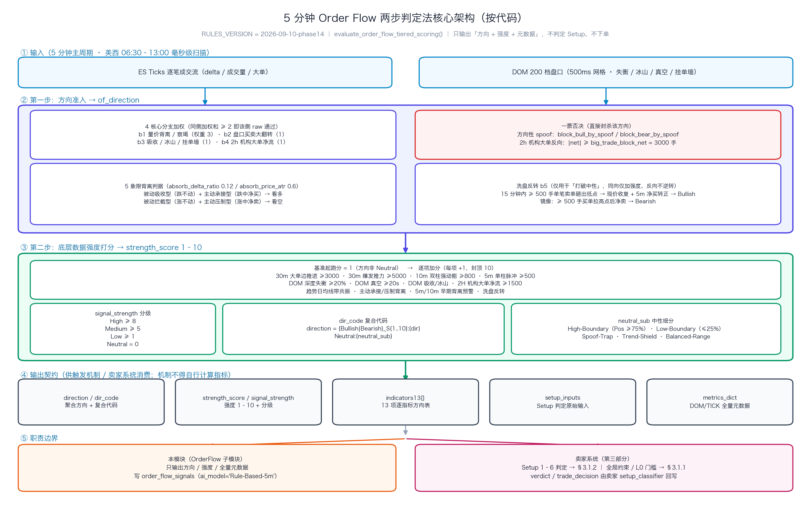

# 交易系统核心规则定义综合全集手册 (Trading System Comprehensive Rules Manual)

本手册系统性整合了量化交易分析平台（包括 `ai_tape_analyst.py`、`order_flow_sentinel.py`、`bbt_signals` 网页端及衍生量化计算模块）中定义的所有核心规则。内容涵盖底层数据清洗、微观盘口定性、量化指标评分、大模型研判约束、SPX 0DTE Gamma 做市商对冲模型以及跨资产流动性验证标准。

---

## 第一部分：Order Flow 订单流分析规则 (Order Flow Analysis Rules)

### 1. 5分钟 Order Flow 两步判定法核心架构 (Two-Step Evaluation Architecture)

量化系统在 5 分钟主周期（美西 06:30 - 13:00）常态化对 ES 成交流（Ticks Flow）与盘口挂单深度（DOM 200档）进行高精度扫描。为彻底根除旧系统“动量滞后导致在行情天花板追多、地板杀跌”以及“98.7%时间频繁多空变色、中性信号消亡”的致命缺陷，系统全面升级为**两步判定法与 1 ~ 10 强度打分体系**：

---

### 2. 核心微观订单流与 DOM 盘口指标定义与计算模型 (Core Metrics & Microstructure Definitions)

5分钟 Order Flow 研判引擎通过毫秒级成交流（Ticks Flow）与盘口深度（DOM 200档）实时计算以下核心微观量化指标。这些指标构成了方向准入（第一步）与强度打分（第二步）的坚实数学底座：

#### (1) DPER (价格推进效率, Delta Price Efficiency Ratio)
- **数学定义与计算公式**:
  `DPER = price_change / (net_delta / 1000)` (单位: 点 / 1000手 Delta)
  衡量每 1000 手净主动买卖量（Delta）在特定时间窗口内（如 30 分钟）所能撬动的标的价格位移点数。
- **微观市场机制与物理内涵**:
  - **顺势有效推进 (|DPER| >= 1.5)**: 主动量推进极具成效，每 1000 手净主动单能推动价格移动至少 1.5 点，表明对手方限价挂单薄弱，盘面顺畅突破；
  - **🟢 底部被动吸收反转 (底背离，DPER > -1.5)**: 当 `net_delta_30m <= -3500`（空头大额激进抛盘砸盘），但价格跌幅收窄且 `DPER > -1.5`（甚至接近 0.0），意味着每砸 1000 手价格下挫不足 1.5 点，说明散户的主动市价抛单全部被主力巨额被动限价买单（挂单/冰山）吃掉，是极强的大级别底部吸收见底特征；
  - **🔴 顶部被动拦截派发 (顶背离，DPER < 1.5)**: 当 `net_delta_30m >= +3500`（多头激进追高），但价格涨幅受阻且 `DPER < 1.5`，说明主力在上方布置了密集限价卖单墙拦截（Supply Trap），是极强的大级别顶部派发见顶特征。

#### (2) dom_bull_book_flip 与 dom_bear_book_flip (盘口买卖比率极速大翻转)
- **采样与量化基准**:
  在 5 分钟窗口内，系统建立 600 个 500ms 离散时间网格，持续追踪近端 Top 0-5 档挂单深度比率:
  `Book_Ratio = Near_Bids (近端买单总量) / Near_Asks (近端卖单总量)`
- **判定标准与逻辑意图**:
  - **dom_bull_book_flip (底部多头大翻转)**: 前半段（前 2.5 分钟）空头压制 `early_ratio < 0.85`，后半段（后 2.5 分钟）买方猛烈翻盘 `late_ratio > 1.40`（挂单比率激增超 60%），且现价处于日内相对低位 `price_position_pct <= 40%`。确认买方主力完全夺得近端盘口主导权，强制激活 Setup 1A 底部吸收准入；
  - **dom_bear_book_flip (顶部空头大翻转)**: 前半段多头占优 `early_ratio > 1.15`，后半段卖方极速筑墙 `late_ratio < 0.70`（骤降超 40%），且现价处于日内相对高位 `price_position_pct >= 60%`。确认卖方主力完全锁死天花板，强制激活 Setup 1B 顶部派发准入。

#### (3) 冰山单 (Iceberg Orders: iceberg_bull / iceberg_bear)
- **微观概念与运行逻辑**:
  机构主力为掩盖真实大额持仓意图，利用算法在特定价格档位仅展示少量限价单（Display Size，如 20 手），背后自动持续刷新补充隐藏限价单（Hidden Size，实际防守数千手）。当市价单连续碰撞该档位时，价格坚如磐石。
- **梯级双层检测模型**:
  - **Tier 1 极致死守 (iceberg_extreme <= 1.0点)**: 单根 5m Bar 内 Delta 冲击绝对值超过 1000 手，但价格移动区间不超过 1.0 点。发生 1 次即可最高置信度确认被动冰山大单死守；
  - **Tier 2 主流波段 (iceberg_std <= 3.0点)**: 涵盖 8~12 个 Tick 算法单分层吸筹/出货，发生 >= 2 次确认；
  - **变量产出**: `iceberg_bull >= 1` 对应买方被动冰山托盘护盘；`iceberg_bear >= 1` 对应卖方被动冰山压盘封顶。

#### (4) vacuum_ask_sec 与 vacuum_bid_sec (流动性真空持续秒数)
- **定义与量化计算**:
  在 500ms DOM 网格步长中，单档挂单量不足 10 手被定义为实质性流动性断层（断崖式空洞）。累计处于断层状态的步长总数并转换为有效秒数:
  `vacuum_sec = (挂单量 < 10手 的步长总数) * 0.5 秒`
- **微观推进机制**:
  - **vacuum_ask_sec (卖方流动性真空)**: 上方阻力档位挂单极其稀薄，极小的市价买盘即可引发向上横扫（Sweep），触发逼空式暴拉；第二步加分项要求持续 `>= 20.0 秒`；
  - **vacuum_bid_sec (买方流动性真空)**: 下方支撑档位挂单极度空虚，缺乏限价垫背，市价抛单极易瞬间击穿引发跳水雪崩；第二步加分项要求持续 `>= 20.0 秒`。

#### (5) weighted_imbalance (多梯队深度加权失衡度) 与 imb_momentum (微观动量)
- **梯队距离加权建模**:
  将全景 0-199 档挂单深度按距现价的物理距离分为三层梯队加权计算失衡：
  - 近端失衡 (`imb_near`，Top 0-5 档，**权重 50%**): `(Bid0_5 - Ask0_5) / (Bid0_5 + Ask0_5)`，代表瞬时阻力；
  - 中端失衡 (`imb_mid`，Level 6-20 档，**权重 30%**): 代表日内核心作战波段的挂单缓冲；
  - 深层失衡 (`imb_deep`，Level 21-120 档，**权重 15%**): 上下 30 点核心深层战略护城河；
  - 远端底色 (`imb_far`，Level 121-200 档，**权重 5%**): 30 点外深水区背景底色。
  `weighted_imbalance = (imb_near * 0.50) + (imb_mid * 0.30) + (imb_deep * 0.15) + (imb_far * 0.05)`
  数值范围在 `[-1.0, +1.0]` 之间。正值代表买盘挂单厚重托底，负值代表卖盘挂单重压封顶；加分项门槛为 `>= +0.20 (+20%)` 或 `<= -0.20 (-20%)`。
- **imb_momentum (失衡微观动量)**:
  `imb_momentum = late_w_imb (后半段 2.5m 均值) - early_w_imb (前半段 2.5m 均值)`
  衡量 5 分钟内盘口攻防力量的加速度。显著偏正（`> +0.04`）表示买方防线快速增厚抢筹；显著偏负（`< -0.04`）表示买盘撤单溃退、卖压加速集结。

#### (6) 其他核心微观量化指标
- **price_position_pct (日内相对极值位置百分比)**:
  `price_position_pct = ((current_price - rth_low) / (rth_high - rth_low)) * 100%`
  将现价无量纲映射在 `[0%, 100%]` 之间。系统硬性规定：`<= 35%` 为极低位吸筹区，`>= 65%` 为极高位派发区，**`>= 75%` 为高位禁追多红线，`<= 25%` 为地板禁杀跌红线**。
- **spoof_bid 与 spoof_ask (虚假撤单诱骗陷阱 Spoofing Trap)**:
  相邻 500ms 步长挂单净减 `< -50 手` 计为 1 次撤单。买方撤单占比 `>= 70%` 且 `spoof_bid > 2 * spoof_ask` 判定为假托单诱多；卖方撤单占比 `>= 70%` 且 `spoof_ask > 2 * spoof_bid` 判定为假压单诱空；**一旦命中强制触发系统一票否决**。
- **big_trade_net_2h (2小时机构大单净量与衰减评分)**:
  统计过去 2 小时单笔 `>= 500 手` 的 ES 机构大单净成交量，结合半衰期指数衰减算法计算主力得分。多头门槛为 `>= +1500 手`，空头门槛为 `<= -1500 手`。

---

### 3. 第一步：基本规则方向准入判定 (Direction Qualifying Rules)

任何 5 分钟节点默认状态均为 `Neutral`（中性），必须首先跨越严格的微观结构门槛，且未触发反追单过滤器与虚假撤单陷阱：

#### 🟢 判定为看多 (Direction = Bullish，基础强度起跑分 = 1)
必须同时通过**反追高刚性约束**（现价处于日内健康相对区间 `price_position_pct <= 65.0%`，实盘严格禁止在 `>= 75.0%` 顶部顺势报多）以及**虚假撤单过滤**（`block_bull_by_spoof == False`），并满足以下三大高确信结构之一：
1. **Setup 1A (大级别底部被动吸收反转 - Major Absorption Reversal)**:
   - **第一道门：物理位置准入门槛 (满足以下 3 大并列超卖途径之一即可过关)**:

| 并列途径 | 空间考核维度 | 量化触发硬性判据 | 空间定位内涵 |
| :---: | :--- | :--- | :--- |
| **途径 A** | **日内绝对振幅低位超卖** (Intraday Range Lows) | `price_position_pct <= 35.0%` | 处于全天价格振幅的下三分之一极度超卖区 |
| **途径 B** | **Smashelito 关键支撑测试** (Order Flow Support Pivot) | 现价下探测试 S1 或 S2 支撑台阶 (`|price - S1/S2| <= 2.0 点` 或 `price <= S1`) | 到达顶尖订单流交易员标注的机构买盘防守线 |
| **途径 C** | **QuantPivot 统计学支撑下轨** (Statistical Support Lows) | 现价下探测试 L1 或 L2 支撑边界 (`|price - L1/L2| <= 2.0 点` 或 `price <= L1`) | 触及大数统计学标准差下轨，下行空间受限 |

   - **第二道门：微观吸收确认判据 (满足以下 4 大微观吸收特征之一即可激活准入)**:

| 并列分支 | 微观确认维度 | 量化触发硬性判据 | 市场微观机制说明 |
| :---: | :--- | :--- | :--- |
| **分支 1** | **量价底背离与推进衰竭** (DPER & Delta Exhaustion) | • **15m 微观底背离**: `last_15m_delta <= -2000 手` 且 `跌幅 <= 2.0 点`； 或 **30m DPER 吸收**: `net_delta_30m <= -3500 手` 且 `dper_30m > -1.5 点/千手` | 抛盘倾泻但价格跌不动，市价砸盘全被大额被动限价买单吸收 |
| **分支 2** | **DOM 盘口买卖比率大翻转** (The Book Flip at Lows) | `dom_bull_book_flip == True` (前半段压制 `early_ratio < 0.85` ➔ 后半段翻盘 `late_ratio > 1.40` 暴增>60%，且低位 `Pos <= 40%`) | 近端买盘挂单厚度暴增，买方瞬间接管盘口防御主动权 |
| **分支 3** | **DOM 盘口密集冰山托单护盘** (Tiered Iceberg Support) | `iceberg_bull >= 1` (检出被动冰山托单) 且最新 5m 单柱卖压衰竭企稳 (`last_5m_delta >= -300 手`) | 隐形机构大单构筑死守防线，卖压撞墙停止下挫 |
| **分支 4** | **2小时机构大单低位吸筹** (Institutional Accumulation) | `inst_bull_accumulation == True` (2小时大单净量 `big_trade_net_2h >= +3000 手` 或衰减评分 `>= 1500`，且低位 `Pos <= 45%`) | 长周期大资金底部密集建仓扫货，提供高安全垫支撑 |

2. **Setup 2A (趋势日 10m 双柱回踩重燃 - Trend Day Pullback & Resumption)**:
   - **第一道门：物理前提准入门槛 (需同时满足以下 3 大宏观与空间条件)**:

| 门槛条件 | 宏观空间考核维度 | 量化触发硬性判据 | 风控与环境内涵 |
| :---: | :--- | :--- | :--- |
| **条件 1** | **SPY 全局统一趋势日多头** (Trend Day Engine) | `is_bullish_trend_day == True` (SPY 判定，现价脱离当日低点(含盘前与RTH) >= 1.00点，开盘无深幅回撤 <= 2.00点，高位回撤 <= 2.00点，且 5m bar 破均线 <= 1次) | 确立全天高确信单边顺势大格局主基调 |
| **条件 2** | **趋势交易黄金时间窗口** (Time Window) | 美西时间 `06:30 - 11:00` 之间 | 早盘与盘中流动性主浪潮，尾盘震荡规避 |
| **条件 3** | **健康回调空间安全垫** (Pullback Health Cushion) | 现价 `price_position_pct <= 65.0%` (**红线: 严禁在 >= 75% 极高位顺势追多**) | 确保买入点处于健康回调蓄能区，而非冲顶接盘 |

   - **第二道门：微观回踩点火共振判据 (需同时满足以下三维要素协同共振)**:

| 验证要素 | 微观考核维度 | 量化触发硬性判据 | 市场微观机制说明 |
| :---: | :--- | :--- | :--- |
| **要素 1** | **15m 均线带防守承接** (EMA Band Support) | 价格回踩测试 15 分钟均线带 (EMA 13/21)，现价稳于 `EMA13 - 3.0 点` 之上企稳受承接 | 强趋势日动态均线防波堤有效，未发生深幅破位 |
| **要素 2** | **10m 双柱复合动能回补** (Dual-Bar Momentum) | 近 10 分钟复合买盘 `last_10m_delta >= +600 手` (或复合 `>= 400` 且单柱 `>= 200`) | 两根 5m 柱连续呈现净主动买盘，确认回调洗盘结束 |
| **要素 3** | **最新 5m 单柱放量点火** (Last-5m Trigger) | 最新 5 分钟主动买盘放量确认 `Delta >= +300 手` | 右侧实质性买单点火推升，拒绝缩量无力假反弹 |

3. **Setup 3A (30m 价值区蓄势突破点火 - 30m Value Area Breakout & Ignition)**:
   - **第一道门：物理前提准入门槛 (需同时满足以下 3 大蓄势突破空间条件)**:

| 门槛条件 | 中枢空间考核维度 | 量化触发硬性判据 | 突破结构内涵 |
| :---: | :--- | :--- | :--- |
| **条件 1** | **中周期密集筹码中枢盘整** (Balance Consolidation) | 突破前经历至少 `30 分钟` 密集价值区横盘蓄势 | 换手充分沉淀筹码，蓄积强单边爆发动能 |
| **条件 2** | **黄金突破空间启动区间** (Optimal Breakout Zone) | 现价处于 `price_position_pct: 45.0% ~ 68.0%` (**拒绝在 >= 75% 极高位追突破**) | 脱离中枢起跑点，具备丰厚的向上盈亏比空间 |
| **条件 3** | **无撤单诱多陷阱认证** (Non-Spoofing Authenticity) | `block_bull_by_spoof == False` (DOM 买方无大额虚假托单撤单) | 排除做市商假突破诱多诱捕陷阱 |

   - **第二道门：微观爆发破位共振判据 (需同时满足以下三维要素协同共振)**:

| 验证要素 | 微观考核维度 | 量化触发硬性判据 | 市场微观机制说明 |
| :---: | :--- | :--- | :--- |
| **要素 1** | **30m 中周期大单边放量** (30m Major Impulse) | 近 30 分钟累计净买盘 `net_delta_30m >= +4500 手` | 中周期主动买盘大举进场，打破筹码平衡区引爆单边推力 |
| **要素 2** | **10m 双柱加速推进** (Dual-Bar Acceleration) | 近 10 分钟双柱加速 `last_10m_delta >= +1000 手` 且最新 5m `Delta >= +400 手` | 短周期主动量持续递增，呈现强单边脉冲加速度 |
| **要素 3** | **DOM 盘口势能点火** (Book Ignition) | 上方出现 Ask 档位流动性真空 (`vacuum_ask_sec >= 15.0s`) 或加权失衡偏多 (`weighted_imbalance >= +15%`) | 上方卖单断层或买盘加固，极易引发逼空式主升浪 |

#### 🔴 判定为看空 (Direction = Bearish，基础强度起跑分 = 1，严格双向对称)
必须同时通过**反杀跌刚性约束**（现价处于日内健康相对区间 `price_position_pct >= 35.0%`，实盘严格禁止在 `<= 25.0%` 地板顺势报空）以及**虚假撤单过滤**（`block_bear_by_spoof == False`），并满足以下三大高确信结构之一：
1. **Setup 1B (大级别顶部被动派发反转 - Major Distribution Reversal)**:
   - **第一道门：物理位置准入门槛 (满足以下 3 大并列超买途径之一即可过关)**:

| 并列途径 | 空间考核维度 | 量化触发硬性判据 | 空间定位内涵 |
| :---: | :--- | :--- | :--- |
| **途径 A** | **日内绝对振幅高位超买** (Intraday Range Highs) | `price_position_pct >= 65.0%` | 处于全天价格振幅的上三分之一极度超买区 |
| **途径 B** | **Smashelito 关键阻力测试** (Order Flow Resistance Pivot) | 现价上冲测试 R1 或 R2 阻力台阶 (`|price - R1/R2| <= 2.0 点` 或 `price >= R1`) | 到达顶尖订单流交易员标注的机构卖盘压制线 |
| **途径 C** | **QuantPivot 统计学阻力上轨** (Statistical Resistance Highs) | 现价上冲测试 H1 或 H2 阻力边界 (`|price - H1/H2| <= 2.0 点` 或 `price >= H1`) | 触及大数统计学标准差上轨，推升空间受限 |

   - **第二道门：微观派发确认判据 (满足以下 4 大微观派发特征之一即可激活准入)**:

| 并列分支 | 微观确认维度 | 量化触发硬性判据 | 市场微观机制说明 |
| :---: | :--- | :--- | :--- |
| **分支 1** | **量价顶背离与推升受阻** (DPER & Buying Exhaustion) | • **15m 微观顶背离**: `last_15m_delta >= +2000 手` 且 `涨幅 <= 2.0 点`； 或 **30m DPER 滞涨**: `net_delta_30m >= +3500 手` 且 `dper_30m < 1.5 点/千手` | 散户追高买单涌入但价格推不动，撞上主力被动限价大单拦截 |
| **分支 2** | **DOM 盘口买卖比率大翻转** (The Book Flip at Highs) | `dom_bear_book_flip == True` (前半段进攻 `early_ratio > 1.15` ➔ 后半段卖方极速筑墙 `late_ratio < 0.70` 骤降>40%，且高位 `Pos >= 60%`) | 近端卖盘挂单沉重压顶，卖方主力瞬间锁死上涨天花板 |
| **分支 3** | **DOM 盘口密集冰山压单拦截** (Tiered Iceberg Resistance) | `iceberg_bear >= 1` (检出被动冰山压单) 且最新 5m 单柱买单衰竭遇阻 (`last_5m_delta <= +300 手`) | 隐形机构大单构筑封顶屏障，买盘撞墙动能耗尽滞涨 |
| **分支 4** | **2小时机构大单高位出货** (Institutional Distribution) | `inst_bear_distribution == True` (2小时大单净量 `big_trade_net_2h <= -3000 手` 或衰减评分 `<= -1500`，且高位 `Pos >= 55%`) | 长周期大资金高位密集派发出货，构筑沉重阻力天花板 |

2. **Setup 2B (趋势日 10m 双柱回抽再跌 - Trend Day Rebound & Breakdown)**:
   - **第一道门：物理前提准入门槛 (需同时满足以下 3 大宏观与空间条件)**:

| 门槛条件 | 宏观空间考核维度 | 量化触发硬性判据 | 风控与环境内涵 |
| :---: | :--- | :--- | :--- |
| **条件 1** | **SPY 全局统一趋势日空头** (Trend Day Engine) | `is_bearish_trend_day == True` (SPY 判定，现价脱离当日高点(含盘前与RTH) >= 1.00点，开盘无深幅反抽 <= 2.00点，低位反弹 <= 2.00点，且 5m bar 破均线 <= 1次) | 确立全天高确信单边顺势打压主基调 |
| **条件 2** | **趋势交易黄金时间窗口** (Time Window) | 美西时间 `06:30 - 11:00` 之间 | 早盘与盘中流动性主浪潮，尾盘震荡规避 |
| **条件 3** | **健康回抽空间安全垫** (Rebound Health Cushion) | 现价 `price_position_pct >= 35.0%` (**红线: 严禁在 <= 25% 地板盲目杀跌**) | 确保卖出点处于健康回抽受阻区，而非地板割肉 |

   - **第二道门：微观承压砸盘共振判据 (需同时满足以下三维要素协同共振)**:

| 验证要素 | 微观考核维度 | 量化触发硬性判据 | 市场微观机制说明 |
| :---: | :--- | :--- | :--- |
| **要素 1** | **15m 均线带承压受阻** (EMA Band Resistance) | 价格回抽测试 15 分钟均线带 (EMA 13/21)，现价受阻于 `EMA13 + 3.0 点` 之下承压受阻 | 空头趋势日均线压制坚固，反弹无法突破阻力带 |
| **要素 2** | **10m 双柱复合卖盘砸盘** (Dual-Bar Momentum) | 近 10 分钟复合卖盘 `last_10m_delta <= -600 手` (或复合 `<= -400` 且单柱 `<= -200`) | 两根 5m 柱连续呈现净主动砸盘，确认反弹遇阻回落 |
| **要素 3** | **最新 5m 单柱砸盘点火** (Last-5m Trigger) | 最新 5 分钟主动卖盘放量确认 `Delta <= -300 手` | 右侧实质性市价抛盘放量砸出，空头重燃下杀势能 |

3. **Setup 3B (30m 价值区破位下杀点火 - 30m Value Area Breakdown & Ignition)**:
   - **第一道门：物理前提准入门槛 (需同时满足以下 3 大破位下杀空间条件)**:

| 门槛条件 | 中枢空间考核维度 | 量化触发硬性判据 | 破位结构内涵 |
| :---: | :--- | :--- | :--- |
| **条件 1** | **中周期密集筹码中枢盘整** (Balance Consolidation) | 破位前经历至少 `30 分钟` 密集价值区横盘蓄势 | 密集支撑沉淀多头筹码，一旦失守引发集中踩踏 |
| **条件 2** | **黄金破位空间启动区间** (Optimal Breakdown Zone) | 现价处于 `price_position_pct: 32.0% ~ 55.0%` (**拒绝在 <= 25% 地板极限杀跌**) | 跌破中枢起跌点，具备丰厚的向下盈亏比空间 |
| **条件 3** | **无撤单诱空陷阱认证** (Non-Spoofing Authenticity) | `block_bear_by_spoof == False` (DOM 卖方无大额虚假压单撤单) | 排除做市商假击穿诱空诱捕陷阱 |

   - **第二道门：微观击穿下杀共振判据 (需同时满足以下三维要素协同共振)**:

| 验证要素 | 微观考核维度 | 量化触发硬性判据 | 市场微观机制说明 |
| :---: | :--- | :--- | :--- |
| **要素 1** | **30m 中周期大单边砸盘** (30m Major Impulse) | 近 30 分钟累计净卖盘 `net_delta_30m <= -4500 手` | 中周期主动卖盘巨额倾泻，击穿支撑中枢打破平衡 |
| **要素 2** | **10m 双柱加速砸盘** (Dual-Bar Acceleration) | 近 10 分钟双柱加速 `last_10m_delta <= -1000 手` 且最新 5m `Delta <= -400 手` | 短周期主动下杀持续加剧，呈现破坏性单边加速度 |
| **要素 3** | **DOM 盘口势能点火** (Book Ignition) | 下方出现 Bid 档位支撑真空塌陷 (`vacuum_bid_sec >= 15.0s`) 或卖盘重压 (`weighted_imbalance <= -15%`) | 下方托单溃败断层，缺乏限价垫背极易引发雪崩跳水 |

#### ⚪ 判定为中性 (Direction = Neutral，强度值 = 0)
- 凡不满足上述看多或看空基本规则（如处于无序震荡中枢、买卖多空胶着）；
- 或触发**高位防守禁追高**（`price_position_pct >= 75.0%` 且处于顺势推进，强制输出 `Neutral:High-Boundary`）；
- 或触发**低位防守禁杀跌**（`price_position_pct <= 25.0%` 且处于顺势打压，强制输出 `Neutral:Low-Boundary`）；
- 或触发**虚假撤单诱捕陷阱**（买方撤单占优诱多或卖方撤单占优诱空，强制输出 `Neutral:Spoof-Trap`）。
- **裁决**：中性状态强度值直接归 **0 分**，进入绝对防御与观望模式，杜绝一切盲目开仓。

---

### 4. 第二步：底层数据强度打分体系 (Strength Scoring 1 ~ 10 分)

凡通过第一步准入判定为看多或看空者：
- **基准起跑分**：符合基本准入规则即赋予 **基础强度值 = 1**；
- **9 大客观底层数据加分项（满足 1 项累加 +1 分，最高累计至 10 分满分）**：

| 加分项 | 评估维度与底层特征 | 多头加分判据 (Bullish +1) | 空头加分判据 (Bearish +1) |
| :---: | :--- | :--- | :--- |
| **加分 1** | **30m 持续大单边推进** | `net_delta_30m >= +3000` | `net_delta_30m <= -3000` |
| **加分 2** | **30m 极强爆发式推力** | `net_delta_30m >= +5000` | `net_delta_30m <= -5000` |
| **加分 3** | **最新 10m 双柱持续强动能** | `last_10m_delta >= +800` (两根 5m 持续放量) | `last_10m_delta <= -800` (两根 5m 持续砸盘) |
| **加分 4** | **最新 5m 单柱脉冲放量** | 最新 5m Delta `>= +500` | 最新 5m Delta `<= -500` |
| **加分 5** | **DOM 深度加权显著失衡** | `weighted_imbalance >= +20%` 且 `imb_momentum >= 0` | `weighted_imbalance <= -20%` 且 `imb_momentum <= 0` |
| **加分 6** | **DOM 阻力/支撑档位真空** | 上方 Ask 档位真空持续 `vacuum_ask_sec >= 20.0s` | 下方 Bid 档位真空持续 `vacuum_bid_sec >= 20.0s` |
| **加分 7** | **DOM 盘口被动冰山大单** | 检出被动冰山护盘 (`iceberg_bull >= 1`) | 检出被动冰山压盘 (`iceberg_bear >= 1`) |
| **加分 8** | **2小时机构大单净流确认** | `big_trade_net_2h >= +1500` 或机构吸筹确认 | `big_trade_net_2h <= -1500` 或机构派发确认 |
| **加分 9** | **趋势日与均线带大势共振** | SPY 趋势日确认多头，且现价运行于 15m EMA 13 上方 (`price >= EMA13 - 1.0`) | SPY 趋势日确认空头，且现价承压于 15m EMA 13 下方 (`price <= EMA13 + 1.0`) |

#### 强度分级定义与交易映射 (Grade Boundaries)
- **强度 8 ~ 10 分 (High)**：多微观通道顶格共振，主升/主跌浪极限确信；
- **强度 5 ~ 7 分 (Medium)**：高确信强动能顺势波段，期权卖方高胜率开仓区；
- **强度 1 ~ 4 分 (Low)**：标准顺势试盘，轻量级推进；
- **强度 0 分 (Neutral)**：多空均衡、中枢震荡或高低位防守禁区。

---

### 5. 输出代码规范与全系统数据库落库 (`order_flow_signals` 表)

1. **`direction` 字段**:
   - 采用多空分级复合代码格式，与 SPX Gamma 保持高度一致：
     * 看多: `Bullish_S1:Bullish` 至 `Bullish_S10:Bullish`
     * 看空: `Bearish_S1:Bearish` 至 `Bearish_S10:Bearish`
     * 中性防守: `Neutral:High-Boundary` (高位禁追多)、`Neutral:Low-Boundary` (低位禁杀跌)、`Neutral:Spoof-Trap` (撤单陷阱)、`Neutral:Range-Bound` (无序震荡)
2. **`signal_strength` 字段**:
   - 强度 8~10 ➔ `High`；强度 5~7 ➔ `Medium`；强度 1~4 ➔ `Low`；强度 0 ➔ `Neutral`
3. **`quantitative_metrics` 字段**:
   - JSON 存储详细打分字典：包含 `strength_score` (1~10)、`base_rule` (触发基准)、`bonus_items` (满足加分清单)、`net_delta_30m`、`last_10m_delta`、`price_position_pct`、`weighted_imbalance`、`big_trade_net_2h` 等微观量化指标。
4. **`verdict` 字段**:
   - 生成高度可读的定性报告，直观呈现多空方向、强度数值、基准触发结构、具体加分项及成交与盘口细节。

---

### 6. DOM 200档盘口微观机制与 Smashelito 关键点位联动

#### (1) 500ms 离散网格与上下 30 点核心加权建模
- **600 步长离散网格**: 在 5 分钟（300 秒）窗口内，划分 600 个 500ms 均匀时间戳，采用前向填充（Forward-Fill）追踪全景 0-199 档挂单深度。
- **上下 30 点核心主导加权 (30-Point Dominance Weighting)**:
  - 挂单深度按距离划分：近端（0-5档占 50%）+ 中端（6-20档占 35%）+ 30点核心深层（20-120档占 10%），**30点以内核心常态占据 95% 绝对权重**。
  - 30点外深水区（120-200档/30-50点）常态下仅分配 **5% 背景底色权重**，彻底杜绝远端僵尸挂单稀释近端博弈信号。
- **5 分钟微观动量 (`imb_momentum`)**:
  - `imb_momentum = 后半段 2.5m 加权失衡均值 - 前半段 2.5m 加权失衡均值`。显著偏正（> +0.04）表明买单防线持续增厚抢筹；显著偏负（< -0.04）表明买盘撤单溃退，卖压加速堆积。

#### (2) 盘口买卖比率极速大翻转规则 (The Book Flip at Key Levels)
- **底部多头大翻转 (`dom_bull_book_flip`)**:
  - 在 600 个步长上监控近端买卖比率 `Book_Ratio = Near_Bids / Near_Asks`，前半段空头压制 `early_ratio < 0.85`，后半段买方猛烈翻盘 `late_ratio > 1.40`（激增 > 60%）且处于日内相对低位 `price_position_pct <= 40%`。
  - 裁决: **确认买方夺得盘口主导权，强制激活 Setup 1A 底部吸收准入**。
- **顶部空头大翻转 (`dom_bear_book_flip`)**:
  - 前半段多头占优 `early_ratio > 1.15`，后半段卖方极速筑墙 `late_ratio < 0.70`（骤降 > 40%）且处于日内相对高位 `price_position_pct >= 60%`。
  - 裁决: **确认卖方筑墙锁死天花板，强制激活 Setup 1B 顶部派发准入**。

#### (3) 梯级冰山密集吸收与最高覆写规则 (Tiered Iceberg Burst)
- **Tier 1 极致死守 (`iceberg_extreme <= 1.0点`)**: 单根 Bar 内 Delta 冲击超过 1000 手但价格移动 <= 1.0 点。仅需 1 次发生即可最高置信度激活 Setup 1A/1B 吸收准入。
- **Tier 2 主流波段 (`iceberg_std <= 3.0点`)**: 涵盖 8~12 个 Tick 算法单分层吸筹/出货，发生 >= 2 次触发吸收准入，兼顾防洗盘。

#### (4) 虚假撤单诱多/诱空陷阱过滤规则 (Spoofing Trap Filter)
- **诱多假托单陷阱 (`spoof_bull_trap`)**: 买方撤单占比 >= 70% 且 `spoof_bid > 2 * spoof_ask`（总撤单 >= 10 次），**硬性封杀一切看多信号 (`block_bull_by_spoof = True`)**。
- **诱空假压单陷阱 (`spoof_bear_trap`)**: 卖方撤单占比 >= 70% 且 `spoof_ask > 2 * spoof_bid`（总撤单 >= 10 次），**硬性封杀一切看空信号 (`block_bear_by_spoof = True`)**。

#### (5) Smashelito 关键点位交互
- **Smashlevel**: 日内多空分水岭 Pivot。站稳上方偏多，跌破偏空。
- **Bullish / Bearish Target**: 进攻加速与突破点位。
- **Support / Resistance (S1~S3, R1~R3)**: 关键支撑阻力台阶，与 DOM 挂单防守重叠时有效性大幅提升。

---

## 第二部分：SPX 0DTE Gamma 规则 (SPX 0DTE Gamma Rules)

本部分从期权做市商（Option Dealers / Market Makers）维持 Delta 动态中性对冲的底层微观机制出发，量化分析 SPX 0DTE Gamma 暴露对大盘走势的约束与引导。

### 做市商对冲机制与两大市场状态 (Market Regimes)

#### 1. 正 Gamma 状态 (Net Long Gamma Regime - 绿色区域)
- **做市商行为**: “低买高卖（逆势对冲）”。
    - 标的上涨时，做市商的 Delta 增加，必须卖出指数期货以维持中性；
    - 标的下跌时，做市商的 Delta 减少，必须买入指数期货以维持中性。
- **价格行为特征**:
    - **波动率收敛与压制**: 做市商的反向对冲单平抑了任何单边价格冲击。
    - **Pinning 锚定效应**: 标的价格在逼近最大正 Gamma 墙（Call Wall）时移动减速，触及后被牢牢“钉”在附近，难以击穿。

#### 2. 负 Gamma 状态 (Net Negative Gamma Regime - 红色区域)
- **做市商行为**: “追涨杀跌（顺势对冲）”。
    - 标的下跌时，做市商的 Delta 亏损扩大，必须追加抛售指数期货以维持中性；
    - 标的上涨时，做市商必须追加买入指数期货。
- **价格行为特征**:
    - **波动率爆炸与滑移**: 做市商形成恶性“抛售-下挫-再抛售”负反馈循环。
    - **磁吸与击穿加速**: 标的价格在靠近大负 Gamma 墙（Put Wall）时，受到顺势抛压的强烈推引（表现为高速磁吸）；一旦触及或击穿，该点位无法提供支撑，反而直接引发爆仓挤压或加速赶底。

---

### 核心关键 Gamma 水位体系

#### 1. 核心关键水位清单
- **Absolute Gamma Strike**: 市场整体绝对 Gamma 暴露最大的单一执行价，具有全天最强的价格锚定（Pinning）吸引力。
- **Call Wall**: 整个 0DTE 链上看涨期权 Gamma 聚集峰值行权价，在正 Gamma 环境下构成日内天然顶部天花板。
- **Put Wall**: 整个 0DTE 链上看跌期权 Gamma 聚集峰值行权价，在负 Gamma 环境下构成日内强磁吸与向下引力阱。
- **Gamma Flip**: 市场整体净 Gamma 符号由正转负的分水岭行权价。此点位为大盘由收敛震荡转为单边暴走的分界点。

#### 2. 目标水位距离量化与追涨杀跌防范
- **距 Call Wall <= 10 点**:
    - 若市场处于正 Gamma 状态，属于高风险逆向区，**禁止追多**，警惕冲高回落被做市商对冲单砸盘。
- **距 Put Wall <= 10 点**:
    - 若市场处于负 Gamma 状态，属于磁吸赶底区，警惕向下加速破位；若处于正 Gamma 状态，则为强力支撑锚定区。

---

### 0DTE 盘中动态演变与时效特征

#### 1. 早盘阶段 (06:30 - 08:30 西雅图时间)
- 隔夜仓位消化与做市商初始持仓对冲，Gamma 水位变动频繁，需等待 08:00 之后的稳态水准确立。

#### 2. 盘中阶段 (08:30 - 11:30)
- 机构交易主力时段，Call Wall 与 Put Wall 结构最稳定，点位指示效果最强。

#### 3. 尾盘归零爆发期 (11:30 - 13:00)
- 随着到期时间趋近于零，ATM（平价）期权的 Gamma 呈现几何级数爆炸，微小的标的波动即可引发做市商巨额期货调仓，极易引发尾盘 Gamma Squeeze。

---

### SPX Gamma 5分钟周期结构决策树与 Neutral 细分体系规则 (SPX Gamma 5m Decision Tree & Neutral Taxonomy Rules)

针对原有 5 分钟周期研判“随波逐流（顺势臆测）”与“极值撞墙继续顺势追单导致期权卖方爆仓”的严重弊端，确立以期权做市商持仓防御边界为核心的刚性决策体系。

#### 1. 决策架构：三阶梯结构决策树状态机
系统按严格的先后逻辑顺序执行硬性过滤与多阶梯裁决：
- **第零层：尾盘时钟刚性过滤闸门 (Time Window Gate)**：
    - **有效顺势时间窗**：仅在美西时间 **06:30 - 11:00 PST**（即美东 09:30 - 14:00 EST）开放多空顺势单边判定；
    - **11:00 PST 之后刚性截断判定为中性**：凡在 **11:00 PST 之后**，0DTE 临期期权面临极限 Theta 衰减与做市商行权钉住 (Pinning) 效应，价格极易产生非线性剧烈异动，做市商不再呈现常规日内单边对冲推力。系统**无条件一票否决一切顺势推演，一律强制判定为中性，输出 Neutral:Time-Cutoff（尾盘时段禁区中性）**，彻底消除尾盘盲目追单风险。
- **第一层：主活动区结构纯净度检测 (Clean Separation)**：
    - 统计有效 Gamma 主活动区间内的变号次数（Sign Flips）。若变号次数 > 2（红绿柱频繁交替），判定做市商持仓无明确单边偏向，直接阻断顺势判定，输出 **Neutral:Conflicted（多空交织中性）**。
    - 容差机制：变号次数 <= 2（或变号为 3 且反向孤立小柱 <= 1 根）时判定结构纯净，放行进入第二层。
- **第二层：优势方绝对压制检测 (Dominance Check)**：
    - 绿柱主导要求：多空主力集群 Gamma 比率（Ratio）>= 2.0 或 最大绿柱高度 >= 2.0 倍最大红柱高度；
    - 红柱主导要求：多空主力集群 Gamma 比率（Ratio）<= 0.50 或 最大红柱高度 >= 2.0 倍最大绿柱高度；
    - 若未达 2.0 倍压制，判定做市商多空力量势均力敌，直接阻断顺势判定，输出 **Neutral:Balanced（均势胶着中性）**。
- **第三层：空间充盈度与极值撞墙禁区 (Cushion & Pos Filter)**：
    - 进入做市商天花板/铁底空间裁决，以 Gamma 绝对位置 Cushion 为核心主导。

> [!NOTE]
> **样本统计与分时动态演进说明**：
> 基于历史 741 组样本分位数实测，消除 0DTE 尾盘到期数学奇点扭曲：**早盘建仓期 (06:30-08:00 PST)** 历史中位数 ~$4.8B，门限设为 $5.0B / $3.5B；**盘中黄金期 (08:00-11:30 PST)** 历史中位数升至 ~$15B，门限设为 $15.0B / $10.0B。
> （系统后续版本可能加入基于分时段最低绝对金额门限的硬性约束校验）。

#### 2. 核心量化指标与纯文本计算公式
- **多空主力集群 Gamma 比率 (Cluster Gamma Ratio)**: `Ratio = |bullish_cluster_gamma| / |bearish_cluster_gamma|`
    - 分别以最大正 Gamma 柱（绿柱最高峰）与最大负 Gamma 柱（红柱最深谷）为中心，向左取 2 档、向右取 2 档，对连续 5 档行权价的 Net Gamma 累计求和作为集群金额。
- **Call 空间缓冲 (Call Cushion)**: `Call Cushion = Call Wall Strike - Spot Price`（单位: 点）
- **Put 空间缓冲 (Put Cushion)**: `Put Cushion = Spot Price - Put Wall Strike`（单位: 点）
- **日内分位数相对位置 (Pos)**: `Pos = (Spot Price - Day Low) / (Day High - Day Low)`
    - 当全天振幅 (Day High - Day Low) <= 1.0 点时，Pos 默认取 0.50（50%）。
- **ATM 自适应外层阻力天花板解析 (Wall Resolver)**:
    - 当链上最大 Gamma 柱位于现价 ATM < 10 点内时，算法自动在外层（OTM）搜寻具备 >= 80% 峰值 Gamma 的真正结构阻力天花板/支撑底，杜绝平价柱带来的假撞墙误报。

#### 3. 极值撞墙禁区与日内形态自适应顺势空间裁决铁律
- **极值冲顶撞墙禁区 (Call Wall Veto)**:
    - 条件: `Call Cushion < 8.0 点`
    - 裁决: 输出 **Neutral:Exhaustion-Top（极值冲顶撞墙禁区）**。
    - **期权卖方一票否决**: 现价逼近做市商天花板，做市商逆势抛售对冲压制达到极限，**绝对禁止顺势追多（严禁建立 Bull Put Spread）**！
- **极值探底撞墙禁区 (Put Wall Veto)**:
    - 条件: `Put Cushion < 8.0 点`
    - 裁决: 输出 **Neutral:Exhaustion-Bottom（极值探底撞墙禁区）**。
    - **期权卖方一票否决**: 现价跌入做市商强支撑铁底，做市商低吸对冲与空头平仓极值，**绝对禁止顺势杀跌（严禁建立 Bear Call Spread）**！
- **日内趋势形态（Trend Regime）自适应顺势推进区 (Unconstrained Trend)**:
    - **核心逻辑与市场机理**: 对于非单边强趋势日（Non-Trend Day，如区间震荡、早盘大跌后死猫反弹、冲高回落等），做市商正 Gamma 平抑机制与现货买盘动能衰竭，标的 SPX 极难最终触及最外层大 Gamma 墙体（常在半途 15~20 点处提前耗尽夭折）。因此系统基于全局统一的 `evaluate_intraday_trend_regime` 引擎（以 SPY 判定、时间窗 06:30 - 11:00、5m 收盘反向 15m 13EMA <= 1 次）客观研判形态，实施动态 Cushion 空间门限：
        1. **单边趋势日 (Trend Day)**:
           - 判定基准: SPY 现价大幅脱离当日极低/极高点(含盘前与RTH) >= 0.80 点，开盘破位/冲顶 <= 2.00 点，极值回撤/反弹 <= 2.00 点，且 5m close 反向 15m 13EMA <= 1 次；
           - **顺势 Cushion 门限**: 保持宽松门限 **`Cushion >= 15.0 点`**（多头需 `Call Cushion >= 15.0` 且 `Pos < 90%` 输出 **Bullish:Bullish**；空头需 `Put Cushion >= 15.0` 且 `Pos > 10%` 输出 **Bearish:Bearish**）。
        2. **非趋势日 (Non-Trend Day)**:
           - 凡不满足上述严苛单边特征的所有行情（反弹、震荡、整理）或超出 06:30-11:00 时间窗，均归为非趋势日；
           - **顺势 Cushion 门限严谨升级**: 顺势推进空间要求从 15.0 点**硬性提高到 23.0 点**！
           - 若非趋势日下 `Call Cushion < 23.0 点`（即使 > 15.0 点），一律严禁看多，直接降级拦截为 **Neutral:Compression-Top（上行空间压缩中性）**；空头对称地若 `Put Cushion < 23.0 点`，一律严禁看空，直接降级拦截为 **Neutral:Compression-Bottom（下行空间压缩中性）**！
- **空间压缩中性区 (Compression Buffer)**:
    - 条件: `8.0 点 <= Cushion < 动态门限(趋势日15点 / 非趋势日23点)` 或 `Pos >= 90% / Pos <= 10%`（未撞入 8 点禁区）
    - 裁决: 绿柱主导输出 **Neutral:Compression-Top（上行空间压缩中性）**；红柱主导输出 **Neutral:Compression-Bottom（下行空间压缩中性）**。
    - 策略指引: 空间受限且盈亏比极差，**暂停顺势开仓，保持中性观望防范反向掉头**。

#### 4. 中性 (Neutral) 七大子类型决策与风控总表

| 中性子类型代码 | 中文定性 | 核心量化触发条件 | 期权卖方风控指导 (Actionable Advice) |
| :--- | :--- | :--- | :--- |
| `Neutral:Time-Cutoff` | **尾盘时段禁区中性** | `时间 >= 11:00 PST`（美西 11 点之后） | **全系统禁止任何新开仓，强制中性防守**；0DTE 临期 Theta 极速衰减且面临行权钉住 (Pinning) 效应，价格极易脱离常规对冲逻辑发生异动；已有仓位严格按计划在 11:30 PST 停止入场、12:30 PST 强制清仓了结。 |
| `Neutral:Exhaustion-Top` | **极值冲顶撞墙禁区** | `Call Cushion < 8.0 点` | **一票否决顺势追多（严禁卖 Put）**；做市商逆势对冲压制达极值，严防随时行权钉住或回落。激进者可结合微观顶背离博弈 Bear Call Spread。 |
| `Neutral:Exhaustion-Bottom` | **极值探底撞墙禁区** | `Put Cushion < 8.0 点` | **一票否决顺势杀跌（严禁卖 Call）**；做市商低吸对冲达极值，严防随时止跌弹升。激进者可结合微观底背离博弈 Bull Put Spread。 |
| `Neutral:Compression-Top` | **上行空间压缩中性** | 绿柱占优，`8.0 <= Cushion < (趋势日15点 / 非趋势日23点)` 或 `Pos >= 90%` | **暂停追多，保持中性观望**；非趋势日严防反弹夭折（如2026-09-04反弹至7728即终结），不盲目反手，等待有效突破重构。 |
| `Neutral:Compression-Bottom` | **下行空间压缩中性** | 红柱占优，`8.0 <= Cushion < (趋势日15点 / 非趋势日23点)` 或 `Pos <= 10%` | **暂停杀跌，保持中性观望**；非趋势日严防下探企稳反抽，严禁在底部追空，等待击穿企稳或右侧反转。 |
| `Neutral:Conflicted` | **多空交织中性** | `Sign Flips > 2`（主区间红绿柱频繁交错） | **双向观望，严禁顺势单边开仓**；仅允许在两端极值宽幅震荡时轻仓布局 Iron Condor。 |
| `Neutral:Balanced` | **均势胶着中性** | `Sign Flips <= 2`，但红绿柱压制比 < 2.0x | **以震荡市对待，耐心等待放量突破**；避免单边押注，维持中性头寸。 |

#### 5. 5分钟 SPX Gamma 顺势多空分级评级决策体系 (Bullish_L0~L3 / Bearish_L0~L3)

在做市商第三层决策树顺势推进分支中，为进一步量化顺势动能强度与信号置信度，建立基于基础判定与三大加分项的四级分级体系：

##### (1) 基础基准判定 (Level 0 Baseline)
- **多头基准 (`Bullish_L0`)**: 满足结构纯净度 PASS、做市商 Gamma 压倒性优势 (>= 2.0x)、未撞入天花板极值禁区 (`Call Cushion >= 8.0`)、顺势缓冲空间充盈 (`Call Cushion >= 动态门限(趋势日15点/非趋势日23点)`)，且现价日内分位数处于安全区 (`Pos < 90%`)。
- **空头基准 (`Bearish_L0`)**: 严格反向对称（红柱占优、`Put Cushion >= 8.0`、`Put Cushion >= 动态门限`、`Pos > 10%`）。

##### (2) 三大独立加分项 (Bonus Factors，各得 1 分)
1. **多空主力集群 Gamma 规模比率 >= 3.0**:
   - 多头: `imbalance_score >= 3.0`（Call 主力集群 Gamma 总和是 Put 主力集群总和绝对值的 3 倍及以上）；
   - 空头: `bear_ratio >= 3.0`（Put 主力集群 Gamma 总和绝对值是 Call 主力集群总和的 3 倍及以上，即 `imbalance_score <= 0.333`）。
2. **开盘黄金布局时段 (06:30 - 08:30 PT)**:
   - 目标时间戳处于美西时间 `06:30:00 <= target_time <= 08:30:00`，为日内大机构资金建仓与早盘大单边动能确立的黄金爆发窗口。
3. **主力集群 Gamma 趋势整体上 Trend Up (持续扩张净注入)**:
   - 提取开盘以来全部历史采样节点序列（多头考察 Call 集群规模，空头考察 Put 集群规模绝对值）；
   - 量化要求: 采样节点数 >= 2，终点高于起点，线性拟合斜率 `slope > 0`，最新值处于序列相对高位 (`curr >= 0.85 * max`)，且具备显著净注入规模 (绝对增量 >= 1.0B 或相对增幅 >= 15%)。

##### (3) 多空分级判定与交易决策指导表

| 信号级别 | 判定条件 | 动能特征与置信度定性 | 期权卖方与日内交易决策指导 |
| :--- | :--- | :--- | :--- |
| `Bullish_L0` `Bearish_L0` | 满足基础顺势推进，**0 项加分** | **常规基准顺势** 满足空间门限但未获超额动能增益 | 常规基础仓位顺势推进（卖 Put / 卖 Call）；严守离场纪律，防范动能后劲不足。 |
| `Bullish_L1` `Bearish_L1` | 满足基础顺势推进，**1 项加分** | **强化顺势动能** 具备 1 项超额特征（高比率/早盘窗/集群注入） | 顺势确定性良好，可适度提高顺势持仓信心，分批推进。 |
| `Bullish_L2` `Bearish_L2` | 满足基础顺势推进，**2 项加分** | **高确信主升/主跌浪** 两项核心特征共振（如早盘黄金窗 + 集群持续净注入） | 胜率与盈亏比俱佳，积极建立顺势组合；严禁逆势摸顶抄底。 |
| `Bullish_L3` `Bearish_L3` | 满足基础顺势推进，**3 项加分全部成立** | **极强力爆发主升/主跌浪** 黄金时段 + 3倍绝对压制 + 集群单调加速注入 | 系统最高置信度单边推进；坚定持有顺势仓位收割 Theta/Delta，杜绝任何逆势妄动。 |

---
## 第三部分：Option Seller 自动交易系统风控与选型规则 (Option Seller Rules)

基于 BBT.AI (BBT.AI) 四步闭环体系（DISCOVER -> STRUCTURE -> MANAGE -> REVIEW），面向 SPY 0DTE 信用价差自动化交易制定以下底层刚性规则：

#### 1. 核心策略与风险锁死原则 (Defined Risk Only)
- **绝对禁止单腿裸卖**：严禁裸卖 Put 或裸卖 Call；所有卖方仓位必须强制配备保护腿（Long Protection Leg）。
- **两腿垂直信用价差结构**：
    - 看多市场或正 Gamma 探底反弹：执行 **Bull Put Spread**（卖出 OTM Put，买入更低行权价 Put）；
    - 看空市场或正 Gamma 冲高受阻：执行 **Bear Call Spread**（卖出 OTM Call，买入更高行权价 Call）；
    - 震荡平衡市：执行两翼 **Iron Condor**；
- **固定价差宽度与绝对最大风险**：SPY 价差宽度统一固定为 1.0 点（行权价间隔 $1.00），每手最大理论亏损严格锁死为 `(1.0 - 净权利金) * 100` 美元（单手最大风险约 $65 ~ $90 美元）。

#### 2. 合约选型与开仓过滤规则 (Structure & Discover)
- **到期日选择与动态 DTE 支持 (0DTE vs 1DTE)**：
    - 系统默认执行 **0DTE**（当天到期），核心利用日内最后数小时 Theta 抛物线加速衰减特性实现快速双批次止盈，并在 12:30 PST 强制清空，彻底消除隔夜跳空与分派风险；
    - 系统同时支持在控制台切换为 **1DTE**（隔天到期），便于在日内波动率较缓和时，以更宽的安全垫距离（`1.0% ~ 1.5%`）换取更高的绝对胜率与更厚的权利金。
- **Short Leg Delta 范围**：卖出腿 Delta 严格限定在 `0.08 ~ 0.15` 区间，确保数学期望胜率（Probability of Profit, POP）维持在 85% ~ 92% 以上。
- **动态安全垫距离 (Safety Cushion Buffer)**：
    - Bull Put: 卖方 Put 行权价必须低于标的现价至少 `0.60% ~ 0.75%`（对于 SPY $769 约为 5~6 点缓冲区）；
    - Bear Call: 卖方 Call 行权价必须高于标的现价至少 `0.60% ~ 0.75%`。
- **最低净权利金门槛 (Net Credit Floor)**：
    - 🛡️ **保守型 (Conservative)**：1.0 点价差要求单手净权利金 `>= $0.03`（胜率优先，极限防御）；
    - ⚖️ **平衡型 (Balanced)**：2.0 点价差要求单手净权利金 `>= $0.05`（兼顾护城河缓冲与收租盈利性）；
    - ⚡ **激进型 (Aggressive)**：2.0 点价差要求单手净权利金 `>= $0.12`（追求更厚收益）。
- **趋势日防护罩约束 (Trend Day Shield Enforcement)**：
    - 15分钟均线带处于 Bullish Trend 状态时，严禁建立 Bear Call Spread；
    - 15分钟均线带处于 Bearish Trend 状态时，严禁建立 Bull Put Spread；
    - 5分钟 DOM 识别到撤单诱多/诱空陷阱时，直接硬性阻断开仓。

#### 3. 动态生命周期三重退出风控铁律 (Triple Exit Rules)
- **主动提早止盈 (Take Profit)**：
    - 当净权利金衰减达到开仓价值的 **65%**（即以原权利金的 35% 价格买回）时，无论到期时间如何，系统立即市价平仓锁定利润。
- **硬性止损保护 (Stop Loss)**：
    - 当价差买回成本攀升至初始开仓权利金的 **2.20 倍** 时，无条件触发市价止损买回，果断切断黑天鹅极端单边行情损失。
- **强制时间全清 (Time Stop - 12:30 PST)**：
    - 美西时间 12:30（美东 15:30，距美股收盘 30 分钟）前，系统执行强制平仓，清空所有活跃的 0DTE 垂直价差持仓，**绝对禁止持仓过夜**，彻底消除美式期权被行权分派及盘后跳空风险。

#### 4. 双批次阶梯开仓与分级止盈机制 (Dual-Tranche Tiered Take-Profit)
- **开仓仓位规则 (2 Spreads Scale-Out)**：
    - 每次空仓状态触发开仓时，系统一次性卖出 **2 个 Spread**（总计 2 手，每手宽度 1.0 点），拆分为两个独立批次（Tranche 1 与 Tranche 2）。
- **第一次止盈 (Tranche 1 - 初级快速减仓)**：
    - **止盈比例**：权利金衰减达到 **40%**（即盘口买回价跌至原权利金的 60%）时触发市价平仓。
    - **设计意图**：以较低获利门槛迅速锁定第一手收益，释放心理压力并迅速回本，消除单次交易的下行风险敞口。
- **第二次止盈 (Tranche 2 - 深度奔跑收割)**：
    - **止盈比例**：权利金衰减达到 **75%**（即盘口买回价跌至原权利金的 25%）时触发市价平仓。
    - **设计意图**：让剩余的一手头寸充分享受 Theta 抛物线收敛的红利，博取单笔交易的丰厚回报。

#### 5. 三档开仓策略标准 (Opening Strategies)
系统支持在控制台一键切换三种开仓策略，将 Delta、安全垫、价差宽度及最低权利金紧密联动：
- **🛡️ 保守型 (Conservative)**：
    - **价差宽度**：1.0 点
    - **Short Leg Delta**：0.10（POP 胜率 ~90%）
    - **安全垫缓冲**：`>= 0.60%`（SPY 缓冲约 5.0 ~ 7.0 点）
    - **最低净权利金**：`>= $0.08`（典型获得 $0.10 ~ $0.16）
    - **定位**：高胜率防守优先，适合大盘震荡、方向不明确或防范极端剧烈毛刺插针。
- **⚖️ 平衡型 (Balanced / 默认)**：
    - **价差宽度**：2.0 点
    - **Short Leg Delta**：0.16（POP 胜率 ~83%）
    - **安全垫缓冲**：`>= 0.45%`（SPY 缓冲约 3.5 ~ 5.0 点）
    - **最低净权利金**：`>= $0.18`（典型获得 $0.20 ~ $0.30）
    - **定位**：黄金平衡折中，通过 2.0 点宽度降低保护腿消耗，权利金收益较保守型翻倍，同时兼顾良好安全垫。
- **⚡ 激进型 (Aggressive / High-Yield)**：
    - **价差宽度**：2.0 点
    - **Short Leg Delta**：0.25（POP 胜率 ~75%）
    - **安全垫缓冲**：`>= 0.30%`（SPY 缓冲约 2.0 ~ 3.5 点）
    - **最低净权利金**：`>= $0.28`（典型获得 $0.30 ~ $0.45）
    - **定位**：高收益率优先，贴近日内关键阻力/支撑位，5 分钟 CVD 与 DOM 哨兵共振明确时博取超高盈亏比。
- **止损与时间平仓一致性**：
    - 两手价差严格执行相同的 **2.20 倍权利金硬止损** 与 **12:30 PST 强制全清** 铁律。

#### 6. 双重运行场景架构 (Dual Usage Scenarios)
系统针对全自动量化盯盘与主观交易员看盘两种工作流，进行了清晰的解耦与针对性设计：

| 场景维度 | 场景（1）后台信号全自动开仓 (Autonomous Execution) | 场景（2）实时看盘手动快捷开仓 (Manual Console) |
| :--- | :--- | :--- |
| **触发机制** | 5分钟 Order Flow 哨兵（CVD 底/顶背离、DOM 冰山吸收）+ SPX Gamma 水位 + 15分钟趋势日防护罩综合仲裁 | 交易员盘中实时观察盘面机会，在控制台点击【⚡ 手动开仓】交互式建仓 |
| **方向确定** | 系统自动仲裁多空方向，严格过滤撤单诱多/诱空陷阱，禁止逆大势交易 | 交易员自主一键选择：🟢 看多卖 Put (Bull Put) 或 🔴 看空卖 Call (Bear Call) |
| **策略选型** | **自适应策略**：常规 HIGH 信号使用 **⚖️ 平衡型**；多重共振确认自动升格为 **⚡ 激进型** | **三档自由定制**：🛡️ 保守型 (宽1.0/Δ0.10) / ⚖️ 平衡型 (宽2.0/Δ0.16) / ⚡ 激进型 (宽2.0/Δ0.25) |
| **到期日规则** | 强制锁定 **0DTE**（当天到期，12:30 PST 强制全平，绝不过夜） | 自由选择 **0 DTE** (当天到期) 或 **1 DTE** (隔天到期) |
| **盘口与成本** | 后台实时获取 Schwab 盘口最优行权价并校验净权利金下限 | 前端控制台实时向 Schwab 询价，即时展示安全垫点数、净权利金、最大理论亏损与止盈线 |
| **下单执行** | 自动卖出 2 手双批次垂直价差，即刻载入 10s 风控守护线程 | 交易员核对无误后点击一键下单，卖出 2 手双批次垂直价差并载入 10s 风控线程 |

#### 7. 动态盯市风控巡检与 12:30 PST 强制时间止损决策规则 (Dynamic Mark Surveillance & 12:30 PST Forced Time Stop)
为确保卖方头寸生命周期处于确定性风控约束之下，系统制定严格的盯市与出场执行标准：

| 核心要素 | 规约参数 | 机制与逻辑说明 |
| :--- | :--- | :--- |
| **风控巡检周期** | **每 10 秒 (10s Loop)** | 独立后台常驻守护线程持续巡检；空仓时微秒级空转，持仓时每 10 秒请求一次实时盘口。 |
| **动态盯市定价模型** | `买回成本 Mark = (Short Leg Ask - Long Leg Bid) / 2` | 严密基于期权链当前真实买卖盘口深度中位价，防范单腿宽差价极端滑点误判。 |
| **持仓状态持久化** | 实时更新 `current_mark` 与 `unrealized_pnl` | 每 10 秒将最新盘口 Mark 成本与浮动盈亏同步持久化至 MySQL，供前端 4s 轮询看板消费。 |

| 出场优先级 | 出场规则类别 | 触发条件阈值 | 决策意图与强制执行动作 |
| :--- | :--- | :--- | :--- |
| **优先级 1 (最高防御)** | **12:30 PST 强制时间全平 (Time Stop)** | **美西 12:30:00 (PST)** 即美东 15:30:00 (EST) | **无条件市价全平**：无视任何盘面技术指标与当前盈亏状态，强制全平离场。彻底规避 0DTE 尾盘非线性 Gamma 爆炸、流动性枯竭与美式期权被行权分派（Pin Risk）风险，严守“绝不过夜”铁律。 |
| **优先级 2 (硬止损防御)** | **动态买回成本硬止损 (Hard Stop Loss)** | **实时 Mark >= 开仓权利金 × 2.20 倍** | **单边穿仓阻断**：当反向亏损触及初始权利金 120% 时立即市价止损出场，坚决切断黑天鹅极端单边击穿风险。 |
| **优先级 3 (初级止盈)** | **Tranche 1 阶梯止盈 (初级快速减仓)** | **权利金衰减达到 40%** (买回成本降至原权利金 60%) | **市价平仓第 1 手**：以较低获利门槛快速锁定首笔利润，消除整笔交易的本金下行风险，释放持仓心理压力。 |
| **优先级 3 (深度止盈)** | **Tranche 2 阶梯止盈 (深度奔跑收割)** | **权利金衰减达到 75%** (买回成本降至原权利金 25%) | **市价平仓第 2 手**：让剩余 1 手头寸充分享受 0DTE 下午 Theta 抛物线加速收敛的暴利红利，博取单次交易最大回报。 |

#### 8. 5分钟主周期后台全自动开仓四层漏斗仲裁机制 (5-Minute Autonomous Entry 4-Tier Funnel Arbitration)
在场景（1）后台无人值守全自动开仓模式下，系统彻底解除对单一突发哨兵脉冲的死锁限制，以**5分钟为主周期（美西 06:35 至 11:30 PST 每 5 分钟常态化巡检）**，执行严格的**四层漏斗逐级仲裁**。系统在四维防波堤后方收割稳态 Theta 时间价值，只有当所有前置闸门、四维多因子共振、策略自适应以及实时期权链盘口指标全部同时满足时，才会自动执行开仓下单：

| 漏斗层级 | 核心检验维度 | 触发硬性阈值 | 仲裁逻辑与决策意图 |
| :--- | :--- | :--- | :--- |
| **第一层：系统前置总闸门 (Engine Preconditions)** | **引擎全局启用状态** | `is_enabled == True` | 系统状态必须为 DISCOVER / MANAGE；若交易员在控制台点击暂停 (PAUSED)，自动阻断一切开仓。 |
| | **必须最多 1 组在途自动单 (AUTO Position Mutex)** | `active_auto_groups < 2` | • **放宽自动单互斥隔离**：允许**最多存在 1 组未完全平仓的自动双批次仓位**；当已有 1 组自动单（如 Tranche 1 已平、Tranche 2 奔跑中，或两批次均在持仓）时，若 5 分钟周期再次出现高置信度共振信号，**允许新开第 2 组自动双批次仓位**； • **硬顶隔离约束**：同时活跃的自动仓位组合**严格封顶最多 2 组（每组两个批次，总计最多 4 手）**。达到 2 组后，微秒级跳过一切新自动开仓，直到至少有 1 组完全平仓释放； • **手动单放行机制**：**仅对自动单生效**。若当前账户已有持仓均为交易员手动单（MANUAL），5分钟自动巡检引擎**不受拦截，依然可以正常自动开仓**！ |
| | **目标到期日与触发架构** | **0DTE** (当天到期) 时间 < **11:30 PST** (双通道无缝调度) | • **0DTE 高速 Theta 衰减策略**：11:30 PST 后禁止新开仓，美西 12:30 PST 强制全平不留隔夜风险。 • **双通道 100% 连续无缝触发架构**： &nbsp;&nbsp;1. **非整点周期 (如 07:05, 07:10, 07:15...)**：由 5分钟订单流哨兵 (`order_flow_sentinel.py`) 轻量高速增量扫描触发； &nbsp;&nbsp;2. **30m 整点与半点边界 (如 07:00, 07:30, 08:00...)**：由 30分钟大任务 (`comprehensive_signals_job.py`) 生成基于 5 分钟统一规则体系的完整分析后无缝联动触发，彻底消除时间真空！ |
| **第二层：四维微观共振评分 (4-Factor Synthesis 100分制)** | **维度 1：订单流与 DOM 微观盘口** (权重 40分) | • **5m Order Flow 1~10 强度分映射** • **S10: 40分 / S9: 37分** • **S8: 34分 / S7: 31分** • **S6: 28分 / S5: 25分** • **S4: 22分 / S3: 20分** • **S1~S2: 15分 / 中性: 0分** • **满分 40分 (撤单陷阱一票否决)** | • **5m Order Flow 规则化强度直连打分矩阵 (挂接全局统一两步判定法与 1~10 强度体系，满分 40分)**： &nbsp;&nbsp;1. **强度直连赋分标准**： &nbsp;&nbsp;&nbsp;&nbsp;- `强度 10 (S10)`：**40分 (顶格满分)** (机构级全通道极致大共振)； &nbsp;&nbsp;&nbsp;&nbsp;- `强度 9 (S9)`：**37分**； &nbsp;&nbsp;&nbsp;&nbsp;- `强度 8 (S8)`：**34分** (高确信顺势主升/主跌浪，期权卖方高胜率开仓区)； &nbsp;&nbsp;&nbsp;&nbsp;- `强度 7 (S7)`：**31分**； &nbsp;&nbsp;&nbsp;&nbsp;- `强度 6 (S6)`：**28分**； &nbsp;&nbsp;&nbsp;&nbsp;- `强度 5 (S5)`：**25分** (标准顺势推进中坚力量)； &nbsp;&nbsp;&nbsp;&nbsp;- `强度 4 (S4)`：**22分**； &nbsp;&nbsp;&nbsp;&nbsp;- `强度 3 (S3)`：**20分** (常规顺势准入门槛)； &nbsp;&nbsp;&nbsp;&nbsp;- `强度 1~2 (S1~S2)`：**15分** (基础试盘单)； &nbsp;&nbsp;&nbsp;&nbsp;- `中性状态 (强度 0 / Neutral:...)`：**0分** (不贡献分数，与其他三大维度自由合成)； &nbsp;&nbsp;2. **被动吸收止跌/滞涨特殊加权保障**： &nbsp;&nbsp;&nbsp;&nbsp;- 当处于低位（`Pos <= 35%`）触发 Setup 1A 底部被动吸收反转时，天然具备大额被动承接垫背，强度通常在 S6~S8（得分 28~34分），专为卖出 Bull Put 稳赚 Theta 提供极高安全垫； &nbsp;&nbsp;&nbsp;&nbsp;- 当处于高位（`Pos >= 65%`）触发 Setup 1B 顶部被动派发时，强度通常在 S6~S8（得分 28~34分），专为卖出 Bear Call 压制提供稳健收益； &nbsp;&nbsp;3. **🚫 虚假撤单陷阱刚性一票否决**： &nbsp;&nbsp;&nbsp;&nbsp;- 若 5 分钟 DOM 检测到假单撤单诱多/诱空（`block_bull_by_spoof` 或 `block_bear_by_spoof` 为 True），**本维度直接 0 分清零并触发风控一票否决开仓**！ |
| **维度 2：SPX 0DTE Gamma 结构** (权重 30分) | • **5m SPX Gamma 多空分级评级** • **L0: 20分 / L1: 24分** • **L2: 27分 / L3: 30分** • **满分 30分 (无单项硬性最低分拦截)** | • **直接挂接 5m SPX Gamma 多空分级评级直接赋分（省去原本子项 1/2/3 复合二次运算）**： &nbsp;&nbsp;由 SPX 0DTE Gamma 引擎综合期权大墙物理屏障、集群比率、时钟时段及动量通道直接输出的多空分级结果打分： &nbsp;&nbsp;- **做多看涨 (卖出 Bull Put Spread 垫背)**： &nbsp;&nbsp;&nbsp;&nbsp;* **满足 0 项加分 (`Bullish_L0`)**：常规基准顺势推进 ➔ **20分** &nbsp;&nbsp;&nbsp;&nbsp;* **满足 1 项加分 (`Bullish_L1`)**：强化顺势动能 ➔ **24分** &nbsp;&nbsp;&nbsp;&nbsp;* **满足 2 项加分 (`Bullish_L2`)**：高确信主升浪 ➔ **27分** &nbsp;&nbsp;&nbsp;&nbsp;* **满足 3 项加分 (`Bullish_L3`)**：极强力爆发主升浪 ➔ **30分 (顶格满分)** &nbsp;&nbsp;- **做空看跌 (卖出 Bear Call Spread 压制，严格反向对称)**： &nbsp;&nbsp;&nbsp;&nbsp;* **满足 0 项加分 (`Bearish_L0`)**：常规基准顺势推进 ➔ **20分** &nbsp;&nbsp;&nbsp;&nbsp;* **满足 1 项加分 (`Bearish_L1`)**：强化顺势动能 ➔ **24分** &nbsp;&nbsp;&nbsp;&nbsp;* **满足 2 项加分 (`Bearish_L2`)**：高确信主跌浪 ➔ **27分** &nbsp;&nbsp;&nbsp;&nbsp;* **满足 3 项加分 (`Bearish_L3`)**：极强力爆发主跌浪 ➔ **30分 (顶格满分)** &nbsp;&nbsp;- **中性态或方向分歧 (`Neutral:...` / 反向)**：当做市商处于压缩震荡、撞墙禁区或方向相反时 ➔ **0分**（不贡献分数，由其他维度自由合成总分，无单项硬性最低分拦截）。 |
| | **维度 3：拍卖关键位与 QuantPivot 反转边界** (权重 20分) | • **Smashelito Pivot (日内中枢)** • **QuantPivot 波动率边界 (L1/L2, H1/H2)** (需贡献 >= 12分，满分 20分) | 将**第 9 节 QuantPivot 统计学反转边界**深度嵌入为本维度的量化决策内核，与 Smashelito 拍卖关键位双重共振： • **做多看涨 (卖出 Bull Put Spread)**： &nbsp;&nbsp;1. **QuantPivot 支撑触碰**：价格下探测试 `L1` 支撑（统计学动能初次衰竭）➔ **+10分**；若深跌穿入 `<= L2` 极端反转带（95% 置信度超跌耗竭极限，均值回归概率最高）➔ **额外 +6分（直斩 16分！）**； &nbsp;&nbsp;2. **Smashelito 拍卖位双共振**：若同时在日内关键支撑（S1/S2 或 Pivot）获得承接 ➔ **额外 +4~5分（直接封顶 20分满分！）**；单纯位于 Pivot 之上运行贡献 +8分。 • **做空看跌 (卖出 Bear Call Spread)**： &nbsp;&nbsp;1. **QuantPivot 阻力触碰**：价格上冲测试 `H1` 阻力（多头动能初次衰竭）➔ **+10分**；若冲入 `>= H2` 极端反转带（95% 置信度超买耗竭极限）➔ **额外 +6分（直斩 16分！）**； &nbsp;&nbsp;2. **Smashelito 拍卖位双共振**：若同时在日内关键阻力（R1/R2 或 Pivot）遇阻承压 ➔ **额外 +4~5分（直接封顶 20分满分！）**；单纯位于 Pivot 之下运行贡献 +8分。 |
| | **维度 4：超卖/超买均线乖离回归与动能衰竭 (EMA Extension & Exhaustion)** (权重 10分) | 均线乖离率 / 动能衰竭 (需贡献 >= 6分，满分 10分) | • **顺势基准（+7分）**：15m EMA 呈现顺势排列或大盘处于顺势 Regime；中性无序时给基础 5 分。 • **均线超卖/超买负乖离率均值回归加分（额外 +3~5分，封顶 10分）**： &nbsp;&nbsp;- **做多卖 Put**：当价格在底部快速下探远离 15m EMA21（负乖离率 <= -0.15%），属于典型的“超跌均值回归”窗口，**直接额外 +5分斩获满分 10分**！彻底告别滞后的均线金叉等待！ &nbsp;&nbsp;- **做空卖 Call**：当价格在高位快速冲高远离 15m EMA21（正乖离率 >= +0.15%），**直接额外 +5分斩获满分 10分**！ |
| **第二层附：刚性一票否决项 (Hard Vetoes)** | **虚假撤单陷阱一票否决** | `is_spoof_trap == False` | 5分钟 DOM 深度检测到假单冰山/虚假大单撤单诱多/诱空时，直接一票否决，拒绝成为对手盘流动性。 |
| | **开盘跳空极端追单刚性一票否决 (Opening Gap Hard Veto)** | • **跳空阈值**：`\|Gap%\| >= 0.30%` • **高危时段**：`06:30 - 07:15 PST` (逆缺口反弹/回踩未确立前绝对阻断) | • **📉 大幅低开 (Gap Down >= 0.30%)**：开盘前 45m 内现价处于下半区 (`Pos <= 45%`) 或缺口下方时，<strong style="color: #b91c1c;">绝对禁止看空卖 Call</strong>（防地板杀跌后均值回归与缺口回补暴力反抽）； • **📈 大幅高开 (Gap Up >= 0.30%)**：开盘前 45m 内现价处于上半区 (`Pos >= 55%`) 或缺口上方时，<strong style="color: #b91c1c;">绝对禁止看多卖 Put</strong>（防天花板追多后获利回吐与下探回补缺口砸盘）； • **严格豁免条件**：仅当价格反抽/回踩测试 VWAP/Open 确认受阻/企稳、且 5m CVD 出现强动能顺势单边破位突破新高/新低时，方可在 07:15 PST 后解禁顺势操作。 |
| | **15分钟趋势日防护罩反向阻断** | `Trend Day Shield` 反向绝对阻断 | 单边大涨趋势日（Bullish Trend）严禁卖 Call；单边大跌趋势日（Bearish Trend）严禁卖 Put，杜绝逆大势顶风作案。 |
| | **市场状态与时间双自适应位置保护 (Regime- & Time-Adaptive Position Boundary)** | **开盘前 30 分钟 (06:30 - 07:00 PST)**： • 宽泛极值保护 (30% 极值保护带) • **Pos >= 70% 禁卖 Put** • **Pos <= 30% 禁卖 Call**  **开盘 30 分钟后 (07:00 PST 之后)**： • **常规区间震荡市 (Neutral)**： &nbsp;&nbsp;- 严格 50% 中枢分割！ &nbsp;&nbsp;- **上半区 (Pos >= 50%) 禁卖 Put** &nbsp;&nbsp;- **下半区 (Pos <= 50%) 禁卖 Call** • **单边强趋势日 (Trend Day)**： &nbsp;&nbsp;- 趋势跟随自适应放宽至 65%，杜绝牛熊踏空死锁！ &nbsp;&nbsp;- 强多头趋势：**Pos >= 65%** 极值区才禁卖 Put； &nbsp;&nbsp;- 强空头趋势：**Pos <= 35%** 极值区才禁卖 Call。 | • **开盘前 30 分钟 (宽泛探索模式)**：日内大波段未完全展开，保留试盘容错。仅在极限位置硬风控：最高 30% 区域（`Pos >= 70%`）禁止追高卖 Put；最低 30% 区域（`Pos <= 30%`）禁止杀跌卖 Call。 • **开盘 30 分钟后 (震荡市中枢分割 50%)**：大盘处于平衡震荡态时，50% 中枢线即为价值中线。坚决执行“上半区禁卖 Put（防冲高回落）、下半区禁卖 Call（防触底反弹）”的教科书级防守。 • **开盘 30 分钟后 (强趋势日自适应放宽 65% / 35%)**：当 15m 均线带确认单边大单边趋势时，顺大势方向将保护门限从 50% 放宽至 65%（多头）/ 35%（空头）。允许策略在均线回调支撑处（如 50% ~ 64% 区间）稳健建立顺势价差，同时坚决封杀贴近 65% 以上极端超买区的盲目追高，实现胜率与盈亏比的最优均衡。 |
| | **均线严重纠缠混沌否决** | `EMA Tangled == False` | 15m EMA 13 与 EMA 21 严重粘合且价格反复穿越，多空混沌无序时坚决空仓观望。 |
| **第三层：策略自适应选型 (Profile Selection)** | **⚡ 激进型 (Aggressive)** | **共振得分 >= 75 分** (或命中 QuantPivot L2/H2 极值) | 四维全要素强共振，或**触碰 QuantPivot L2 极端超跌/H2 极端超买耗竭线**时自动激活！贴近日内关键阻力/支撑位，卖出更高 Delta 垂直价差，博取超额权利金与 Vega/Theta 极速双重收割。 |
| | **⚖️ 平衡型 (Balanced / 核心主力)** | **共振得分 55 ~ 74 分** (命中 QuantPivot L1/H1 常规带) | 三维标准稳态共振，价格处于 QuantPivot L1/H1 支撑阻力带，日常行情压舱石配置，黄金兼顾高胜率与稳健时间价值收割。 |
| | **🚫 动能不足拒绝开仓 (No Trade)** | **共振得分 < 55 分** | 四维共振动能不足或缺乏做市商强力支撑垫背，系统**坚决不开仓（直接阻断）**，杜绝低置信度下的劣质交易，耐心等待下一个 5 分钟周期的更好形态。 |

| 第四层：期权链盘口硬性验算 | 🛡️ 保守型 (Conservative) | ⚖️ 平衡型 (Balanced / 核心主力) | ⚡ 激进型 (Aggressive) |
| :--- | :--- | :--- | :--- |
| **Short Leg 目标 Delta** | **0.10 附近** (POP 胜率 ~90%) | **0.16 附近** (POP 胜率 ~83%) | **0.25 附近** (POP 胜率 ~75%) |
| **价差行权价宽度 (Width)** | **固定 1.0 点** (间隔 $1.00) | **固定 2.0 点** (间隔 $2.00) | **固定 2.0 点** (间隔 $2.00) |
| **安全垫缓冲比例 (Cushion)** | **>= 0.60%** (SPY 缓冲约 5.0 ~ 7.0 点) | **>= 0.45%** (SPY 缓冲约 3.5 ~ 5.0 点) | **>= 0.30%** (SPY 缓冲约 2.0 ~ 3.5 点) |
| **最低真实盘口净权利金** | **>= $0.08** (实盘获得 $0.10 ~ $0.16) | **>= $0.18** (实盘获得 $0.20 ~ $0.30) | **>= $0.28** (实盘获得 $0.30 ~ $0.45) |
| **盘口深度与流动性校验** | 买卖一档深度真实有效，盘口点差合理无倒挂；低于权利金下限直接舍弃，拒绝低价值单。 | 买卖一档深度真实有效，盘口点差合理无倒挂；低于权利金下限直接舍弃，拒绝低价值单。 | 买卖一档深度真实有效，盘口点差合理无倒挂；低于权利金下限直接舍弃，拒绝低价值单。 |
| **自适应降级与防踏空补偿 (Profile Downgrade Fallback)** | • **策略降级保单机制（全合格信号通用）**：只要综合共振得分 **>= 55 分（所有合格触发信号）**，若当前档位（激进型 >= $0.28 或平衡型 >= $0.18）因期权链 IV 偏低导致无法获得对应权利金时，系统**严禁直接放弃交易**，自动逐级降级至 **⚖️ 平衡型 (门限 $0.18)** ➔ **🛡️ 保守型 (门限 $0.08~$0.10)** 寻优开仓！ • **安全垫适度放宽补偿**：在出现多维强共振且远离 ATM 极端区的前提下，安全垫硬门限允许从 0.30% 智能自适应放宽至 **>= 0.25%** (SPY 缓冲 >= 2.0 点)，彻底打破“高胜率信号因微小权利金差距被死锁”的瓶颈。 | | |

**触发后执行动作**：四层漏斗全部验算通过后，系统自动卖出 2 手双批次垂直价差（Tranche 1 与 Tranche 2），同步持久化写入数据库，并即刻移交 **10 秒风控守护线程**，进入 40%/75% 阶梯止盈、2.20 倍硬止损与 12:30 PST 强制时间全平的全程盯市闭环。

#### 9. QuantPivot 统计学动态波动率耗竭与反转边界决策规范 (QuantPivot Statistical Volatility Reversion Bands Rules)

> **⚠️ 核心架构定位与两大系统用途 (System Architecture & Purposes)**:
> 1. **明确系统定性**：QuantPivot **不是独立开仓通道**（系统唯一的独立开仓通道为第 10 节《ES 盘前大单信号与均线带回踩》及前台《挂单条件开仓》）。QuantPivot 的本质是**期权卖方 5分钟主周期后台全自动决策漏斗中不可或缺的底层量化基石**。
> 2. **两大核心系统用途**：
>    - **用途 1：主决策漏斗「维度 3」的定量打分内核 (满分 20分，需贡献 >= 12分)**：实时度量价格相对于 30 日真实日线波动率（True Daily Range）的统计学耗竭程度（初碰 L1/H1 贡献 +10分，深入 L2/H2 极限反转带累加至 +16分，与 Smashelito 拍卖中枢共振封顶 20分满分），提供科学严谨的均值回归胜率保证；
>    - **用途 2：开仓后期权行权价的刚性安全垫防线 (Strike Moat Anchoring)**：当总分达标（>= 55分）触发开仓后，系统根据 QuantPivot 的 1-SD 边界（L2 / H2）锁定卖方行权价（卖 Put Strike 必须优先锚定在 <= L2，卖 Call Strike 优先锚定在 >= H2），构筑 84%~95% 统计学概率防下穿/防上刺的坚固防御屏障。

##### 1. 数学模型与统计学理论 (Mathematical Principles)
- **样本数据口径**：严格基于标的过去 30 个交易日交易所标准交易时段（RTH 09:30 - 16:00 EST / 06:30 - 13:00 PST）的纯日线 OHLC 历史数据。
- **日内多空扩张百分比定义**：
  - 上涨扩张百分比: up = 100 * (High - Open) / Close
  - 下跌扩张百分比: down = 100 * abs(Open - Low) / Close
- **30 日样本均值与标准差**：
  - aveUp = avg(up)
  - upSD = stdev(up, ddof=1)
  - aveDown = avg(down)
  - downSD = stdev(down, ddof=1)
- **当日动态波动率边界计算公式**（基准 pO 为美东 09:30 / 美西 06:30 官方 RTH 开盘价）：
  - H2 (极端上行耗竭位 / 阻力 2): H2 = pO + ((aveUp + upSD) / 100) * pO
  - H1 (平均期望上行耗竭位 / 阻力 1): H1 = pO + (aveUp / 100) * pO
  - pO (RTH 开盘锚点): pO = RTH Open
  - L1 (平均期望下行耗竭位 / 支撑 1): L1 = pO - (aveDown / 100) * pO
  - L2 (极端下行耗竭位 / 支撑 2): L2 = pO - ((aveDown + downSD) / 100) * pO
- **统计学概率分布意义**：
  - H1 与 L1 代表单日日内多空波动的期望均值边界；
  - H2 与 L2 代表日内波动率均值 + 1 倍标准差，历史经验表明约 84% 以上交易日的 RTH 极值均被有效约束在 H2 之下与 L2 之上，构筑了高确定性的期权卖方防御防线。

##### 2. 双向开仓决策与微观共振仲裁规范 (Bidirectional Entry Rules)

| 交易方向 | 价格位置状态 | 订单流 / DOM 微观共振要求 | 决策输出与评分 | 期权行权价优选锚定 (Strike Moat) |
| :--- | :--- | :--- | :--- | :--- |
| **空头开仓 (Bear Call Spread)** | **触及或测试 H1 阻力**： 现价进入 `[H1 - 0.15%, H1 + 0.30%]` 区域；或价格刺破 H1 向 H2 延伸并出现滞涨冲高回落。 | • CVD 顶背离或 Delta 出现急剧负值反转； • DOM 显示主动买单竭尽，卖方大单冰山密集挂出吸收或买单真空。 | • **用途 1 评分**：触碰 H1 贡献 **+10 分**；冲入 H2 极端耗竭追加 **+6 分** (达 16 分)；若与 Smashelito R1/R2 或 Pivot 遇阻，直接封顶 **20 分满分**。 • 决策总分 >= 55 分达标后自动开仓。 | **用途 2 行权价**：**Short Call Strike 优先锚定在 >= H2**； 若由于权利金限制无法达到 H2，则退守 `>= H1 + 0.5%`，借助统计学 1-SD 极端边界阻挡标的击穿。 |
| **多头开仓 (Bull Put Spread)** | **触及或测试 L1 支撑**： 现价进入 `[L1 - 0.30%, L1 + 0.15%]` 区域；或价格跌破 L1 向 L2 延伸并出现探底企稳回升。 | • CVD 底背离或 Delta 出现急剧正值回暖； • DOM 显示主动砸盘竭尽，买方大单冰山密集挂出吸收或卖单真空。 | • **用途 1 评分**：触碰 L1 贡献 **+10 分**；穿入 L2 极端耗竭追加 **+6 分** (达 16 分)；若与 Smashelito S1/S2 或 Pivot 企稳，直接封顶 **20 分满分**。 • 决策总分 >= 55 分达标后自动开仓。 | **用途 2 行权价**：**Short Put Strike 优先锚定在 <= L2**； 若由于权利金限制无法达到 L2，则退守 `<= L1 - 0.5%`，借助统计学 1-SD 极端边界阻挡标的下穿。 |

##### 3. 极值状态加权 (Extreme Volatility Reversal Boost)
- 当标的价格在早盘或盘中触及或暂时刺破 **H2 (>= H2)** 时，属于小概率极端超买耗竭，系统自动将当前价格标记为 `AT_OR_ABOVE_H2`，额外追加 +5 分反转倾向；
- 当标的价格触及或暂时刺破 **L2 (<= L2)** 时，属于小概率极端超卖耗竭，系统自动将当前价格标记为 `AT_OR_BELOW_L2`，额外追加 +5 分反转倾向；
- 该极值反转加权机制能够有效抵抗滞后的均线动量指标，帮助系统精准捕捉像 2026-08-28 SPY 在 H1/H2 与 L1/L2 的结构性高赔率反转点位。

#### 10. ES 盘前大单信号与 RTH 均线带回踩独立全自动开仓机制 (ES Premarket Big Trades & MTF EMA Bands Pullback Autonomous Entry Rules)

为捕获由隔夜机构大单确立的高确定性单边偏见行情，系统在原有的 **“5分钟主周期后台全自动开仓四层漏斗”** 之外，建立**一套完全独立触发的高置信度直接开仓通道**：

##### 1. 触发前置条件：ES 盘前大单信号确立 (Premarket Signal Qualification)
每天 RTH 开盘前（06:25 PST 调度计算），基于隔夜 PM 时段的 ES 机构逐笔大单（`SingleTickBigTrades`）进行统计，当满足以下硬性条件时确立信号：

| 信号级别 | 触发条件 | 方向判定 | 期权卖方开仓批次规划 |
| :--- | :--- | :--- | :--- |
| **⚡ L1 级别 (标准强信号)** | • 净成交量 `\|Net Vol\| >= 900 手` • 反向成交量占比 `< 25%` | • Net Vol > 0 ➔ **看涨 (BULLISH)** • Net Vol < 0 ➔ **看跌 (BEARISH)** | **开仓 1 组双批次仓位** (共 2 手)： • Tranche 1: 40% 快速减仓 • Tranche 2: 75% 深度奔跑 |
| **🚀 L2 级别 (顶格极强信号)** | • 净成交量 `\|Net Vol\| >= 2000 手` • 反向成交量占比 `< 25%` | • Net Vol > 0 ➔ **看涨 (BULLISH)** • Net Vol < 0 ➔ **看跌 (BEARISH)** | **顶格开仓 2 组双批次仓位** (共 4 手)： • 占满自动仓位 2 组上限，捕获强机构趋势 |

##### 2. 核心架构机制：盘前方向与信号确立 + 开盘后 10 秒高频周期回踩检测 (Two-Stage Architecture)

> **⚡ 痛点根治与架构重构：杜绝 5 分钟轮询滞后，全面转向 10 秒级高频高灵敏度入场**
> - **5 分钟轮询的严重弊端**：价格回踩均线带通常属于快速触碰即反抽（Touch and Go）或插针瞬间，若等待 5 分钟常规哨兵扫描，往往等轮询触发时价格已反弹离开均线带数点，错失最优权利金与最佳防御空间；
> - **阶段一：盘前方向与信号确立 (Premarket Setup, 06:25 PST)**：每天开盘前由后台定时任务统计 ES 隔夜逐笔大单净成交量与占比，一旦达到 L1 / L2 级别，确立今日多空偏见（BULLISH / BEARISH），并将当前 15m / 1h EMA 13/21 均线带靶位数据打包注册至 `OptionSellerManager` 上下文；
> - **阶段二：开盘后 10 秒周期高频价格检测 (10-Second Real-Time EMA Surveillance)**：RTH 开盘后，后台守护线程 (`_monitor_loop`) 以 **10 秒为周期** 持续巡检 SPY 实时现价与 EMA 均线带的相对距离。一旦现价触碰或接近均线带（距离 `<= 0.05%`），**在 10 秒内瞬间秒级开仓**，一触即发！

| 均线带级别 | 🟢 看涨信号 (Bull L1/L2) 入场触发 (10秒检测) | 🔴 看跌信号 (Bear L1/L2) 入场触发 (10秒检测) |
| :--- | :--- | :--- |
| **15 分钟 EMA 带** `EMA 13 / 21 (15m)` | **10秒检测价格回踩均线带或接近支撑**： • 现价跌入 `[EMA21, EMA13]` 均线带内；或 • 现价距离均线带上方距离 **`<= 0.05%` (约 SPY 0.38点)**； ➔ **10秒内立即秒级开仓卖出 Bull Put Spread (0DTE/1DTE)**！ | **10秒检测价格反弹均线带或接近阻力**： • 现价冲入 `[EMA13, EMA21]` 均线带内；或 • 现价距离均线带下方距离 **`<= 0.05%` (约 SPY 0.38点)**； ➔ **10秒内立即秒级开仓卖出 Bear Call Spread (0DTE/1DTE)**！ |
| **1 小时 EMA 带** `EMA 13 / 21 (1h)` | 同上 | 同上 |

##### 3. 独立通道执行特点与独立风控
- **独立性与豁免权**：该通道**完全独立于 5m 四维共振漏斗**，不受 5m 哨兵评分门限限制，由盘前信号确立后直接交由 10 秒高频守护线程盯盘，只要“盘前大单 + 10秒均线带回踩”达成即直接开仓；
- **单日单向只触发一次 (One-Shot Guard)**：每个交易日同一方向的盘前回踩信号仅触发一次，防止在均线带附近震荡时反复磨损；
- **平仓风控统一接管**：开仓成功后，立即无缝移交给 **10 秒生命周期风控守护线程 (`_monitor_loop`)**，执行 40%/75% 阶梯止盈、2.2x 硬止损与 12:30 PST 强制全平。

#### 11. 极值耗竭与震荡边界反向期权卖方独立开仓决策规范 (Extreme Exhaustion & Range Boundary Counter-Trend Entry Rules)

针对传统期权卖方在“单边大趋势启动时顺势反向卖期权”以外的另外两大核心盈利场景，系统设立**第二套独立全自动开仓通道**，专门捕获“大单边趋势日极限终点”与“非趋势震荡日上下两端边界”的高确定性均值回归与空间封顶机会：

> **⚠️ 核心架构定位：平衡型 (Balanced) 为基准 + 刚性外侧防线锚定**
> 1. **选型基准**：所有开仓严格遵循**平衡型 (Balanced / 核心主力)** 标准（价差宽度 2.0 点，安全垫缓冲 >= 0.45%，Delta ~0.16）；
> 2. **叠加刚性防线 (Strike Moat Boundary)**：卖 Call 时的 Short Call Strike **必须严格 >= Max Call Gamma Strike** (且 >= H2)；卖 Put 时的 Short Put Strike **必须严格 <= Max Put Gamma Strike** (且 <= L2)；
> 3. **风控接管与防重入**：开仓后统一接入 10 秒守护线程（40%/75% 阶梯止盈与 2.20 倍硬止损）；单日每个子场景只触发一次 (One-Shot Guard)。

##### 1. 场景一：大单边趋势日极限终点反向开仓 (Trend Day Terminal Exhaustion Reversal)
当大盘处于单边推进的强趋势日时，顺势追单风险巨大。单日做市商持仓中最大 Gamma Bar 所在的 Strike 大概率成为全天行情的终点终结位。系统以**“单日已走出单边大波动 + 日内处于绝对极值位置 + 距离 SPX Max Gamma Bar <= 4.0 点”**形成三维合围：

> **⚡ 执行时机创新：5分钟“宏观预置伏击” + 10秒守护线程“微观极速开仓” (Two-Stage Pre-Arming)**
> - **痛点根治**：冲顶或杀跌探底行情瞬间移动极快，若硬等 5 分钟定时任务可能在回落或折返后踏空或失去最佳权利金；
> - **第 1 阶段 (5m 审查与预埋)**：5 分钟后台扫描时，若单日波幅充足且位置进入极值（`Pos >= 80% 或 <= 20%`），系统自动根据最新 Max Gamma Wall 计算触发点（如 `7750 - 4.0 = 7746.00`），并在后台**自动装配挂起 10 秒哨兵伏击单 (Armed Trigger)**；
> - **第 2 阶段 (10s 秒级触发)**：后台 10 秒守护线程 (`_monitor_loop`) 高频轮询现价，一旦 SPX 触碰该点位，**瞬间毫秒级开仓入场**，把期权恰好卖在现货最高点、IV 飙升、权利金最肥厚的瞬间！

> **📏 场景一硬性波幅与位置前置限定条件：**
> - **单日波动大小 (Price Move Size)**：日内总振幅 `rth_range_pts >= 30.0 点`（或 `rth_range_pct >= 0.70%`，或系统判定 `is_trend_day == True`），严防在没有走完单边能量的半途抄底摸顶！
> - **日内区间位置 (Price Position in Day)**：价格在日内已走出极值振幅区间中的相对百分比位置 `price_position_pct`：
>   - **摸顶卖 Call**：必须处于日内极端高位区 `price_position_pct >= 80.0%` (顶峰区)；
>   - **抄底卖 Put**：必须处于日内极端低位区 `price_position_pct <= 20.0%` (深水区)。
> - **SPX Gamma 结构形态硬性前置限定 (SPX Gamma Profile Shape Check - 极佳单边形态)**：
>   只有当 SPX 净 Gamma 分布呈现高置信度、单边清晰、界限分明的“极佳单边形态”时才允许开仓或装配伏击单，彻底杜绝多空穿插混乱的低胜率假单边：
>   1. **红绿完全隔绝无穿插 (Clean Separation / Zero Interleaving)**：红柱和绿柱在横轴左右清晰排列，在某个 Strike (Zero Gamma Flip) 明显分开；主活动区间变号次数严格等于 1 次，严禁红柱和绿柱在横轴上穿插交错（坚决排除劣势异色柱突兀穿插进优势阵营内部的情况）。
>   2. **优势方单峰三角形 (Dominant Triangle Peak)**：优势柱一侧必须具有唯一的明显主波峰（无高度接近的第二独立强峰，主峰/次峰 >= 1.20）；且整体呈现为正立（看涨）或倒立（看跌）的平滑收敛三角形（Triangular Score >= 0.60）。
>   3. **绝对压制倍数 (Height Ratio >= 2.0x)**：最大优势柱的高度（对应净 Gamma 绝对金额）必须是最大劣势柱高度的 2.0 倍以上。
>   4. **Flip 分水岭位置 (Zero Flip Junction)**：Zero Gamma Flip 点精确位于红柱倒立三角与绿柱正立三角在零轴上的交接处，两军阵线分明。

| 行情子场景 | 波幅与日内位置限定 | SPX Gamma 形态硬性要求 | SPX 极限距离门槛 | Order Flow 微观衰竭要求 | 开仓动作与 Strike 锚定 |
| :--- | :--- | :--- | :--- | :--- | :--- |
| **单边暴涨趋势日 冲顶见顶摸顶** | • **单日涨幅**：`Move >= 30点 / 0.70%` • **日内位置**：`Pos >= 80.0%` | • **正立单峰三角形**：最大绿柱显著突出且呈现平滑收敛三角； • **高度绝对压制**：`Max Green >= 2.0 * Max Red`； • **零穿插**：Flip 点右侧全为绿柱，无大红柱突兀穿插。 | **距离 Max Call Gamma Bar <= 4.0 点**： 现价进入 `[Call Wall - 4.0, Call Wall + 2.0]`。 *例：Max Gamma 在 7750，SPX 涨至 7746 以上触发。* | • 5m Delta 冲高发生断崖式萎缩 (> 50%)； • CVD 顶背离或 DOM 盘口出现密集冰山卖单拦截吸收。 | • **动作**：卖出 Bear Call Spread； • **行权价**：严格以**平衡型**开仓，且 Short Call Strike **必须 >= Max Call Gamma Strike (7750)**，站在终点线外侧收租。 |
| **单边暴跌趋势日 探底见底抄底** | • **单日跌幅**：`Move >= 30点 / 0.70%` • **日内位置**：`Pos <= 20.0%` | • **倒立单峰三角形**：最深红柱显著突出且呈现平滑收敛三角； • **高度绝对压制**：`Max Red >= 2.0 * Max Green`； • **零穿插**：Flip 点左侧全为红柱，无大绿柱突兀穿插。 | **距离 Max Put Gamma Bar <= 4.0 点**： 现价进入 `[Put Wall - 2.0, Put Wall + 4.0]`。 *例：Max Gamma 在 7750，SPX 跌至 7754 以下触发。* | • 5m Delta 杀跌发生断崖式萎缩； • CVD 底背离或 DOM 盘口出现密集买方大单吸收托底。 | • **动作**：卖出 Bull Put Spread； • **行权价**：严格以**平衡型**开仓，且 Short Put Strike **必须 <= Max Put Gamma Strike (7750)**，站在铁底下侧收租。 |

##### 2. 场景二：非趋势震荡日 QuantPivot 边界反向开仓 (Non-Trend Range-Bound Boundary Reversal)
当大盘处于非单边趋势的区间震荡市（15m EMA 13/21 纠缠走平，多空在中枢内部反复拉锯）时，依托 30 日真实日线波动率计算的 QuantPivot 边界具有极高均值回归胜率：

> **⚡ 场景二同样实行：5分钟“宏观预置伏击” + 10秒守护线程“微观极速开仓” (Two-Stage Pre-Arming)**
> - **瞬时插针痛点**：震荡市中，价格触碰或刺破 H1/H2 或 L1/L2 往往伴随虚假突破或瞬间插针暴力反抽（通常仅维系 30 秒至 1 分钟）。若仅依赖 5 分钟轮询开仓，极易错失最佳权利金与最佳防御行权价；
> - **第 1 阶段 (5m 审查与预埋)**：5 分钟后台扫描时，一旦确认非单边震荡环境（`is_trend_day == False` 且 `Range <= 0.85% / 45点`），当价格在日内中枢偏高位（`Pos >= 60%`）逼近 H1 阻力位（距离 <= 0.5%）或在偏低位（`Pos <= 40%`）逼近 L1 支撑位（距离 <= 0.5%）时，后台**自动装配挂起 10 秒哨兵伏击单 (Armed Trigger)**；
> - **第 2 阶段 (10s 秒级触发)**：后台 10 秒守护线程 (`_monitor_loop`) 高频轮询现价，一旦触碰目标阻力/支撑，**瞬间毫秒级开仓入场**，并将期权行权价精准锁死在外侧刚性防线（Short Call Strike >= H2，Short Put Strike <= L2）！

> **📏 场景二硬性波幅与位置前置限定条件：**
> - **单日波动大小 (Price Move Size)**：排斥大趋势日，日内总振幅 `rth_range_pct <= 0.85%`（且 `rth_range_pts <= 45.0 点`），确认市场无不可阻挡的单边动能；
> - **日内区间位置 (Price Position in Day)**：
>   - **上轨阻力卖 Call**：价格位于日内高位震荡箱体上缘 `price_position_pct >= 60.0%`（进场 60% ~ 95%）；
>   - **下轨支撑卖 Put**：价格位于日内低位震荡箱体下缘 `price_position_pct <= 40.0%`（进场 5% ~ 40%）；
> - **标的统一规范 (Unified SPY Asset Rule)**：QuantPivot L1/L2/H1/H2 的统计学边界计算与盘中价格检查**统一且严格使用 SPY 现价与点位**。严禁使用 ES 或 SPX 点位与 SPY QuantPivot 混合比对，系统内部自带量级防御归一化；
> - **🎯 QuantPivot 点位测试严格判定区间规范 (Strict [-0.2, +0.2] Testing Tolerance Band Rule)**：
>   - **痛点机理**：震荡市中，价格在统计学边界（L1/L2 支撑或 H1/H2 阻力）附近的微观博弈极其敏感。若容差带过宽（例如此前 0.25% 对应近 2 点，在 SPY 769.50 距 L1 768.99 差 0.51 点时就过早判定为探底测试），会导致系统在半山腰仓促开仓，不仅安全垫过薄，还极易在后续向真实边界下探插针时被洗盘或触发止损；
>   - **双向严格判定公理 (Bidirectional Strict Band)**：对于价格测试或接近 QuantPivot 统计点位时，系统**严格设定容差带为 QuantPivot 点位 [-0.2, +0.2] 点**（以 SPY 点位为基准；若为 SPX/ES 等高点位标的则等比映射为 2.0 点）：
>     - **下轨做多 (Bull Put Spread)**：现价必须真正落入 `[L1 - 0.2, L1 + 0.2]`（或进一步下探至 `[L2 - 0.2, L2 + 0.2]` / `L2 之下`）才允许认定为触碰支撑并 QUALIFIED 立即开仓；若现价距离 L1 超过 0.2 点（例如相差 0.51 点），绝对禁止直接做多，必须自动降级装配为 10 秒守护线程条件哨兵单 (Armed Sentinel: `SPY LTE L1`)，等待价格真实触及点位时毫秒级开仓；
>     - **上轨做空 (Bear Call Spread)**：现价必须真正落入 `[H1 - 0.2, H1 + 0.2]`（或进一步上冲至 `[H2 - 0.2, H2 + 0.2]` / `H2 之上`）才允许认定为触碰阻力并 QUALIFIED 立即开仓；若现价距离 H1 超过 0.2 点，绝对禁止直接做空，必须自动装配为条件哨兵单 (Armed Sentinel: `SPY GTE H1`)，杜绝半途提前摸顶。
> - **持仓配额隔离规则 (Position Limit Isolation Rule)**：用户在 UI 控制台发起的 MANUAL 手工单不占用 AUTO 自动交易与条件单的 2 仓额度限制；系统仅在当前活跃的 AUTO 仓位达到上限（2 组）时才拦截新的 AUTO 开仓；
> - **🛡️ QuantPivot L1 / H1 触发单 30% 浮盈保本止损与双批次联动机制 (L1/H1 Breakeven Stop Protection)**：
>   - **微观结构与理论合理性**：QuantPivot L1 与 H1 属于一级统计波动率边界，在行情趋势较强或仅为微幅假反抽时，价格存在一定概率在短暂反弹后迅速耗尽动能，并顺势跌破向 L2 或突破向 H2 延伸。若机械等待 40% 或 75% 深度止盈，极易经历“从浮盈翻为大幅浮亏并最终触发 2.2x 硬止损”的不良回撤；
>   - **10 秒守护线程动态检测**：在 10 秒后台循环中，针对带有 `is_l1_h1_pivot_trade` 标签的活跃持仓，实时监控权利金衰减浮盈比例：`浮盈比例 = (开仓预收 net_credit - 当前买回成本 current_close_cost) / 开仓预收 net_credit`；
>   - **两批次止损同步提至开仓价 (Dual-Tranche Breakeven Shift)**：一旦浮盈比例 >= 30%，系统立即**同时将两手持仓（Tranche 1 与 Tranche 2）的条件止损价格全部提升至开仓净权利金价格**（`stop_loss_price = net_credit`，即 $0.00 零亏损保本防线），并同步持久化到数据库；
>   - **阶梯止盈目标完全保持不变**：Tranche 1 依旧保留 40% 快速减仓止盈（目标买回价 <= net_credit * 0.60），Tranche 2 依旧保留 75% 深度收割止盈（目标买回价 <= net_credit * 0.25）；
>   - **回踩保本平仓结算**：若市场回踩开仓成本价（`current_close_cost >= stop_loss_price`），系统以 `CLOSED_BREAKEVEN_L1_H1` 状态执行平仓，已实现净盈亏精确结算为 $0.00，实现完全零亏损出场，锁定本金安全。
> - **🚫 EMA 阻力/支撑带禁区反向开仓一票否决铁律 (EMA Dynamic Band Resistance/Support Forbidden Zone Veto Rule)**：
>   - **微观市场结构机理与痛点**：当市场处于明确跳空低开（Gap Down）或日内深度下挫（如日内最低跌幅达到 -0.40% ~ -0.54% 及以上）时，价格最低点此前运行在两大核心均线带（15m EMA 13/21 Band 与 1h EMA 13/21 Band）的下方，此时均线带呈陡峭空头排列压制。当价格从低位超跌反弹向上朝 EMA 带移动时，**EMA 均线带构成了极强的层级动态阻力区间（Dynamic Resistance Zone）**。向均线带靠拢是典型的空头顺势二次加仓砸盘区域，绝非顺畅向上反转的突破口，**绝对不能在接近 EMA 带或在 EMA 带内部开仓看多（卖出 Bull Put Spread）去押注突破**，否则极易在强阻力下沿被砸盘造成重大止损；
>   - **双向通用性限定规范 (Bidirectional Generality & Strict Veto)**：
>     - **(1) 下行破位反弹卖 Put 禁区 (Bearish Breakdown Pullback Veto for Bull Put Spread)**：
>       • **触发背景**：当日 SPY 处于跳空低开（Gap Down）或日内最低跌幅达到 `<= -0.40%`（例如探底至 -0.54%）；
>       • **均线相对位置**：此前价格极值点持续运行在两大均线带（15m EMA 13/21 与 1h EMA 13/21）的下方；
>       • **阻力禁区判定**：当价格向上反抽接近或进入 EMA 带内部（`现价距离 15m 或 1h EMA 13/21 下沿 <= 0.10%`，或 `现价处于 EMA 13 与 21 之间/下方` 且尚未在带上方实体站稳 2 根 5m K 线）；
>       • **一票否决 (Veto)**：**系统绝对禁止开仓 Bull Put Spread！**直接否决入场请求，严防在最强均线阻力带逆势押注上破。
>     - **(2) 上行突破回调卖 Call 禁区 (Bullish Breakout Pullback Veto for Bear Call Spread)**：
>       • **触发背景**：当日 SPY 处于跳空高开（Gap Up）或日内最高涨幅达到 `>= +0.40%`（例如冲高至 +0.50% 及以上）；
>       • **均线相对位置**：此前价格极值点持续运行在两大均线带（15m EMA 13/21 与 1h EMA 13/21）的上方；
>       • **支撑禁区判定**：当价格向下回踩接近或进入 EMA 带内部（`现价距离 15m 或 1h EMA 13/21 上沿 <= 0.10%`，或 `现价处于 EMA 13 与 21 之间/上方` 且尚未在带下方实体跌破 2 根 5m K 线）；
>       • **一票否决 (Veto) :** **系统绝对禁止开仓 Bear Call Spread！**直接否决入场请求，严防在最强均线支撑带逆势押注下破。
> - **🔄 QuantPivot L1/L2/H1/H2 边界多次开仓三维风控准入准出铁律 (QuantPivot Triple-Barrier Multi-Entry Engine)**：
>   - **微观市场结构与复利逻辑**：非趋势震荡日中，行情常在中枢边界与价值区之间多次往返拉锯（如早盘 08:30 测试 L1 触底反弹，至 10:45 价格再次回踩 L1 确认二次探底）。原系统“单日仅触发一次”的单向一刀切规则错失了震荡日多轮收割期权时间价值（Theta Decay）的良机。系统将【大单边趋势日极限冲顶/杀跌反转】与【非趋势震荡日 QuantPivot 边界反弹】彻底物理解耦：场景一单边极值仍严格维持单日 1 次保护；场景二针对具体点位（`L1`, `L2`, `H1`, `H2`）开放多次开仓权限，但必须严密满足**三维硬性开仓准入风控准则**（任一条件不满足立即一票否决）：
>     - **(1) 条件一：该点位无未完全平仓的活跃仓位 (No Active Incomplete Position)**：该具体点位当前不存在任何处于已开仓但未完全平仓（Status != 'CLOSED'）的活跃单据；若此前该点位开出了双批次（Tranche 1 与 Tranche 2），必须等待两批次全部止盈平仓或保本平仓完毕后，才允许重新评估该点位的下一轮开仓资格；
>     - **(2) 条件二：该点位无历史已平仓亏损单据 (Zero Realized Loss Circuit-Breaker)**：检查当日数据库与历史已平仓记录，该具体点位历史上绝对不能存在任何已实现净盈亏为负（`realized_pnl < 0`）的平仓单据。一旦某点位发生真实破位并触发硬止损产生实际亏损，说明当日该统计支撑/阻力线已被有效击穿失效，系统对该点位立即施加**当日永久熔断锁死（Circuit-Breaker Tripped）**，当天剩余交易时段严禁再次开启该点位的开仓；若此前平仓记录为全部盈利（`realized_pnl > 0`）或保本无损出场（`realized_pnl == 0`），则不视为亏损，视为健康完成上一轮收割；
>     - **(3) 条件三：距离该点位上一次开仓时间必须大于 45 分钟 (Elapsed Time > 45 Minutes)**：无论是活跃持仓还是已平仓单据，当前评估时间距离该具体点位上一次开仓的时间（`open_time`）必须严格满足：`时间差 (elapsed_minutes) > 45 分钟`。杜绝在短时间内因微观价格反复在 L1 或 H1 附近来回打转而连续频繁开仓，确保每一轮开仓都对应一轮独立的、充分展开的时间价值衰减波段。

| 行情子场景 | 波幅与日内位置限定 | QuantPivot 波动率边界 | 均线乖离与微观验证 | 开仓动作与 Strike 锚定 |
| :--- | :--- | :--- | :--- | :--- |
| **震荡日上边界遇阻 (Upper Boundary)** | • **振幅限制**：`Range <= 0.85% / 45点` • **日内位置**：`Pos >= 60%` (进场 60%~95%) | **触及或逼近 H1 / H2 (SPY)**： • 现价严格落入 `[H1 - 0.2, H2 + 0.2]` 立即 QUALIFIED； • 距离 H1 > 0.2 点且 <= 0.5% 自动 ARMED 预置 `>= H1` 伏击单。 | • 15m EMA 正乖离率 `>= +0.08%` 或微观竭尽； • Smashelito R1/R2 或日内 Pivot 上轨遇阻； • **🚫 EMA 支撑禁区否决**：高开或冲高（>= +0.40%）且最高点在两大 EMA 带上方时，回调向 EMA 带移动过程中，**严禁在接近或位于 EMA 支撑带内部卖 Call 押注下破！** | • **动作**：卖出 Bear Call Spread； • **行权价分层锚定**：测试 H1 时 Short Call 优先锚定在 `>= H1`；若极端冲破 H2 则退守锚定 `>= H2`。 |
| **震荡日下边界探底 (Lower Boundary)** | • **振幅限制**：`Range <= 0.85% / 45点` • **日内位置**：`Pos <= 40%` (进场 5%~40%) | **触及或逼近 L1 / L2 (SPY)**： • 现价严格落入 `[L2 - 0.2, L1 + 0.2]` 立即 QUALIFIED； • 距离 L1 > 0.2 点且 <= 0.5% 自动 ARMED 预置 `<= L1` 伏击单。 | • 15m EMA 负乖离率 `<= -0.08%` 或微观吸筹； • Smashelito S1/S2 或日内 Pivot 下轨企稳； • **🚫 EMA 阻力禁区否决**：低开或深跌（<= -0.40%）且最低点在两大 EMA 带下方时，反弹向 EMA 带移动过程中，**严禁在接近或位于 EMA 阻力带内部卖 Put 押注上破！** | • **动作**：卖出 Bull Put Spread； • **行权价分层锚定**：测试 L1 时 Short Put 优先锚定在 `<= L1`；若极端跌破 L2 则退守锚定 `<= L2`。 |

---

## 第四部分：其他系统规则 (Other System Rules)

### 异常价格毛刺与数据清洗规则 (Price Spike & Noise Cleanup)

底层数据采集在遇到盘后撮合、网络抖动或清算结算时可能产生单笔异常毛刺：

#### 1. 价格跳跃阈值过滤
- 在 1 秒内价格突变绝对值超过 30 点且下一秒立即完全回归原位者，判定为脏数据毛刺（Spike），自动剔除不参与 VWAP、均线与区间振幅计算。

#### 2. 零成交量与格式异常清洗
- 成交量 `<= 0` 或买卖档位倒挂（Bid >= Ask）之快照行，在入库与送入模型前自动清洗过滤。

---

### 个股多资产交叉流规则 (Cross-Asset Flow Rules - TSLA & META)

在大盘研判中，高流动性权重龙头股的资金流向作为先行指标验证大盘真伪：

#### 1. TSLA 异常大单先导性
- 当 TSLA 出现单笔名义金额超 500 万美元的激进市价买单或大额 Call Sweep 时，通常领先 ES 产生 1-3 分钟的多头拉升传导。

#### 2. 龙头股与大盘背离拦截
- 若 ES 突破拉升但 TSLA 与 META 核心科技股遭遇暗池持续大额卖单压制，大盘突破置信度降级，防范虚假诱多。

---

### 信号发布与微观数据时差认知规则 (Post Timing Delay Recognition)

分析推特/社媒顶级交易员（如 Adam Set、Smashelito）的公开信号时：

#### 1. 信号发布时差模型
- 社媒发帖时间戳并非该交易员观察到盘口异动的物理发生时间；
- 正常存在 1-5 分钟的“观察识别 -> 进场建仓 -> 编辑文字 -> 平台发布”固有延迟；
- 追溯研判时必须倒推 1-5 分钟的微观 Ticks 与 DOM 深度，以捕捉其真实的交易意图。

---

### 大模型分析防幻觉与保真强制约束 (Anti-Hallucination Constraints)

在 `ai_tape_analyst.py` 驱动 Gemini 大模型输出研判时，必须严格执行以下系统级指令：

#### 1. 100% 数据事实保真
- 绝对禁止捏造不存在的成交量、Delta 或 Gamma 点位；所有引用的点位与数值必须能在传入的 Section 提示词中精准匹配。

#### 2. 纯文本公式与符号呈现 (No LaTeX)
- 为杜绝前端渲染乱码，严禁使用任何 LaTeX 语法（禁止 `$$` 或 `$` 符号包裹）；所有计算公式、对比关系必须以纯文本与标准运算符直接书写。

#### 3. 严谨客观专业语调
- 保持极其严谨、中立的机构量化研判口吻，严禁使用任何夸张、戏谑或情绪化表达。

---

### 第十八章：交易系统全景定时任务、轮询机制与后台守护线程执行规范 (System Scheduled Tasks, Polling & Daemons)

本章系统性梳理期权卖方日内交易控制台 (`bbt_option_seller`) 以及整个量化交易系统中，前端与后端所有定时任务、高频轮询机制及后台守护线程的具体周期、对应代码与执行规范：

#### 一、 期权卖方日内交易控制台 (`bbt_option_seller`) 定时任务
该模块为高频、自动化、强风控的 0DTE/1DTE 期权卖方引擎，包含前端的高频拉取与后端高可靠的风控守护：

##### 1. 前端定时任务 (Frontend Timers)

| 定时任务 | 周期 / 延迟 | 对应代码与文件 | 任务具体执行内容 |
| :--- | :--- | :--- | :--- |
| **状态全景轮询 (Auto-Refresh Loop)** | **每 4 秒 (4000 ms)** | `setInterval(fetchStatus, 4000)` 位于 `bbt_option_seller.html` | 发起 `GET /api/option_seller/status` 请求： 1. 轮询并刷新**活跃持仓卡片**（实时买回成本 Mark、浮动盈亏、安全垫距离）； 2. 刷新**顶部统计面板**（当日累计盈亏、胜率、当前净 Delta / Theta）； 3. 实时刷新**今日交易流水账本**（各单平仓状态、出场原因、实现盈亏及单日序列号）； 4. 刷新引擎运行状态徽章（DISCOVER / MANAGE / PAUSED）。 |
| **TOS 代码复制提示自动淡出** | **延迟 2.4 秒 (2400 ms)** | `setTimeout(..., 2400)` 位于 `bbt_option_seller.html` | 用户点击合约代码一键复制 ThinkorSwim 复合代码后，右下角 Toast 提示保持 2.4 秒后平滑淡出关闭。 |

##### 2. 后端定时与循环守护任务 (Backend Daemons)

| 后端任务 | 周期 / 触发时点 | 对应代码与文件 | 任务具体执行内容 |
| :--- | :--- | :--- | :--- |
| **生命周期风控守护线程 (`_monitor_loop`)** | **每 10 秒 (10s Loop)** 持续死循环 | `OptionSellerManager._monitor_loop` 独立守护线程 `threading.Thread(daemon=True)` 位于 `option_seller_manager.py` | **核心风控中枢**：若存在未平仓订单，每 10 秒执行： 1. 向 Schwab API 拉取 SPY 实时盘口（`BBTOS.get_option_chain_for_symbol`）； 2. 重新核算各持仓买回成本 Mark 并实时更新数据库 `current_mark`； 3. **三重平仓铁律仲裁**：    - **Tranche 1 止盈**：权利金衰减达到 40% 自动市价平仓；    - **Tranche 2 止盈**：权利金衰减达到 75% 自动市价平仓；    - **硬止损**：买回成本 >= 开仓权利金 × 2.2 倍时立即市价止损。 |
| **ES 盘前大单均线带回踩高频盯盘** | **每 10 秒 (10s Loop)** 开盘后高频触发 | `_evaluate_pm_big_trade_pullback_10s` 位于 `option_seller_manager.py` | **开盘高频入场**：盘前 06:25 确立多空偏见（L1/L2）后，RTH 开盘由 10 秒守护线程实时监控 SPY 市价与 15m/1h EMA 13/21 均线带距离（<= 0.05%），触碰瞬间 10 秒内直接秒级触发开仓，绝不等待 5 分钟轮询。 |
| **12:30 PST 强平时间止损 (Time Stop)** | **美西 12:30:00 (PST)** 即美东 15:30:00 (EST) | `is_time_stop = current_time_str >= "12:30:00"` 位于 `option_seller_manager.py` | 每次 10 秒巡检时比对系统时间，一旦到达美西 12:30，无论持仓浮盈浮亏，**立即无条件市价全平所有持仓**，杜绝 0DTE 尾盘非线性剧烈 Gamma 挤压与行权风险，严守“不留仓过夜”铁律。 |
| **哨兵全自动入场扫描 (Auto Entry Scanner)** | **盘中每 5 分钟 (5m RTH)** | 由 Order Flow 5分钟哨兵信号与 Gamma 水位触发 位于 `option_seller_engine.py` | 盘中每 5 分钟周期触发：检验 Gamma 震荡抑制环境（Positive Gamma）、趋势日防暴跌单边过滤、以及 CVD/OFI 突破方向；满足多重仲裁时自动寻找最优行权价入场。 |

---

#### 二、 全交易系统其他定时任务与数据流守护汇总 (Cross-System Scheduled Tasks)
除了期权卖方外，底层数据与订单流系统还运行着以下定时任务：

##### 1. 宏观定时批处理调度 (`PyTools/daily_jobs.py`)
采用 `schedule.run_pending()`，主进程每 60 秒轮询一次 (`time.sleep(60)`)：

| 任务类型 | 调度时点 (PST) | 对应函数 / 模块 | 核心工作内容与决策目标 |
| :--- | :--- | :--- | :--- |
| **盘中宏观信号分析** | **07:30 PST** (美东 10:30) | `run_x_posts_adam_signal_job` | RTH 开盘 1 小时收官，初始平衡区 (IB) 定型，仲裁早盘多空偏见与突破真伪。 |
| **午盘流动性陷阱审计** | **09:00 PST** (美东 12:00) | `run_x_posts_adam_signal_job` | 欧洲市场收盘交接，深度审计早盘拉升是否为“有毒集会 (Poisoned Rally)”或诱多陷阱。 |
| **尾盘 MOC 结算定性** | **12:30 PST** (美东 15:30) | `run_x_posts_adam_signal_job` | 尾盘 MOC 大额订单汇入，结算日内胜负并沉淀次日盘前宏观基调。 |
| **暗池数据下载入库** | **17:05 ~ 17:09 PST** | `run_download_dp` `run_dp_daily_big` `run_dp_save_to_db` | 盘后自动下载全天暗池 (Dark Pool) 逐笔交易数据，提取单笔超千万级机构大单并持久化至 MySQL。 |
| **大额异动放量计算** | **17:11 & 17:13 PST** | `run_dp_spike` `run_dp_phantom_spike` | 运行暗池大额异常成交放量算法，计算 Spike 与隐形 Phantom Spike 价位。 |
| **MotiveWave 异动聚合** | **17:15 ~ 17:19 PST** | `run_spike_mw_agg` `run_save_spikes_to_db` | 聚合盘中 MotiveWave 异动并入库，供日线图表与支撑阻力复盘。 |
| **全天 Delta 校验归档** | **17:21 ~ 17:27 PST** | `run_order_flow_delta_save_to_db` `run_order_flow_big_trade_check` | 结算全天 Cumulative Delta、大单分布，执行数据校验与终验入库。 |
| **波动率 ATR 定期重算** | **每周二 07:15 PST** | `run_calc_atrs` | 重新计算各大核心标的（SPY、QQQ、TSLA 等）日线 ATR 真实波幅。 |
| **盘面缓存清理与备份** | **每周五 18:30 & 18:32 PST** | `run_clean_up_market_status` `run_backup_log` | 清理盘面实时缓存状态，执行全系统日志数据安全备份与归档。 |

##### 2. 系统服务与数据连接健康守护

| 守护模块 | 监控周期 | 对应实现 | 任务具体执行内容 |
| :--- | :--- | :--- | :--- |
| **数据源心跳监测守护** | **每 15 分钟 (15 min)** | `health_check_monitor` 位于 `bbt_signal_web/signal_app/health_checks.py` | 检查 MotiveWave、QuantData、IBKR 等数据推送源的最后通信时间戳，若超过 15 分钟未收到心跳则发出异常告警。 |
| **QuantData WebSocket 实时长连接心跳** | **每 20 ~ 30 秒** | `send_heartbeat` 位于 `PyTools/quantdata/ws_client.py` | 发送 WebSocket Ping 帧维持期权异动大单长连接链路活跃，并在断线时自动重连。 |

---

##### 3. AI 推理链路与定时任务超时保护执行规范 (AI Inference & Task Timeout Governance)

为防止大模型 API 偶发网络抖动、配额耗尽轮换阻塞及长连接挂起引发全系统级级联超时，系统采用**三级分层超时与优雅降级治理架构 (Hierarchical Timeout & Graceful Degradation)**：

| 超时保护层级 | 设置阈值 | 对应实现与代码文件 | 核心治理机制与容错设计 |
| :--- | :--- | :--- | :--- |
| **Tier 1: GenAI 底层 HTTP 请求超时** | **40 秒 (40000 ms)** | `types.HttpOptions(timeout=40000)` 位于 `PyTools/py_lib/bb_ai.py:57` | **单次大模型调用硬超时限制**：在初始化 `genai.Client` 时显式配置底层 HTTP 客户端超时。无论模型生成多长上下文，单次网络请求超过 40 秒必须断开，避免挂死在 `SSL_read`，并迅速释放线程尝试模型列表中的下一个备用候选模型。 |
| **Tier 2A: SPX Gamma AI 分析子任务超时** | **180 秒 (3 分钟)** | `subprocess.run(gamma_cmd, timeout=180)` 位于 `PyTools/order_flow_analysis/comprehensive_signals_job.py:40` | **Gamma 独立任务时限**：给予 SPX Gamma 分析（包含 TOS SPX 现价获取、做市商持仓分布统计与大模型语义生成）充分的执行时间，支持至多 4 次以上完整的备用大模型重试轮换空间。 |
| **Tier 2B: Order Flow AI 胶带分析子任务超时** | **240 秒 (4 分钟)** | `subprocess.run(tape_cmd, timeout=240)` 位于 `PyTools/order_flow_analysis/comprehensive_signals_job.py:55` | **复杂订单流任务时限与规则降级**：面对 30 分钟庞大的成交流 Ticks、微观 5m 切片与大宗单上下文，给予 4 分钟充裕推理生成时间；**一旦超过 240s 自动触发内置 Rule-Based 规则降级通道**，确保盘面多空信号 100% 产出，绝不中断。 |
| **Tier 3: 调度器总进程防卡死超时** | **500 秒 (8.3 分钟)** | `run_cmd(command, command_name, timeout=500)` 位于 `PyTools/daily_jobs.py:721` | **宏观调度器兜底安全网**：外部调度时限 (500s) 严格大于内部各子分析超时之和 (180s + 240s = 420s)，从架构上彻底根绝“外部调度抢先强杀、子任务未来得及触发降级便退出”的时限倒挂隐患，保证无论 AI 成功还是降级均能安全跑完邮件与期权联动。 |

